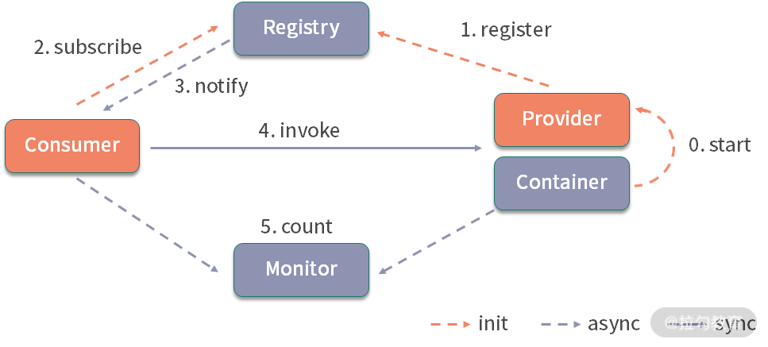
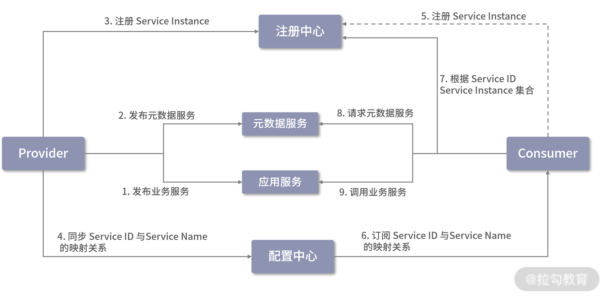
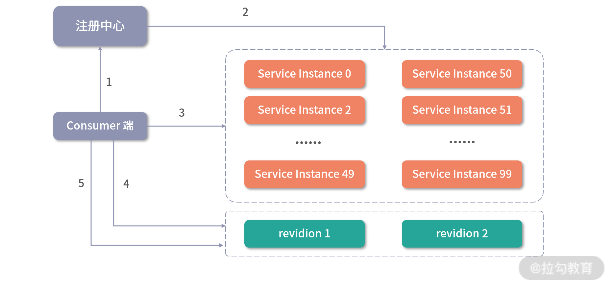

# 43 服务自省设计方案：新版本新方案

随着微服务架构的不断发展和普及，RPC 框架成为微服务架构中不可或缺的重要角色，Dubbo 作为 Java 生态中一款成熟的 RPC 框架也在随着技术的更新换代不断发展壮大。当然，传统的 Dubbo 架构也面临着新思想、新生态和新技术带来的挑战。

在微服务架构中，服务是基本单位，而 Dubbo 架构中服务的基本单位是 Java 接口，这种架构上的差别就会带来一系列挑战。 **从 2.7.5 版本开始，Dubbo 引入了服务自省架构，来应对微服务架构带来的挑战** 。具体都有哪些挑战呢？下面我们就来详细说明一下。

### 注册中心面临的挑战

在开始介绍注册中心面临的挑战之前，我们先来回顾一下前面课时介绍过的 Dubbo 传统架构以及这个架构中最核心的组件：



Dubbo 核心架构图

结合上面这张架构图，我们可以一起回顾一下这些核心组件的功能。

- **Registry：注册中心。** 负责服务地址的注册与查找，服务的 Provider 和 Consumer 只在启动时与注册中心交互。注册中心通过长连接感知 Provider 的存在，在 Provider 出现宕机的时候，注册中心会立即推送相关事件通知 Consumer。
- **Provider：服务提供者。** 在它启动的时候，会向 Registry 进行注册操作，将自己服务的地址和相关配置信息封装成 URL 添加到 ZooKeeper 中。
- **Consumer：服务消费者。** 在它启动的时候，会向 Registry 进行订阅操作。订阅操作会从 ZooKeeper 中获取 Provider 注册的 URL，并在 ZooKeeper 中添加相应的监听器。获取到 Provider URL 之后，Consumer 会根据 URL 中相应的参数选择 LoadBalance、Router、Cluster 实现，创建相应的 Invoker 对象，然后封装服务接口的代理对象，返回给上层业务。上层业务调用该代理对象的方法，就会执行远程调用。
- **Monitor：监控中心。** 用于统计服务的调用次数和调用时间。Provider 和 Consumer 在运行过程中，会在内存中统计调用次数和调用时间，定时每分钟发送一次统计数据到监控中心。监控中心在上面的架构图中并不是必要角色，监控中心宕机不会影响 Provider、Consumer 以及 Registry 的功能，只会丢失监控数据而已。

通过前面对整个 Dubbo 实现体系的介绍，我们知道 **URL 是贯穿整个 Dubbo 注册与发现的核心** 。Provider URL 注册到 ZooKeeper 上的大致格式如下：

```plaintext
dubbo://192.168.0.100:20880/org.apache.dubbo.demo.DemoService?anyhost=true&application=demo-provider&deprecated=false&dubbo=2.0.2&dynamic=true&generic=false&group=groupA&interface=org.apache.dubbo.demo.DemoService&metadata-type=remote&methods=sayHello,sayHelloAsync&pid=59975&release=&side=provider&timestamp=1601390276192
```

其中包括 Provider 的 IP、Port、服务接口的完整名称、Dubbo 协议的版本号、分组信息、进程 ID 等。

我们常用的注册中心，比如，ZooKeeper、Nacos 或 etcd 等，都是中心化的基础设施。注册中心基本都是以内存作为核心存储，其内存使用量与服务接口的数量以及 Provider 节点的个数是成正比的，一个 Dubbo Provider 节点可以注册多个服务接口。随着业务发展，服务接口的数量会越来越多，为了支撑整个系统的流量增长，部署的 Dubbo Provider 节点和 Dubbo Consumer 节点也会不断增加，这就 **导致注册中心的内存压力越来越大** 。

在生产环境中为了避免单点故障，在搭建注册中心的时候，都会使用高可用方案。这些高可用方案的本质就是底层的一致性协议，例如，ZooKeeper 使用的是 Zab 协议，etcd 使用的是 Raft 协议。当注册数据频繁发生变化的时候，注册中心集群的内部节点 **用于同步数据的网络开销也会增大** 。

从注册中心的外部看，Dubbo Provider 和 Dubbo Consumer 都可以算作注册中心的客户端，都会与注册中心集群之间维护长连接，这也会造成一部分 **网络开销和资源消耗** 。

在使用类似 ZooKeeper 的注册中心实现方案时，注册中心会主动将注册数据的变化推送到客户端。假设一个 Dubbo Consumer 订阅了 N 个服务接口，每个服务接口由 M 个 Provider 节点组成的集群提供服务，在 Provider 节点进行机器迁移的时候，就会涉及 M * N 个 URL 的更新，这些变更事件都会通知到每个 Dubbo Consumer 节点，这就造成了 **注册中心在处理通知方面的压力** 。

总之，在超大规模的微服务落地实践中，从内存、网络开销、通知等多个角度看，注册中心以及整个 Dubbo 传统架构都受到了不少的挑战和压力。

### Dubbo 的改进方案

Dubbo 从 2.7.0 版本开始增加了 **简化 URL** 的特性，从 URL 中抽出的数据会被存放至元数据中心。但是这次优化只是缩短了 URL 的长度，从内存使用量以及降低通知频繁度的角度降低了注册中心的压力，并没有减少注册中心 URL 的数量，所以注册中心所承受的压力还是比较明显的。

Dubbo 2.7.5 版本引入了 **服务自省架构** ，进一步降低了注册中心的压力。在此次优化中，Dubbo 修改成应用为粒度的服务注册与发现模型，最大化地减少了 Dubbo 服务元信息注册数量，其核心流程如下图所示：



服务自省架构图

上图展示了引入服务自省之后的 Dubbo 服务注册与发现的核心流程，Dubbo 会按照顺序执行这些操作（当其中一个操作失败时，后续操作不会执行）。

我们首先来看 Provider 侧的执行流程：

1.发布所有业务接口中定义的服务接口，具体过程与\[第 41 课时\]中介绍的发布流程相同；

2.发布 MetadataService 接口，该接口的发布由 Dubbo 框架自主完成；

3.将 Service Instance 注册到注册中心；

4.建立所有的 Service ID 与 Service Name 的映射，并同步到配置中心。

接下来，我们再来看Consumer 侧的执行流程：

5.注册当前 Consumer 的 Service Instance，Dubbo 允许 Consumer 不进行服务注册，所以这一步操作是可选的；

6.从配置中心获取 Service ID 与 Service Name 的映射关系；

7.根据 Service ID 从注册中心获取 Service Instance 集合；

8.随机选择一个 Service Instance，从中获取 MetadataService 的元数据，这里会发起 MetadataService 的调用，获取该 Service Instance 所暴露的业务接口的 URL 列表，从该 URL 列表中可以过滤出当前订阅的 Service 的 URL；

9.根据步骤 8 中获取的业务接口 URL 发起远程调用。

至于上图中涉及的一些新概念，为方便你理解，这里我们对它们的具体实现进行一个简单的介绍。

- Service Name：服务名称，例如，在一个电商系统中，有用户服务、商品服务、库存服务等。
- Service Instance：服务实例，表示单个 Dubbo 应用进程， **多个 Service Instance 构成一个服务集群，拥有相同的 Service Name** 。
- Service ID：唯一标识一个 Dubbo 服务，由 `${protocol}:${interface}:${version}:${group}` 四部分构成。

在有的场景中，我们会在线上部署两组不同配置的服务节点，来验证某些配置是否生效。例如，共有 100 个服务节点，平均分成 A、B 两组，A 组服务节点超时时间（即 timeout）设置为 3000 ms，B 组的超时时间（即 timeout）设置为 2000 ms，这样的话该服务就有了两组不同的元数据。

按照前面介绍的优化方案，在订阅服务的时候，会得到 100 个 ServiceInstance，因为每个 ServiceInstance 发布的服务元数据都有可能不一样，所以我们需要调用每个 ServiceInstance 的 MetadataService 服务获取元数据。

为了减少 MetadataService 服务的调用次数，Dubbo 提出了 **服务修订版本的优化方案** ，其核心思想是：将每个 ServiceInstance 发布的服务 URL 计算一个 hash 值（也就是 revision 值），并随 ServiceInstance 一起发布到注册中心；在 Consumer 端进行订阅的时候，对于 revision 值相同的 ServiceInstance，不再调用 MetadataService 服务，直接共用一份 URL 即可。下图展示了 Dubbo 服务修订的核心逻辑：



引入 Dubbo 服务修订的 Consumer 端交互图

通过该流程图，我们可以看到 Dubbo Consumer 端实现服务修订的流程如下。

1. Consumer 端通过服务发现 API 从注册中心获取 Provider 端的 ServiceInstance 列表。
1. 注册中心返回 100 台服务实例，其中 revision 为 1 的 ServiceInstance 编号是 0~49，revision 为 2 的 ServiceInstance 编号是 50~99。
1. Consumer 端在这 100 台服务实例中随机选择一台，例如，选择到编号为 68 的 ServiceInstance。
1. Consumer 端调用 ServiceInstance 68 暴露的 MetadataService 服务，获得其发布的 Dubbo 服务 URL 列表，并在本地内存中建立 revision 为 2 的服务 URL 列表缓存。
1. Consumer 端再从剩余的 99 台服务实例中随机选择一台，例如，选中了 ServiceInstance 30，发现其 revision 值为 1，且本地缓存中没有 revision 为 1 的服务 URL 列表缓存。此时，Consumer 会如步骤 4 一样发起 MetadataService 调用，从 ServiceInstance 30 获取服务 URL 列表，并更新缓存。

由于此时的本地缓存已经覆盖了当前场景中全部的 revision 值，后续再次随机选择的 ServiceInstance 的 revision 不是 1 就是 2，都会落到本地缓存中，不会再次发起 MetadataService 服务调用。后续其他 ServiceInstance 的处理都会复用本地缓存的这两个 URL 列表，并根据 ServiceInstance 替换相应的参数（例如，host、port 等），这样即可得到 ServiceInstance 发布的完整的服务 URL 列表。

一般情况下，revision 的数量不会很多，那么 Consumer 端发起的 MetadataService 服务调用次数也是有限的，不会随着 ServiceInstance 的扩容而增长。 **这样就避免了同一服务的不同版本导致的元数据膨胀** 。

### 总结

在本课时，我们重点介绍了 Dubbo 的服务自省架构的相关内容。

首先，我们一起复习了 Dubbo 的传统架构以及传统架构中基础组建的核心功能和交互流程。然后分析了 Dubbo 传统架构在超大规模微服务落地实践中面临的各项挑战和压力。最后，我们重点讲解了 Dubbo 2.7.5 版本之后引入的服务自省方案，服务自省方案可以很好地应对 Dubbo 面临的诸多挑战，并缓解基于 Dubbo 实现的、超大规模的微服务系统压力。在此基础上，我们还特别介绍了 Dubbo 服务修订方案是如何避免元数据膨胀的具体原理。
