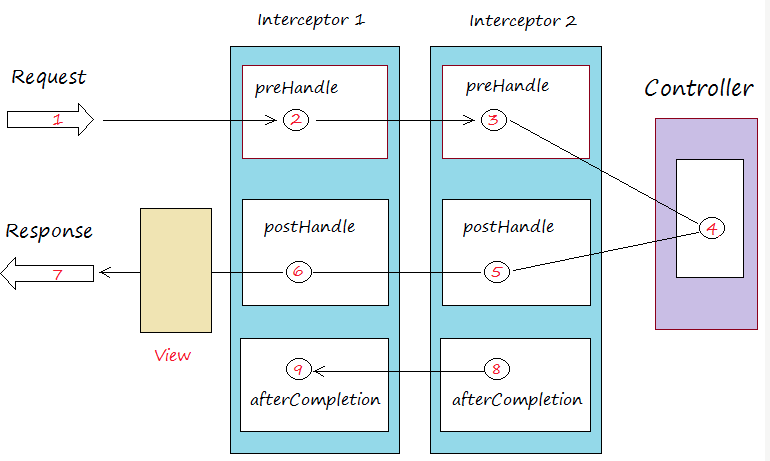

# 12 客户端都有哪些不常见但是很高级的功能？

你好，我是胡夕。今天我要和你分享的主题是：客户端都有哪些不常见但是很高级的功能。

既然是不常见，那就说明在实际场景中并没有太高的出场率，但它们依然是很高级很实用的。下面就有请今天的主角登场：Kafka 拦截器。

**什么是拦截器？** -----------

如果你用过 Spring Interceptor 或是 Apache Flume，那么应该不会对拦截器这个概念感到陌生，其基本思想就是允许应用程序在不修改逻辑的情况下，动态地实现一组可插拔的事件处理逻辑链。它能够在主业务操作的前后多个时间点上插入对应的“拦截”逻辑。下面这张图展示了 Spring MVC 拦截器的工作原理：



图片来源：[https://o7planning.org/en/11229/spring-mvc-interceptors-tutorial](https://o7planning.org/en/11229/spring-mvc-interceptors-tutorial%5Breference_end%5D)

拦截器 1 和拦截器 2 分别在请求发送之前、发送之后以及完成之后三个地方插入了对应的处理逻辑。而 Flume 中的拦截器也是同理，它们插入的逻辑可以是修改待发送的消息，也可以是创建新的消息，甚至是丢弃消息。这些功能都是以配置拦截器类的方式动态插入到应用程序中的，故可以快速地切换不同的拦截器而不影响主程序逻辑。

Kafka 拦截器借鉴了这样的设计思路。你可以在消息处理的前后多个时点动态植入不同的处理逻辑，比如在消息发送前或者在消息被消费后。

作为一个非常小众的功能，Kafka 拦截器自 0.10.0.0 版本被引入后并未得到太多的实际应用，我也从未在任何 Kafka 技术峰会上看到有公司分享其使用拦截器的成功案例。但即便如此，在自己的 Kafka 工具箱中放入这么一个有用的东西依然是值得的。今天我们就让它来发挥威力，展示一些非常酷炫的功能。 **Kafka 拦截器** ------------- **Kafka 拦截器分为生产者拦截器和消费者拦截器** 。生产者拦截器允许你在发送消息前以及消息提交成功后植入你的拦截器逻辑；而消费者拦截器支持在消费消息前以及提交位移后编写特定逻辑。值得一提的是，这两种拦截器都支持链的方式，即你可以将一组拦截器串连成一个大的拦截器，Kafka 会按照添加顺序依次执行拦截器逻辑。

举个例子，假设你想在生产消息前执行两个“前置动作”：第一个是为消息增加一个头信息，封装发送该消息的时间，第二个是更新发送消息数字段，那么当你将这两个拦截器串联在一起统一指定给 Producer 后，Producer 会按顺序执行上面的动作，然后再发送消息。

当前 Kafka 拦截器的设置方法是通过参数配置完成的。生产者和消费者两端有一个相同的参数，名字叫 interceptor.classes，它指定的是一组类的列表，每个类就是特定逻辑的拦截器实现类。拿上面的例子来说，假设第一个拦截器的完整类路径是 com.yourcompany.kafkaproject.interceptors.AddTimeStampInterceptor，第二个类是 com.yourcompany.kafkaproject.interceptors.UpdateCounterInterceptor，那么你需要按照以下方法在 Producer 端指定拦截器：

```java
Properties props = new Properties();
List<String> interceptors = new ArrayList<>();
interceptors.add("com.yourcompany.kafkaproject.interceptors.AddTimestampInterceptor"); // 拦截器 1
interceptors.add("com.yourcompany.kafkaproject.interceptors.UpdateCounterInterceptor"); // 拦截器 2
props.put(ProducerConfig.INTERCEPTOR_CLASSES_CONFIG, interceptors);
……
```

现在问题来了，我们应该怎么编写 AddTimeStampInterceptor 和 UpdateCounterInterceptor 类呢？其实很简单，这两个类以及你自己编写的所有 Producer 端拦截器实现类都要继承 org.apache.kafka.clients.producer.ProducerInterceptor 接口。该接口是 Kafka 提供的，里面有两个核心的方法。

1. onSend：该方法会在消息发送之前被调用。如果你想在发送之前对消息“美美容”，这个方法是你唯一的机会。
1. onAcknowledgement：该方法会在消息成功提交或发送失败之后被调用。还记得我在上一期中提到的发送回调通知 callback 吗？onAcknowledgement 的调用要早于 callback 的调用。值得注意的是，这个方法和 onSend 不是在同一个线程中被调用的，因此如果你在这两个方法中调用了某个共享可变对象，一定要保证线程安全哦。还有一点很重要，这个方法处在 Producer 发送的主路径中，所以最好别放一些太重的逻辑进去，否则你会发现你的 Producer TPS 直线下降。

同理，指定消费者拦截器也是同样的方法，只是具体的实现类要实现 org.apache.kafka.clients.consumer.ConsumerInterceptor 接口，这里面也有两个核心方法。

1. onConsume：该方法在消息返回给 Consumer 程序之前调用。也就是说在开始正式处理消息之前，拦截器会先拦一道，搞一些事情，之后再返回给你。
1. onCommit：Consumer 在提交位移之后调用该方法。通常你可以在该方法中做一些记账类的动作，比如打日志等。

一定要注意的是， **指定拦截器类时要指定它们的全限定名** ，即 full qualified name。通俗点说就是要把完整包名也加上，不要只有一个类名在那里，并且还要保证你的 Producer 程序能够正确加载你的拦截器类。 **典型使用场景** ----------

Kafka 拦截器都能用在哪些地方呢？其实，跟很多拦截器的用法相同， **Kafka 拦截器可以应用于包括客户端监控、端到端系统性能检测、消息审计等多种功能在内的场景** 。

我以端到端系统性能检测和消息审计为例来展开介绍下。

今天 Kafka 默认提供的监控指标都是针对单个客户端或 Broker 的，你很难从具体的消息维度去追踪集群间消息的流转路径。同时，如何监控一条消息从生产到最后消费的端到端延时也是很多 Kafka 用户迫切需要解决的问题。

从技术上来说，我们可以在客户端程序中增加这样的统计逻辑，但是对于那些将 Kafka 作为企业级基础架构的公司来说，在应用代码中编写统一的监控逻辑其实是很难的，毕竟这东西非常灵活，不太可能提前确定好所有的计算逻辑。另外，将监控逻辑与主业务逻辑耦合也是软件工程中不提倡的做法。

现在，通过实现拦截器的逻辑以及可插拔的机制，我们能够快速地观测、验证以及监控集群间的客户端性能指标，特别是能够从具体的消息层面上去收集这些数据。这就是 Kafka 拦截器的一个非常典型的使用场景。

我们再来看看消息审计（message audit）的场景。设想你的公司把 Kafka 作为一个私有云消息引擎平台向全公司提供服务，这必然要涉及多租户以及消息审计的功能。

作为私有云的 PaaS 提供方，你肯定要能够随时查看每条消息是哪个业务方在什么时间发布的，之后又被哪些业务方在什么时刻消费。一个可行的做法就是你编写一个拦截器类，实现相应的消息审计逻辑，然后强行规定所有接入你的 Kafka 服务的客户端程序必须设置该拦截器。 **案例分享** --------

下面我以一个具体的案例来说明一下拦截器的使用。在这个案例中，我们通过编写拦截器类来统计消息端到端处理的延时，非常实用，我建议你可以直接移植到你自己的生产环境中。

我曾经给一个公司做 Kafka 培训，在培训过程中，那个公司的人提出了一个诉求。他们的场景很简单，某个业务只有一个 Producer 和一个 Consumer，他们想知道该业务消息从被生产出来到最后被消费的平均总时长是多少，但是目前 Kafka 并没有提供这种端到端的延时统计。

学习了拦截器之后，我们现在知道可以用拦截器来满足这个需求。既然是要计算总延时，那么一定要有个公共的地方来保存它，并且这个公共的地方还是要让生产者和消费者程序都能访问的。在这个例子中，我们假设数据被保存在 Redis 中。

Okay，这个需求显然要实现生产者拦截器，也要实现消费者拦截器。我们先来实现前者：

```java
public class AvgLatencyProducerInterceptor implements ProducerInterceptor<String, String> {
    private Jedis jedis; // 省略 Jedis 初始化
    @Override
    public ProducerRecord<String, String> onSend(ProducerRecord<String, String> record) {
        jedis.incr("totalSentMessage");
        return record;
    }
    @Override
    public void onAcknowledgement(RecordMetadata metadata, Exception exception) {
    }
    @Override
    public void close() {
    }
    @Override
    public void configure(Map<java.lang.String, ?> configs) {
    }
```

上面的代码比较关键的是在发送消息前更新总的已发送消息数。为了节省时间，我没有考虑发送失败的情况，因为发送失败可能导致总发送数不准确。不过好在处理思路是相同的，你可以有针对性地调整下代码逻辑。

下面是消费者端的拦截器实现，代码如下：

```java
public class AvgLatencyConsumerInterceptor implements ConsumerInterceptor<String, String> {
    private Jedis jedis; // 省略 Jedis 初始化
    @Override
    public ConsumerRecords<String, String> onConsume(ConsumerRecords<String, String> records) {
        long lantency = 0L;
        for (ConsumerRecord<String, String> record : records) {
            lantency += (System.currentTimeMillis() - record.timestamp());
        }
        jedis.incrBy("totalLatency", lantency);
        long totalLatency = Long.parseLong(jedis.get("totalLatency"));
        long totalSentMsgs = Long.parseLong(jedis.get("totalSentMessage"));
        jedis.set("avgLatency", String.valueOf(totalLatency / totalSentMsgs));
        return records;
    }
    @Override
    public void onCommit(Map<TopicPartition, OffsetAndMetadata> offsets) {
    }
    @Override
    public void close() {
    }
    @Override
    public void configure(Map<String, ?> configs) {
```

在上面的消费者拦截器中，我们在真正消费一批消息前首先更新了它们的总延时，方法就是用当前的时钟时间减去封装在消息中的创建时间，然后累计得到这批消息总的端到端处理延时并更新到 Redis 中。之后的逻辑就很简单了，我们分别从 Redis 中读取更新过的总延时和总消息数，两者相除即得到端到端消息的平均处理延时。

## 创建好生产者和消费者拦截器后，我们按照上面指定的方法分别将它们配置到各自的 Producer 和 Consumer 程序中，这样就能计算消息从 Producer 端到 Consumer 端平均的处理延时了。这种端到端的指标监控能够从全局角度俯察和审视业务运行情况，及时查看业务是否满足端到端的 SLA 目标。 **小结**

今天我们花了一些时间讨论 Kafka 提供的冷门功能：拦截器。如之前所说，拦截器的出场率极低，以至于我从未看到过国内大厂实际应用 Kafka 拦截器的报道。但冷门不代表没用。事实上，我们可以利用拦截器满足实际的需求，比如端到端系统性能检测、消息审计等。

从这一期开始，我们将逐渐接触到更多的实际代码。看完了今天的分享，我希望你能够亲自动手编写一些代码，去实现一个拦截器，体会一下 Kafka 拦截器的功能。要知道，“纸上得来终觉浅，绝知此事要躬行”。也许你在敲代码的同时，就会想到一个使用拦截器的绝妙点子，让我们拭目以待吧。
