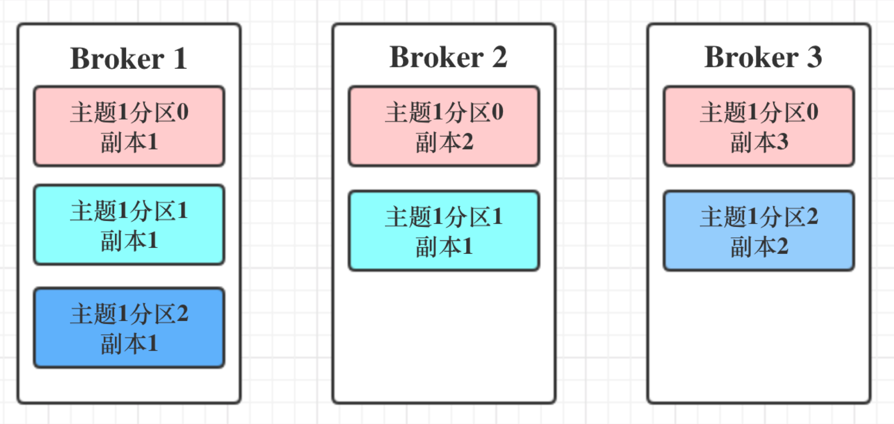
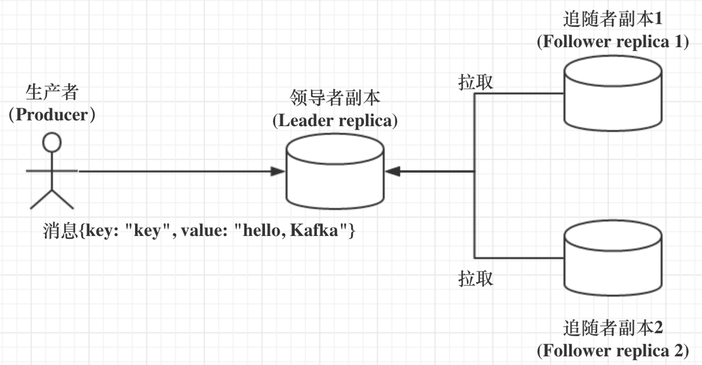
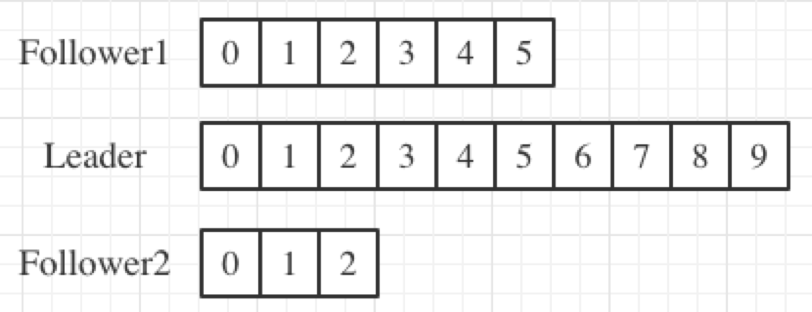
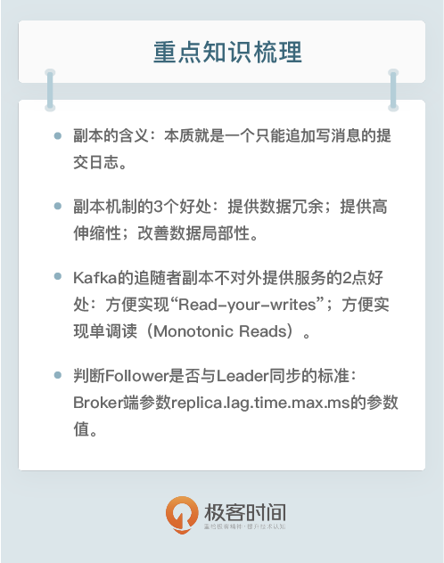

# 23 Kafka副本机制详解

你好，我是胡夕。今天我要和你分享的主题是：Apache Kafka 的副本机制。

所谓的副本机制（Replication），也可以称之为备份机制，通常是指分布式系统在多台网络互联的机器上保存有相同的数据拷贝。副本机制有什么好处呢？

1. **提供数据冗余** 。即使系统部分组件失效，系统依然能够继续运转，因而增加了整体可用性以及数据持久性。
   2. **提供高伸缩性** 。支持横向扩展，能够通过增加机器的方式来提升读性能，进而提高读操作吞吐量。
   3. **改善数据局部性** 。允许将数据放入与用户地理位置相近的地方，从而降低系统延时。

这些优点都是在分布式系统教科书中最常被提及的，但是有些遗憾的是，对于 Apache Kafka 而言，目前只能享受到副本机制带来的第 1 个好处，也就是提供数据冗余实现高可用性和高持久性。我会在这一讲后面的内容中，详细解释 Kafka 没能提供第 2 点和第 3 点好处的原因。

不过即便如此，副本机制依然是 Kafka 设计架构的核心所在，它也是 Kafka 确保系统高可用和消息高持久性的重要基石。

## 副本定义

在讨论具体的副本机制之前，我们先花一点时间明确一下副本的含义。

我们之前谈到过，Kafka 是有主题概念的，而每个主题又进一步划分成若干个分区。副本的概念实际上是在分区层级下定义的，每个分区配置有若干个副本。 **所谓副本（Replica），本质就是一个只能追加写消息的提交日志** 。根据 Kafka 副本机制的定义，同一个分区下的所有副本保存有相同的消息序列，这些副本分散保存在不同的 Broker 上，从而能够对抗部分 Broker 宕机带来的数据不可用。

在实际生产环境中，每台 Broker 都可能保存有各个主题下不同分区的不同副本，因此，单个 Broker 上存有成百上千个副本的现象是非常正常的。

接下来我们来看一张图，它展示的是一个有 3 台 Broker 的 Kafka 集群上的副本分布情况。从这张图中，我们可以看到，主题 1 分区 0 的 3 个副本分散在 3 台 Broker 上，其他主题分区的副本也都散落在不同的 Broker 上，从而实现数据冗余。

## 副本角色

既然分区下能够配置多个副本，而且这些副本的内容还要一致，那么很自然的一个问题就是：我们该如何确保副本中所有的数据都是一致的呢？特别是对 Kafka 而言，当生产者发送消息到某个主题后，消息是如何同步到对应的所有副本中的呢？针对这个问题，最常见的解决方案就是采用 **基于领导者（Leader-based）的副本机制** 。Apache Kafka 就是这样的设计。

基于领导者的副本机制的工作原理如下图所示，我来简单解释一下这张图里面的内容。

第一，在 Kafka 中，副本分成两类：领导者副本（Leader Replica）和追随者副本（Follower Replica）。每个分区在创建时都要选举一个副本，称为领导者副本，其余的副本自动称为追随者副本。

第二，Kafka 的副本机制比其他分布式系统要更严格一些。在 Kafka 中，追随者副本是不对外提供服务的。这就是说，任何一个追随者副本都不能响应消费者和生产者的读写请求。所有的请求都必须由领导者副本来处理，或者说，所有的读写请求都必须发往领导者副本所在的 Broker，由该 Broker 负责处理。追随者副本不处理客户端请求，它唯一的任务就是从领导者副本 **异步拉取** 消息，并写入到自己的提交日志中，从而实现与领导者副本的同步。

第三，当领导者副本挂掉了，或者说领导者副本所在的 Broker 宕机时，Kafka 依托于 ZooKeeper 提供的监控功能能够实时感知到，并立即开启新一轮的领导者选举，从追随者副本中选一个作为新的领导者。老 Leader 副本重启回来后，只能作为追随者副本加入到集群中。

你一定要特别注意上面的第二点，即 **追随者副本是不对外提供服务的** 。还记得刚刚我们谈到副本机制的好处时，说过 Kafka 没能提供读操作横向扩展以及改善局部性吗？具体的原因就在于此。

对于客户端用户而言，Kafka 的追随者副本没有任何作用，它既不能像 MySQL 那样帮助领导者副本“抗读”，也不能实现将某些副本放到离客户端近的地方来改善数据局部性。

既然如此，Kafka 为什么要这样设计呢？其实这种副本机制有两个方面的好处。

1. **方便实现“Read-your-writes”** 。

所谓 Read-your-writes，顾名思义就是，当你使用生产者 API 向 Kafka 成功写入消息后，马上使用消费者 API 去读取刚才生产的消息。

举个例子，比如你平时发微博时，你发完一条微博，肯定是希望能立即看到的，这就是典型的 Read-your-writes 场景。如果允许追随者副本对外提供服务，由于副本同步是异步的，因此有可能出现追随者副本还没有从领导者副本那里拉取到最新的消息，从而使得客户端看不到最新写入的消息。

2. **方便实现单调读（Monotonic Reads）** 。

什么是单调读呢？就是对于一个消费者用户而言，在多次消费消息时，它不会看到某条消息一会儿存在一会儿不存在。

如果允许追随者副本提供读服务，那么假设当前有 2 个追随者副本 F1 和 F2，它们异步地拉取领导者副本数据。倘若 F1 拉取了 Leader 的最新消息而 F2 还未及时拉取，那么，此时如果有一个消费者先从 F1 读取消息之后又从 F2 拉取消息，它可能会看到这样的现象：第一次消费时看到的最新消息在第二次消费时不见了，这就不是单调读一致性。但是，如果所有的读请求都是由 Leader 来处理，那么 Kafka 就很容易实现单调读一致性。

## In-sync Replicas（ISR）

我们刚刚反复说过，追随者副本不提供服务，只是定期地异步拉取领导者副本中的数据而已。既然是异步的，就存在着不可能与 Leader 实时同步的风险。在探讨如何正确应对这种风险之前，我们必须要精确地知道同步的含义是什么。或者说，Kafka 要明确地告诉我们，追随者副本到底在什么条件下才算与 Leader 同步。

基于这个想法，Kafka 引入了 In-sync Replicas，也就是所谓的 ISR 副本集合。ISR 中的副本都是与 Leader 同步的副本，相反，不在 ISR 中的追随者副本就被认为是与 Leader 不同步的。那么，到底什么副本能够进入到 ISR 中呢？

我们首先要明确的是，Leader 副本天然就在 ISR 中。也就是说， **ISR 不只是追随者副本集合，它必然包括 Leader 副本。甚至在某些情况下，ISR 只有 Leader 这一个副本** 。

另外，能够进入到 ISR 的追随者副本要满足一定的条件。至于是什么条件，我先卖个关子，我们先来一起看看下面这张图。

图中有 3 个副本：1 个领导者副本和 2 个追随者副本。Leader 副本当前写入了 10 条消息，Follower1 副本同步了其中的 6 条消息，而 Follower2 副本只同步了其中的 3 条消息。现在，请你思考一下，对于这 2 个追随者副本，你觉得哪个追随者副本与 Leader 不同步？

答案是，要根据具体情况来定。换成英文，就是那句著名的“It depends”。看上去好像 Follower2 的消息数比 Leader 少了很多，它是最有可能与 Leader 不同步的。的确是这样的，但仅仅是可能。

事实上，这张图中的 2 个 Follower 副本都有可能与 Leader 不同步，但也都有可能与 Leader 同步。也就是说，Kafka 判断 Follower 是否与 Leader 同步的标准，不是看相差的消息数，而是另有“玄机”。 **这个标准就是 Broker 端参数 replica.lag.time.max.ms 参数值** 。这个参数的含义是 Follower 副本能够落后 Leader 副本的最长时间间隔，当前默认值是 10 秒。这就是说，只要一个 Follower 副本落后 Leader 副本的时间不连续超过 10 秒，那么 Kafka 就认为该 Follower 副本与 Leader 是同步的，即使此时 Follower 副本中保存的消息明显少于 Leader 副本中的消息。

我们在前面说过，Follower 副本唯一的工作就是不断地从 Leader 副本拉取消息，然后写入到自己的提交日志中。如果这个同步过程的速度持续慢于 Leader 副本的消息写入速度，那么在 replica.lag.time.max.ms 时间后，此 Follower 副本就会被认为是与 Leader 副本不同步的，因此不能再放入 ISR 中。此时，Kafka 会自动收缩 ISR 集合，将该副本“踢出”ISR。

值得注意的是，倘若该副本后面慢慢地追上了 Leader 的进度，那么它是能够重新被加回 ISR 的。这也表明，ISR 是一个动态调整的集合，而非静态不变的。

## Unclean 领导者选举（Unclean Leader Election）

既然 ISR 是可以动态调整的，那么自然就可以出现这样的情形：ISR 为空。因为 Leader 副本天然就在 ISR 中，如果 ISR 为空了，就说明 Leader 副本也“挂掉”了，Kafka 需要重新选举一个新的 Leader。可是 ISR 是空，此时该怎么选举新 Leader 呢？ **Kafka 把所有不在 ISR 中的存活副本都称为非同步副本** 。通常来说，非同步副本落后 Leader 太多，因此，如果选择这些副本作为新 Leader，就可能出现数据的丢失。毕竟，这些副本中保存的消息远远落后于老 Leader 中的消息。在 Kafka 中，选举这种副本的过程称为 Unclean 领导者选举。 **Broker 端参数 unclean.leader.election.enable 控制是否允许 Unclean 领导者选举** 。

开启 Unclean 领导者选举可能会造成数据丢失，但好处是，它使得分区 Leader 副本一直存在，不至于停止对外提供服务，因此提升了高可用性。反之，禁止 Unclean 领导者选举的好处在于维护了数据的一致性，避免了消息丢失，但牺牲了高可用性。

如果你听说过 CAP 理论的话，你一定知道，一个分布式系统通常只能同时满足一致性（Consistency）、可用性（Availability）、分区容错性（Partition tolerance）中的两个。显然，在这个问题上，Kafka 赋予你选择 C 或 A 的权利。

你可以根据你的实际业务场景决定是否开启 Unclean 领导者选举。不过，我强烈建议你 **不要** 开启它，毕竟我们还可以通过其他的方式来提升高可用性。如果为了这点儿高可用性的改善，牺牲了数据一致性，那就非常不值当了。

## 小结

今天，我主要跟你分享了 Apache Kafka 的副本机制以及它们实现的原理。坦率地说，我觉得有些地方可能讲浅了，如果要百分之百地了解 Replication，你还是要熟读一下 Kafka 相应的源代码。不过你也不用担心，在专栏后面的内容中，我会专门从源码角度分析副本机制，特别是 Follower 副本从 Leader 副本拉取消息的全过程。从技术深度上来说，那一讲应该算是本专栏中最贴近技术内幕的分析了，你一定不要错过。

