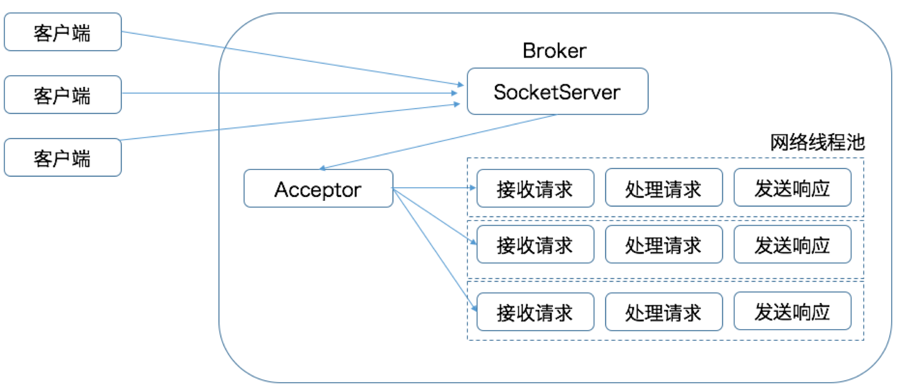
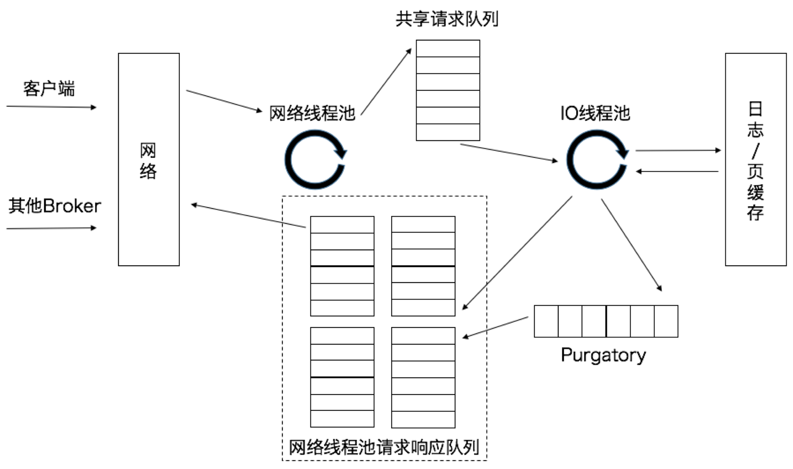
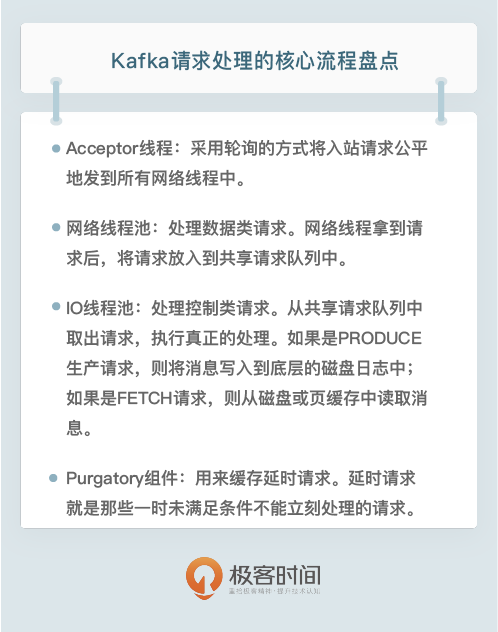

# 24 请求是怎么被处理的？

你好，我是胡夕。今天我要和你分享的主题是：Kafka 请求是怎么被处理的。

无论是 Kafka 客户端还是 Broker 端，它们之间的交互都是通过“请求 / 响应”的方式完成的。比如，客户端会通过网络发送消息生产请求给 Broker，而 Broker 处理完成后，会发送对应的响应给到客户端。

Apache Kafka 自己定义了一组请求协议，用于实现各种各样的交互操作。比如常见的 PRODUCE 请求是用于生产消息的，FETCH 请求是用于消费消息的，METADATA 请求是用于请求 Kafka 集群元数据信息的。

总之，Kafka 定义了很多类似的请求格式。我数了一下，截止到目前最新的 2.3 版本，Kafka 共定义了多达 45 种请求格式。**所有的请求都是通过 TCP 网络以 Socket 的方式进行通讯的** 。

今天，我们就来详细讨论一下 Kafka Broker 端处理请求的全流程。

关于如何处理请求，我们很容易想到的方案有两个。

1. **顺序处理请求** 。如果写成伪代码，大概是这个样子：

```plaintext
while (true) {
            Request request = accept(connection);
            handle(request);
}
```

这个方法实现简单，但是有个致命的缺陷，那就是 **吞吐量太差** 。由于只能顺序处理每个请求，因此，每个请求都必须等待前一个请求处理完毕才能得到处理。这种方式只适用于 **请求发送非常不频繁的系统** 。

**2. 每个请求使用单独线程处理** 。也就是说，我们为每个入站请求都创建一个新的线程来异步处理。我们一起来看看这个方案的伪代码。

```java
while (true) {
            Request = request = accept(connection);
            Thread thread = new Thread(() -> {
 handle(request);});
            thread.start();
}
```

这个方法反其道而行之，完全采用 **异步** 的方式。系统会为每个入站请求都创建单独的线程来处理。这个方法的好处是，它是完全异步的，每个请求的处理都不会阻塞下一个请求。但缺陷也同样明显。为每个请求都创建线程的做法开销极大，在某些场景下甚至会压垮整个服务。还是那句话，这个方法只适用于请求发送频率很低的业务场景。

既然这两种方案都不好，那么，Kafka 是如何处理请求的呢？用一句话概括就是，Kafka 使用的是 **Reactor 模式** 。

谈到 Reactor 模式，大神 Doug Lea 的“[Scalable IO in Java](http://gee.cs.oswego.edu/dl/cpjslides/nio.pdf)”应该算是最好的入门教材了。即使你没听说过 Doug Lea，那你应该也用过 ConcurrentHashMap 吧？这个类就是这位大神写的。其实，整个 java.util.concurrent 包都是他的杰作！

好了，我们说回 Reactor 模式。简单来说，**Reactor 模式是事件驱动架构的一种实现方式，特别适合应用于处理多个客户端并发向服务器端发送请求的场景** 。我借用 Doug Lea 的一页 PPT 来说明一下 Reactor 的架构，并借此引出 Kafka 的请求处理模型。

Reactor 模式的架构如下图所示：


从这张图中，我们可以发现，多个客户端会发送请求给到 Reactor。Reactor 有个请求分发线程 Dispatcher，也就是图中的 Acceptor，它会将不同的请求下发到多个工作线程中处理。

在这个架构中，Acceptor 线程只是用于请求分发，不涉及具体的逻辑处理，非常得轻量级，因此有很高的吞吐量表现。而这些工作线程可以根据实际业务处理需要任意增减，从而动态调节系统负载能力。

如果我们来为 Kafka 画一张类似的图的话，那它应该是这个样子的：



显然，这两张图长得差不多。Kafka 的 Broker 端有个 SocketServer 组件，类似于 Reactor 模式中的 Dispatcher，它也有对应的 Acceptor 线程和一个工作线程池，只不过在 Kafka 中，这个工作线程池有个专属的名字，叫网络线程池。Kafka 提供了 Broker 端参数 num.network.threads，用于调整该网络线程池的线程数。其 **默认值是 3，表示每台 Broker 启动时会创建 3 个网络线程，专门处理客户端发送的请求** 。

Acceptor 线程采用轮询的方式将入站请求公平地发到所有网络线程中，因此，在实际使用过程中，这些线程通常都有相同的几率被分配到待处理请求。这种轮询策略编写简单，同时也避免了请求处理的倾斜，有利于实现较为公平的请求处理调度。

好了，你现在了解了客户端发来的请求会被 Broker 端的 Acceptor 线程分发到任意一个网络线程中，由它们来进行处理。那么，当网络线程接收到请求后，它是怎么处理的呢？你可能会认为，它顺序处理不就好了吗？实际上，Kafka 在这个环节又做了一层异步线程池的处理，我们一起来看一看下面这张图。



当网络线程拿到请求后，它不是自己处理，而是将请求放入到一个共享请求队列中。Broker 端还有个 IO 线程池，负责从该队列中取出请求，执行真正的处理。如果是 PRODUCE 生产请求，则将消息写入到底层的磁盘日志中；如果是 FETCH 请求，则从磁盘或页缓存中读取消息。

IO 线程池处中的线程才是执行请求逻辑的线程。Broker 端参数 **num.io.threads** 控制了这个线程池中的线程数。**目前该参数默认值是 8，表示每台 Broker 启动后自动创建 8 个 IO 线程处理请求** 。你可以根据实际硬件条件设置此线程池的个数。

比如，如果你的机器上 CPU 资源非常充裕，你完全可以调大该参数，允许更多的并发请求被同时处理。当 IO 线程处理完请求后，会将生成的响应发送到网络线程池的响应队列中，然后由对应的网络线程负责将 Response 返还给客户端。

细心的你一定发现了请求队列和响应队列的差别： **请求队列是所有网络线程共享的，而响应队列则是每个网络线程专属的** 。这么设计的原因就在于，Dispatcher 只是用于请求分发而不负责响应回传，因此只能让每个网络线程自己发送 Response 给客户端，所以这些 Response 也就没必要放在一个公共的地方。

我们再来看看刚刚的那张图，图中有一个叫 Purgatory 的组件，这是 Kafka 中著名的“炼狱”组件。它是用来 **缓存延时请求** （Delayed Request）的。**所谓延时请求，就是那些一时未满足条件不能立刻处理的请求** 。比如设置了 acks=all 的 PRODUCE 请求，一旦设置了 acks=all，那么该请求就必须等待 ISR 中所有副本都接收了消息后才能返回，此时处理该请求的 IO 线程就必须等待其他 Broker 的写入结果。当请求不能立刻处理时，它就会暂存在 Purgatory 中。稍后一旦满足了完成条件，IO 线程会继续处理该请求，并将 Response 放入对应网络线程的响应队列中。

讲到这里，Kafka 请求流程解析的故事其实已经讲完了，我相信你应该已经了解了 Kafka Broker 是如何从头到尾处理请求的。但是我们不会现在就收尾，我要给今天的内容开个小灶，再说点不一样的东西。

到目前为止，我提及的请求处理流程对于所有请求都是适用的，也就是说，Kafka Broker 对所有请求是一视同仁的。但是，在 Kafka 内部，除了客户端发送的 PRODUCE 请求和 FETCH 请求之外，还有很多执行其他操作的请求类型，比如负责更新 Leader 副本、Follower 副本以及 ISR 集合的 LeaderAndIsr 请求，负责勒令副本下线的 StopReplica 请求等。与 PRODUCE 和 FETCH 请求相比，这些请求有个明显的不同：它们不是数据类的请求，而是控制类的请求。也就是说，它们并不是操作消息数据的，而是用来执行特定的 Kafka 内部动作的。

Kafka 社区把 PRODUCE 和 FETCH 这类请求称为数据类请求，把 LeaderAndIsr、StopReplica 这类请求称为控制类请求。细究起来，当前这种一视同仁的处理方式对控制类请求是不合理的。为什么呢？因为 **控制类请求有这样一种能力：它可以直接令数据类请求失效！** 我来举个例子说明一下。假设我们有个主题只有 1 个分区，该分区配置了两个副本，其中 Leader 副本保存在 Broker 0 上，Follower 副本保存在 Broker 1 上。假设 Broker 0 这台机器积压了很多的 PRODUCE 请求，此时你如果使用 Kafka 命令强制将该主题分区的 Leader、Follower 角色互换，那么 Kafka 内部的控制器组件（Controller）会发送 LeaderAndIsr 请求给 Broker 0，显式地告诉它，当前它不再是 Leader，而是 Follower 了，而 Broker 1 上的 Follower 副本因为被选为新的 Leader，因此停止向 Broker 0 拉取消息。

这时，一个尴尬的场面就出现了：如果刚才积压的 PRODUCE 请求都设置了 acks=all，那么这些在 LeaderAndIsr 发送之前的请求就都无法正常完成了。就像前面说的，它们会被暂存在 Purgatory 中不断重试，直到最终请求超时返回给客户端。

设想一下，如果 Kafka 能够优先处理 LeaderAndIsr 请求，Broker 0 就会立刻抛出 **NOT_LEADER_FOR_PARTITION 异常**，快速地标识这些积压 PRODUCE 请求已失败，这样客户端不用等到 Purgatory 中的请求超时就能立刻感知，从而降低了请求的处理时间。即使 acks 不是 all，积压的 PRODUCE 请求能够成功写入 Leader 副本的日志，但处理 LeaderAndIsr 之后，Broker 0 上的 Leader 变为了 Follower 副本，也要执行显式的日志截断（Log Truncation，即原 Leader 副本成为 Follower 后，会将之前写入但未提交的消息全部删除），依然做了很多无用功。

再举一个例子，同样是在积压大量数据类请求的 Broker 上，当你删除主题的时候，Kafka 控制器（我会在专栏后面的内容中专门介绍它）向该 Broker 发送 StopReplica 请求。如果该请求不能及时处理，主题删除操作会一直 hang 住，从而增加了删除主题的延时。

基于这些问题，社区于 2.3 版本正式实现了数据类请求和控制类请求的分离。其实，在社区推出方案之前，我自己尝试过修改这个设计。当时我的想法是，在 Broker 中实现一个优先级队列，并赋予控制类请求更高的优先级。这是很自然的想法，所以我本以为社区也会这么实现的，但后来我这个方案被清晰地记录在“已拒绝方案”列表中。

究其原因，这个方案最大的问题在于，它无法处理请求队列已满的情形。当请求队列已经无法容纳任何新的请求时，纵然有优先级之分，它也无法处理新的控制类请求了。

那么，社区是如何解决的呢？很简单，你可以再看一遍今天的第三张图，社区完全拷贝了这张图中的一套组件，实现了两类请求的分离。也就是说，Kafka Broker 启动后，会在后台分别创建网络线程池和 IO 线程池，它们分别处理数据类请求和控制类请求。至于所用的 Socket 端口，自然是使用不同的端口了，你需要提供不同的 **listeners 配置**，显式地指定哪套端口用于处理哪类请求。

## 小结

讲到这里，Kafka Broker 请求处理流程的解析应该讲得比较完整了。明确请求处理过程的最大意义在于，它是你日后执行 Kafka 性能优化的前提条件。如果你能从请求的维度去思考 Kafka 的工作原理，你会发现，优化 Kafka 并不是一件困难的事情。


