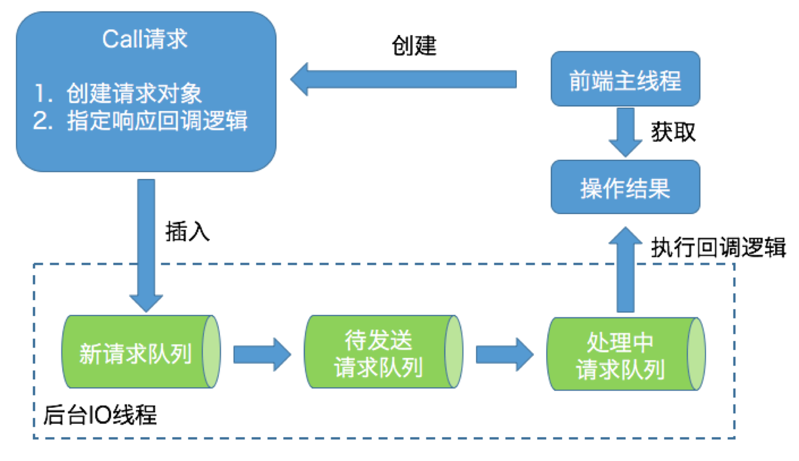
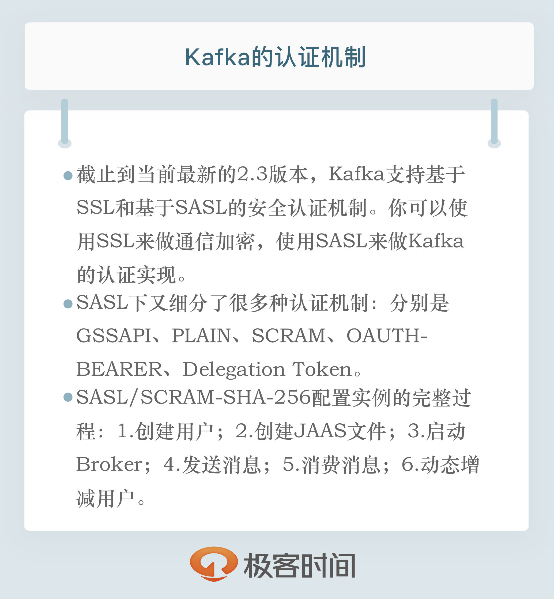

# 32 KafkaAdminClient：Kafka的运维利器

你好，我是胡夕。今天我要和你分享的主题是：Kafka 的运维利器 KafkaAdminClient。

## 引入原因

在上一讲中，我向你介绍了 Kafka 自带的各种命令行脚本，这些脚本使用起来虽然方便，却有一些弊端。

首先，不论是 Windows 平台，还是 Linux 平台，命令行的脚本都只能运行在控制台上。如果你想要在应用程序、运维框架或是监控平台中集成它们，会非常得困难。

其次，这些命令行脚本很多都是通过连接 ZooKeeper 来提供服务的。目前，社区已经越来越不推荐任何工具直连 ZooKeeper 了，因为这会带来一些潜在的问题，比如这可能会绕过 Kafka 的安全设置。在专栏前面，我说过 kafka-topics 脚本连接 ZooKeeper 时，不会考虑 Kafka 设置的用户认证机制。也就是说，任何使用该脚本的用户，不论是否具有创建主题的权限，都能成功“跳过”权限检查，强行创建主题。这显然和 Kafka 运维人员配置权限的初衷背道而驰。

最后，运行这些脚本需要使用 Kafka 内部的类实现，也就是 Kafka **服务器端** 的代码。实际上，社区还是希望用户只使用 Kafka **客户端** 代码，通过现有的请求机制来运维管理集群。这样的话，所有运维操作都能纳入到统一的处理机制下，方便后面的功能演进。

基于这些原因，社区于 0.11 版本正式推出了 Java 客户端版的 AdminClient，并不断地在后续的版本中对它进行完善。我粗略地计算了一下，有关 AdminClient 的优化和更新的各种提案，社区中有十几个之多，而且贯穿各个大的版本，足见社区对 AdminClient 的重视。

值得注意的是， **服务器端也有一个 AdminClient** ，包路径是 kafka.admin。这是之前的老运维工具类，提供的功能也比较有限，社区已经不再推荐使用它了。所以，我们最好统一使用客户端的 AdminClient。

## 如何使用？

下面，我们来看一下如何在应用程序中使用 AdminClient。我们在前面说过，它是 Java 客户端提供的工具。想要使用它的话，你需要在你的工程中显式地增加依赖。我以最新的 2.3 版本为例来进行一下展示。

如果你使用的是 Maven，需要增加以下依赖项：

```plaintext
<dependency>
    <groupId>org.apache.kafka</groupId>
    <artifactId>kafka-clients</artifactId>
    <version>2.3.0</version>
</dependency>
```

如果你使用的是 Gradle，那么添加方法如下：

```plaintext
compile group: 'org.apache.kafka', name: 'kafka-clients', version: '2.3.0'
```

## 功能

鉴于社区还在不断地完善 AdminClient 的功能，所以你需要时刻关注不同版本的发布说明（Release Notes），看看是否有新的运维操作被加入进来。在最新的 2.3 版本中，AdminClient 提供的功能有 9 大类。

1. 主题管理：包括主题的创建、删除和查询。
1. 权限管理：包括具体权限的配置与删除。
1. 配置参数管理：包括 Kafka 各种资源的参数设置、详情查询。所谓的 Kafka 资源，主要有 Broker、主题、用户、Client-id 等。
1. 副本日志管理：包括副本底层日志路径的变更和详情查询。
1. 分区管理：即创建额外的主题分区。
1. 消息删除：即删除指定位移之前的分区消息。
1. Delegation Token 管理：包括 Delegation Token 的创建、更新、过期和详情查询。
1. 消费者组管理：包括消费者组的查询、位移查询和删除。
1. Preferred 领导者选举：推选指定主题分区的 Preferred Broker 为领导者。

## 工作原理

在详细介绍 AdminClient 的主要功能之前，我们先简单了解一下 AdminClient 的工作原理。 **从设计上来看，AdminClient 是一个双线程的设计：前端主线程和后端 I/O 线程** 。前端线程负责将用户要执行的操作转换成对应的请求，然后再将请求发送到后端 I/O 线程的队列中；而后端 I/O 线程从队列中读取相应的请求，然后发送到对应的 Broker 节点上，之后把执行结果保存起来，以便等待前端线程的获取。

值得一提的是，AdminClient 在内部大量使用生产者 - 消费者模式将请求生成与处理解耦。我在下面这张图中大致描述了它的工作原理。



如图所示，前端主线程会创建名为 Call 的请求对象实例。该实例有两个主要的任务。

1. **构建对应的请求对象** 。比如，如果要创建主题，那么就创建 CreateTopicsRequest；如果是查询消费者组位移，就创建 OffsetFetchRequest。
   2. **指定响应的回调逻辑** 。比如从 Broker 端接收到 CreateTopicsResponse 之后要执行的动作。一旦创建好 Call 实例，前端主线程会将其放入到新请求队列（New Call Queue）中，此时，前端主线程的任务就算完成了。它只需要等待结果返回即可。

剩下的所有事情就都是后端 I/O 线程的工作了。就像图中所展示的那样，该线程使用了 3 个队列来承载不同时期的请求对象，它们分别是新请求队列、待发送请求队列和处理中请求队列。为什么要使用 3 个呢？原因是目前新请求队列的线程安全是由 Java 的 monitor 锁来保证的。 **为了确保前端主线程不会因为 monitor 锁被阻塞，后端 I/O 线程会定期地将新请求队列中的所有 Call 实例全部搬移到待发送请求队列中进行处理** 。图中的待发送请求队列和处理中请求队列只由后端 I/O 线程处理，因此无需任何锁机制来保证线程安全。

当 I/O 线程在处理某个请求时，它会显式地将该请求保存在处理中请求队列。一旦处理完成，I/O 线程会自动地调用 Call 对象中的回调逻辑完成最后的处理。把这些都做完之后，I/O 线程会通知前端主线程说结果已经准备完毕，这样前端主线程能够及时获取到执行操作的结果。AdminClient 是使用 Java Object 对象的 wait 和 notify 实现的这种通知机制。

严格来说，AdminClient 并没有使用 Java 已有的队列去实现上面的请求队列，它是使用 ArrayList 和 HashMap 这样的简单容器类，再配以 monitor 锁来保证线程安全的。不过，鉴于它们充当的角色就是请求队列这样的主体，我还是坚持使用队列来指代它们了。

了解 AdminClient 工作原理的一个好处在于， **它能够帮助我们有针对性地对调用 AdminClient 的程序进行调试** 。

我们刚刚提到的后端 I/O 线程其实是有名字的，名字的前缀是 kafka-admin-client-thread。有时候我们会发现，AdminClient 程序貌似在正常工作，但执行的操作没有返回结果，或者 hang 住了，现在你应该知道这可能是因为 I/O 线程出现问题导致的。如果你碰到了类似的问题，不妨使用 **jstack 命令** 去查看一下你的 AdminClient 程序，确认下 I/O 线程是否在正常工作。

这可不是我杜撰出来的好处，实际上，这是实实在在的社区 bug。出现这个问题的根本原因，就是 I/O 线程未捕获某些异常导致意外“挂”掉。由于 AdminClient 是双线程的设计，前端主线程不受任何影响，依然可以正常接收用户发送的命令请求，但此时程序已经不能正常工作了。

## 构造和销毁 AdminClient 实例

如果你正确地引入了 kafka-clients 依赖，那么你应该可以在编写 Java 程序时看到 AdminClient 对象。 **切记它的完整类路径是 org.apache.kafka.clients.admin.AdminClient，而不是 kafka.admin.AdminClient** 。后者就是我们刚才说的服务器端的 AdminClient，它已经不被推荐使用了。

创建 AdminClient 实例和创建 KafkaProducer 或 KafkaConsumer 实例的方法是类似的，你需要手动构造一个 Properties 对象或 Map 对象，然后传给对应的方法。社区专门为 AdminClient 提供了几十个专属参数，最常见而且必须要指定的参数，是我们熟知的 **bootstrap.servers 参数** 。如果你想了解完整的参数列表，可以去[官网](https://kafka.apache.org/documentation/#adminclientconfigs)查询一下。如果要销毁 AdminClient 实例，需要显式调用 AdminClient 的 close 方法。

你可以简单使用下面的代码同时实现 AdminClient 实例的创建与销毁。

```java
Properties props = new Properties();
props.put(AdminClientConfig.BOOTSTRAP_SERVERS_CONFIG, "kafka-host:port");
props.put("request.timeout.ms", 600000);
try (AdminClient client = AdminClient.create(props)) {
         // 执行你要做的操作……
}
```

这段代码使用 Java 7 的 try-with-resource 语法特性创建了 AdminClient 实例，并在使用之后自动关闭。你可以在 try 代码块中加入你想要执行的操作逻辑。

## 常见的 AdminClient 应用实例

讲完了 AdminClient 的工作原理和构造方法，接下来，我举几个实际的代码程序来说明一下如何应用它。这几个例子，都是我们最常见的。

### 创建主题

首先，我们来看看如何创建主题，代码如下：

```java
String newTopicName = "test-topic";
try (AdminClient client = AdminClient.create(props)) {
         NewTopic newTopic = new NewTopic(newTopicName, 10, (short) 3);
         CreateTopicsResult result = client.createTopics(Arrays.asList(newTopic));
         result.all().get(10, TimeUnit.SECONDS);
}
```

这段代码调用 AdminClient 的 createTopics 方法创建对应的主题。构造主题的类是 NewTopic 类，它接收主题名称、分区数和副本数三个字段。

注意这段代码倒数第二行获取结果的方法。目前，AdminClient 各个方法的返回类型都是名为 **\*Result 的对象。这类对象会将结果以 Java Future 的形式封装起来。如果要获取运行结果，你需要调用相应的方法来获取对应的 Future 对象，然后再调用相应的 get 方法来取得执行结果。

当然，对于创建主题而言，一旦主题被成功创建，任务也就完成了，它返回的结果也就不重要了，只要没有抛出异常就行。

### 查询消费者组位移

接下来，我来演示一下如何查询指定消费者组的位移信息，代码如下：

```plaintext
String groupID = "test-group";
try (AdminClient client = AdminClient.create(props)) {
         ListConsumerGroupOffsetsResult result = client.listConsumerGroupOffsets(groupID);
         Map<TopicPartition, OffsetAndMetadata> offsets = 
                  result.partitionsToOffsetAndMetadata().get(10, TimeUnit.SECONDS);
         System.out.println(offsets);
}
```

和创建主题的风格一样， **我们调用 AdminClient 的 listConsumerGroupOffsets 方法去获取指定消费者组的位移数据** 。

不过，对于这次返回的结果，我们不能再丢弃不管了， **因为它返回的 Map 对象中保存着按照分区分组的位移数据** 。你可以调用 OffsetAndMetadata 对象的 offset() 方法拿到实际的位移数据。

### 获取 Broker 磁盘占用

现在，我们来使用 AdminClient 实现一个稍微高级一点的功能：获取某台 Broker 上 Kafka 主题占用的磁盘空间量。有些遗憾的是，目前 Kafka 的 JMX 监控指标没有提供这样的功能，而磁盘占用这件事，是很多 Kafka 运维人员要实时监控并且极为重视的。

幸运的是，我们可以使用 AdminClient 来实现这一功能。代码如下：

```cpp
try (AdminClient client = AdminClient.create(props)) {
         DescribeLogDirsResult ret = client.describeLogDirs(Collections.singletonList(targetBrokerId)); // 指定 Broker id
         long size = 0L;
         for (Map<String, DescribeLogDirsResponse.LogDirInfo> logDirInfoMap : ret.all().get().values()) {
                  size += logDirInfoMap.values().stream().map(logDirInfo -> logDirInfo.replicaInfos).flatMap(
                           topicPartitionReplicaInfoMap ->
                           topicPartitionReplicaInfoMap.values().stream().map(replicaInfo -> replicaInfo.size))
                           .mapToLong(Long::longValue).sum();
         }
         System.out.println(size);
}
```

这段代码的主要思想是，使用 AdminClient 的 **describeLogDirs 方法** 获取指定 Broker 上所有分区主题的日志路径信息，然后把它们累积在一起，得出总的磁盘占用量。

## 小结

好了，我们来小结一下。社区于 0.11 版本正式推出了 Java 客户端版的 AdminClient 工具，该工具提供了几十种运维操作，而且它还在不断地演进着。如果可以的话，你最好统一使用 AdminClient 来执行各种 Kafka 集群管理操作，摒弃掉连接 ZooKeeper 的那些工具。另外，我建议你时刻关注该工具的功能完善情况，毕竟，目前社区对 AdminClient 的变更频率很高。


