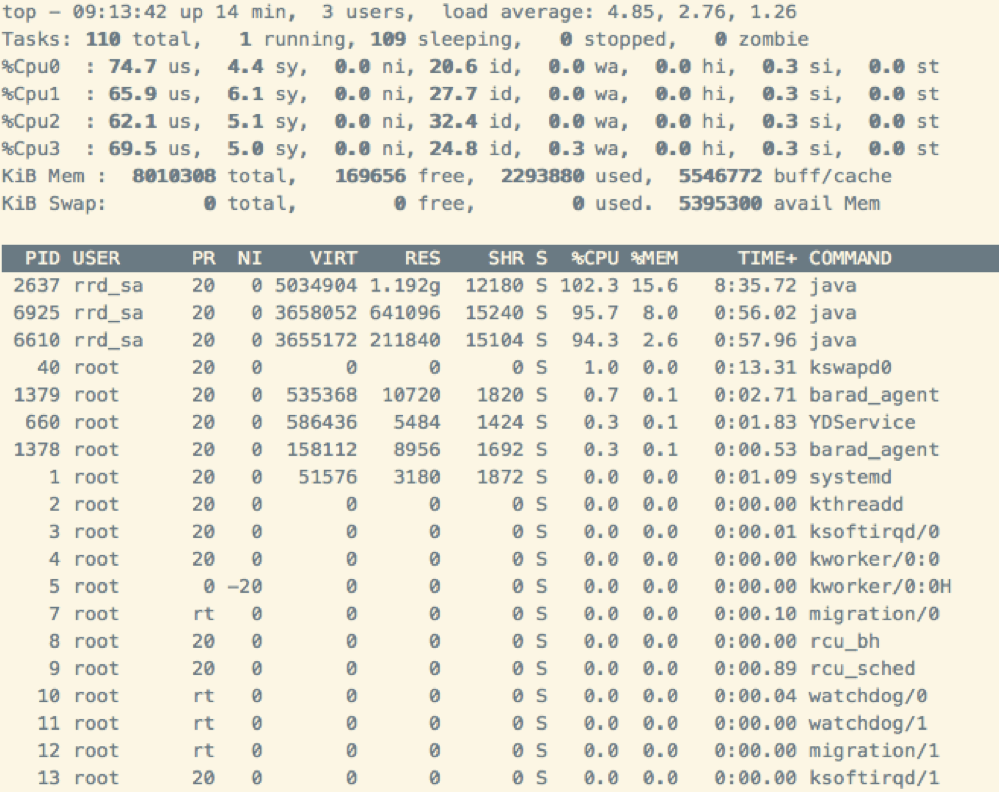
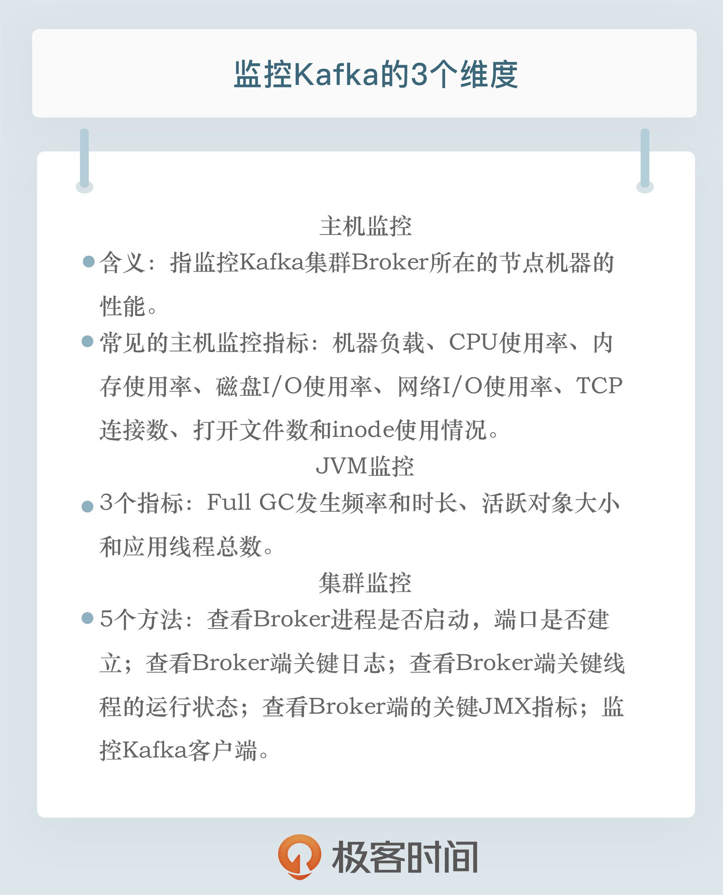

# 36 你应该怎么监控Kafka？

你好，我是胡夕。今天我要和你分享的主题是：如何监控 Kafka。

监控 Kafka，历来都是个老大难的问题。无论是在我维护的微信公众号，还是 Kafka QQ 群里面，大家问得最多的问题，一定是 Kafka 的监控。大家提问的内容看似五花八门，但真正想了解的，其实都是监控这点事，也就是我应该监控什么，怎么监控。那么今天，我们就来详细聊聊这件事。

我个人认为，和头疼医头、脚疼医脚的问题类似，在监控 Kafka 时，如果我们只监控 Broker 的话，就难免以偏概全。单个 Broker 启动的进程虽然属于 Kafka 应用，但它也是一个普通的 Java 进程，更是一个操作系统进程。因此，我觉得有必要从 Kafka 主机、JVM 和 Kafka 集群本身这三个维度进行监控。

## 主机监控

主机级别的监控，往往是揭示线上问题的第一步。 **所谓主机监控，指的是监控 Kafka 集群 Broker 所在的节点机器的性能** 。通常来说，一台主机上运行着各种各样的应用进程，这些进程共同使用主机上的所有硬件资源，比如 CPU、内存或磁盘等。

常见的主机监控指标包括但不限于以下几种：

- 机器负载（Load）
- CPU 使用率
- 内存使用率，包括空闲内存（Free Memory）和已使用内存（Used Memory）
- 磁盘 I/O 使用率，包括读使用率和写使用率
- 网络 I/O 使用率
- TCP 连接数
- 打开文件数
- inode 使用情况

考虑到我们并不是要系统地学习调优与监控主机性能，因此我并不打算对上面的每一个指标都进行详细解释，我重点分享一下机器负载和 CPU 使用率的监控方法。我会以 Linux 平台为例来进行说明，其他平台应该也是类似的。

首先，我们来看一张图片。我在 Kafka 集群的某台 Broker 所在的主机上运行 top 命令，输出的内容如下图所示：

在图片的右上角，我们可以看到 load average 的 3 个值：4.85，2.76 和 1.26，它们分别代表过去 1 分钟、过去 5 分钟和过去 15 分钟的 Load 平均值。在这个例子中，我的主机总共有 4 个 CPU 核，但 Load 值却达到了 4.85，这就说明，一定有进程暂时“抢不到”任何 CPU 资源。同时，Load 值一直在增加，也说明这台主机上的负载越来越大。

举这个例子，其实我真正想说的是 CPU 使用率。很多人把 top 命令中“%CPU”列的输出值当作 CPU 使用率。比如，在上面这张图中，PID 为 2637 的 Java 进程是 Broker 进程，它对应的“%CPU”的值是 102.3。你不要认为这是 CPU 的真实使用率，这列值的真实含义是进程使用的所有 CPU 的平均使用率，只是 top 命令在显示的时候转换成了单个 CPU。因此，如果是在多核的主机上，这个值就可能会超过 100。在这个例子中，我的主机有 4 个 CPU 核，总 CPU 使用率是 102.3，那么，平均每个 CPU 的使用率大致是 25%。

## JVM 监控

除了主机监控之外，另一个重要的监控维度就是 JVM 监控。Kafka Broker 进程是一个普通的 Java 进程，所有关于 JVM 的监控手段在这里都是适用的。

监控 JVM 进程主要是为了让你全面地了解你的应用程序（Know Your Application）。具体到 Kafka 而言，就是全面了解 Broker 进程。比如，Broker 进程的堆大小（HeapSize）是多少、各自的新生代和老年代是多大？用的是什么 GC 回收器？这些监控指标和配置参数林林总总，通常你都不必全部重点关注，但你至少要搞清楚 Broker 端 JVM 进程的 Minor GC 和 Full GC 的发生频率和时长、活跃对象的总大小和 JVM 上应用线程的大致总数，因为这些数据都是你日后调优 Kafka Broker 的重要依据。

我举个简单的例子。假设一台主机上运行的 Broker 进程在经历了一次 Full GC 之后，堆上存活的活跃对象大小是 700MB，那么在实际场景中，你几乎可以安全地将老年代堆大小设置成该数值的 1.5 倍或 2 倍，即大约 1.4GB。不要小看 700MB 这个数字，它是我们设定 Broker 堆大小的重要依据！

很多人会有这样的疑问：我应该怎么设置 Broker 端的堆大小呢？其实，这就是最合理的评估方法。试想一下，如果你的 Broker 在 Full GC 之后存活了 700MB 的数据，而你设置了堆大小为 16GB，这样合理吗？对一个 16GB 大的堆执行一次 GC 要花多长时间啊？！

因此，我们来总结一下。要做到 JVM 进程监控，有 3 个指标需要你时刻关注：

1. Full GC 发生频率和时长。这个指标帮助你评估 Full GC 对 Broker 进程的影响。长时间的停顿会令 Broker 端抛出各种超时异常。
1. 活跃对象大小。这个指标是你设定堆大小的重要依据，同时它还能帮助你细粒度地调优 JVM 各个代的堆大小。
1. 应用线程总数。这个指标帮助你了解 Broker 进程对 CPU 的使用情况。

总之，你对 Broker 进程了解得越透彻，你所做的 JVM 调优就越有效果。

谈到具体的监控，前两个都可以通过 GC 日志来查看。比如，下面的这段 GC 日志就说明了 GC 后堆上的存活对象大小。

> 2019-07-30T09:13:03.809+0800: 552.982: \[GC cleanup 827M->645M(1024M), 0.0019078 secs\]

这个 Broker JVM 进程默认使用了 G1 的 GC 算法，当 cleanup 步骤结束后，堆上活跃对象大小从 827MB 缩减成 645MB。另外，你可以根据前面的时间戳来计算每次 GC 的间隔和频率。

自 0.9.0.0 版本起，社区将默认的 GC 收集器设置为 G1，而 G1 中的 Full GC 是由单线程执行的，速度非常慢。因此， **你一定要监控你的 Broker GC 日志，即以 kafkaServer-gc.log 开头的文件** 。注意不要出现 Full GC 的字样。一旦你发现 Broker 进程频繁 Full GC，可以开启 G1 的 -XX:+PrintAdaptiveSizePolicy 开关，让 JVM 告诉你到底是谁引发了 Full GC。

## 集群监控

说完了主机和 JVM 监控，现在我来给出监控 Kafka 集群的几个方法。

**1. 查看 Broker 进程是否启动，端口是否建立。** 千万不要小看这一点。在很多容器化的 Kafka 环境中，比如使用 Docker 启动 Kafka Broker 时，容器虽然成功启动了，但是里面的网络设置如果配置有误，就可能会出现进程已经启动但端口未成功建立监听的情形。因此，你一定要同时检查这两点，确保服务正常运行。 **2. 查看 Broker 端关键日志。** 这里的关键日志，主要涉及 Broker 端服务器日志 server.log，控制器日志 controller.log 以及主题分区状态变更日志 state-change.log。其中，server.log 是最重要的，你最好时刻对它保持关注。很多 Broker 端的严重错误都会在这个文件中被展示出来。因此，如果你的 Kafka 集群出现了故障，你要第一时间去查看对应的 server.log，寻找和定位故障原因。 **3. 查看 Broker 端关键线程的运行状态。**

这些关键线程的意外挂掉，往往无声无息，但是却影响巨大。比方说，Broker 后台有个专属的线程执行 Log Compaction 操作，由于源代码的 Bug，这个线程有时会无缘无故地“死掉”，社区中很多 Jira 都曾报出过这个问题。当这个线程挂掉之后，作为用户的你不会得到任何通知，Kafka 集群依然会正常运转，只是所有的 Compaction 操作都不能继续了，这会导致 Kafka 内部的位移主题所占用的磁盘空间越来越大。因此，我们有必要对这些关键线程的状态进行监控。

可是，一个 Kafka Broker 进程会启动十几个甚至是几十个线程，我们不可能对每个线程都做到实时监控。所以，我跟你分享一下我认为最重要的两类线程。在实际生产环境中，监控这两类线程的运行情况是非常有必要的。

- Log Compaction 线程，这类线程是以 kafka-log-cleaner-thread 开头的。就像前面提到的，此线程是做日志 Compaction 的。一旦它挂掉了，所有 Compaction 操作都会中断，但用户对此通常是无感知的。
- 副本拉取消息的线程，通常以 ReplicaFetcherThread 开头。这类线程执行 Follower 副本向 Leader 副本拉取消息的逻辑。如果它们挂掉了，系统会表现为对应的 Follower 副本不再从 Leader 副本拉取消息，因而 Follower 副本的 Lag 会越来越大。

不论你是使用 jstack 命令，还是其他的监控框架，我建议你时刻关注 Broker 进程中这两类线程的运行状态。一旦发现它们状态有变，就立即查看对应的 Kafka 日志，定位原因，因为这通常都预示会发生较为严重的错误。

**4. 查看 Broker 端的关键 JMX 指标。**

Kafka 提供了超多的 JMX 指标供用户实时监测，我来介绍几个比较重要的 Broker 端 JMX 指标：

- BytesIn/BytesOut：即 Broker 端每秒入站和出站字节数。你要确保这组值不要接近你的网络带宽，否则这通常都表示网卡已被“打满”，很容易出现网络丢包的情形。
- NetworkProcessorAvgIdlePercent：即网络线程池线程平均的空闲比例。通常来说，你应该确保这个 JMX 值长期大于 30%。如果小于这个值，就表明你的网络线程池非常繁忙，你需要通过增加网络线程数或将负载转移给其他服务器的方式，来给该 Broker 减负。
- RequestHandlerAvgIdlePercent：即 I/O 线程池线程平均的空闲比例。同样地，如果该值长期小于 30%，你需要调整 I/O 线程池的数量，或者减少 Broker 端的负载。
- UnderReplicatedPartitions：即未充分备份的分区数。所谓未充分备份，是指并非所有的 Follower 副本都和 Leader 副本保持同步。一旦出现了这种情况，通常都表明该分区有可能会出现数据丢失。因此，这是一个非常重要的 JMX 指标。
- ISRShrink/ISRExpand：即 ISR 收缩和扩容的频次指标。如果你的环境中出现 ISR 中副本频繁进出的情形，那么这组值一定是很高的。这时，你要诊断下副本频繁进出 ISR 的原因，并采取适当的措施。
- ActiveControllerCount：即当前处于激活状态的控制器的数量。正常情况下，Controller 所在 Broker 上的这个 JMX 指标值应该是 1，其他 Broker 上的这个值是 0。如果你发现存在多台 Broker 上该值都是 1 的情况，一定要赶快处理，处理方式主要是查看网络连通性。这种情况通常表明集群出现了脑裂。脑裂问题是非常严重的分布式故障，Kafka 目前依托 ZooKeeper 来防止脑裂。但一旦出现脑裂，Kafka 是无法保证正常工作的。

其实，Broker 端还有很多很多 JMX 指标，除了上面这些重要指标，你还可以根据自己业务的需要，去官网查看其他 JMX 指标，把它们集成进你的监控框架。

**5. 监控 Kafka 客户端。** 客户端程序的性能同样需要我们密切关注。不管是生产者还是消费者，我们首先要关心的是客户端所在的机器与 Kafka Broker 机器之间的 **网络往返时延** （Round-Trip Time，RTT）。通俗点说，就是你要在客户端机器上 ping 一下 Broker 主机 IP，看看 RTT 是多少。

我曾经服务过一个客户，他的 Kafka 生产者 TPS 特别低。我登到机器上一看，发现 RTT 是 1 秒。在这种情况下，无论你怎么调优 Kafka 参数，效果都不会太明显，降低网络时延反而是最直接有效的办法。

除了 RTT，客户端程序也有非常关键的线程需要你时刻关注。对于生产者而言，有一个以 kafka-producer-network-thread 开头的线程是你要实时监控的。它是负责实际消息发送的线程。一旦它挂掉了，Producer 将无法正常工作，但你的 Producer 进程不会自动挂掉，因此你有可能感知不到。对于消费者而言，心跳线程事关 Rebalance，也是必须要监控的一个线程。它的名字以 kafka-coordinator-heartbeat-thread 开头。

除此之外，客户端有一些很重要的 JMX 指标，可以实时告诉你它们的运行情况。

从 Producer 角度，你需要关注的 JMX 指标是 request-latency，即消息生产请求的延时。这个 JMX 最直接地表征了 Producer 程序的 TPS；而从 Consumer 角度来说，records-lag 和 records-lead 是两个重要的 JMX 指标。我们在专栏\[第 22 讲\]解释过这两个指标的含义，这里我就不再赘述了。总之，它们直接反映了 Consumer 的消费进度。如果你使用了 Consumer Group，那么有两个额外的 JMX 指标需要你关注下，一个是 join rate，另一个是 sync rate。它们说明了 Rebalance 的频繁程度。如果在你的环境中，它们的值很高，那么你就需要思考下 Rebalance 频繁发生的原因了。

## 小结

好了，我们来小结一下。今天，我介绍了监控 Kafka 的方方面面。除了监控 Kafka 集群，我还推荐你从主机和 JVM 的维度进行监控。对主机的监控，往往是我们定位和发现问题的第一步。JVM 监控同样重要。要知道，很多 Java 进程碰到的性能问题是无法通过调整 Kafka 参数是解决的。最后，我罗列了一些比较重要的 Kafka JMX 指标。在下一讲中，我会专门介绍一下如何使用各种工具来查看这些 JMX 指标。

