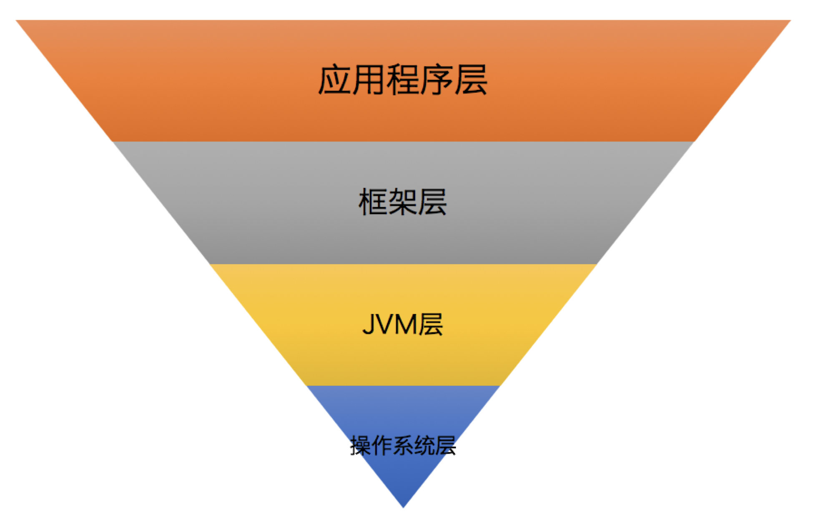
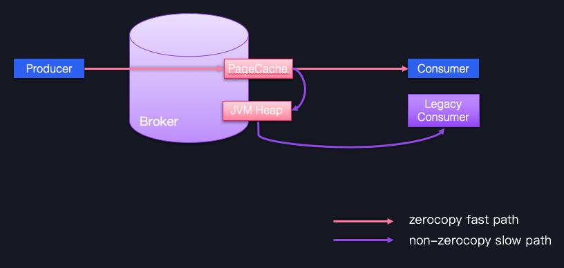
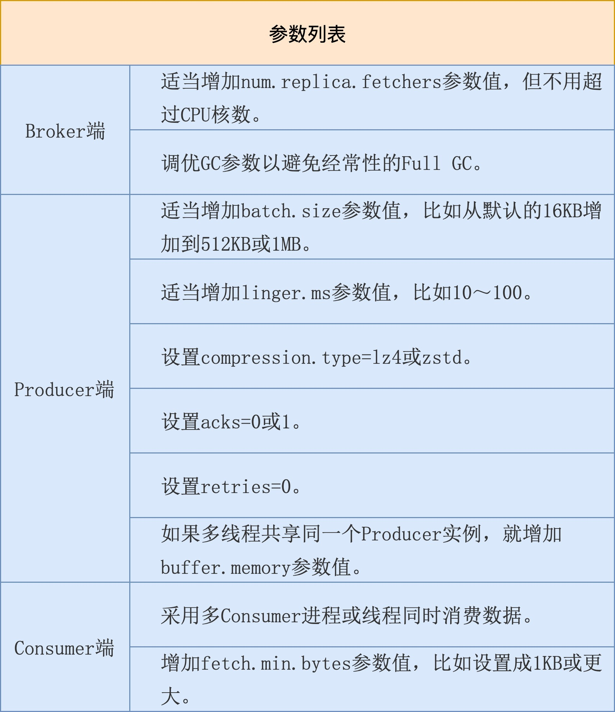
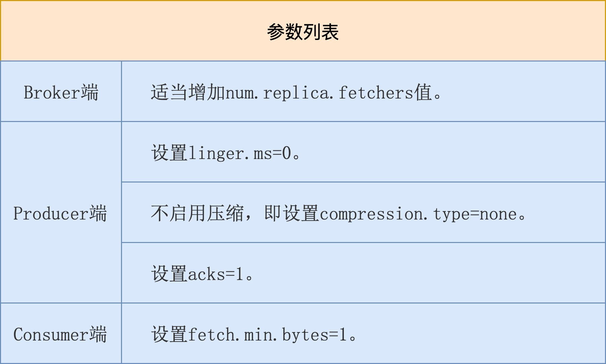
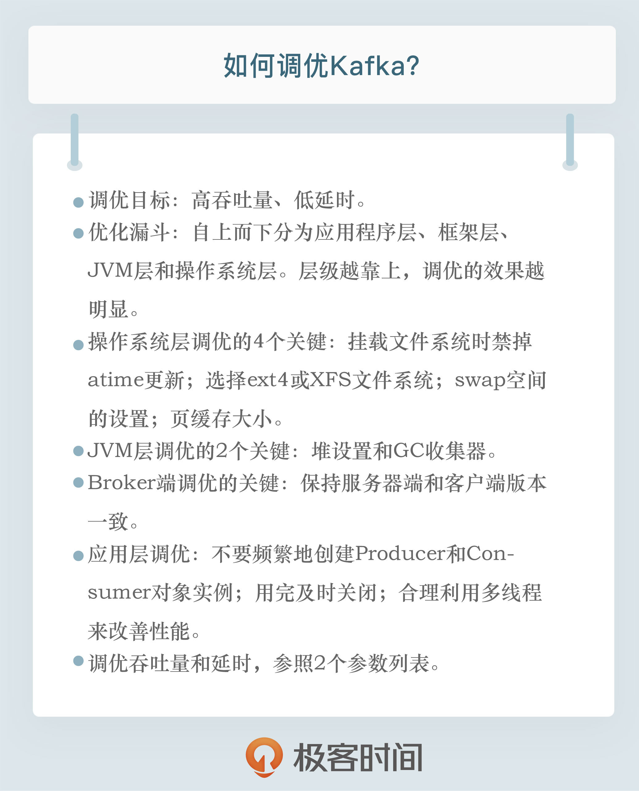

# 38 调优Kafka，你做到了吗？

你好，我是胡夕。今天我要和你分享的主题是：如何调优 Kafka。

## 调优目标

在做调优之前，我们必须明确优化 Kafka 的目标是什么。通常来说，调优是为了满足系统常见的非功能性需求。在众多的非功能性需求中，性能绝对是我们最关心的那一个。不同的系统对性能有不同的诉求，比如对于数据库用户而言，性能意味着请求的响应时间，用户总是希望查询或更新请求能够被更快地处理完并返回。

对 Kafka 而言，性能一般是指吞吐量和延时。

吞吐量，也就是 TPS，是指 Broker 端进程或 Client 端应用程序每秒能处理的字节数或消息数，这个值自然是越大越好。

延时和我们刚才说的响应时间类似，它表示从 Producer 端发送消息到 Broker 端持久化完成之间的时间间隔。这个指标也可以代表端到端的延时（End-to-End，E2E），也就是从 Producer 发送消息到 Consumer 成功消费该消息的总时长。和 TPS 相反，我们通常希望延时越短越好。

总之，高吞吐量、低延时是我们调优 Kafka 集群的主要目标，一会儿我们会详细讨论如何达成这些目标。在此之前，我想先谈一谈优化漏斗的问题。

## 优化漏斗

优化漏斗是一个调优过程中的分层漏斗，我们可以在每一层上执行相应的优化调整。总体来说，层级越靠上，其调优的效果越明显，整体优化效果是自上而下衰减的，如下图所示：

**第 1 层：应用程序层** 。它是指优化 Kafka 客户端应用程序代码。比如，使用合理的数据结构、缓存计算开销大的运算结果，抑或是复用构造成本高的对象实例等。这一层的优化效果最为明显，通常也是比较简单的。 **第 2 层：框架层** 。它指的是合理设置 Kafka 集群的各种参数。毕竟，直接修改 Kafka 源码进行调优并不容易，但根据实际场景恰当地配置关键参数的值，还是很容易实现的。 **第 3 层：JVM 层** 。Kafka Broker 进程是普通的 JVM 进程，各种对 JVM 的优化在这里也是适用的。优化这一层的效果虽然比不上前两层，但有时也能带来巨大的改善效果。 **第 4 层：操作系统层** 。对操作系统层的优化很重要，但效果往往不如想象得那么好。与应用程序层的优化效果相比，它是有很大差距的。

## 基础性调优

接下来，我就来分别介绍一下优化漏斗的 4 个分层的调优。

### 操作系统调优

我先来说说操作系统层的调优。在操作系统层面，你最好在挂载（Mount）文件系统时禁掉 atime 更新。atime 的全称是 access time，记录的是文件最后被访问的时间。记录 atime 需要操作系统访问 inode 资源，而禁掉 atime 可以避免 inode 访问时间的写入操作，减少文件系统的写操作数。你可以执行 **mount -o noatime 命令** 进行设置。

至于文件系统，我建议你至少选择 ext4 或 XFS。尤其是 XFS 文件系统，它具有高性能、高伸缩性等特点，特别适用于生产服务器。值得一提的是，在去年 10 月份的 Kafka 旧金山峰会上，有人分享了 ZFS 搭配 Kafka 的案例，我们在专栏\[第 8 讲\]提到过与之相关的[数据报告](https://www.confluent.io/kafka-summit-sf18/kafka-on-zfs)。该报告宣称 ZFS 多级缓存的机制能够帮助 Kafka 改善 I/O 性能，据说取得了不错的效果。如果你的环境中安装了 ZFS 文件系统，你可以尝试将 Kafka 搭建在 ZFS 文件系统上。

另外就是 swap 空间的设置。我个人建议将 swappiness 设置成一个很小的值，比如 1～10 之间，以防止 Linux 的 OOM Killer 开启随意杀掉进程。你可以执行 sudo sysctl vm.swappiness=N 来临时设置该值，如果要永久生效，可以修改 /etc/sysctl.conf 文件，增加 vm.swappiness=N，然后重启机器即可。

操作系统层面还有两个参数也很重要，它们分别是 **ulimit -n 和 vm.max_map_count** 。前者如果设置得太小，你会碰到 Too Many File Open 这类的错误，而后者的值如果太小，在一个主题数超多的 Broker 机器上，你会碰到 **OutOfMemoryError：Map failed** 的严重错误，因此，我建议在生产环境中适当调大此值，比如将其设置为 655360。具体设置方法是修改 /etc/sysctl.conf 文件，增加 vm.max_map_count=655360，保存之后，执行 sysctl -p 命令使它生效。

最后，不得不提的就是操作系统页缓存大小了，这对 Kafka 而言至关重要。在某种程度上，我们可以这样说：给 Kafka 预留的页缓存越大越好，最小值至少要容纳一个日志段的大小，也就是 Broker 端参数 log.segment.bytes 的值。该参数的默认值是 1GB。预留出一个日志段大小，至少能保证 Kafka 可以将整个日志段全部放入页缓存，这样，消费者程序在消费时能直接命中页缓存，从而避免昂贵的物理磁盘 I/O 操作。

### JVM 层调优

说完了操作系统层面的调优，我们来讨论下 JVM 层的调优，其实，JVM 层的调优，我们还是要重点关注堆设置以及 GC 方面的性能。

\\1. 设置堆大小。

如何为 Broker 设置堆大小，这是很多人都感到困惑的问题。我来给出一个朴素的答案： **将你的 JVM 堆大小设置成 6～8GB** 。

在很多公司的实际环境中，这个大小已经被证明是非常合适的，你可以安心使用。如果你想精确调整的话，我建议你可以查看 GC log，特别是关注 Full GC 之后堆上存活对象的总大小，然后把堆大小设置为该值的 1.5～2 倍。如果你发现 Full GC 没有被执行过，手动运行 jmap -histo:live \< pid > 就能人为触发 Full GC。

2.GC 收集器的选择。 **我强烈建议你使用 G1 收集器，主要原因是方便省事，至少比 CMS 收集器的优化难度小得多** 。另外，你一定要尽力避免 Full GC 的出现。其实，不论使用哪种收集器，都要竭力避免 Full GC。在 G1 中，Full GC 是单线程运行的，它真的非常慢。如果你的 Kafka 环境中经常出现 Full GC，你可以配置 JVM 参数 -XX:+PrintAdaptiveSizePolicy，来探查一下到底是谁导致的 Full GC。

使用 G1 还很容易碰到的一个问题，就是 **大对象（Large Object）** ，反映在 GC 上的错误，就是“too many humongous allocations”。所谓的大对象，一般是指至少占用半个区域（Region）大小的对象。举个例子，如果你的区域尺寸是 2MB，那么超过 1MB 大小的对象就被视为是大对象。要解决这个问题，除了增加堆大小之外，你还可以适当地增加区域大小，设置方法是增加 JVM 启动参数 -XX:+G1HeapRegionSize=N。默认情况下，如果一个对象超过了 N/2，就会被视为大对象，从而直接被分配在大对象区。如果你的 Kafka 环境中的消息体都特别大，就很容易出现这种大对象分配的问题。

### Broker 端调优

我们继续沿着漏斗往上走，来看看 Broker 端的调优。

Broker 端调优很重要的一个方面，就是合理地设置 Broker 端参数值，以匹配你的生产环境。不过，后面我们在讨论具体的调优目标时再详细说这部分内容。这里我想先讨论另一个优化手段， **即尽力保持客户端版本和 Broker 端版本一致** 。不要小看版本间的不一致问题，它会令 Kafka 丧失很多性能收益，比如 Zero Copy。下面我用一张图来说明一下。

图中蓝色的 Producer、Consumer 和 Broker 的版本是相同的，它们之间的通信可以享受 Zero Copy 的快速通道；相反，一个低版本的 Consumer 程序想要与 Producer、Broker 交互的话，就只能依靠 JVM 堆中转一下，丢掉了快捷通道，就只能走慢速通道了。因此，在优化 Broker 这一层时，你只要保持服务器端和客户端版本的一致，就能获得很多性能收益了。

### 应用层调优

现在，我们终于来到了漏斗的最顶层。其实，这一层的优化方法各异，毕竟每个应用程序都是不一样的。不过，有一些公共的法则依然是值得我们遵守的。

- **不要频繁地创建 Producer 和 Consumer 对象实例** 。构造这些对象的开销很大，尽量复用它们。
- **用完及时关闭** 。这些对象底层会创建很多物理资源，如 Socket 连接、ByteBuffer 缓冲区等。不及时关闭的话，势必造成资源泄露。
- **合理利用多线程来改善性能** 。Kafka 的 Java Producer 是线程安全的，你可以放心地在多个线程中共享同一个实例；而 Java Consumer 虽不是线程安全的，但我们在专栏\[第 20 讲\]讨论过多线程的方案，你可以回去复习一下。

## 性能指标调优

接下来，我会给出调优各个目标的参数配置以及具体的配置原因，希望它们能够帮助你更有针对性地调整你的 Kafka 集群。

### 调优吞吐量

首先是调优吞吐量。很多人对吞吐量和延时之间的关系似乎有些误解。比如有这样一种提法还挺流行的：假设 Kafka 每发送一条消息需要花费 2ms，那么延时就是 2ms。显然，吞吐量就应该是 500 条 / 秒，因为 1 秒可以发送 1 / 0.002 = 500 条消息。因此，吞吐量和延时的关系可以用公式来表示：TPS = 1000 / Latency(ms)。但实际上，吞吐量和延时的关系远不是这么简单。

我们以 Kafka Producer 为例。假设它以 2ms 的延时来发送消息，如果每次只是发送一条消息，那么 TPS 自然就是 500 条 / 秒。但如果 Producer 不是每次发送一条消息，而是在发送前等待一段时间，然后统一发送 **一批** 消息，比如 Producer 每次发送前先等待 8ms，8ms 之后，Producer 共缓存了 1000 条消息，此时总延时就累加到 10ms（即 2ms + 8ms）了，而 TPS 等于 1000 / 0.01 = 100,000 条 / 秒。由此可见，虽然延时增加了 4 倍，但 TPS 却增加了将近 200 倍。这其实也是批次化（batching）或微批次化（micro-batching）目前会很流行的原因。

在实际环境中，用户似乎总是愿意用较小的延时增加的代价，去换取 TPS 的显著提升。毕竟，从 2ms 到 10ms 的延时增加通常是可以忍受的。事实上，Kafka Producer 就是采取了这样的设计思想。

当然，你可能会问：发送一条消息需要 2ms，那么等待 8ms 就能累积 1000 条消息吗？答案是可以的！Producer 累积消息时，一般仅仅是将消息发送到内存中的缓冲区，而发送消息却需要涉及网络 I/O 传输。内存操作和 I/O 操作的时间量级是不同的，前者通常是几百纳秒级别，而后者则是从毫秒到秒级别不等，因此，Producer 等待 8ms 积攒出的消息数，可能远远多于同等时间内 Producer 能够发送的消息数。

好了，说了这么多，我们该怎么调优 TPS 呢？我来跟你分享一个参数列表。

我稍微解释一下表格中的内容。

Broker 端参数 num.replica.fetchers 表示的是 Follower 副本用多少个线程来拉取消息，默认使用 1 个线程。如果你的 Broker 端 CPU 资源很充足，不妨适当调大该参数值，加快 Follower 副本的同步速度。因为在实际生产环境中， **配置了 acks=all 的 Producer 程序吞吐量被拖累的首要因素，就是副本同步性能** 。增加这个值后，你通常可以看到 Producer 端程序的吞吐量增加。

另外需要注意的，就是避免经常性的 Full GC。目前不论是 CMS 收集器还是 G1 收集器，其 Full GC 采用的是 Stop The World 的单线程收集策略，非常慢，因此一定要避免。 **在 Producer 端，如果要改善吞吐量，通常的标配是增加消息批次的大小以及批次缓存时间，即 batch.size 和 linger.ms** 。目前它们的默认值都偏小，特别是默认的 16KB 的消息批次大小一般都不适用于生产环境。假设你的消息体大小是 1KB，默认一个消息批次也就大约 16 条消息，显然太小了。我们还是希望 Producer 能一次性发送更多的消息。

除了这两个，你最好把压缩算法也配置上，以减少网络 I/O 传输量，从而间接提升吞吐量。当前，和 Kafka 适配最好的两个压缩算法是 **LZ4 和 zstd** ，不妨一试。

同时，由于我们的优化目标是吞吐量，最好不要设置 acks=all 以及开启重试。前者引入的副本同步时间通常都是吞吐量的瓶颈，而后者在执行过程中也会拉低 Producer 应用的吞吐量。

最后，如果你在多个线程中共享一个 Producer 实例，就可能会碰到缓冲区不够用的情形。倘若频繁地遭遇 TimeoutException：Failed to allocate memory within the configured max blocking time 这样的异常，那么你就必须显式地增加 **buffer.memory** 参数值，确保缓冲区总是有空间可以申请的。

说完了 Producer 端，我们来说说 Consumer 端。Consumer 端提升吞吐量的手段是有限的，你可以利用多线程方案增加整体吞吐量，也可以增加 fetch.min.bytes 参数值。默认是 1 字节，表示只要 Kafka Broker 端积攒了 1 字节的数据，就可以返回给 Consumer 端，这实在是太小了。我们还是让 Broker 端一次性多返回点数据吧。

### 调优延时

讲完了调优吞吐量，我们来说说如何优化延时，下面是调优延时的参数列表。

在 Broker 端，我们依然要增加 num.replica.fetchers 值以加快 Follower 副本的拉取速度，减少整个消息处理的延时。

在 Producer 端，我们希望消息尽快地被发送出去，因此不要有过多停留，所以必须设置 linger.ms=0，同时不要启用压缩。因为压缩操作本身要消耗 CPU 时间，会增加消息发送的延时。另外，最好不要设置 acks=all。我们刚刚在前面说过，Follower 副本同步往往是降低 Producer 端吞吐量和增加延时的首要原因。

在 Consumer 端，我们保持 fetch.min.bytes=1 即可，也就是说，只要 Broker 端有能返回的数据，立即令其返回给 Consumer，缩短 Consumer 消费延时。

## 小结

好了，我们来小结一下。今天，我跟你分享了 Kafka 调优方面的内容。我们先从调优目标开始说起，然后我给出了调优层次漏斗，接着我分享了一些基础性调优，包括操作系统层调优、JVM 层调优以及应用程序调优等。最后，针对 Kafka 关心的两个性能指标吞吐量和延时，我分别从 Broker、Producer 和 Consumer 三个维度给出了一些参数值设置的最佳实践。

最后，我来分享一个性能调优的真实小案例。

曾经，我碰到过一个线上环境的问题：该集群上 Consumer 程序一直表现良好，但是某一天，它的性能突然下降，表现为吞吐量显著降低。我在查看磁盘读 I/O 使用率时，发现其明显上升，但之前该 Consumer Lag 很低，消息读取应该都能直接命中页缓存。此时磁盘读突然飙升，我就怀疑有其他程序写入了页缓存。后来经过排查，我发现果然有一个测试 Console Consumer 程序启动，“污染”了部分页缓存，导致主业务 Consumer 读取消息不得不走物理磁盘，因此吞吐量下降。找到了真实原因，解决起来就简单多了。

其实，我给出这个案例的真实目的是想说，对于性能调优，我们最好按照今天给出的步骤一步一步地窄化和定位问题。一旦定位了原因，后面的优化就水到渠成了。

