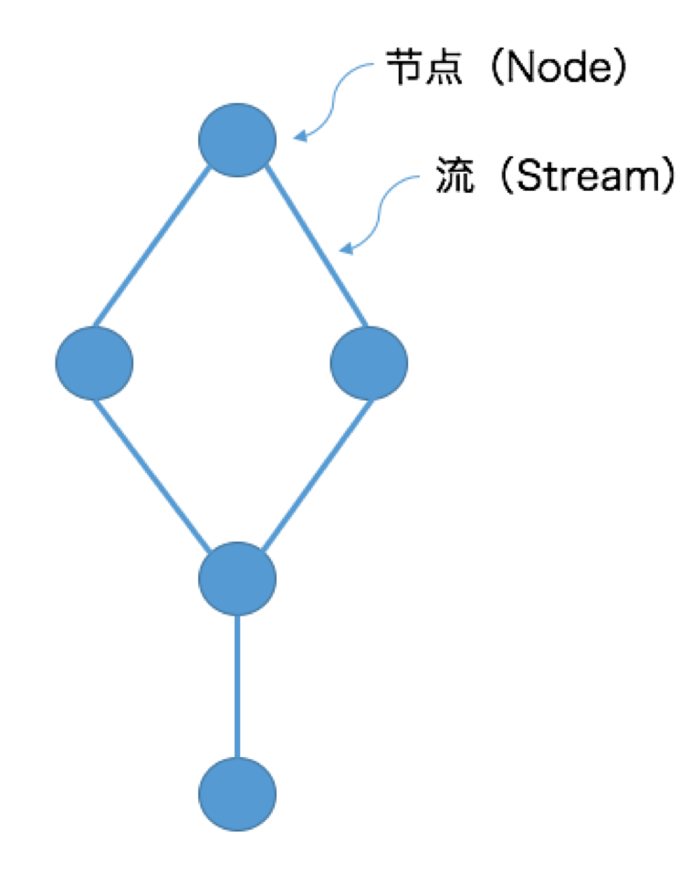
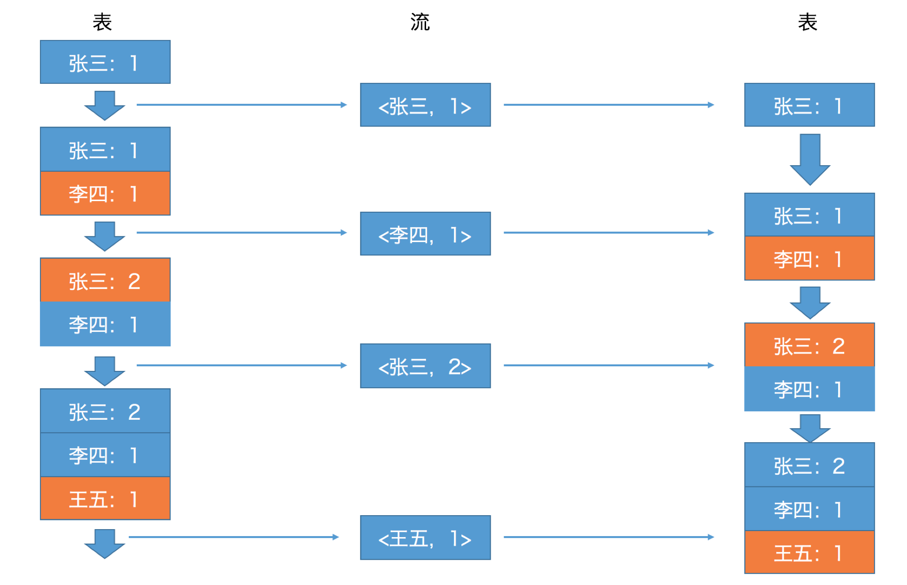
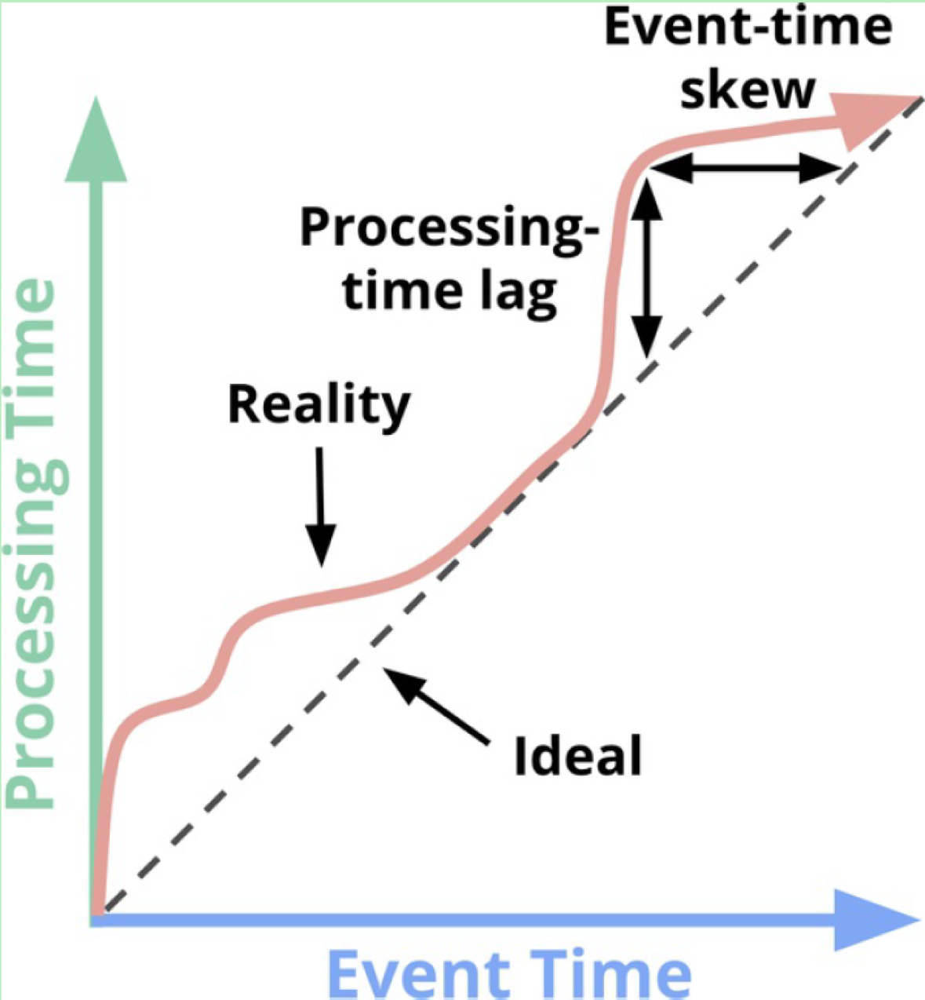
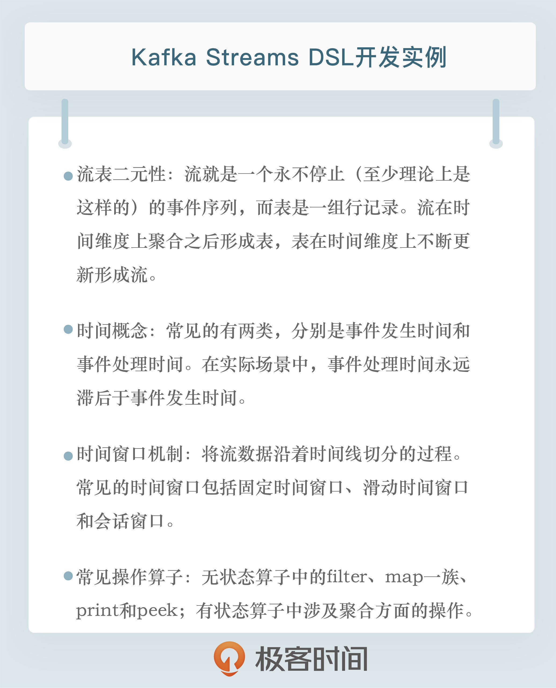

# 41 Kafka Streams DSL开发实例

你好，我是胡夕。今天我要和你分享的主题是：Kafka Streams DSL 开发实例。

DSL，也就是 Domain Specific Language，意思是领域特定语言。它提供了一组便捷的 API 帮助我们实现流式数据处理逻辑。今天，我就来分享一些 Kafka Streams 中的 DSL 开发方法以及具体实例。

## Kafka Streams 背景介绍

在上一讲中，我们提到流处理平台是专门处理无限数据集的引擎。就 Kafka Streams 而言，它仅仅是一个客户端库。所谓的 Kafka Streams 应用，就是调用了 Streams API 的普通 Java 应用程序。只不过在 Kafka Streams 中，流处理逻辑是用 **拓扑** 来表征的。

一个拓扑结构本质上是一个有向无环图（DAG），它由多个处理节点（Node）和连接节点的多条边组成，如下图所示：



图中的节点也称为处理单元或 Processor，它封装了具体的事件处理逻辑。Processor 在其他流处理平台也被称为操作算子。常见的操作算子包括转换（map）、过滤（filter）、连接（join）和聚合（aggregation）等。后面我会详细介绍几种常见的操作算子。

大体上，Kafka Streams 开放了两大类 API 供你定义 Processor 逻辑。

第 1 类就是我刚刚提到的 DSL，它是声明式的函数式 API，使用起来感觉和 SQL 类似，你不用操心它的底层是怎么实现的，你只需要调用特定的 API 告诉 Kafka Streams 你要做什么即可。

举个简单的例子，你可以看看下面这段代码，尝试理解下它是做什么的。

```plaintext
movies.filter((title, movie) -> movie.getGenre().equals(" 动作片 ")).xxx()...
```

这段代码虽然用了 Java 8 的 Lambda 表达式，但从整体上来看，它要做的事情应该还是很清晰的：它要从所有 Movie 事件中过滤出影片类型是“动作片”的事件。这就是 DSL 声明式 API 的实现方式。

第 2 类则是命令式的低阶 API，称为 Processor API。比起 DSL，这组 API 提供的实现方式更加灵活。你可以编写自定义的算子来实现一些 DSL 天然没有提供的处理逻辑。事实上，DSL 底层也是用 Processor API 实现的。

目前，Kafka Streams DSL 提供的 API 已经很丰富了，基本上能够满足我们大部分的处理逻辑需求，我今天重点介绍一下 DSL 的使用方法。

**不论是用哪组 API 实现，所有流处理应用本质上都可以分为两类：有状态的（Stateful）应用和无状态的（Stateless）应用** 。

有状态的应用指的是应用中使用了类似于连接、聚合或时间窗口（Window）的 API。一旦调用了这些 API，你的应用就变为有状态的了，也就是说你需要让 Kafka Streams 帮你保存应用的状态。

无状态的应用是指在这类应用中，某条消息的处理结果不会影响或依赖其他消息的处理。常见的无状态操作包括事件转换以及刚刚那个例子中的过滤等。

## 关键概念

了解了这些背景之后，你还需要掌握一些流处理领域内的关键概念，即流、表以及流表二元性，还有时间和时间窗口。

### 流表二元性

首先，我来介绍一下流处理中流和表的概念，以及它们之间的关系。

流就是一个永不停止（至少理论上是这样的）的事件序列，而表和关系型数据库中的概念类似，是一组行记录。在流处理领域，两者是有机统一的： **流在时间维度上聚合之后形成表，表在时间维度上不断更新形成流，这就是所谓的流表二元性（Duality of Streams and Tables）** 。流表二元性在流处理领域内的应用是 Kafka 框架赖以成功的重要原因之一。

下面这张图展示了表转换成流，流再转换成表的全过程。



刚开始时，表中只有一条记录“张三：1”。将该条记录转成流，变成了一条事件。接着，表增加了新记录“李四：1”。针对这个变更，流中也增加了对应的新事件。之后，表中张三的对应值，从 1 更新为 2，流也增加了相应的更新事件。最后，表中添加了新数据“王五：1”，流也增加了新记录。至此，表转换成流的工作就完成了。

从这个过程中我们可以看出，流可以看作是表的变更事件日志（Changelog）。与之相反的是，流转换成表的过程，可以说是这个过程的逆过程：我们为流中的每条事件打一个快照（Snapshot），就形成了表。

流和表的概念在流处理领域非常关键。在 Kafka Streams DSL 中，流用 **KStream** 表示，而表用 **KTable** 表示。

Kafka Streams 还定义了 **GlobalKTable** 。本质上它和 KTable 都表征了一个表，里面封装了事件变更流，但是它和 KTable 的最大不同在于，当 Streams 应用程序读取 Kafka 主题数据到 GlobalKTable 时，它会读取主题 **所有分区的数据** ，而对 KTable 而言，Streams 程序实例只会读取 **部分分区的数据** ，这主要取决于 Streams 实例的数量。

### 时间

在流处理领域内，精确定义事件时间是非常关键的：一方面，它是决定流处理应用能否实现正确性的前提；另一方面，流处理中时间窗口等操作依赖于时间概念才能正常工作。

常见的时间概念有两类：事件发生时间（Event Time）和事件处理时间（Processing Time）。理想情况下，我们希望这两个时间相等，即事件一旦发生就马上被处理，但在实际场景中，这是不可能的， **Processing Time 永远滞后于 Event Time** ，而且滞后程度又是一个高度变化，无法预知，就像“Streaming Systems”一书中的这张图片所展示的那样：



该图中的 45°虚线刻画的是理想状态，即 Event Time 等于 Processing Time，而粉色的曲线表征的是真实情况，即 Processing Time 落后于 Event Time，而且落后的程度（Lag）不断变化，毫无规律。

如果流处理应用要实现结果的正确性，就必须要使用基于 Event Time 的时间窗口，而不能使用基于 Processing Time 的时间窗口。

### 时间窗口

所谓的时间窗口机制，就是将流数据沿着时间线切分的过程。常见的时间窗口包括：固定时间窗口（Fixed Windows）、滑动时间窗口（Sliding Windows）和会话窗口（Session Windows）。Kafka Streams 同时支持这三类时间窗口。在后面的例子中，我会详细介绍如何使用 Kafka Streams API 实现时间窗口功能。

## 运行 WordCount 实例

好了，关于 Kafka Streams 及其 DSL 的基本概念我都阐述完了，下面我给出大数据处理领域的 Hello World 实例：WordCount 程序。

每个大数据处理框架第一个要实现的程序基本上都是单词计数。我们来看下 Kafka Streams DSL 如何实现 WordCount。我先给出完整代码，稍后我会详细介绍关键部分代码的含义以及运行它的方法。

```java
package kafkalearn.demo.wordcount;
import org.apache.kafka.clients.consumer.ConsumerConfig;
import org.apache.kafka.common.serialization.Serdes;
import org.apache.kafka.streams.KafkaStreams;
import org.apache.kafka.streams.StreamsBuilder;
import org.apache.kafka.streams.StreamsConfig;
import org.apache.kafka.streams.kstream.KStream;
import org.apache.kafka.streams.kstream.KTable;
import org.apache.kafka.streams.kstream.Produced;
import java.util.Arrays;
import java.util.Locale;
import java.util.Properties;
import java.util.concurrent.CountDownLatch;
public final class WordCountDemo {
    public static void main(final String[] args) {
        final Properties props = new Properties();
        props.put(StreamsConfig.APPLICATION_ID_CONFIG, "wordcount-stream-demo");
        props.put(StreamsConfig.BOOTSTRAP_SERVERS_CONFIG, "localhost:9092");
        props.put(StreamsConfig.DEFAULT_KEY_SERDE_CLASS_CONFIG, Serdes.String().getClass().getName());
        props.put(StreamsConfig.DEFAULT_VALUE_SERDE_CLASS_CONFIG, Serdes.String().getClass().getName());
        props.put(ConsumerConfig.AUTO_OFFSET_RESET_CONFIG, "earliest");
        final StreamsBuilder builder = new StreamsBuilder();
        final KStream<String, String> source = builder.stream("wordcount-input-topic");
        final KTable<String, Long> counts = source
            .flatMapValues(value -> Arrays.asList(value.toLowerCase(Locale.getDefault()).split(" ")))
            .groupBy((key, value) -> value)
            .count();
        counts.toStream().to("wordcount-output-topic", Produced.with(Serdes.String(), Serdes.Long()));
        final KafkaStreams streams = new KafkaStreams(builder.build(), props);
        final CountDownLatch latch = new CountDownLatch(1);
        Runtime.getRuntime().addShutdownHook(new Thread("wordcount-stream-demo-jvm-hook") {
            @Override
            public void run() {
                streams.close();
                latch.countDown();
            }
        });
        try {
            streams.start();
            latch.await();
        } catch (final Throwable e) {
            System.exit(1);
        }
        System.exit(0)
```

在程序开头，我构造了一个 Properties 对象实例，对 Kafka Streams 程序的关键参数进行了赋值，比如 application id、bootstrap servers 和默认的 KV 序列化器（Serializer）和反序列化器（Deserializer）。其中，application id 是 Kafka Streams 应用的唯一标识，必须要显式地指定。默认的 KV 序列化器、反序列化器是为消息的 Key 和 Value 进行序列化和反序列化操作的。

接着，我构造了一个 StreamsBuilder 对象，并使用该对象实例创建了一个 KStream，这个 KStream 从名为 wordcount-input-topic 的 Kafka 主题读取消息。该主题消息由一组单词组成，单词间用空格分割，比如 zhangsan lisi wangwu。

由于我们要进行单词计数，所以就需要将消息中的单词提取出来。有了前面的概念介绍，你应该可以猜到，KTable 是很合适的存储结构，因此，下一步就是将刚才的这个 KStream 转换成 KTable。

我们先对单词进行分割，这里我用到了 flatMapValues 方法，代码中的 Lambda 表达式实现了从消息中提取单词的逻辑。由于 String.split() 方法会返回多个单词，因此我们使用 flatMapValues 而不是 mapValues。原因是，前者能够将多个元素“打散”成一组单词，而如果使用后者，我们得到的就不是一组单词，而是多组单词了。

这些都做完之后，程序调用 groupBy 方法对单词进行分组。由于是计数，相同的单词必须被分到一起，然后就是调用 count 方法对每个出现的单词进行统计计数，并保存在名为 counts 的 KTable 对象中。

最后，我们将统计结果写回到 Kafka 中。由于 KTable 是表，是静态的数据，因此这里要先将其转换成 KStream，然后再调用 to 方法写入到名为 wordcount-output-topic 的主题中。此时，counts 中事件的 Key 是单词，而 Value 是统计个数，因此我们在调用 to 方法时，同时指定了 Key 和 Value 的序列化器，分别是字符串序列化器和长整型序列化器。

至此，Kafka Streams 的流计算逻辑就编写完了，接下来就是构造 KafkaStreams 实例并启动它了。通常来说，这部分的代码都是类似的，即调用 start 方法启动整个流处理应用，以及配置一个 JVM 关闭钩子（Shutdown Hook）实现流处理应用的关闭等。

总体来说，Kafka Streams DSL 实现 WordCount 的方式还是很简单的，仅仅调用几个操作算子就轻松地实现了分布式的单词计数实时处理功能。事实上，现在主流的实时流处理框架越来越倾向于这样的设计思路，即通过提供丰富而便捷的开箱即用操作算子，简化用户的开发成本，采用类似于搭积木的方式快捷地构建实时计算应用。

待启动该 Java 程序之后，你需要创建出对应的输入和输出主题，并向输入主题不断地写入符合刚才所说的格式的单词行，之后，你需要运行下面的命令去查看输出主题中是否正确地统计了你刚才输入的单词个数：

```plaintext
bin/kafka-console-consumer.sh --bootstrap-server localhost:9092 \
    --topic wordcount-output-topic \
    --from-beginning \
    --formatter kafka.tools.DefaultMessageFormatter \
    --property print.key=true \
    --property print.value=true \
    --property key.deserializer=org.apache.kafka.common.serialization.StringDeserializer \
    --property value.deserializer=org.apache.kafka.common.serialization.LongDeserializer
```

## 开发 API

介绍了具体的例子之后，我们来看下 Kafka Streams 还提供了哪些功能强大的 API。我们可以重点关注两个方面，一个是常见的操作算子，另一个是时间窗口 API。

### 常见操作算子

操作算子的丰富程度和易用性是衡量流处理框架受欢迎程度的重要依据之一。Kafka Streams DSL 提供了很多开箱即用的操作算子，大体上分为两大类： **无状态算子和有状态算子** 。下面我就向你分别介绍几个经常使用的算子。 **在无状态算子中，filter 的出场率是极高的** 。它执行的就是过滤的逻辑。依然拿 WordCount 为例，假设我们只想统计那些以字母 s 开头的单词的个数，我们可以在执行完 flatMapValues 后增加一行代码，代码如下：

```plaintext
.filter(((key, value) -> value.startsWith("s")))
```

**另一个常见的无状态算子当属 map 一族了** 。Streams DSL 提供了很多变体，比如 map、mapValues、flatMap 和 flatMapValues。我们已经见识了 flatMapValues 的威力，其他三个的功能也是类似的，只是所有带 Values 的变体都只对消息体执行转换，不触及消息的 Key，而不带 Values 的变体则能修改消息的 Key。

举个例子，假设当前消息没有 Key，而 Value 是单词本身，现在我们想要将消息变更成这样的 KV 对，即 Key 是单词小写，而 Value 是单词长度，那么我们可以调用 map 方法，代码如下：

```plaintext
KStream\<String, Integer> transformed = stream.map(
```

(key, value) -> KeyValue.pair(value.toLowerCase(), value.length()));

```plaintext
```

最后，我再介绍一组调试用的无状态算子： **print 和 peek** 。Streams DSL 支持你使用这两个方法查看你的消息流中的事件。这两者的区别在于，print 是终止操作，一旦你调用了 print 方法，后面就不能再调用任何其他方法了，而 peek 则允许你在查看消息流的同时，依然能够继续对其进行处理，比如下面这两段代码所示：
```

stream.print(Printed.toFile("streams.out").withLabel("debug"));
stream.peek((key, value) -> System.out.println("key=" + key + ", value=" + value)).map(...);

```plaintext
常见的有状态操作算子主要涉及聚合（Aggregation）方面的操作，比如计数、求和、求平均值、求最大最小值等。Streams DSL 目前只提供了 count 方法用于计数，其他的聚合操作需要你自行使用 API 实现。

假设我们有个消息流，每条事件就是一个单独的整数，现在我们想要对其中的偶数进行求和，那么 Streams DSL 中的实现方法如下：
```

final KTable\<Integer, Integer> sumOfEvenNumbers = input

```plaintext
     .filter((k, v) -> v % 2 == 0)

     .selectKey((k, v) -> 1)

     .groupByKey()

     .reduce((v1, v2) -> v1 + v2);
```


```plaintext
我简单解释一下 selectKey 调用。由于我们要对所有事件中的偶数进行求和，因此需要把这些消息的 Key 都调整成相同的值，因此这里我使用 selectKey 指定了一个 Dummy Key 值，即上面这段代码中的数值 1。它没有任何含义，仅仅是让所有消息都赋值上这个 Key 而已。真正核心的代码在于 reduce 调用，它是执行求和的关键逻辑。

### 时间窗口实例

前面说过，Streams DSL 支持 3 类时间窗口。前两类窗口通过 **TimeWindows.of 方法** 来实现，会话窗口通过 **SessionWindows.with** 来实现。

假设在刚才的 WordCount 实例中，我们想每一分钟统计一次单词计数，那么需要在调用 count 之前增加下面这行代码：
```

.windowedBy(TimeWindows.of(Duration.ofMinutes(1)))

```plaintext
同时，你还需要修改 counts 的类型，此时它不再是 KTable<String, Long> 了，而变成了 KTable<Windowed, Long>，因为引入了时间窗口，所以，事件的 Key 也必须要携带时间窗口的信息。除了这两点变化，WordCount 其他部分代码都不需要修改。

可见，Streams DSL 在 API 封装性方面还是做得很好的，通常你只需要增加或删减几行代码，就能实现处理逻辑的修改了。

小结
--

好了，我们来小结一下。今天我跟你分享了 Kafka Streams 以及 DSL 的背景与概念，然后我根据实例展示了 WordCount 单词计数程序以及运行方法，最后，针对常见的操作算子和时间窗口，我给出了示例代码，这些内容应该可以帮你应对大部分的流处理开发。另外，我建议你经常性地查询一下[官网文档](https://kafka.apache.org/23/documentation/streams/developer-guide/dsl-api.html#aggregating)，去学习一些更深入更高级的用法，比如固定时间窗口的用法。在很多场景中，我们都想知道过去一段时间内企业某个关键指标的值是多少，如果要实现这个需求，时间窗口是必然要涉及到的。


```

