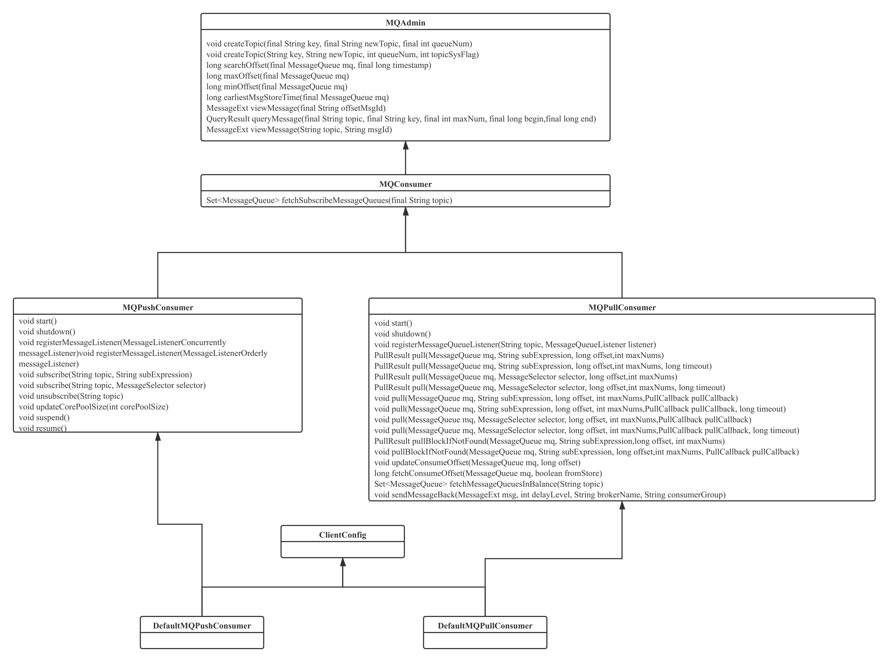

# 08 消息消费 API 与版本变迁说明

从本篇开始我们将详细介绍 RockeMQ 的消息消费端的 API。

### 消息消费类图

RocketMQ 消费端的 API 如下图所示：



其核心类图如下所示。

**MQAdmin** MQ 一些基本的管理功能，例如创建 Topic，这里稍微有点奇怪，消费端应该不需要继承该接口。该类在消息发送 API 章节已详细介绍，再次不再重复说明。 **MQConsumer** MQ 消费者，这个接口定义得过于简单，如果该接口需要，可以将其子接口一些共同的方法提取到该接口中。

```plaintext
Set<MessageQueue> fetchSubscribeMessageQueues(final String topic)
```

获取分配该 Topic 所有的读队列。 **MQPushConsumer** RocketMQ 支持推、拉两种模式，该接口是 **拉模式** 的接口定义。

```plaintext
void start()
```

启动消费者。

```plaintext
void shutdown()
```

关闭消费者。

```plaintext
void registerMessageQueueListener(String topic, MessageQueueListener listener)
```

注册消息队列变更回调时间，即消费端分配到的队列发生变化时触发的回调函数，其声明如下：


其参数说明如下：

- `String topic`：主题。
- `Set<MessageQueue> mqAll`：该 Topic 所有的队列集合。
- `Set<MessageQueue> mqDivided`：分配给当前消费者的消费队列。

```plaintext
PullResult pull(MessageQueue mq, String subExpression, long offset,int maxNums, long timeout)
```

消息拉取，应用程序可以通过调用该方法从 RocketMQ 服务器拉取一篇消息，其参数含义说明如下：

- `MessageQueue mq`：消息消费队列。
- `String subExpression`：消息过滤表达式，基于 Tag、SQL92 的过滤表达式。
- `long offset`：消息偏移量，消息在 ConsumeQueue 中的偏移量。
- `int maxNums`：一次消息拉取返回的最大消息条数。
- `long timeout`：本次拉取的超时时间。

```plaintext
PullResult pull(MessageQueue mq, MessageSelector selector, long offset,int maxNums, long timeout)
```

pull 重载方法，通过 MessageSelector 构建消息过滤对象，可以通过 MessageSelector 的 buildSql、buildTag 两个方法构建过滤表达式。

```plaintext
void pull(MessageQueue mq, String subExpression, long offset, int maxNums,PullCallback pullCallback)
```

异步拉取，调用其异步回调函数 PullCallback。

```plaintext
PullResult pullBlockIfNotFound(MessageQueue mq, String subExpression,long offset, int maxNums)
```

拉取消息，如果服务端没有新消息待拉取，一直阻塞等待，直到有消息返回，同样该方法有一个重载放假支持异步拉取。

```plaintext
void updateConsumeOffset(MessageQueue mq, long offset)
```

更新消息消费处理进度。

```plaintext
long fetchConsumeOffset(MessageQueue mq, boolean fromStore)
```

获取指定消息消费队列的消费进度。其中参数 fromStore 如果为 true，表示从消息消费进度存储文件中获取消费进度。

```plaintext
Set<MessageQueue> fetchMessageQueuesInBalance(String topic)
```

获取当前正在处理的消息消费队列（通过消息队列负载机制分配的队列）。

```plaintext
void sendMessageBack(MessageExt msg, int delayLevel, String brokerName, String consumerGroup)
```

消息消费失败后发送的 ACK。

**MQPushConsumer** RocketMQ **推模式** 消费者接口。

```plaintext
void start()
```

启动消费者。

```plaintext
void shutdown()
```

关闭消费者。

```plaintext
void registerMessageListener(MessageListenerConcurrently messageListener)
```

注册并发消费模式监听器。

```plaintext
void registerMessageListener(MessageListenerOrderly messageListener)
```

注册顺序消费模式监听器。

```plaintext
void subscribe(String topic, String subExpression)
```

订阅主题。其参数说明如下：

- `String topic`： 订阅的主题，RocketMQ 支持一个消费者订阅多个主题，操作方式是多次调用该方法。
- `String subExpression`：消息过滤表达式，例如传入订阅的 tag，SQL92 表达式。

```plaintext
void subscribe(String topic, MessageSelector selector)
```

订阅主题，重载方法，MessageSelector 提供了 buildSQL、buildTag 的订阅方式。

```plaintext
void unsubscribe(String topic)
```

取消订阅。

```plaintext
void suspend()
```

挂起消费。

```plaintext
void resume()
```

恢复继续消费。

**DefaultMQPushConsumer** RocketMQ 消息推模式默认实现类。 **DefaultMQPullConsumer**

RocketMQ 消息拉取模式默认实现类。

在 RocketMQ 的内部实现原理中，其实现机制为 PULL 模式，而 PUSH 模式是一种伪推送，是对 PULL 模式的封装，PUSH 模式的实现原理如下图所示：


即 PUSH 模式就是对 PULL 模式的封装，每拉去一批消息后，提交到消费端的线程池（异步），然后马上向 Broker 拉取消息，即实现类似“推”的效果。

从 PULL 模式来看，消息的消费主要包含如下几个方面：

- 消息拉取，消息拉取模式通过 PULL 相关的 API 从 Broker 指定消息消费队列中拉取一批消息到消费消费客户端，多个消费者需要手动完成队列的分配。
- 消息消费端处理完消费，需要向 Broker 端报告消息处理队列，然后继续拉取下一批消息。
- 如果遇到消息消费失败，需要告知 Broker，该条消息消费失败，后续需要重试，通过手动调用 sendMessageBack 方法实现。

而 PUSH 模式就上述这些处理操作无需使用者考虑，只需告诉 RocketMQ 消费者在拉取消息后需要调用的事件监听器即可，消息消费进度的存储、消息消费的重试统一由 RocketMQ Client 来实现。

### 消息消费 API 简单使用示例

从上文基本可以得知，推模式 API 与拉模式 API 在使用层面的差别，可以简单理解为汽车领域的自动挡与手动挡。在实际业务类场景中，通常使用的是推送风格的 API，适合实时监控；但在大数据领域，通常是跑批处理即定时类任务，故大数据领域通常使用拉模式更多。

接下来编写几个示例代码对拉取、推送相关 API 进行一个使用方面的演示。

#### **RocketMQ 拉模式核心 API 使用示例**

使用场景：例如公司大数据团队需要对订单进行分析，为了提高计算效能，采取每 2 个小时调度一次，每批任务处理任务启动之前的所有消息。

首先我先给出一个基于 RocketMQ PULL 的 API 的编程示例代码，本示例接近生产实践，示例代码如下：

```java
import org.apache.rocketmq.client.consumer.DefaultMQPullConsumer;
import org.apache.rocketmq.client.consumer.PullResult;
import org.apache.rocketmq.common.message.MessageExt;
import org.apache.rocketmq.common.message.MessageQueue;
import java.util.HashMap;
import java.util.List;
import java.util.Map;
import java.util.Set;
import java.util.concurrent.CountDownLatch;
import java.util.concurrent.TimeUnit;
public class PullConsumerTest {
    public static void main(String[] args) throws Exception {
        Semaphore semaphore = new Semaphore();
        Thread t = new Thread(new Task(semaphore));
        t.start();
        CountDownLatch cdh = new CountDownLatch(1);
        try {
            //程序运行 120s　后介绍
            cdh.await(120 * 1000, TimeUnit.MILLISECONDS);
        } finally {
            semaphore.running = false;
        }
    }
    /**
     * 消息拉取核心实现逻辑
     */
    static class Task implements Runnable {
        Semaphore s = new Semaphore();
        public Task(Semaphore s ) {
            this.s = s;
        }
        public void run() {
            try {
                DefaultMQPullConsumer consumer = new 
                    DefaultMQPullConsumer("dw_pull_consumer");
                consumer.setNamesrvAddr("127.0.01:9876");
                consumer.start();
                Map<MessageQueue, Long> offsetTable = new HashMap<MessageQueue, Long>();
                Set<MessageQueue> msgQueueList = consumer.
                    fetchSubscribeMessageQueues("TOPIC_TEST"); // 获取该 Topic 的所有队列
                if(msgQueueList != null && !msgQueueList.isEmpty()) {
                    boolean noFoundFlag = false;
                    while(this.s.running) {
                        if(noFoundFlag) { //　没有找到消息，暂停一下消费
                            Thread.sleep(1000);
                        }
                        for( MessageQueue q : msgQueueList ) {
                            PullResult pullResult = consumer.pull(q, "*",                                          decivedPulloffset(offsetTable
                             , q, consumer) , 3000);
                            System.out.println("pullStatus:" + 
                                               pullResult.getPullStatus());
                            switch (pullResult.getPullStatus()) {
                                case FOUND:
                                    doSomething(pullResult.getMsgFoundList());
                                    break;
                                case NO_MATCHED_MSG:
                                    break;
                                case NO_NEW_MSG:
                                case OFFSET_ILLEGAL:
                                    noFoundFlag = true;
                                    break;
                                default:
                                    continue ;
                            }
                            //提交位点
                            consumer.updateConsumeOffset(q, 
                                 pullResult.getNextBeginOffset());
                        }
                        System.out.println("balacne queue is empty: " + consumer.
                              fetchMessageQueuesInBalance("TOPIC_TEST").isEmpty());
                    }
                } else {
                    System.out.println("end,because queue is enmpty");
                }
                consumer.shutdown();
                System.out.println("consumer shutdown");
            } catch (Throwable e) {
                e.printStackTrace();
            }
        }
    }
    /** 拉取到消息后具体的处理逻辑　*/
    private static void doSomething(List<MessageExt> msgs) {
        System.out.println("本次拉取到的消息条数:" + msgs.size());
    }
    public static long decivedPulloffset(Map<MessageQueue, Long> offsetTable, 
             MessageQueue queue, DefaultMQPullConsumer consumer) throws Exception {
        long offset = consumer.fetchConsumeOffset(queue, false);
        if(offset < 0 ) {
            offset = 0;
        }
        System.out.println("offset:" + offset);
        return offset;
    }
    static class Semaphore {
        public volatile boolean running = true;
    }
}
```

关于上述代码，提供了优雅的线程拉取的方法，消息的拉取实现主要在任务 Task 的 run 方法中，主要的实现技巧如下：

- 首先根据 MQConsumer 的 fetchSubscribeMessageQueues 的方法获取 Topic 的所有队列信息。
- 然后遍历所有队列，依次通过 MQConsuemr 的 PULL 方法从 Broker 端拉取消息。
- 对拉取的消息进行消费处理。
- 通过调用 MQConsumer 的 updateConsumeOffset 方法更新位点，但需要注意的是这个方法并不是实时向 Broker 提交，而是客户端会启用以线程，默认每隔 5s 向 Broker 集中上报一次。

上面的示例演示的是一个消费组只有一个消费者，如果有多个消费组呢？这里就涉及到队列的重新分配，而每一个消费者是否只负责拉取分配的队列，是不是觉得这个直接使用 PULL 模式，是不是觉得有点复杂了。笔者也觉得是，接下来我们来看一下 PUSH 模式。

#### **RocketMQ 推模式使用示例**

在 RocketMQ 中绝大数场景中，通常会选择使用 PUSH 模式，因为 PUSH 模式是对 PULL 模式的封装，将消息的拉取、消息队列的自动负载、消息进度（位点）自动提交、消息消费重试都进行了封装，无需使用者关心，其示例代码如下：

```java
public static void main(String[] args) throws InterruptedException, MQClientException {
        DefaultMQPushConsumer consumer = new 
            DefaultMQPushConsumer("dw_test_consumer_6");
        consumer.setNamesrvAddr("127.0.0.1:9876");
        consumer.setConsumeFromWhere(ConsumeFromWhere.CONSUME_FROM_FIRST_OFFSET);
        consumer.subscribe("TOPIC_TEST", "*");
        consumer.setAllocateMessageQueueStrategy(new 
               AllocateMessageQueueAveragelyByCircle());
        consumer.registerMessageListener(new MessageListenerConcurrently() {
            @Override
            public ConsumeConcurrentlyStatus consumeMessage(List<MessageExt> msgs,
                ConsumeConcurrentlyContext context) {
                try {
                    System.out.printf("%s Receive New Messages: %s %n", 
                          Thread.currentThread().getName(), msgs);
                    return ConsumeConcurrentlyStatus.CONSUME_SUCCESS;
                } catch (Throwable e) {
                    e.printStackTrace();
                    return ConsumeConcurrentlyStatus.RECONSUME_LATER;
                }
            }
        });
        consumer.start();
        System.out.printf("Consumer Started.%n");
    }
```

上面的代码是不是非常简单。在后续的文章我们会重点对 PUSH 模式消费者的核心属性即工作原理做详细的介绍。使用 DefaultMQPushConsumer 开发一个消费者，其代码基本覆盖如下几个方面：

- 首先 new DefaultMQPushConsumer 对象，并指定一个消费组名。
- 然后设置相关参数，例如 nameSrvAdd、消费失败重试次数、线程数等（可以设置哪些参数将在下篇文章中详细介绍）。
- 通过调用 setConsumeFromWhere 方法指定初次启动时从什么地方消费，默认是最新的消息开始消费。
- 通过调用 setAllocateMessageQueueStrategy 指定队列负载机制，默认平均分配。
- 通过调用 registerMessageListener 设置消息监听器，即消息处理逻辑，最终返回 CONSUME_SUCCESS（成功消费）或 RECONSUME_LATER（需要重试）。

> 温馨提示，关于消息消费的详细使用，将在后面的文章中进行详细介绍。

### 消息消费 API 版本演变说明

RocketMQ 在消费端的 API 相对来说还是比较稳定的，只是在 RocketMQ 4.6.0 版本引入了 DefaultLitePullConsumer，如果上述 PULL 示例代码引用的 Client 包版本为 4.6.0，细心的读者朋友们肯定会发现 DefaultMQPullConsumer 已过期，取代它的正是 DefaultLitePullConsumer。那这是什么原因呢？

我想只要大家使用过 DefaultMQPullConsumer 编写代码后，就会发现这个类的 API 太底层，使用者需要考虑的问题太多，例如队列负载、消费进度存储等等方面，可以毫不夸张地说，要用好 DefaultMQPullConsumer 还是不那么容易的。

RocketMQ 设计者也意识到了这样的问题，故引入了 DefaultLitePullConsumer，按照官方文档上的介绍，该类具备如下特性：

- 支持以订阅方式进行消息消费，支持消费队列自动再平衡。
- 支持手动分配队列的方式进行消息消费，此模式不支持队列自动再平衡。
- 提供 seek/commit 方法来重置、提交消费位点。

温馨提示：由于 DefaultLitePullConsumer 的内容比较多，我们将在后续单独一篇文章对其参数、方法、使用示例进行详细介绍，故本篇只是告知其引入的目的。

### 小结

本篇详细介绍了 RocketMQ PUSH、PULl 两种消息消费模式的核心 API，并对相关 API 进行了演示，后续会详细结合实际场景，并梳理核心参数，给出使用建议，后面引出了 RocketMQ 消费者一个重大的版本变更。
