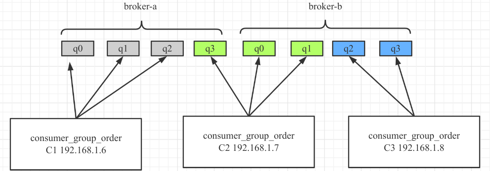
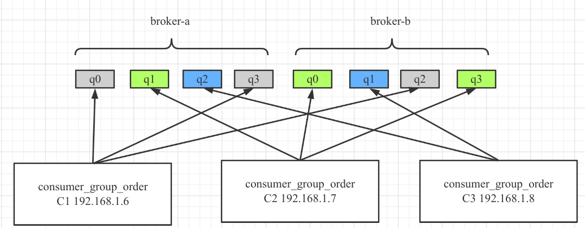
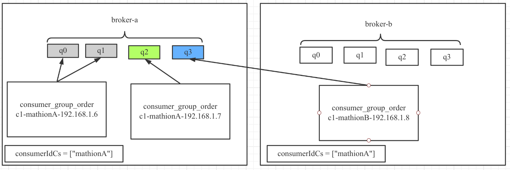
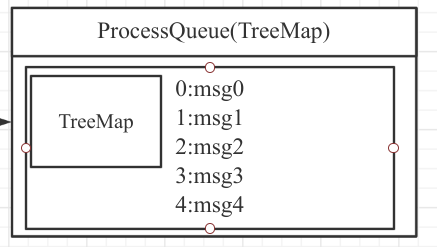
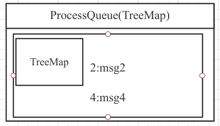
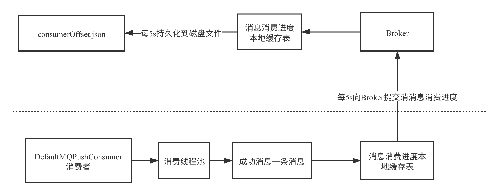

# 09 DefaultMQPushConsumer 核心参数与工作原理

PUSH 模式是对 PULL 模式的封装，类似于一个高级 API，用户使用起来将非常简单，基本将消息消费所需要解决的问题都封装好了，故使用起来将变得简单。与此同时，需要将其用好，那还是需要了解其内部的工作原理以及 PUSH 模式支持哪些参数，这些参数是如何工作的，在使用时有什么注意的呢？

### DefaultMQPushConsumer 核心参数一览与内部原理

DefaultMQPushConsumer 的核心参数一览如下。

**InternalLogger log** 这个是消费者一个 final 的属性，用来记录 RocketMQ Consumer 在运作过程中的一些日志，其日志文件默认路径为 `{user.home}/logs/rocketmqlogs/rocketmq_cliente.log`。 **String consumerGroup** 消费组的名称，在 RocketMQ 中，对于消费中来说，一个消费组就是一个独立的隔离单位，例如多个消费组订阅同一个主题，其消息进度（消息处理的进展）是相互独立的，两者不会有任何的干扰。 **MessageModel messageModel** 消息组消息消费模式，在 RocketMQ 中支持集群模式、广播模式。集群模式值得是一个消费组内多个消费者共同消费一个 Topic 中的消息，即一条消息只会被集群内的某一个消费者处理；而广播模式是指一个消费组内的每一个消费者负责 Topic 中的所有消息。 **ConsumeFromWhere consumeFromWhere**  **一个消费者初次启动时** （即消费进度管理器中无法查询到该消费组的进度）时从哪个位置开始消费的策略，可选值如下所示：

- CONSUME_FROM_LAST_OFFSET：从最新的消息开始消费。
- CONSUME_FROM_FIRST_OFFSET：从最新的位点开始消费。
- CONSUME_FROM_TIMESTAMP：从指定的时间戳开始消费，这里的实现思路是从 Broker 服务器寻找消息的存储时间小于或等于指定时间戳中最大的消息偏移量的消息，从这条消息开始消费。

**String consumeTimestamp** 指定从什么时间戳开始消费，其格式为 yyyyMMddHHmmss，默认值为 30 分钟之前，该参数只在 consumeFromWhere 为 CONSUME_FROM_TIMESTAMP 时生效。 **AllocateMessageQueueStrategy allocateMessageQueueStrategy**

消息队列负载算法。主要解决的问题是消息消费队列在各个消费者之间的负载均衡策略，例如一个 Topic 有８个队列，一个消费组中有３个消费者，那这三个消费者各自去消费哪些队列。

RocketMQ 默认提供了如下负载均衡算法：

- AllocateMessageQueueAveragely：平均连续分配算法。
- AllocateMessageQueueAveragelyByCircle：平均轮流分配算法。
- AllocateMachineRoomNearby：机房内优先就近分配。
- AllocateMessageQueueByConfig：手动指定，这个通常需要配合配置中心，在消费者启动时，首先先创建 AllocateMessageQueueByConfig 对象，然后根据配置中心的配置，再根据当前的队列信息，进行分配，即该方法不具备队列的自动负载，在 Broker 端进行队列扩容时，无法自动感知，需要手动变更配置。
- AllocateMessageQueueByMachineRoom：消费指定机房中的队列，该分配算法首先需要调用该策略的 `setConsumeridcs(Set<String> consumerIdCs)` 方法，用于设置需要消费的机房，将刷选出来的消息按平均连续分配算法进行队列负载。

**AllocateMessageQueueConsistentHash** 一致性 Hash 算法。 **OffsetStore offsetStore**

消息进度存储管理器，该属性为私有属性，不能通过 API 进行修改，该参数主要是根据消费模式在内部自动创建，RocketMQ 在广播消息、集群消费两种模式下消息消费进度的存储策略会有所不同。

- 集群模式：RocketMQ 会将消息消费进度存储在 Broker 服务器，存储路径为 `${ROCKET_HOME}/store/config/ consumerOffset.json` 文件中。
- 广播模式：RocketMQ 会将消息消费进存在在消费端所在的机器上，存储路径为 `${user.home}/.rocketmq_offsets` 中。

为了方便大家对消息消费进度有一个直接的理解，下面给出我本地测试时 Broker 集群中的消息消费进度文件，其截图如下：


消息消费进度，首先使用 [\[email protected\]](/cdn-cgi/l/email-protection) 为键，其值是一个 Map，键为 Topic 的队列序列，值为当前的消息消费位点。

```plaintext
int consumeThreadMin
```

消费者每一个消费组线程池中最小的线程数量，默认为 20。在 RocketMQ 消费者中，会为每一个消费者创建一个独立的线程池。

```plaintext
int consumeThreadMax
```

消费者最大线程数量，在当前的 RocketMQ 版本中，该参数通常与 consumeThreadMin 保持一致，大于没有意义，因为 RocketMQ 创建的线程池内部创建的队列为一个无界队列。

```plaintext
int consumeConcurrentlyMaxSpan
```

并发消息消费时处理队列中最大偏移量与最小偏移量的差值的阔值，如差值超过该值，触发消费端限流。限流的具体做法是不再向 Broker 拉取该消息队列中的消息，默认值为 2000。

```plaintext
int pullThresholdForQueue
```

消费端允许消费端端单队列积压的消息数量，如果处理队列中超过该值，会触发消息消费端的限流。默认值为 1000，不建议修改该值。

```pullThresholdSizeForQueue
```

消费端允许消费端但队列中挤压的消息体大小，默认为 100MB。
```

pullThresholdForTopic

```plaintext
按 Topic 级别进行消息数量限流，默认不开启，为 -1，如果设置该值，会使用该值除以分配给当前消费者的队列数，得到每个消息消费队列的消息阔值，从而改变 pullThresholdForQueue。
```

pullThresholdSizeForTopic

```plaintext
按 Topic 级别进行消息消息体大小进行限流，默认不开启，其最终通过改变 pullThresholdSizeForQueue 达到限流效果。
```

long pullInterval = 0

```plaintext
消息拉取的间隔，默认 0 表示，消息客户端在拉取一批消息提交到线程池后立即向服务端拉取下一批，PUSH 模式不建议修改该值。
```

int pullBatchSize = 32

```plaintext
一次消息拉取请求最多从 Broker 返回的消息条数，默认为 32。
```

int consumeMessageBatchMaxSize 

```plaintext
消息消费一次最大消费的消息条数，这个值得是下图中参数 `ist<MessageExt> msgs` 中消息的最大条数。


```

int maxReconsumeTimes 

```plaintext
消息消费重试次数，并发消费模式下默认重试 16 次后进入到死信队列，如果是顺序消费，重试次数为 Integer.MAX_VALUE。
```

long suspendCurrentQueueTimeMillis

```plaintext
消费模式为顺序消费时设置每一次重试的间隔时间，提高重试成功率。
```

long consumeTimeout = 15
```

消息消费超时时间，默认为 15 分钟。

### 核心参数工作原理

#### **消息消费队列负载算法** 本节将使用图解的方式来阐述 RocketMQ 默认提供的消息消费队列负载机制。 **AllocateMessageQueueAveragely** 平均连续分配算法。主要的特点是一个消费者分配的消息队列是连续的

 **AllocateMessageQueueAveragelyByCircle** 平均轮流分配算法，其分配示例图如下：

 **AllocateMachineRoomNearby** 机房内优先就近分配。其分配示例图如下：


上述的背景是一个 MQ 集群的两台 Broker 分别部署在两个不同的机房，每一个机房中都部署了一些消费者，其队列的负载情况是同机房中的消费队列优先被同机房的消费者进行分配，其分配算法可以指定其他的算法，例如示例中的平均分配，但如果机房 B 中的消费者宕机，B 机房中没有存活的消费者，那该机房中的队列会被其他机房中的消费者获取进行消费。 **AllocateMessageQueueByConfig** 手动指定，这个通常需要配合配置中心，在消费者启动时，首先先创建 AllocateMessageQueueByConfig 对象，然后根据配置中心的配置，再根据当前的队列信息，进行分配，即该方法不具备队列的自动负载，在 Broker 端进行队列扩容时，无法自动感知，需要手动变更配置。 **AllocateMessageQueueByMachineRoom** 消费指定机房中的队列，该分配算法首先需要调用该策略的 `setConsumeridcs(Set<String> consumerIdCs)` 方法，用于设置需要消费的机房，将刷选出来的消息按平均连续分配算法进行队列负载，其分配示例图如下所示：



由于设置 consumerIdCs 为 A 机房，故 B 机房中的队列并不会消息。 **AllocateMessageQueueConsistentHash** 一致性 Hash 算法，讲真，在消息队列负载这里使用一致性算法，没有任何实际好处，一致性 Hash 算法最佳的使用场景用在 Redis 缓存的分布式领域最适宜。

#### **PUSH 模型消息拉取机制** 在介绍消息消费端限流机制时，首先用如下简图简单介绍一下 RocketMQ 消息拉取执行模型


其核心关键点如下：

1. 经过队列负载机制后，会分配给当前消费者一些队列，注意一个消费组可以订阅多个主题，正如上面 pullRequestQueue 中所示，topic_test、topic_test1 这两个主题都分配了一个队列。
1. 轮流从 pullRequestQueue 中取出一个 PullRequest 对象，根据该对象中的拉取偏移量向 Broker 发起拉取请求，默认拉取 32 条，可通过上文中提到的 pullBatchSize 参数进行改变，该方法不仅会返回消息列表，还会返更改 PullRequest 对象中的下一次拉取的偏移量。
1. 接收到 Broker 返回的消息后，会首先放入 ProccessQueue（处理队列），该队列的内部结构为 TreeMap，key 存放的是消息在消息消费队列（consumequeue）中的偏移量，而 value 为具体的消息对象。
1. 然后将拉取到的消息提交到消费组内部的线程池，并立即返回，并将 PullRequest 对象放入到 pullRequestQueue 中，然后取出下一个 PullRequest 对象继续重复消息拉取的流程，从这里可以看出，消息拉取与消息消费是不同的线程。
1. 消息消费组线程池处理完一条消息后，会将消息从 ProccessQueue 中，然后会向 Broker 汇报消息消费进度，以便下次重启时能从上一次消费的位置开始消费。

#### **消息消费进度提交** 通过上面的介绍，想必读者应该对消息消费进度有了一个比较直观的认识，接下来我们再来介绍一下 RocketMQ PUSH 模式的消息消费进度提交机制

通过上文的消息消费拉取模型可以看出，消息消费组线程池在处理完一条消息后，会将消息从 ProccessQueue 中移除，并向 Broker 汇报消息消费进度，那请大家思考一下下面这个问题：



例如现在处理队列中有 5 条消息，并且是线程池并发消费，那如果消息偏移量为 3 的消息（3:msg3）先于偏移量为 0、1、2 的消息处理完，那向 Broker 如何汇报消息消费进度呢？

有读者朋友说，消息 msg3 处理完，当然是向 Broker 汇报 msg3 的偏移量作为消息消费进度呀。但细心思考一下，发现如果提交 msg3 的偏移量为消息消费进度，那汇报完毕后如果消费者发生内存溢出等问题导致 JVM 异常退出，msg1 的消息还未处理，然后重启消费者，由于消息消费进度文件中存储的是 msg3 的消息偏移量，会继续从 msg3 开始消费，会造成 **消息丢失** 。显然这种方式并不可取。

RocketMQ 采取的方式是处理完 msg3 之后，会将 msg3 从消息处理队列中移除，但在向 Broker 汇报消息消费进度时是 **取 ProceeQueue 中最小的偏移量为消息消费进度** ，即汇报的消息消费进度是 0。



即如果处理队列如上图所示，那提交的消息进度为 2。但这种方案也并非完美，有可能会造成消息重复消费，例如如果发生内存溢出等异常情况，消费者重新启动，会继续从消息偏移量为 2 的消息开始消费，msg3 就会被消费多次，故 **RocketMQ 不保证消息重复消费** 。

消息消费进度具体的提交流程如下图所示：



从这里也可以看成，为了减少消费者与 Broker 的网络交互，提高性能，提交消息消费进度时会首先存入到本地缓存表中，然后定时上报到 Broker，同样 Broker 也会首先存储本地缓存表，然后定时刷写到磁盘。

### 小结

本篇详细介绍了 DefaultMQPushConsumer 的所有可配置参数以及消息消费中消息队列负载机制、消息拉取机制、消息消费进度提交这三个非常重要的点，为后续的实践与问题排查打下坚实的基础。
