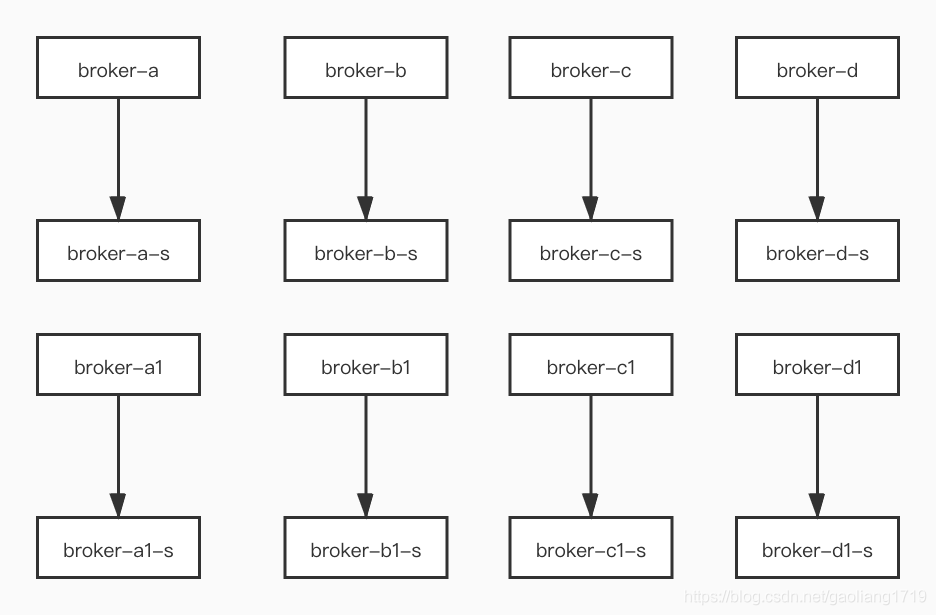
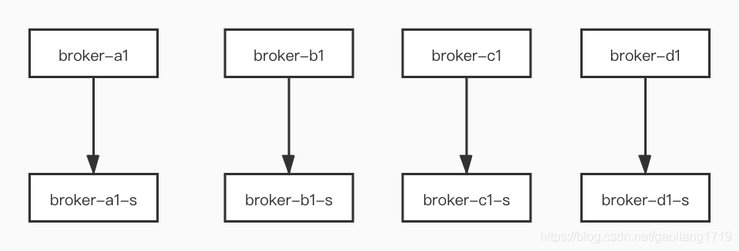
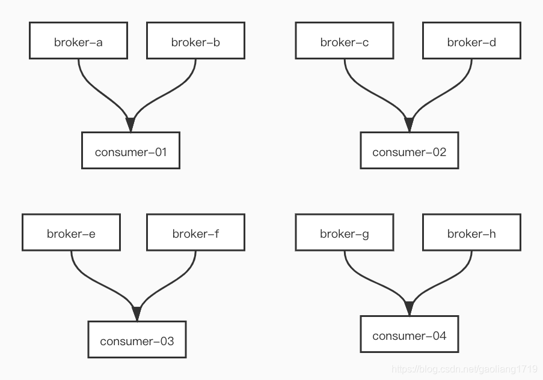
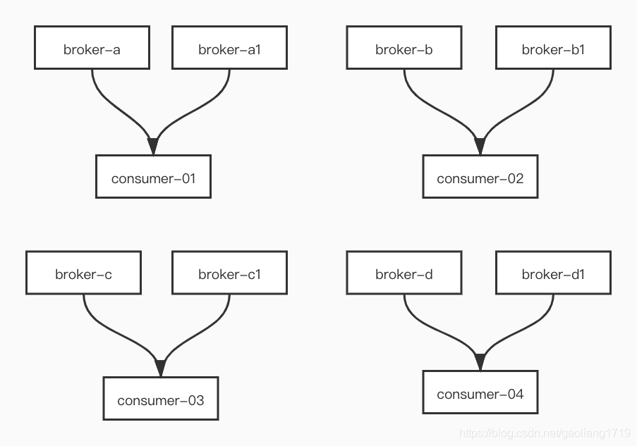

# 18 RocketMQ 集群平滑运维

### 前言

在 RocketMQ 集群的运维实践中，无论线上 Broker 节点启动和关闭，还是集群的扩缩容，都希望是平滑的，业务无感知。正所谓 “随风潜入夜，润物细无声” ，本文以实际发生的案例窜起系列平滑操作。

### 优雅摘除节点

#### **案例背景** 自建机房 4 主 4 从、异步刷盘、主从异步复制。有一天运维同学遗失其中一个 Master 节点所有账户的密码，该节点在集群中运行正常，然不能登陆该节点机器终究存在安全隐患，所以决定摘除该节点

如何平滑地摘除该节点呢？

直接关机，有部分未同步到从节点的数据会丢失，显然不可行。线上安全的指导思路“先摘除流量”，当没有流量流入流出时，对节点的操作是安全的。

#### **流量摘除**  **1. 摘除写入流量** 我们可以通过关闭 Broker 的写入权限，来摘除该节点的写入流量。RocketMQ 的 broker 节点有 3 种权限设置，brokerPermission=2 表示只写权限，brokerPermission=4 表示只读权限，brokerPermission=6 表示读写权限。通过 updateBrokerConfig 命令将 Broker 设置为只读权限，执行完之后原该 Broker 的写入流量会分配到集群中的其他节点，所以摘除前需要评估集群节点的负载情况

```sql
bin/mqadmin updateBrokerConfig -b x.x.x.x:10911 -n x.x.x.x:9876 -k brokerPermission -v 4
Java HotSpot(TM) 64-Bit Server VM warning: ignoring option PermSize=128m; support was removed in 8.0
Java HotSpot(TM) 64-Bit Server VM warning: ignoring option MaxPermSize=128m; support was removed in 8.0
update broker config success, x.x.x.x:10911
```

将 Broker 设置为只读权限后，观察该节点的流量变化，直到写入流量（InTPS）掉为 0 表示写入流量已摘除。

```plaintext
bin/mqadmin clusterList -n x.x.x.x:9876
Java HotSpot(TM) 64-Bit Server VM warning: ignoring option PermSize=128m; support was removed in 8.0
Java HotSpot(TM) 64-Bit Server VM warning: ignoring option MaxPermSize=128m; support was removed in 8.0
#Cluster Name #Broker Name #BID #Addr #Version #InTPS(LOAD) #OutTPS(LOAD) #PCWait(ms) #Hour #SPACE
ClusterA broker-a 0 x.x.x.x:10911 V4_7_0_SNAPSHOT 2492.95(0,0ms) 2269.27(1,0ms) 0 137.57 0.1861
ClusterA broker-a 1 x.x.x.x:10911 V4_7_0_SNAPSHOT 2485.45(0,0ms) 0.00(0,0ms) 0 125.26 0.3055
ClusterA broker-b 0 x.x.x.x:10911 V4_7_0_SNAPSHOT 26.47(0,0ms) 26.08(0,0ms) 0 137.24 0.1610
ClusterA broker-b 1 x.x.x.x:10915 V4_7_0_SNAPSHOT 20.47(0,0ms) 0.00(0,0ms) 0 125.22 0.3055
ClusterA broker-c 0 x.x.x.x:10911 V4_7_0_SNAPSHOT 2061.09(0,0ms) 1967.30(0,0ms) 0 125.28 0.2031
ClusterA broker-c 1 x.x.x.x:10911 V4_7_0_SNAPSHOT 2048.20(0,0ms) 0.00(0,0ms) 0 137.51 0.2789
ClusterA broker-d 0 x.x.x.x:10911 V4_7_0_SNAPSHOT 2017.40(0,0ms) 1788.32(0,0ms) 0 125.22 0.1261
ClusterA broker-d 1 x.x.x.x:10915 V4_7_0_SNAPSHOT 2026.50(0,0ms) 0.00(0,0ms) 0 137.61 0.2789
```

**2. 摘除读出流量** 当摘除 Broker 写入流量后，读出消费流量也会逐步降低。可以通过 clusterList 命令中 OutTPS 观察读出流量变化。除此之外，也可以通过 brokerConsumeStats 观察 broker 的积压（Diff）情况，当积压为 0 时，表示消费全部完成。

```plaintext
# Topic             #Group                #Broker Name    #QID  #Broker Offset   #Consumer Offset  #Diff     #LastTime

test_melon_topic   test_melon_consumer     broker-b        0     2171742           2171742          0       2020-08-13 23:38:09
test_melon_topic   test_melon_consumer     broker-b        1     2171756           2171756          0       2020-08-13 23:38:50
test_melon_topic   test_melon_consumer     broker-b        2     2171740           2171740          0       2020-08-13 23:42:58
test_melon_topic   test_melon_consumer     broker-b        3     2171759           2171759          0       2020-08-13 23:40:44
test_melon_topic   test_melon_consumer     broker-b        4     2171743           2171743          0       2020-08-13 23:32:48
test_melon_topic   test_melon_consumer     broker-b        5     2171740           2171740          0       2020-08-13 23:35:58
```

**3. 节点下线** 在观察到该 Broker 的所有积压为 0 时，通常该节点可以摘除了。考虑到可能消息回溯到之前某个时间点重新消费，可以过了日志保存日期再下线该节点。如果日志存储为 3 天，那 3 天后再移除该节点。

### 平滑扩所容

#### **案例背景** 需要将线上的集群操作系统从 CentOS 6 全部换成 CenOS 7，具体现象和原因在踩坑记中介绍。集群部署架构为 4 主 4 从，见下图，broker-a 为主节点，broker-a-s 是 broker-a 的从节点。


那需要思考的是如何做到平滑替换？指导思想为“先扩容再缩容”。

#### **集群扩容** 申请 8 台相同配置的机器，机器操作系统为 CenOS 7。分别组建主从结构加入到原来的集群中，此时集群中架构为 8 主 8 从，如下图：



broker-a、broker-b、broker-c、broker-d 及其从节点为 CentOS 6。broker-a1、broker-b1、broker-c1、broker-d1 及其从节点为 CentOS 7。8 主均有流量流入流出，至此我们完成了集群的平滑扩容操作。

#### **集群缩容** 按照第二部分“优雅摘除节点”操作，分别摘除 broker-a、broker-b、broker-c、broker-d 及其从节点的流量。为了安全，可以在过了日志保存时间（例如：3 天）后再下线。集群中剩下操作系统为 CentOS 7 的 4 主 4 从的架构，如图。至此，完成集群的平滑缩容操作。



#### **注意事项** 在扩容中，我们将新申请的 8 台 CentOS 7 节点，命名为 broker-a1、broker-b1、broker-c1、broker-d1 的形式，而不是 broker-e、broker-f、broker-g、broker-h。下面看下这么命名的原因，客户端消费默认采用平均分配算法，假设有四个消费节点。**第一种形式** 扩容后排序如下，即新加入的节点 broker-e 会排在原集群的最后。

```plaintext
broker-a,broker-b,broker-c,broker-d,broker-e,broker-f,broker-g,broker-h
```



注：当缩容摘除 broker-a、broker-b、broker-c、broker-d 的流量时，会发现 consumer-01、consumer-02 没有不能分到 Broker 节点，造成流量偏移，存在剩余的一半节点无法承载流量压力的隐患。**第二种形式**

扩容后的排序如下，即新加入的主节点 broker-a1 紧跟着原来的主节点 broker-a。

```plaintext
broker-a,broker-a1,broker-b,broker-b1,broker-c,broker-c1,broker-d,broker-d1
```



注：当缩容摘除 broker-a、broker-b、broker-c、broker-d 的流量时，各个 consumer 均分配到了新加入的 Broker 节点，没有流量偏移的情况。
```
