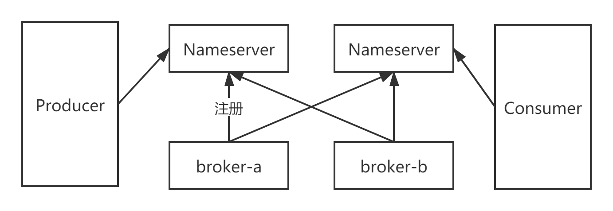
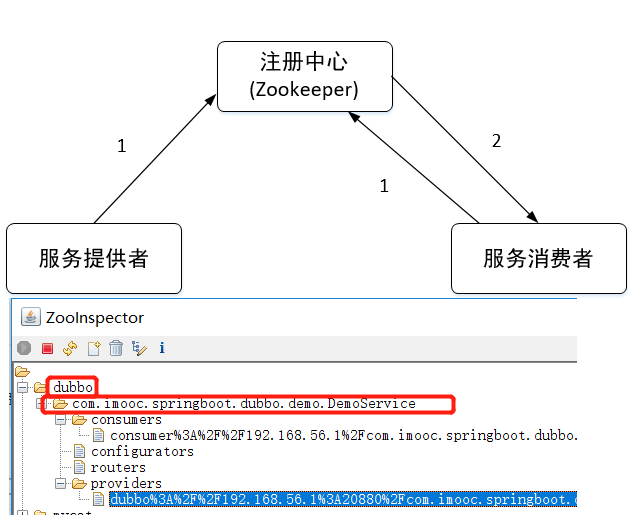
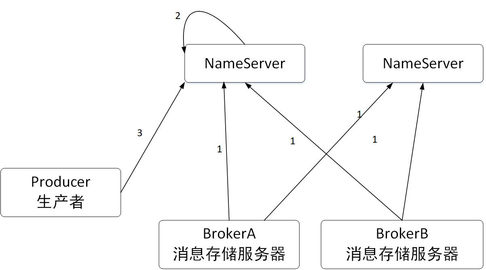

# 25 RocketMQ Nameserver 背后的设计理念

Nameserver 在 RocketMQ 整体架构中所处的位置就相当于 ZooKeeper、Dubbo 服务化架构体系中的位置，即充当“注册中心”，在 RocketMQ 中路由信息主要是指主题（Topic）的队列信息，即一个 Topic 的队列分布在哪些 Broker 中。

### Nameserver 工作机制

Topic 的注册与发现主要的参与者：Nameserver、Producer、Consumer、Broker。其交互特性与联通性如下：

- Nameserver：命名服务器，多台机器组成一个集群，每台机器之间互不联通。
- Broker：Broker 消息服务器，会向 Nameserver 中的每一台 NamServer 每隔 30s 发送心跳包，即 Nameserver 中关于 Topic 路由信息来源于 Broker。正式由于这种注册机制，并且 Nameserver 互不联通，如果出现网络分区等因素，例如 broker-a 与集群中的一台 Nameserver 网络出现中断，这样会出现两台 Nameserver 中的数据出现不一致。具体会有什么影响下文会继续探讨。
- Producer、Consumer：消息发送者、消息消费者，在同一时间只会连接 Nameserver 集群中的一台服务器，并且会每隔 30s 会定时更新 Topic 的路由信息。

另外 Nameserver 会定时扫描 Broker 的存活状态，其依据之一是如果连续 120s 未收到 Broker 的心跳信息，就会移除 Topic 路由表中关于该 broker 的所有队列信息，这样消息发送者在发送消息时就不会将消息发送到出现故障的 Broker 上，提高消息发送高可用性。

Nameserver 采用的注册中心模式为——PULL 模式，接下来会详细介绍目前主流的注册中心实现思路，从而从架构上如何进行选择。

### 两种设计注册中心的思路

#### **PUSH 模式** 说到服务注册中心，大家肯定会优先想到 Dubbo 的服务注册中心 ZooKeeper，正式由于这种“先入为主”，不少读者朋友们通常也会有一个疑问：为什么 RocketMQ 的注册中心不直接使用 ZooKeeper，而要自己实现一个 Nameserver 的注册中心呢？

那我们首先来聊一下 Dubbo 的服务注册中心：ZooKeeper，基于 ZooKeeper 的注册中心有一个显著的特点是服务的动态变更，消费者可以实时感知。例如在 Dubbo 中，一个服务进行在线扩容，增加一批的消息服务提供者，消费者能立即感知，并将新的请求负载到新的服务提供者，这种模式在业界有一个专业术语：PUSH 模式。

基于 ZooKeeper 的服务注册中心主要是利于 ZooKeeper 的事件机制，其主要过程如下：

1. 消息服务提供者在启动时向注册中心进行注册，其主要是在 /dubbo/{serviceName}/providers 目录下创建一个瞬时节点。服务提供者如果宕机该节点就会由于会话关闭而被删除。
1. 消息消费者在启动时订阅某个服务，其实就是在 /dubbo/{serviceName}/consumers 下创建一个瞬时节点，同时监听 /dubbo/{serviceName}/providers，如果该节点下新增或删除子节点，消费端会收到一个事件，ZooKeeper 会将 providers 当前所有子节点信息推送给消费消费端，消费端收到最新的服务提供者列表，更新消费端的本地缓存，及时生效。

基于 ZooKeeper 的注册中心一个最大的优点是其实时性。但其内部实现非常复杂，ZooKeeper 是基于 CP 模型，可以看出是强一致性，往往就需要吸收其可用性，例如如果 ZooKeeper 集群触发重新选举或网络分区，此时整个 ZooKeeper 集群将无法提供新的注册与订阅服务，影响用户的使用。

在 **服务注册领域** 服务数据的一致性其实并不是那么重要，例如回到 Dubbo 服务的注册与订阅场景来看，其实客户端（消息消费端）就算获得服务提供者列表不一致，也不会造成什么严重的后果，最多是在一段时间内服务提供者的负载不均衡，只要最终能达到一致即可。

#### PULL 模式

RocketMQ 的 Nameserver 并没有采用诸如 ZooKeeper 的注册中心，而是选择自己实现，如果大家看过 RocketMQ 的源代码，就会发现该模块就 5~6 个类，总代码不超过 5000 行，简单就意味着高效，基于 PULL 模式的注册中心示例图：

1. Broker 每 30s 向 Nameserver 发送心跳包，心跳包中包含主题的路由信息（主题的读写队列数、操作权限等），Nameserver 会通过 HashMap 更新 Topic 的路由信息，并记录最后一次收到 Broker 的时间戳。
1. Nameserver 以每 10s 的频率清除已宕机的 Broker，Nameserver 认为 Broker 宕机的依据是如果当前系统时间戳减去最后一次收到 Broker 心跳包的时间戳大于 120s。
1. 消息生产者以每 30s 的频率去拉取主题的路由信息，即消息生产者并不会立即感知 Broker 服务器的新增与删除。**PULL 模式的一个典型特征是即使注册中心中存储的路由信息发生变化后，客户端无法实时感知，只能依靠客户端的定时更新更新任务，这样会引发一些问题** 。例如大促结束后要对集群进行缩容，对集群进行下线，如果是直接停止进程，由于是网络连接直接断开，Nameserver 能立即感知 Broker 的下线，会及时存储在内存中的路由信息，但并不会立即推送给 Producer、Consumer，而是需要等到 Producer 定时向 Nameserver 更新路由信息，那在更新之前，进行消息队列负载时，会选择已经下线的 Broker 上的队列，这样会造成消息发送失败。

在 RocketMQ 中 Nameserver 集群中的节点相互之间不通信，各节点相互独立，实现非常简单，但同样会带来一个问题：Topic 的路由信息在各个节点上会出现不一致。

那 Nameserver 如何解决上述这两个问题呢？RocketMQ 的设计者采取的方案是不解决，即为了保证 Nameserver 的高性能，允许存在这些缺陷，这些缺陷由其使用者去解决。**由于消息发送端无法及时感知路由信息的变化，引入了消息发送重试与故障规避机制来保证消息的发送高可用**，这部分内容已经在前面的文章中详细介绍。

那 Nameserver 之间数据的不一致，会造成什么重大问题吗？

### Nameserver 数据不一致影响分析

RocketMQ 中的消息发送者、消息消费者在同一时间只会连接到 Nameserver 集群中的某一台机器上，即有可能消息发送者 A 连接到 Namederver-1 上，而消费端 C1 可能连接到 Nameserver-1 上，消费端 C2 可能连接到 Nameserver-2 上，我们分别针对消息发送、消息消费来谈一下数据不一致会产生什么样的影响。

Nameserver 数据不一致示例图如下：

#### **对消息发送端的影响** 正如上图所示，Producer-1 连接 Nameserver-1，而 Producer-2 连接 Nameserver-2，例如这个两个消息发送者都需要发送消息到主题 order_topic。**由于 Nameserver 中存储的路由信息不一致，对消息发送的影响不大，只是会造成消息分布不均衡**，会导致消息大部分会发送到 broker-a 上，只要不出现网络分区的情况，Nameserver 中的数据会最终达到一致，数据不均衡问题会很快得到解决。故从消息发送端来看，Nameserver 中路由数据的不一致性并不会产生严重的问题

#### **对消息消费端的影响**

如果一个消费组 order_consumer 中有两个消费者 c1、c2，同样由于 c1、c2 连接的 Nameserver 不同，两者得到的路由信息会不一致，会出现什么问题呢？我们知道，在 RocketMQ PUSH 模式下会自动进行消息消费队列的负载均衡，我们以平均分配算法为例，来看一下队列的负载情况。

- c1：在消息队列负载的时查询到 order_topic 的队列数量为 8 个（broker-a、broker-b 各 2 个），查询到该消费组在线的消费者为 2 个，那按照平均分配算法，会分配到 4 个队列，分别为 broker-a：q0、q1、q2、q3。
- c2：在消息队列负载时查询到 order_topic 的队列个数为 4 个（broker-a），查询到该消费组在线的消费者 2 个，按照平均分配算法，会分配到 2 个队列，由于 c2 在整个消费列表中处于第二个位置，故分配到队列为 broker-a：q2、q3。

将出现的问题一目了然了吧： **会出现 broker-b 上的队列分配不到消费者，并且 broker-a 上的 q2、q3 这两个队列会被两个消费者同时消费，造成消息的重复处理**，如果 **消费端实现了幂等**，也不会造成太大的影响，无法就是有些队列消息未处理，结合监控机制，这种情况很快能被监控并通知人工进行干预。

当然随着 Nameserver 路由信息最终实现一致，同一个消费组中所有消费组，最终维护的路由信息会达到一致，这样消息消费队列最终会被正常负载，故只要消费端实现幂等，造成的影响也是可控的，不会造成不可估量的损失，就是因为这个原因，RocketMQ 的设计者们为了达到简单、高效之目的，在 Nameserver 的设计上允许出现一些缺陷，给我们做架构设计方案时起到了一个非常好的示范作用，无需做到尽善尽美，懂得抉择、权衡。
