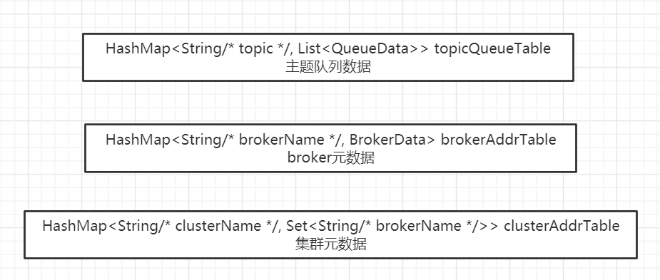
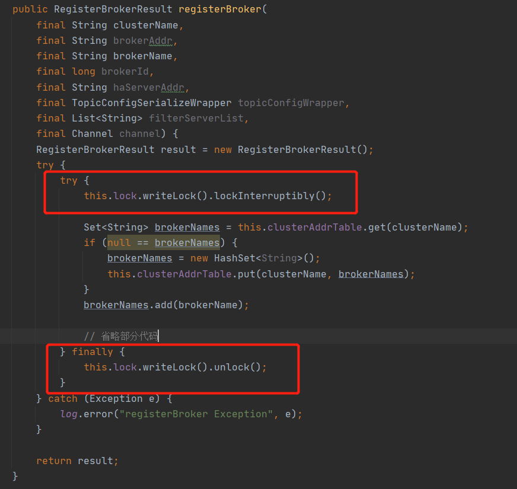
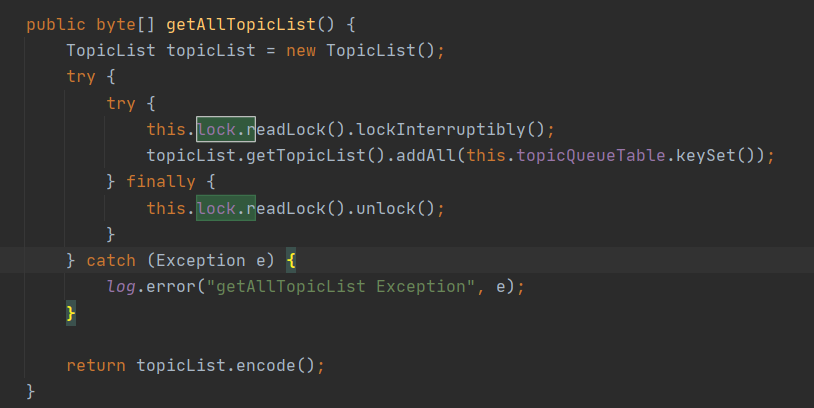
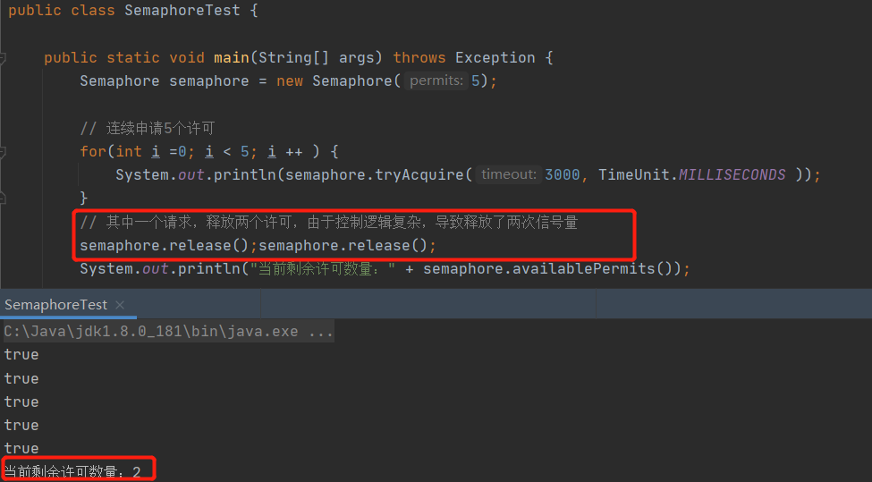
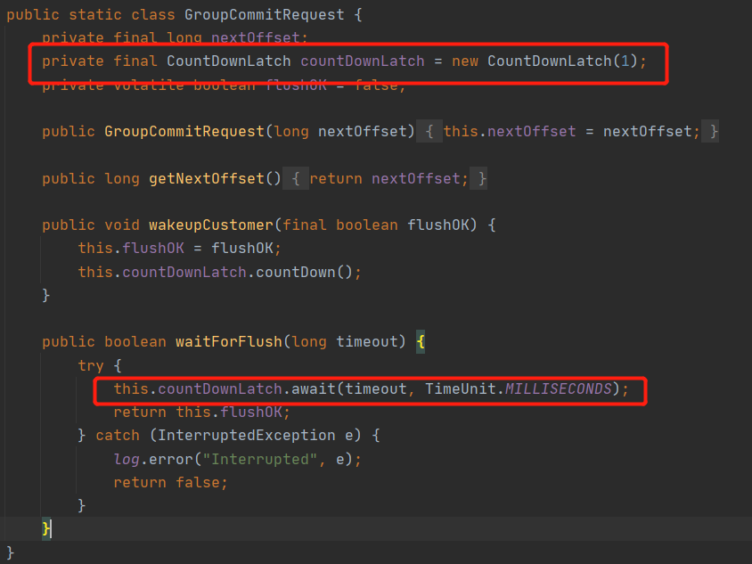
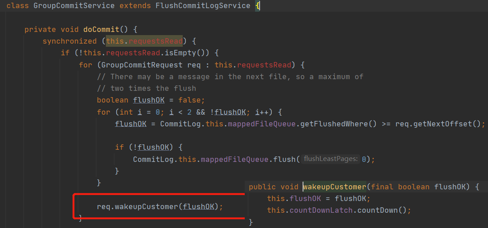
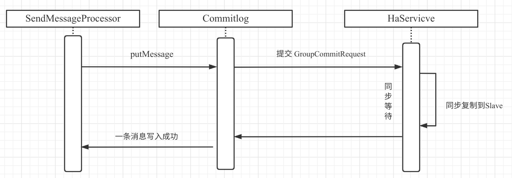
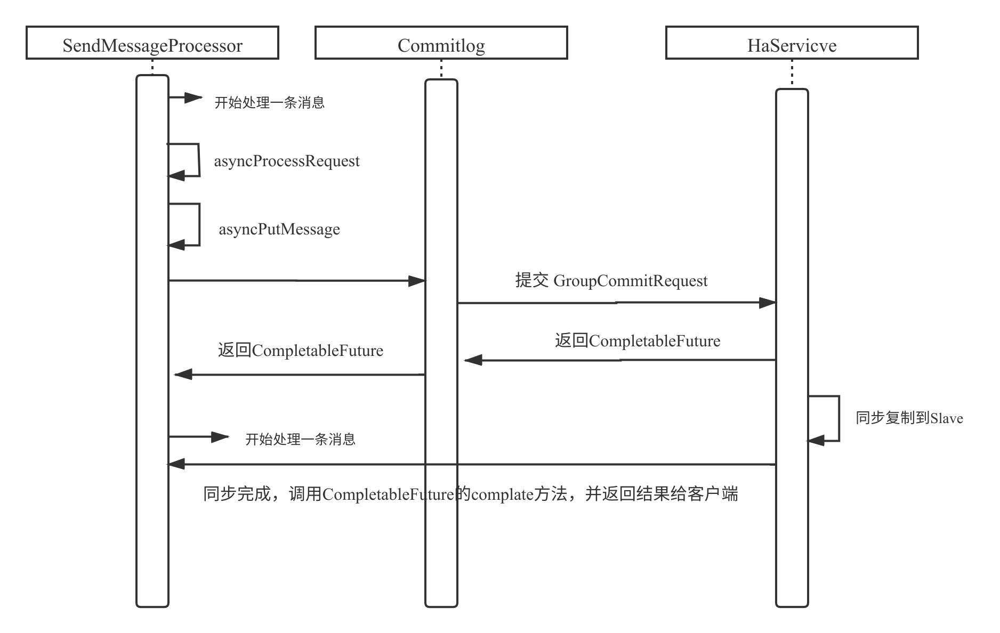

# 26 Java 并发编程实战

RocketMQ 是一款非常优秀的分布式，里面有很多的编程技巧值得我们借鉴，本文从并发编程角度，从 RocketMQ 中挑选几个示例与大家一起来分享沟通一下。

### 读写锁的使用场景

在 RocketMQ 中关于 Topic 的路由信息主要指的是一个 Topic 在各个 Broker 上的队列信息，而 Broker 的元数据又包含所属集群名称、Broker IP 地址，路由信息的写入操作主要是 Broker 每隔 30s 向 Broker 上报路由信息，而路由信息的读取时由消息客户端（消息发送者、消息消费者）定时向 Nameserver 查询 Topic 的路由消息，而且 Broker 的请求是量请求，而客户端查询路由信息是以 Topic 为维度的查询，并且一个消费端集群的应用成百上千个，其特点： **查询请求远超过写入请求** 。



在 RocketMQ Nameserver 中用来存储路由信息的元数据使用的是上述三个 HashMap，众所周知，HashMap 在多线程环境并不安全，容易造成 CPU 100%，故在 Broker 向 Nameserver 汇报路由信息时需要对上述三个 HashMap 进行数据更新，故需要引入锁，结合读多写少的特性，故采用 JDK 的读写锁 ReentrantReadWriteLock，用来对数据的读写进行保护，其示例代码如下：



在对上述 HashMap 添加数据时加写锁。



在对数据进行读取时加读锁。

> 读写锁主要的特点是申请了写锁后所有的读锁申请全部阻塞，如果读锁申请成功后，写锁会被阻塞，但读锁能成功申请，这样能保证读请求的并发度，而由于写请求少，故因为锁导致的等待将会非常少。结合路由注册场景，如果 Broker 向 Nameserver 发送心跳包，如果当时前有 100 个客户端正在向 Nameserver 查询路由信息，那写请求会暂时被阻塞，只有等这 100 个读请求结束后，才会执行路由的更新操作，可能会有读者会问，如果在写请求阻塞期间，又有 10 个新的客户端发起路由查询，那这 10 个请求是立即能执行还是需要阻塞，答案是默认会阻塞等待，因为已经有写锁在申请，后续的读请求会被阻塞。

**思考题：为什么 Nameserver 的容器不使用 ConcurrentHashMap 等并发容器呢？**

一个非常重要的点与其“业务”有关，因为 RocketMQ 中的路由信息比较多，其数据结构采用了多个 HashMap，如下图所示：


每次写操作可能需要同时变更上述数据结构，故为了保证其一致性，故需要加锁，ConcurrentHashMap 并发容器在多线程环境下的线程安全也只是针对其自身，故从这个维度，选用读写锁是必然的选择。

当然读者朋友们会问，如果只是针对读写锁 + HashMap 与 ConcurrentHashMap，那又该如何选择呢？这个要分 JDK 版本。

在 JDK 8 之前，ConcurrentHashMap 的数据结构 Segment（ReentrantLock）+ HashMap，其锁的粒度为 Segment，同一个 Segment 的读写都需要加锁，即落在同一个 Segment 中的读、写操作是串行的，其读的并发性低于读写锁 + HashMap 的，故在 JDK 1.8 之前，ConcurrentHashMap 是落后于读写锁 + HashMap 的结构的。

但在 JDK 1.8 及其后续版本后，对 ConcurrentHashMap 进行了优化，其存储结构与 HashMap 的存储结构类似，只是引入了 CAS 来解决并发更新，这样一来，我觉得 ConcurrentHashMap 具有一定的优势，因为不需要再维护锁结构。

### 信号量使用技巧

JDK 的信号量 Semaphore 的一个非常经典的使用场景，控制并发度，在 RocketMQ 中异步发送，为了避免异步发送过多挂起，可以通过信号量来控制并发度，即如果超过指定的并发度就会进行限流，阻止新的提交任务。信号量的通常使用情况如下所示：

```java
public static void main(String[] args) {
        Semaphore semaphore = new Semaphore(10);
        for(int i = 0; i < 100; i++) {
            Thread t = new Thread(new Runnable() {
                @Override
                public void run() {
                    doSomething(semaphore);
                }
            });
            t.start();
        }
    }
    private static  void doSomething(Semaphore semaphore) {
        boolean acquired = false;
        try {
            acquired = semaphore.tryAcquire(3000, TimeUnit.MILLISECONDS);
            if(acquired) {
                System.out.println("执行业务逻辑");
            } else {
                System.out.println("信号量未获取执行的逻辑");
            }
        } catch (Throwable e) {
            e.printStackTrace();
        } finally {
            if(acquired) {
                semaphore.release();
            }
        }
    }
```

上面的示例代码非常简单，就是通过信号量来控制 doSomething() 的并发度，上面几个点如下：

- tryAcquire：该方法是尝试获取一个信号，如果当前没有剩余许可，在指定等待时间后会返回 false，故其 release 方法必须在该方法返回 true 时调用，否则会许可超发。
- release：归还许可。

上述的场景较为紧张，如果 doSomething 是一个异步方法，则上述代码的效果会大打折扣，甚至于如果 doSomething 分支众多，而且有可能会再次异步，信号量的归还就变得非常复杂，信号量的使用最关键是申请一个许可，就必须只调用一次 release，如果多次调用 release，则会造成应用程序实际的并发数量超过设置的许可，请看如下测试代码：



由于一个线程控制的逻辑有误，导致原本只允许一个线程获取许可，但此时可以允许两个线程去获取许可，导致当前的并发量为 6，超过预定的 5 个。当然无线次调用 release 方法，并不会报错，也不会无限增加许可，许可数量不会超过构造时传入的个数。

故信号量在实践中如何避免重复调用 release 方法显得非常关键，RocketMQ 给出了如下解决方案。

```java
public class SemaphoreReleaseOnlyOnce {
    private final AtomicBoolean released = new AtomicBoolean(false);
    private final Semaphore semaphore;
    public SemaphoreReleaseOnlyOnce(Semaphore semaphore) {
        this.semaphore = semaphore;
    }
    public void release() {
        if (this.semaphore != null) {
            if (this.released.compareAndSet(false, true)) {
                this.semaphore.release();
            }
        }
    }
    public Semaphore getSemaphore() {
        return semaphore;
    }
}
```

即对 Semaphore 进行一次包装，然后传入到业务方法中，例如上述示例中的 doSomething 方法，不管 doSomething 是否还会创建线程，在需要释放的时候调用 SemaphoreReleaseOnlyOnce 的 release 方法，在该方法中进行重复判断调用，因为一个业务线程只会持有一个唯一的 SemaphoreReleaseOnlyOnce 实例，这样就能确保一个业务线只会释放一次。

在 SemaphoreReleaseOnlyOnce 的 release 的方法实现也非常简单，引入了 CAS 机制，如果该方法被调用，就使用 CAS 将 released 设置为 true，下次试图释放时，判断该状态已经是 true，则不会再次调用 Semaphore 的 release 方法，完美解决该问题。

### 同步转异步编程技巧

在并发编程模型中，有一个经典的并发设计模式——Future，即主线程向一线程提交任务时返回一个凭证（Future），此时主线程不会阻塞，还可以做其他的事情，例如再发送一些 Dubbo 请求，等需要用到异步执行结果时调用 Future 的 get() 方法时，如果异步结果已经执行完成就立即获取结果，如果未执行完，则主线程阻塞等待执行结果。

JDK 的 Future 模型通常需要一个线程池对象、一个任务请求 Task。在 RocketMQ 的同步刷盘实现中，也使用了线程进行异步解耦，同样实现了异步的效果，并且没有使用 Future 设计模式，而是巧妙的使用了 CountDownLatch。


其中 GroupCommitService 拥有同步刷盘，该线程提供一个提交刷盘请求的方法 putRequest，接受一个同步刷盘请求 GroupCommitRequest，并且该方法并不会阻塞，主线程可以继续调用 GroupCommitRequest 的 waitForFlush 方法等待刷盘结束，即虽然使用了异步线程 GroupCommitService 与主线程解耦，GroupCommitService 主要负责刷盘的业务实现。那我们来看一下 waitForFlush 的实现，体会一下同步方法转异步的关键实现要点：



巧妙的使用 CountDownLatch 的 await 方法，进行指定超时等待时间，那什么时候会被唤醒呢？当然是刷盘操作结束，由刷盘线程来调用 countDownLatch 的 countDown() 方法，从而使 await 方法结束阻塞，其实现很简单。



这种设计够优雅吧，相比 Future 来说显得更加的轻量级。

### CompletableFuture 编程技巧

从 JDK 8 开始，由于引入了 CompletableFuture，对真正实现异步编程成为了可能。所谓的真正异步是主线程发起一个异步请求后，尽管主线程需要最终得到异步请求的返回结果，但并不需要在代码中显示的调用 Future.get() 方法，做到不完全阻塞主线程，我们称之为“真正的异步”。我以 RocketMQ 的一个真实使用场景主从复制为例进行阐述。

在 RocketMQ 4.7.0 之前，同步复制的模型如下图所示：



在 RocketMQ 处理消息写入的线程通过调用 SendMessageProcessor 的 putMessage 进行消息写入，在这里我们称之为主线程，消息写入主节点后，需要将数据复制到从节点，这个过程 SendMessageProcessor 主线程一直在阻塞，需要同步等待从节点的复制结构，然后再通过网络将结果发送到消息发送客户端。即在这种编程模型中，消息发送主线程并不符合异步编程的模式，使之并不高效。

**优化的思路：将消息发送的处理逻辑与返回响应结果到客户端这个两个步骤再次进行解耦，再使用一线程池来处理同步复制的结果，然后在另外一个线程中将响应结果通过网络写入，而 SendMessageProcessor 就无需等待复制结果，减少阻塞，提高主线程的消息处理速率。** 在 JDK 8 中，由于引入了 CompletableFuture，上述的改造思路就更加容易，故在 RocketMQ 4.7.0 中借助 CompletableFuture 实现了 SendMessageProcessor 的真正异步化处理，并且还不违背同步复制的语义，其流程图如下：



实现的要点是在触发同步复制的地方，提交给 HaService（同步复制服务）时返回一个 CompletableFuture，异步线程在数据复制成功后，通过 CompletableFuture 通知其结果，得到处理结果后再向客户端返回结果。

其示例代码如下：


然后在 SendMessageProcessor 在处理 CompletableFuture 的关键代码如下：


然后调用 thenApply 方法，为 CompletableFuture 注册一个异步回掉，即在异步回掉的时候，将结果通过网络传入到客户端，实现消息发送线程与结果返回的解耦。**思考：CompletableFuture 的 thenApply 方法在哪个线程中执行呢？**

其实在 CompletableFuture 中会内置一个线程池 ForkJoin 线程池，用来执行器异步回调。
