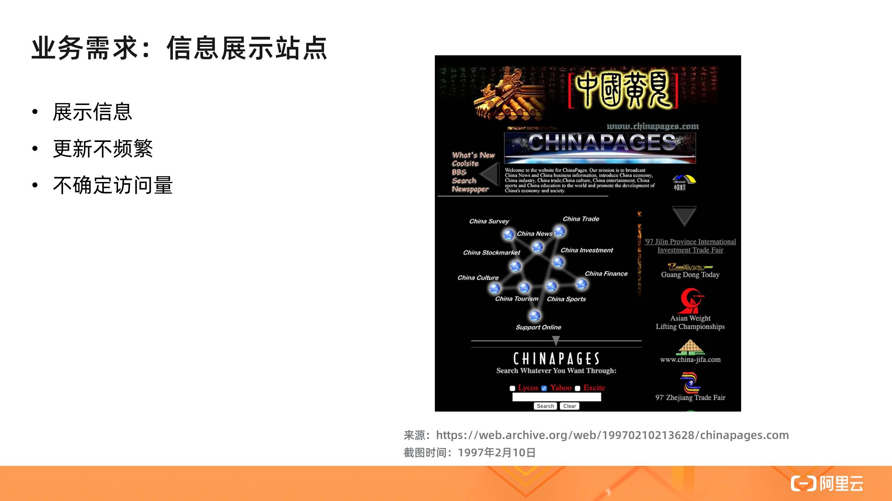
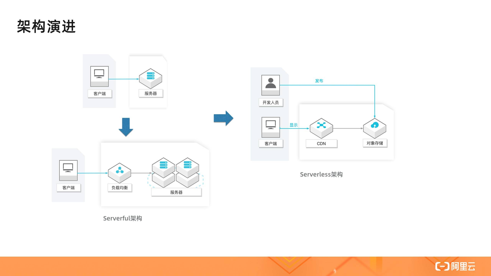
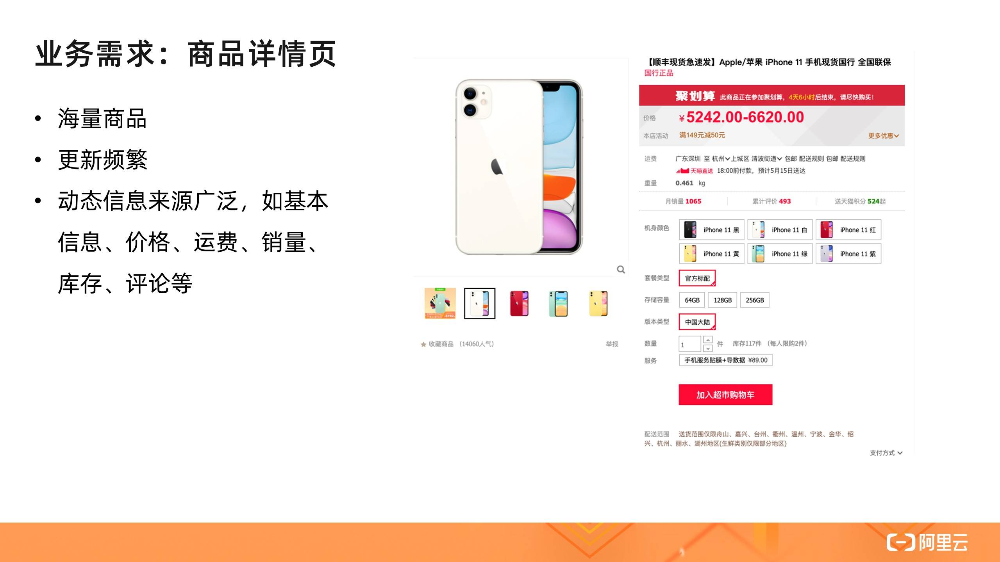
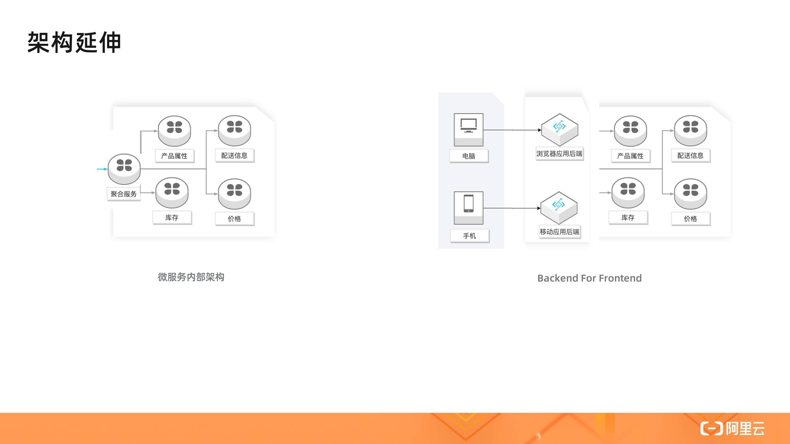
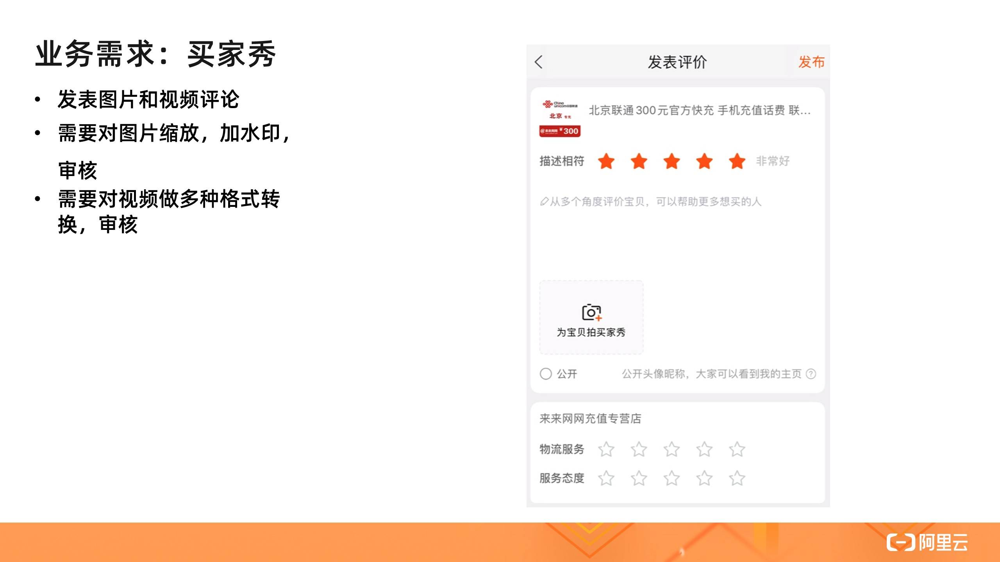
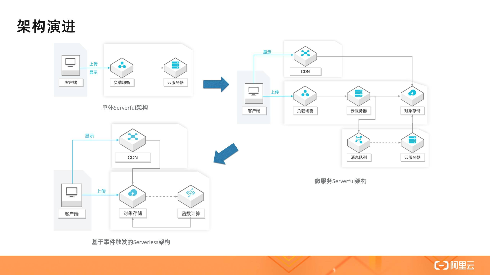
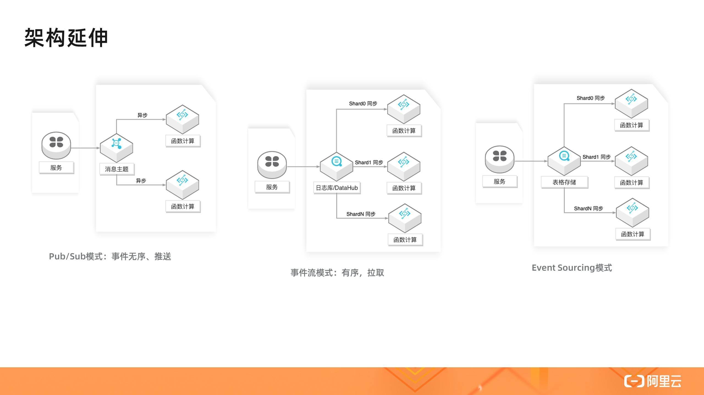
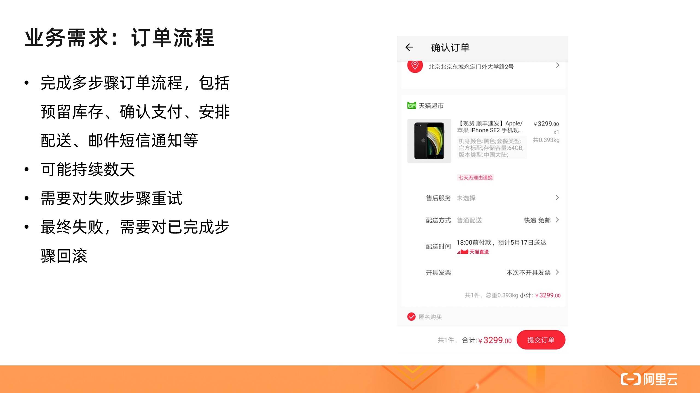
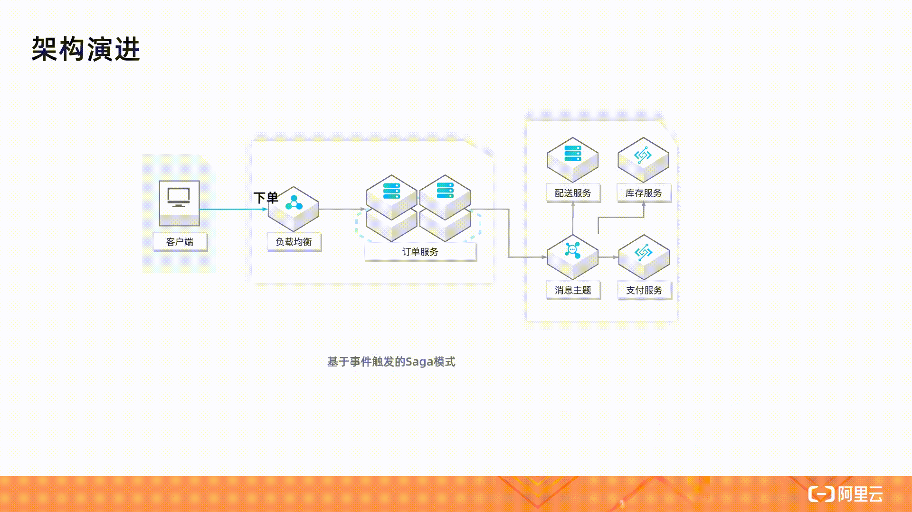
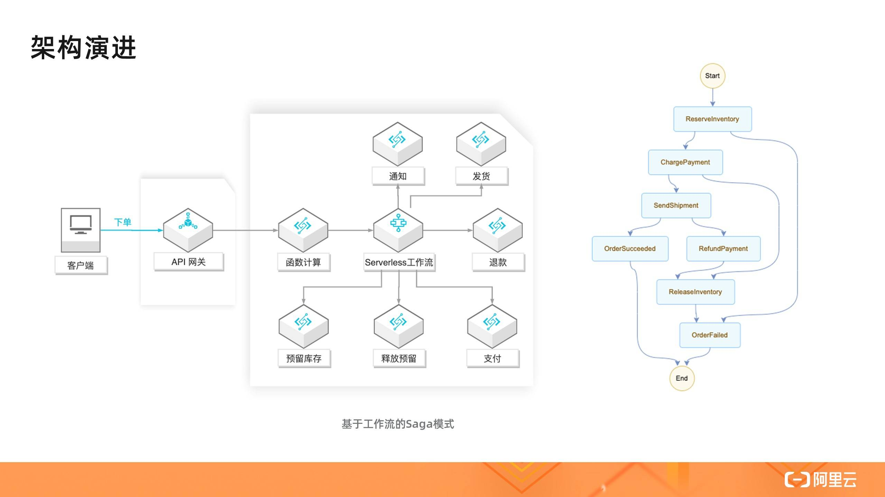

# 03 常见 Serverless 架构模式

### 究竟什么是 Serverless 架构？

什么是 Serverless 架构？按照 CNCF 对 Serverless 计算的定义，Serverless 架构应该是采用 FaaS（函数即服务）和 BaaS（后端服务）服务来解决问题的一种设计。这个定义让我们对 Serverless 的理解稍显清晰，同时可能也造成了一些困扰和争论。

- 随着需求和技术的发展，业界出现了一些 FaaS 以外的其它形态的 Serverless 计算服务，比如 Google Cloud Run，阿里云推出的面向应用的 Serverless 应用引擎服务以及 Serverless K8s，这些服务也提供了弹性伸缩能力和按使用计费的收费模式，具备 Serverless 服务的形态，可以说进一步扩大了 Serverless 计算的阵营；
- 为了消除冷启动影响，FaaS 类服务如阿里云的函数计算和 AWS 的 Lambda 相继推出了预留功能，变得不那么“按使用付费”了；
- 一些基于服务器（Serverful）的后端服务也推出了 Serverless 形态产品，比如 AWS Serverless Aurora，阿里云 Serverless HBase 服务。

这样看来，Serverless 的界线是有些模糊的，诸多云服务都向着 Serverless 方向演进。一个模糊的东西如何指导我们解决业务问题呢？Serverless 有一个根本的理念是一直没有改变的，即让用户最大化地专注业务逻辑，其它的特征如不关心服务器、自动弹性、按使用计费等，都是为了实现这个理念而服务。

著名的 Serverless 实践者 Ben Kehoe 这样描述 Serverless 原生心智，当我们在业务中考虑做什么时可以体会一下这种心智：

- 我的业务是什么？
- 做这件事情能不能让我的业务出类拔萃？
- 如果不能，我为什么要做这件事情而不是让别人来解决这个问题？
- 在解决业务问题之前没有必要解决技术问题。

在实践 Serverless 架构时，最重要的心智不是选择哪些流行服务和技术，攻克哪些技术难题，而是时刻将专注业务逻辑铭记在心，这样更容易让我们选择合适的技术和服务，明确如何设计应用架构。人的精力是有限的，组织的资源是有限的，Serverless 的理念可以让我们更好地用有限的资源解决真正需要解决的问题，正是因为我们少做了一些事情，转而让别人做这些事情，我们才可以在业务上做的更多。

接下来我们介绍一些常见的场景，并探讨如何使用 Serverless 架构支持这些场景。我们主要会采用计算、存储和消息通信等技术来设计架构，从可运维性、安全性、可靠性、可扩展性、成本几个角度来衡量架构的优劣。为了让这种讨论不过于抽象，我们会用一些具体的服务作为参考，但是这些架构的思想是通用的，可以用其它类似产品实现。

### 场景 1: 静态 Web 站点

假如我们要做一个信息展示的网站，需求很简单，就像早年的中国黄页那样，信息更新很少，大概有以下几种主要选择：

- 买台服务器放在 IDC 机房里托管，运行站点；
- 去云厂商上买台云服务器运行站点，为了解决高可用的问题又买了负载均衡服务和多个服务器；
- 采用静态站点方式，直接由对象存储服务（如 OSS）支持，并使用 CDN 回源 OSS。

这三种方式由云下到云上，由管理服务器到无需管理服务器，即 Serverless。这一系列的转变给使用者带来了什么变化呢？前两种方案需要预算，需要扩展，需要实现高可用，需要自行监控等，这些都不是马老师当年想要的，他只想去展示信息，让世界了解中国，这是他的业务逻辑。Serverless 正是这样一种理念，最大化地让人去专注业务逻辑。第三种方式就是采用了 Serverless 架构去构建一个静态站点，它有其它方案无法比拟的优势，比如：

- 可运维性：无需管理服务器，比如操作系统的安全补丁升级、故障升级、高可用性，这些云服务（OSS，CDN）都帮着做了；
- 可扩展性：无需对资源做预估和考虑未来的扩展，因为 OSS 本身是弹性的，使用 CDN 使得系统延迟更小、费用更低、可用性更高；
- 成本：按实际使用的资源付费，包括存储费用和请求费用，没有请求时不收取请求费用；
- 安全性：这样一个系统甚至看不到服务器，不需要通过 SSH 登录，DDoS 攻击也交给云服务来解决。

### 场景 2: 单体和微服务应用

静态页面和站点适合用于内容少、更新频率低的场景，反之，就需要动态站点了。比如淘宝的商品页面，采用静态页面方式管理商品信息是不现实的。如何根据用户请求动态地返回结果呢？我们来看两种常见的解决方案：

- Web 单体应用：所有的应用逻辑都在一个应用中完成，结合数据库，这种分层架构可以快速实现一些复杂度较低的应用；
- 微服务应用：随着业务发展，功能多了，访问量高了，团队大了，这时候一般就需要将单体应用中的逻辑拆分成多个执行单元，比如商品页面上的评论信息、售卖信息、配送信息等，都可以对应一个单独的微服务。这种架构的好处是每个单元是高度自治的，易于开发（比如使用不同技术）、部署和扩展。但是这种架构也引入了分布式系统的一些问题，如服务间通信的负载均衡、失败处理等。

处在不同阶段不同规模的组织可以选择适合自身的方式，来解决它面临的首要业务问题，淘宝最初被人们接受一定不是因为它使用了哪种技术架构。但是无论选择哪种架构，上面提到的 Serverless 原生心智都有助于我们专注业务。比如：

- 是否需要自己购置服务器安装数据库，实现高可用、管理备份、升级版本等，还是可以把这些事情交给托管的服务如 RDS；是否可以使用表格存储、Serverless HBase 等 Serverless 数据库服务，实现按使用的弹性扩容缩容和付费；
- 单体应用是需要自己购置服务器运行，还是可以交给托管服务，如函数计算和 Serverless 应用引擎；
- 是否可以通过函数来实现轻量级微服务，依赖函数计算提供的负载均衡、自动伸缩、按需付费、日志采集、系统监控等能力；
- 基于 Spring Cloud、Dubbo、HSF 等实现的微服务应用是否需要自己购置服务器部署应用，管理服务发现，负载均衡，弹性伸缩，熔断，系统监控等，还是可以将这些工作交给诸如 Serverless 应用引擎服务。

上图右侧的架构引入了 API 网关、函数计算或者 Serverless 应用引擎来实现计算层，将大量的工作交给了云服务完成，让用户最大程度上专注实现业务逻辑。其中系统内部多个微服务的交互如下图所示，通过提供一个商品聚合服务，将内部的多个微服务统一呈现给外部。这里的微服务可以通过 SAE 或者函数实现。

这样的架构还可以继续扩展，比如如何支持不同客户端的访问，如上图右侧所示。现实中这种需求是常见的，不同的客户端需要的信息可能是不同的，手机可以根据位置信息做相关推荐。如何让手机客户端和不同浏览器都能受益于 Serverless 架构呢？这又牵扯出了另一个词——Backend for fronted（BFF），即为前端定做的后端，这受到了前端开发工程师的推崇，Serverless 技术让这个架构广泛流行，因为前端工程师可以从业务角度出发直接编写 BFF，而无需管理服务器相关的令前端工程师更加头疼的事情。更多实践可以参见：[基于函数计算的 BFF 架构](https://yq.aliyun.com/articles/752780)。

### 场景 3: 事件触发

前面提到的动态页面生成是同步请求完成的，还有一类常见场景，其中请求处理通常需要较长时间或者较多资源，比如用户评论中的图片和视频内容管理，涉及到如何上传图片和处理图片（缩略图、水印、审核等）及视频，以适应不同客户端的播放需求。

如何对上传多媒体文件实时处理呢？这个场景的技术架构大体经历了以下演变：

- 基于服务器的单体架构：多媒体文件被上传到服务器，由服务器处理，对多媒体的显示请求也由服务器完成；
- 基于服务器的微服务架构：多媒体文件被上传到服务器，服务器处理转存到 OSS，然后将文件地址加入消息队列，由另一组服务器处理文件，将处理结果保存到 OSS，对多媒体的显示请求由 OSS 和 CDN 完成；
- Serverless 架构：多媒体直接上传到 OSS，由 OSS 的事件触发能力直接触发函数，函数处理结果保存到 OSS，对多媒体的显示请求由 OSS 和 CDN 完成。

基于服务器的单体架构面临以下问题：

- 如何处理海量文件？单台服务器空间有限，购买更多的服务器；
- 如何扩展 Web 应用服务器？Web 应用服务器是否适合 CPU 密集型任务？
- 如何解决上传请求的高可用？
- 如果解决显示请求的高可用？
- 如何应对请求负载的波峰波谷？

基于服务器的微服务架构很好地解决了上述的大部分问题，但是仍然面临一些问题：

- 管理应用服务器的高可用性和弹性；
- 管理文件处理服务器的弹性；
- 管理消息队列的弹性。

而第三种 Serverless 架构很好地解决了上述所有问题。开发人员原来需要做的负载均衡、服务器的高可用和弹性伸缩、消息队列都转移到了服务内部。我们可以看到随着架构的演进，开发人员做的事情越来越少，系统更加成熟，业务上更加聚焦，大大提升了交付速度。

这里的 Serverless 架构主要体现的价值是：

- 事件触发能力：函数计算服务与事件源（OSS）的原生集成让使用者无需管理队列资源，队列自动扩展，实时处理上传的多媒体文件；
- 高弹性和按需付费：图片和视频（不同大小的视频）需要的计算资源规格是不同的，流量的波峰波谷对资源的需求是不同的，现在这种弹性由服务提供，按照用户的真实使用去扩容缩容，让用户 100% 地利用资源，无需为闲置资源付费。

事件触发能力是 FaaS 服务的一个重要特性，这种 Pub-Sub 事件驱动模式不是一个新的概念，但是在 Serverless 流行之前，事件的生产者、消费者以及中间的连接枢纽都是用户负责的，就像前面架构演进中的第二个架构。

Serverless 让生产者发送事件，维护连接枢纽都从用户职责中省略了，而只需关注消费者的逻辑，这就是 Serverless 的价值所在。

函数计算服务还集成其它云服务事件源，让你更方便地在业务中使用一些常见的模式，如 Pub/Sub、事件流模式、Event Sourcing 模式。关于更多的函数组合模式可以参见：[函数组合的 N 种方式](https://yq.aliyun.com/articles/722461)。

### 场景 4: 服务编排

前面的商品页面虽然复杂，但是所有的操作都是读操作，聚合服务 API 是无状态、同步的。我们来看一下电商中的一个核心场景——订单流程。

这个场景涉及到多个分布式写的问题，这是引入微服务架构导致的最麻烦的一个问题。单体应用在一定程度上可以比较容易地处理这个流程，因为使用了一个数据库，可以通过数据库事务保持数据一致性。但是现实中可能不得不去跟一些外部服务打交道，需要一定的机制保证流程的前进和回退顺利完成，解决这个问题的一个经典模式是 Saga 模式，而实现这种模式有两种不同架构：

一种做法是采用事件驱动模式，驱动流程完成。在这个架构里，有一个消息总线，感兴趣的服务如库存服务监听事件，监听者可以使用服务器或者函数。借助于函数计算和消息主题的集成，这个架构也可以完全不使用服务器。

这个架构模块是松耦合的，职责清晰。不足之处是随着流程变得更长更加复杂，这个系统变得难以维护。比如很难直观地了解业务逻辑，执行时的状态也不宜跟踪，可运维性比较差。

另外一种架构是基于工作流的 Saga 模式。在这个架构里，各个服务之间是独立的，也不通过事件传递信息，而是有一个集中的协调者服务来调度单个业务服务，业务逻辑和状态由集中协调者维护。而实现这个集中的协调者通常面临以下问题：

- 编写大量代码来实现编排逻辑、状态维护和错误重试等功能，而这些实现又很难被其它应用重用；
- 维护运行编排应用的基础设施，以确保编排应用的高可用性和可伸缩性；
- 考虑状态持久性，以支持多步骤长时间运行流程并确保流程的事务性。

依赖于云服务，比如阿里云的 Serverless 工作流服务，这些事情都可以交给平台来做，用户又回到了只需关注业务逻辑的状态。>

下图右侧是流程定义，我们可以看到这实现了前面基于事件的 Saga 模式的效果，并且流程大大简化，提升了可观测性。

### 场景 5: 数据流水线

随着业务的进一步发展，数据变得越来越多，这时候就可以挖掘数据的价值。比如，分析用户对网站的使用行为并做相应的推荐。一个数据流水线包括数据采集、处理、分析等多个环节。这样的服务如果从头搭建虽然是可行的，但是也是复杂的，我们这里讨论的业务是电商，而不是去提供一个数据流水线服务。有了这样一个目标，我们做选择时就会变得简单明确。

- 日志服务（SLS）提供了数据采集、分析和投递功能；
- 函数计算（FC）可以对日志服务的数据进行实时处理，将结果写入其它服务，如日志服务、OSS；
- Serverless 工作流服务可以定时批量处理数据，通过函数定义灵活的数据处理逻辑，构建 ETL 作业；
- 数据湖分析（DLA）提供了 Serverless 化的交互式查询服务，它使用标准 SQL 分析对象存储(OSS)、数据库（PostgreSQL / MySQL 等）、NoSQL（TableStore 等）等多个数据源的数据。

### 总结

限于篇幅，我们只讨论了 Serverless 架构在几个场景中的应用，但是在实践中我们可以看出一种共性，即如何将业务逻辑中与业务不相关的工作剥离出去，交给平台和服务完成。这种各司其职、分工协作的做法在其它场合并不陌生，但是 Serverless 的思想让这种形态更为明确。Less is more，少的不只是 Server 和围绕 Server 相关的负担，还可以是业务以外的方方面面，多的是专注的业务和产品的核心竞争力。
