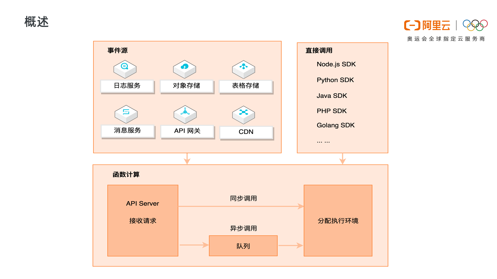
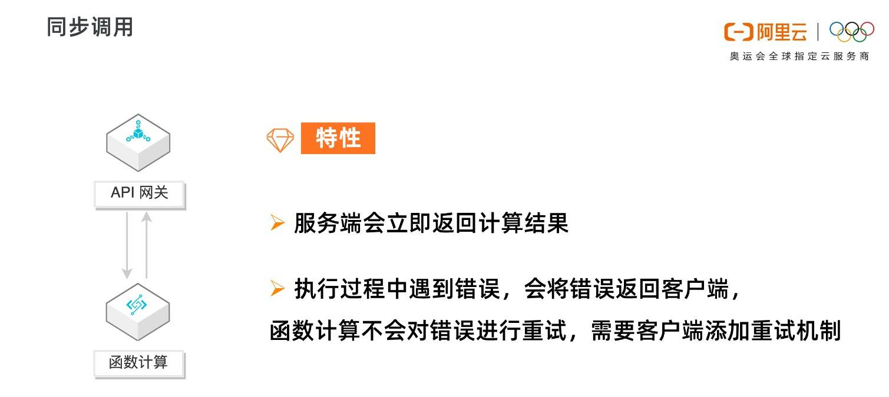
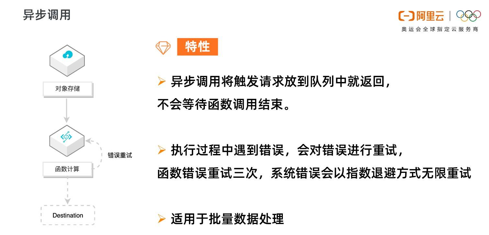
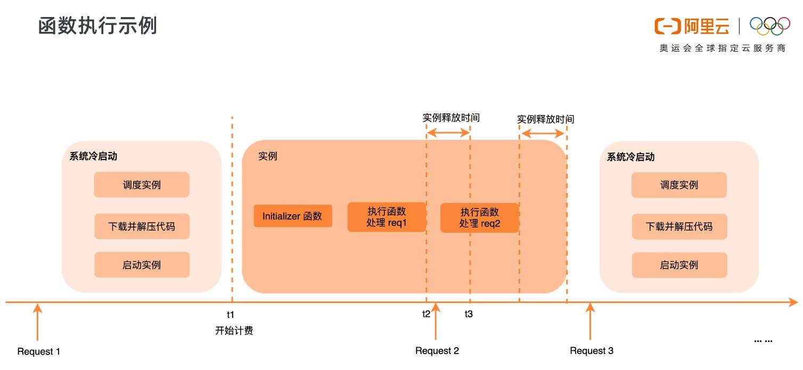
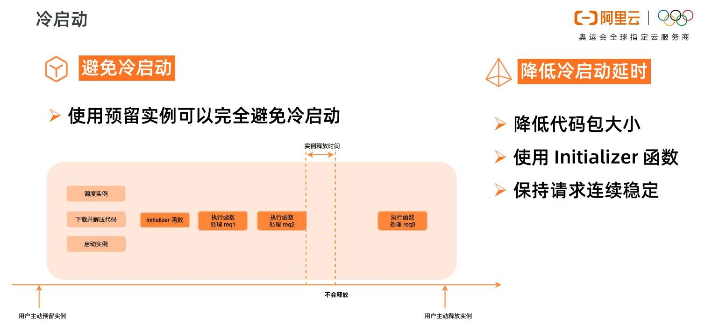

# 06 函数计算是如何工作的？

### 函数计算调用链路

上图展示了函数计算完整的请求和调用链路。函数计算是事件驱动的无服务器应用，事件驱动是说可以通过事件源自动触发函数执行，比如当有对象上传至 OSS 中时，自动触发函数，对新上传的图片进行处理。函数计算支持丰富的事件源类型，包括日志服务、对象存储、表格存储、消息服务、API 网关、CDN 等。

除了事件触发外，也可以直接通过 API/SDK 直接调用函数。调用可以分为同步调用与异步调用，当请求到达函数计算后，函数计算会为请求分配执行环境，如果是异步调用，函数计算会将请求事件存入队列中，等待消费。

### 函数计算调用方式

同步调用的特性是，客户端期待服务端立即返回计算结果。请求到达函数计算时，会立即分配执行环境执行函数。

以 API 网关为例，API 网关同步触发函数计算，客户端会一直等待服务端的执行结果，如果执行过程中遇到错误， 函数计算会将错误直接返回，而不会对错误进行重试。这种情况下，需要客户端添加重试机制来做错误处理。

异步调用的特性是，客户端不急于立即知道函数结果，函数计算将请求丢入队列中即可返回成功，而不会等待到函数调用结束。

函数计算会逐渐消费队列中的请求，分配执行环境，执行函数。如果执行过程中遇到错误，函数计算会对错误的请求进行重试，对函数错误重试三次，系统错误会以指数退避方式无限重试，直至成功。

异步调用适用于数据的处理，比如 OSS 触发器触发函数处理音视频，日志触发器触发函数清洗日志，都是对延时不敏感，又需要尽可能保证任务执行成功的场景。如果用户需要了解失败的请求并对请求做自定义处理，可以使用 Destination 功能。

### 函数计算执行过程

函数计算是 Serverless 的，这不是说无服务器，而是开发者无需关心服务器，函数计算会为开发者分配实例执行函数。

如上图所示，当函数第一次被调用的时候，函数计算需要动态调度实例、下载代码、解压代码、启动实例，得到一个可执行函数的代码环境。然后才开始在系统分配的实例中真正地执行用户的初始化函数，执行函数业务逻辑。这个调度实例启动实例的过程，就是系统的冷启动过程。

函数逻辑执行结束后，不会立即释放掉实例，会等一段时间，如果在这段时间内有新的调用，会复用这个实例，比如上图中的 Request 2，由于执行环境已经分配好了，Request 2 可以直接使用，所以 Request 2 就不会遇到冷启动。

Request 2 执行结束后，等待一段时间，如果这段时间没有新的请求分配到这个实例上，那系统会回收实例，释放执行环境。此实例释放后，新的请求 Request 3 来到函数计算，需要重新调度实例、下载代码、解压代码，启动实例，又会遇到冷启动。

所以，为了减小冷启动带来的影响，要尽可能避免冷启动，降低冷启动带来的延时。

使用预留实例可以完全避免冷启动，预留实例是在用户预留后就分配实例，准备执行环境；请求结束后系统也不会自动回收实例。

预留实例不由系统自动分配与回收，由用户控制实例的生命周期，可以长驻不销毁，这将彻底消除实例冷启动带来的延时毛刺，提供极致性能，也为在线应用迁移至函数计算扫清障碍。

如果业务场景不适合使用预留实例，那就要设法降低冷启动的延时，比如降低代码包大小，可以降低下载代码包、解压代码包的时间。Initializer 函数是实例的初始化函数，Initializer 在同一实例中执行且只执行一次，所以可以将一些耗时的公共逻辑放到 Initializer 中，比如在 NAS 中加载依赖、建立连接等等。另外要尽量保持请求连续稳定，避免突发的流量，由于系统已启动的实例不足以支撑大量的突发流量，就会带来不可避免的冷启动。
