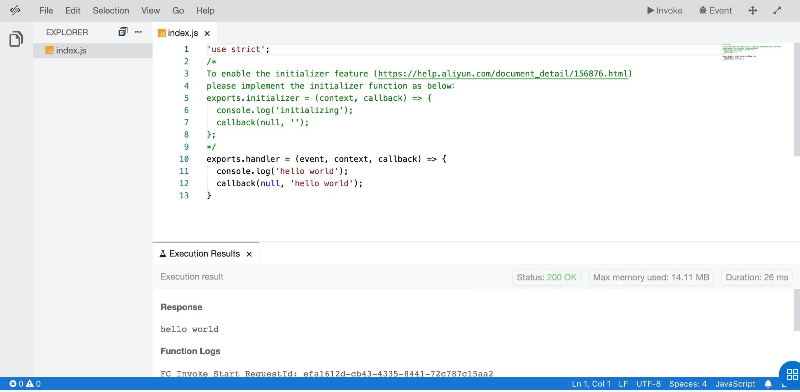
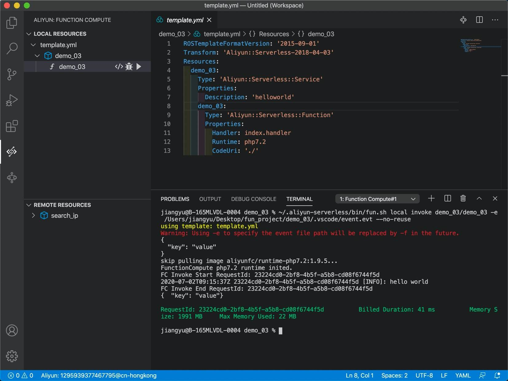
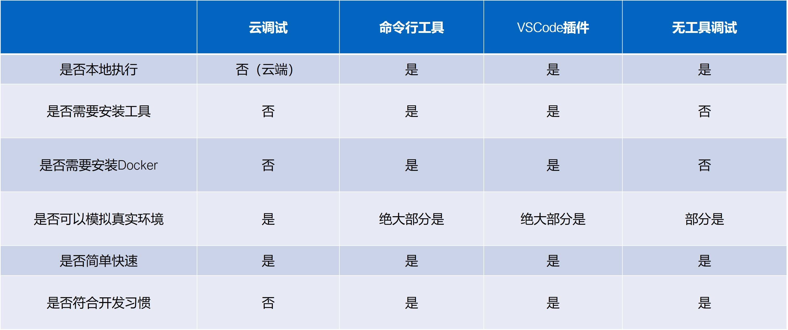
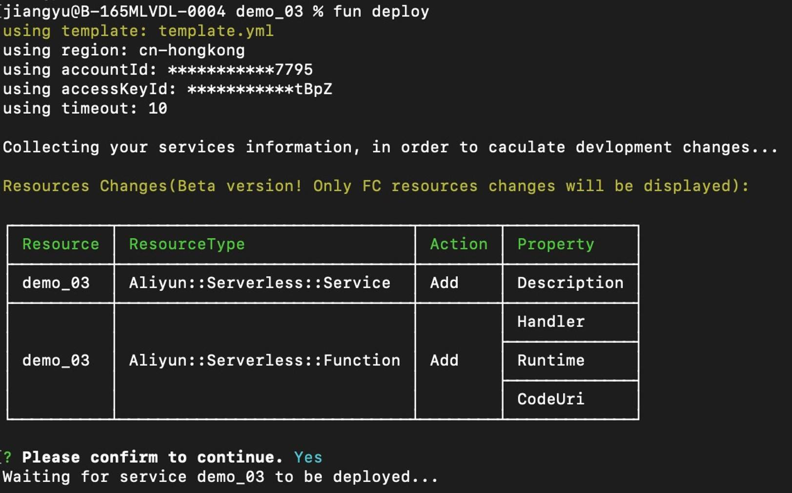
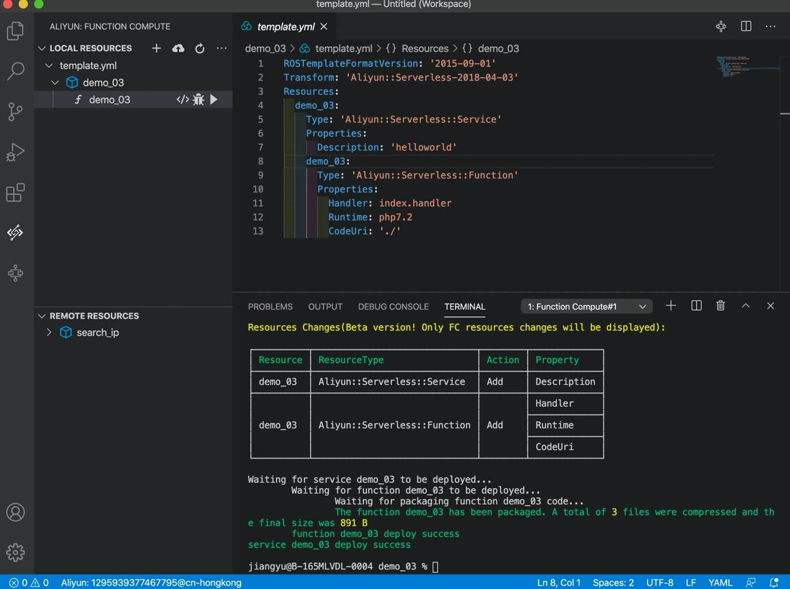

# 09 函数的调试与部署

### 函数调试

函数的调试与部署，其实这是两部分内容：调试部分与部署部分。相对来说，调试部分是比较困难的，因为调试本身就是 Serverless 架构的一大弱点。

在开始讲解调试之前，先问大家一个问题：我们写完的代码为什么要有调试的过程呢？不调试行不行？

记得我在上学的时候，无论是考试还是做什么，都少不了一个检查的过程，例如写完作业时，爸妈会说：“做完了检查一下”；考试时，老师会说：“考完了检查一下”；在做完某件事时，我们还要有一个检查的过程，来保证尽可能地少犯错误。

程序也是这样，我们写了一堆代码，难免这个代码会做一些奇奇怪怪的事情，例如说我们少写了一个字母，用错了一个符号，或者说我们的程序输出和预期不一致，我们的程序存在逻辑问题，我们的程序在处理某些业务时少考虑了一些因素，我们的程序……很多问题。这个时候，我们就要自己来检查一下，看看他是不是 OK 的，如果不 OK 要马上修改，如果 OK 了，我们再提交代码、上传代码、部署代码等，这个过程，你就可以认为是调试的过程。

#### 1. 函数调试方式

当然，调试也不是这么容易的，它也有很多的方法和理论，本文就针对函数计算以及相关工具，给大家讲解怎么调试函数计算中的函数们。

**1）云调试** 首先，第一种方法，是非常简单的，我们只需要打开浏览器，进入到我们的项目页面，就可以点击 Invoke 按钮进行调试。

（在线调用）

上图中可以看到，我们已经完成了调试，输出了 hello world，这种方法非常简单，对于临时使用是非常有效果的。

但是稍微麻烦一些的项目，可能就不太适合在线上调试了，这时，我们就需要本地开发和调试方法，毕竟大部分代码开发应该都在本地，虽然大家都说云端写代码、开发、debug 是未来的趋势，但是至少目前来看，还是本地开发更习惯、更靠谱。

所以这时就需要用我们的插件或者命令行工具了。**2）命令行工具**

（命令行工具本地调试）

我们在安装之后，如果想进行本地调试，还要安装 Docker，安装之后，我们可以通过 invoke local 的指令来进行本地的调试。例如上图中，我们可以看到，当我执行完了 fun local invoke demo_03/demo_03，顺利输出了结果。当然如果你是第一次使用，可能还会涉及到通过 Docker 拉取镜像的过程。**3）VSCode 插件** 如果要在编辑器中写代码，该怎么调试？非常简单，使用 VSCode 插件，你只需要点击 VSCode 插件的运行功能，插件就可以自动拉起 Docker，帮助我们本地调试代码。

从上图中可以看到，我们已经顺利输出了结果。

这时就会有人问：还要安装 Docker 吗？没有 Docker 行不行？没有 Docker 当然是不行的，因为这个调试的机制本身就依赖 Docker。但是我们人类往往是具有创造力的：没有条件，就创造条件，所以，下面再给大家分享一个无工具的调试方案。**4）无工具调试**

如上图，以 Python 为例，我们只需要增加一段代码，来调用我们的方法，至于 event 可以采用我们即将使用的触发器情况，这样就可以实现简单的调试方法了。

#### 2. 适用场景

上文介绍了这么多的调试方法，什么时候该用哪个呢？

如上图，我们来看一下对比，在一般小的情况下，如果我们不想开编辑器，也不想用 Docker ，想要获取比较靠谱的调试，可以使用云端调试；如果我们想本地调试，和开发更亲密一些，可以用命令行工具或者 VSCode 插件；如果我们不想安装各种工具，那么完全可以采用无工具调试方案。

云端调试虽然不太符合我们的开发习惯，但是这种调试方法可以 100% 模拟“现场场地”；命令行工具或者 VSCode 插件，虽然通过 Docker 镜像方法，已经尽可能地模仿了线上环境，但是对于一些和线上资源交互的场景，尤其是通过 VPC 等和其他资源交互的场景，这种方法未必可以很好地解决类似的问题；无工具调试，只适合临时用一下，它的环境和线上环境天差地别，很可能会对真正上线的结果造成一定影响。

### 函数部署

函数部署的方法很简单，也不需要特殊的依赖，就算没有 Docker 也可以。

#### 1. 在线部署

在线创建函数上传代码包，或者更新函数上传代码包等。

#### 2. 客户端部署 **1）通过命令行工具** 如下图所示，通过命令行工具，执行 fun deploy 来进行部署

 **2）通过 VSCode 插件**

通过 VSCode 插件，点击上传部署的按钮，即可自动部署。

### 结语

最后额外说一下，本文并非王婆卖瓜自卖自夸，而是命令行工具的 - h 指令真的很棒，无论使用什么指令，我们都可以通过 - h 查看到使用方法，非常简单方便，不信你也可以偷偷试一下。
