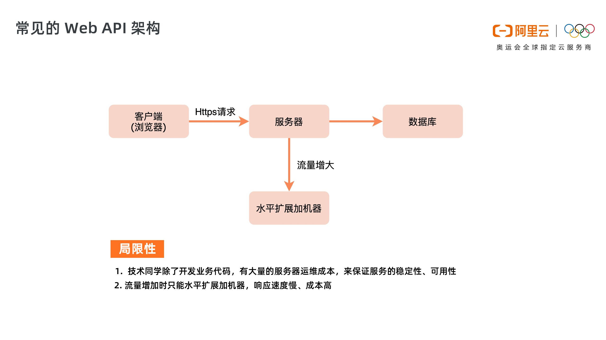
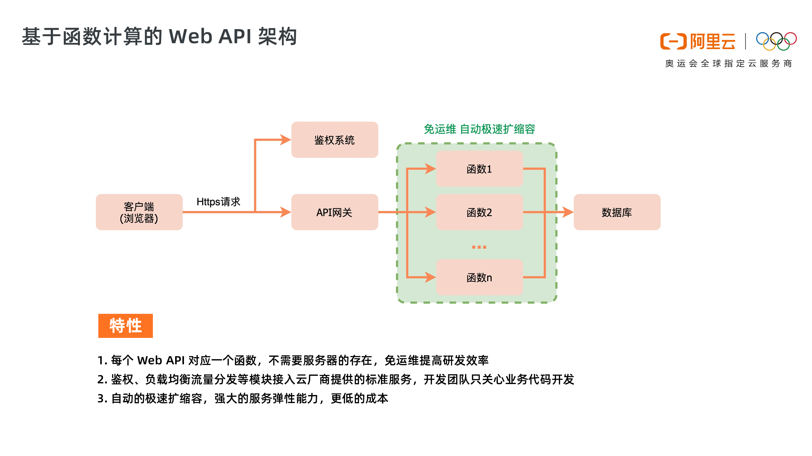
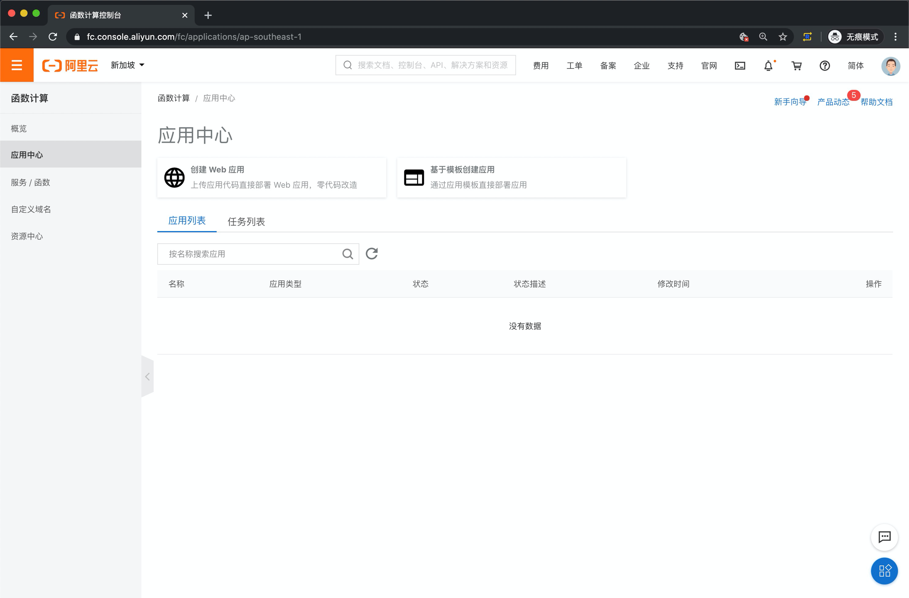
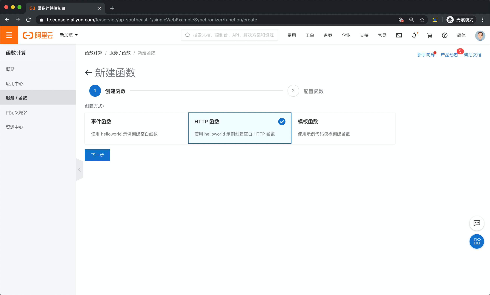
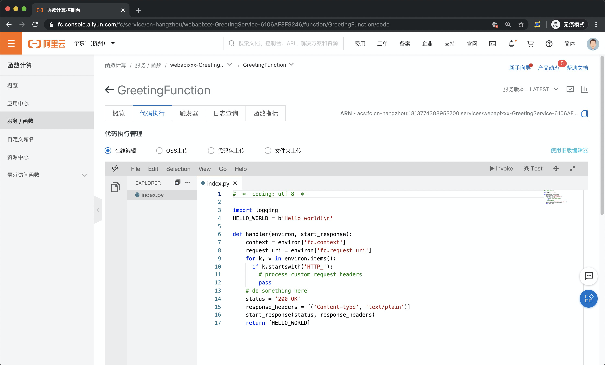
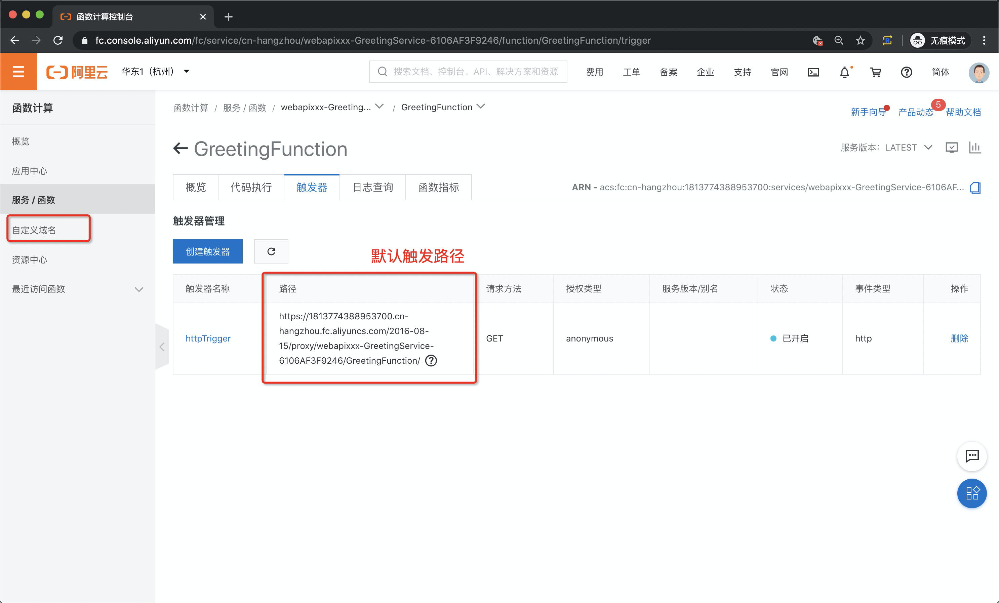
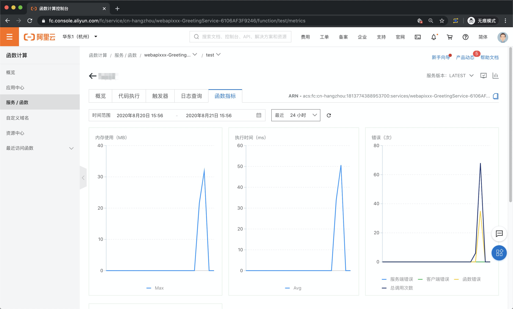

# 13 典型案例 3：十分钟搭建弹性可扩展的 Web API

### 基本概念

常见的 WebAPI 架构如上图所示，主要包括客户端（浏览器）、服务器、数据库，WebAPI 由服务器提供，同时服务器要完成负载均衡、登录鉴权的相关操作。

当客户端流量快速增大时，服务器端只能通过水平扩展加机器的方式来增加提高服务能力。

这种常规模式主要有两点局限性：

- 技术同学除了开发业务代码，有大量的服务器运维成本，来保证服务的稳定性、可用性，技术同学要花费很多时间进行运维工作，占用开发时间，降低项目研发效率。
- 流量突然增加时，需要水平扩展加机器，弹性的响应能力差，扩容速度往往要数十分钟，无法实现秒级极速扩容，导致一段时间内的服务能力不足。同时当流量变少时，难以做到及时缩容，造成机器的成本浪费。

基于函数计算的 WebAPI 架构如上图所示，与常规的 WebAPI 架构相比，客户端和数据库未发生变化，但服务器变化巨大，主要体现在：

- 之前需要开发团队维护的路由模块以及鉴权模块都将接入服务商提供的 API 网关系统以及鉴权系统，开发团队无须再维护这两部分的业务代码，只需要持续维护相关规则即可。
- 在这个结构下，业务代码也被拆分成了函数粒度，不同函数表示不同的功能。
- 我们已经看不到服务器的存在，是因为 Serverless 的目的是让使用者只关注自己的业务逻辑即可，所以一部分安全问题、资源调度问题（例如用户量暴增、如何实现自动扩容等）全都交给云厂商负责。
- 相对于传统项目而言，传统项目无论是否有用户访问，服务都在运行中，都是有成本支出，而 Serverless 而言，只有在用去发起请求时，函数才会被激活并执行，且会按量收费，可以实现在有流量的时候才有支持，没有流量的时候就没有支出，相对来说，成本会进一步降低。

### 开发流程

#### 1. 登录函数计算控制台，创建应用

可以通过两种方式来创建应用，如果是已有的 Web 项目，可以选择上图中的第一种方式：“常见 Web 应用”；对于新项目则推荐使用第二种方式：“基于模板创建应用”。我们这里使用模板方式，选择基于 Python 的 Web 应用。

模板可以当做应用脚手架，选择适合的模板，可以自动完成相关依赖资源的创建，如角色、OSS、域名网关等，降低开发成本。

#### 2. 新建函数

在应用下，创建函数，我们是开发 WebAPI，所以选择“HTTP”函数，这种函数会将指定的 http 请求作为触发器，来调度对应函数的执行。

函数新建好之后，是个返回 helloWorld 的 demo，我们在此基础上来开发我们的业务逻辑。

首先介绍下上图代码中的 handler 函数，这个函数是入口函数，http 触发器接收到调用后会通过这个入口来启动整个函数。函数有两个入参，environ 和 start_response：

- environ

environ 中主要包含两部分内容：http 请求的入参和函数执行上下文 fcContext，函数上下文参数中包含一些函数运行时的信息（例如 request id 、 临时 AK ），您在代码中可以使用这些信息。信息类型是 FCContext。

- start_response

该参数主要用于生成 http 请求的 response。

#### 3. 配置触发器，绑定域名

在新建函数时会自动创建一个 http 触发器，这个触发器的路径是“aliyun.com”的一个测试路径，只能用于测试，真实的应用需要通过自定义域名将真实域名与函数绑定，这样访问指定域名时，对应函数就会被触发执行。

#### 4. 日志与监控

在每个函数编辑页面，日志和监控服务，函数的每次执行都会生成唯一的 requestId，日志中通过 requestId 进行查询，看到本次函数执行的所有日志。

### 操作演示

点击链接即可观看演示视频：[https://developer.aliyun.com/lesson_2024_18999](https://developer.aliyun.com/lesson_2024_18999)
