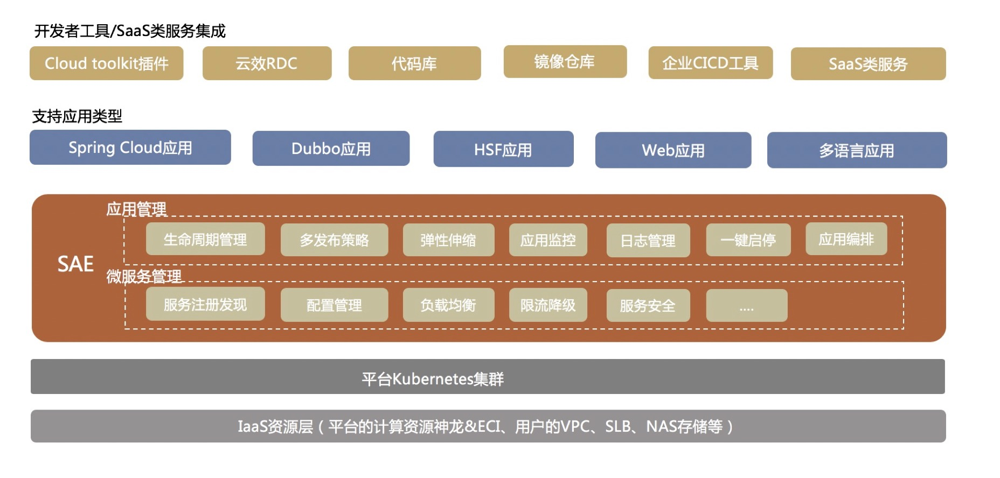
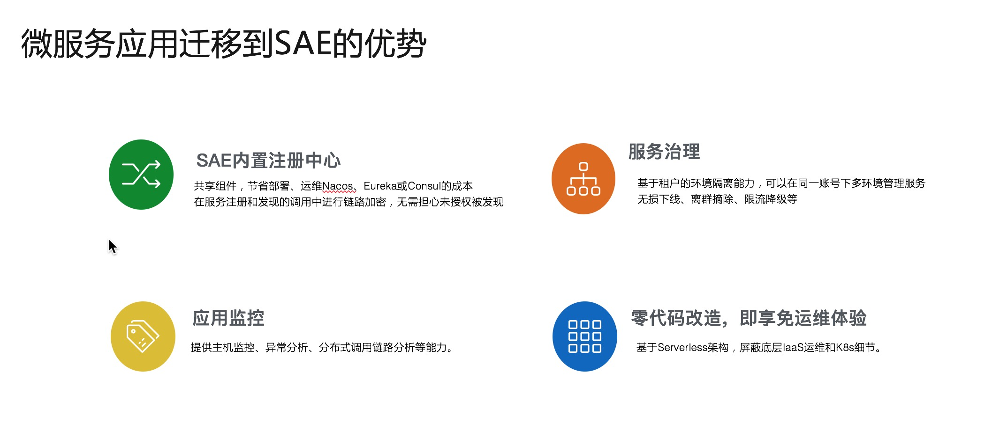
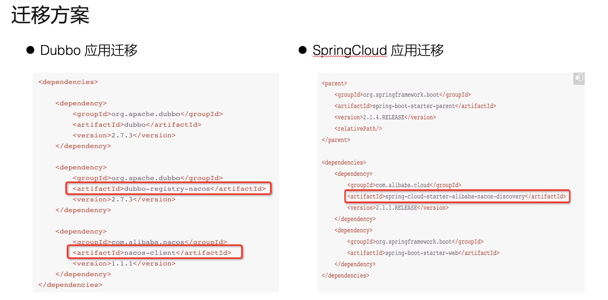
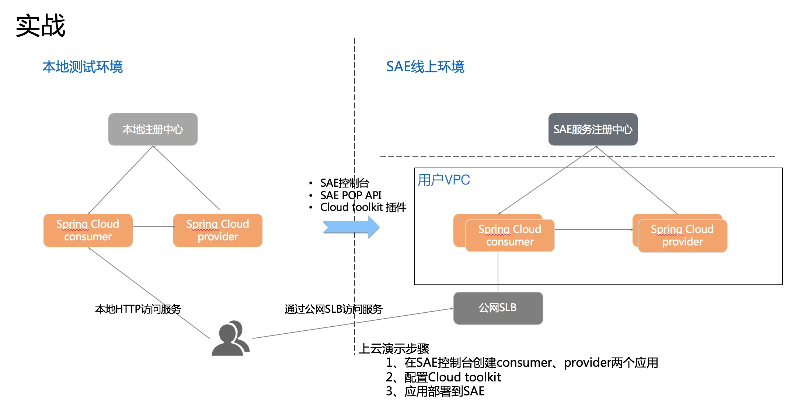

# 26 Spring CloudDubbo 应用无缝迁移到 Serverless 架构

### 背景

通过前面几节课程的学习，相信大家对于 SAE 平台已经有了一定的了解，SAE 基于 IaaS 层资源构建的一款 Serverles 应用托管产品，免除了客户很多复杂的运维工作，开箱即用、按用量付费；并且提供了丰富的 Open API 可以很容易地与其他平台做集成。

本文将为大家介绍 SAE 在微服务方面的一些能力，SAE 产品把 Serverless 技术和微服务做了很好的结合，天然支持 Java 微服务应用的托管和服务治理，对 SpringCloud/Dubbo 微服务应用能够在只修改配置和依赖，不修改代码的情况下迁移到 SAE 上，并提供服务治理能力，比如基于租户的微服务隔离环境、服务列表、无损下线、离群摘除、应用监控以及调用链分析等。

本次课程分为三部分来介绍，分别介绍微服务应用迁移到 SAE 的优势，如何迁移 SpringCloud/Dubbo 应用到 SAE 上，以及针对 SpringCloud 应用迁移的实践演示。

### 迁移到 SAE 的优势

在介绍迁移之前，先介绍下 SpringCloud/Dubbo 应用迁移到 SAE 的优势：

- **SAE 内置注册中心：** 所有用户共享注册中心组件，SAE 帮助用户运维，这就节省了用户的部署、运维成本；在服务注册和发现的过程中进行链路加密，无需担心被未授权的服务发现。
- **服务治理：** SAE 有命名空间的概念，是基于微服务租户的逻辑隔离环境，用户可以使用不同的命名空间来隔离微服务的注册、发现和调用，提供无损下线、离群摘除和限流降级等服务治理能力。
- **应用监控：** SAE 针对微服务应用提供主机监控、异常栈分析以及分布式调用链路分析等能力，可以提升微服务应用的可观测性和诊断能力。
- **零代码改造：** 简单接入就可以享受免运维体验。

### SpringCloud/Dubbo 迁移方案

那如何迁移 SpringCloud/Dubbo 应用到 SAE 呢？我们只需要修改添加依赖和配置，就可以把应用部署到 SAE 上。

Dubbo 应用需要添加 dubbo-register-nacos 和 nacos-client 依赖；SpringCloud 应用需要添加 spring-cloud-starter-alibaba-nacos-discovery 即可。

### SpringCloud/Dubbo 应用迁移实战

Spring Cloud 提供了简化应用开发的一系列标准和规范。

目前业界流行的 Spring Cloud 具体实现有 Spring Cloud Netflix、Spring Cloud Consul、Spring Cloud Gateway 和 Spring Cloud Alibaba 等。

如果您熟悉 Spring Cloud 中的 Eureka、Consul 和 ZooKeeper 等服务注册组件，但未使用过 Spring Cloud Alibaba 的服务注册组件 Nacos Discovery，那么您仅需将服务注册组件的服务依赖关系和服务配置替换成 Spring Cloud Alibaba Nacos Discovery，无需修改任何代码。

Spring Cloud Alibaba Nacos Discovery 同样实现了 Spring Cloud Registry 的标准接口与规范，与您之前使用 Spring Cloud 接入服务注册与发现的方式基本一致。

接下来针对 SpringCloud 应用迁移过程进行演示，演示过程请点击视频课：<https://developer.aliyun.com/lesson_2026_19003> 进行观看。
