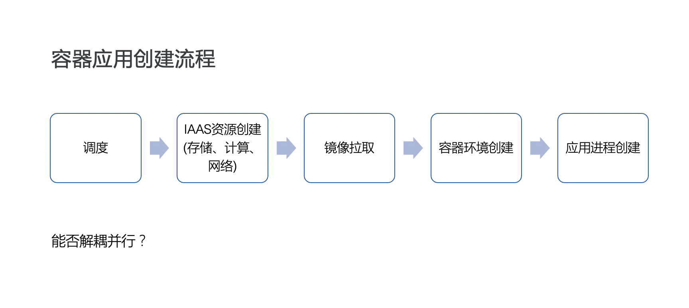
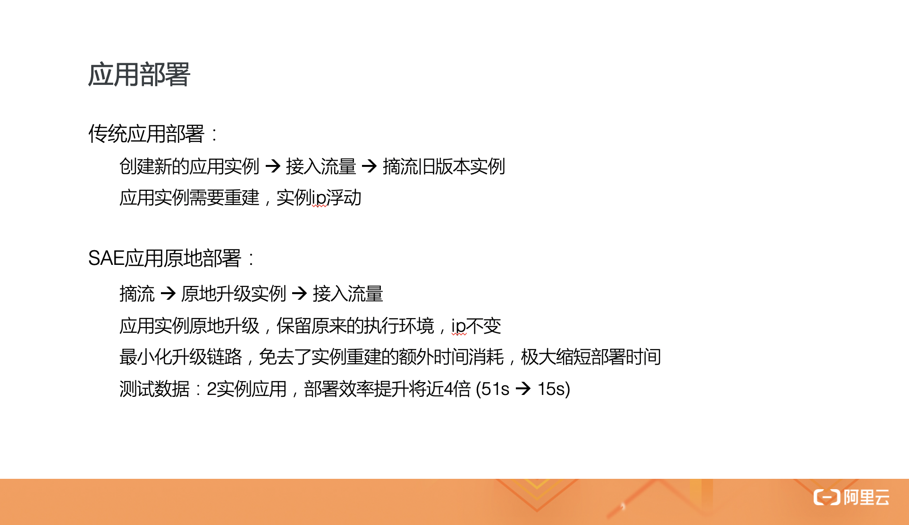

# 29 SAE 极致应用部署效率

作为 Serverless 平台，SAE 提供了应用全托管的服务，充分利用了云原生的技术红利，以容器作为应用载体，提供了敏捷的部署、编排、弹性等能力。SAE 屏蔽了底层的基础设施，对于用户来说，感知到的最底层资源是应用实例本身，应用创建、部署等操作是用户交互的主要接口。

接下来将介绍我们在应用创建、部署、重启等过程所做的效率优化工作。

### 应用创建

首先是应用创建。目前，用户界面可通过镜像或 war、jar 安装包的方式部署应用，最后在平台侧，以统一打包成容器镜像的方式进行分发，然后平台去申请计算、存储、网络等 IAAS 资源，再开始创建容器执行环境和应用实例。

在这个过程中，涉及到调度、云资源创建和挂载、镜像拉取、容器环境创建、应用进程创建等步骤，应用的创建效率与这些过程紧密相关。

我们很自然而然地能想到，这其中部分过程是否能并行，以减少整个创建的耗时呢？经过对每个过程的耗时分析，我们发现其中的一些瓶颈点，并且部分执行步骤之间是解耦独立的，比如云弹性网卡的创建挂载和应用镜像拉取，就是相互独立的过程。 **基于此，我们将其中独立的过程做了并行化处理，在不影响创建链路的同时，降低了应用创建的时耗。** ### 应用部署

应用的部署，即应用升级。我们知道，传统的应用部署过程可以分为以下几个步骤：

1. 首先创建新版本的实例；
1. 然后等待实例启动、业务进程 ready 后，接入流量，即创建对应 SLB 后端；
1. 最后将老版本实例从 SLB 后端摘除并销毁。

在分批发布的场景下，如此继续循环下一批实例，进行滚动升级。我们能看到，在这个过程中，应用实例发生了重建，同时实例 ip 也会发生浮动。

上文我们讲到，应用实例的创建过程包括调度、云资源创建挂载、镜像拉取、容器环境创建、应用进程拉起等步骤，对于应用部署而言，完全可以不用重走一遍所有的流程，因为我们需要的仅仅是基于新的镜像，创建新的应用执行环境和进程而已。

因此， **我们实现了原地部署的功能** ，在滚动升级过程中，保留原来待升级应用实例及其挂载的云网络、云存储资源，只更新实例的执行环境，无需经过调度、云资源创建等过程。这样，原来的部署流程也简化为：

> 摘流，将运行实例从 SLB 后端摘除 -> 原地升级实例 -> 接入流量

原地升级后，应用实例仍保持原来的 ip。经过测试，对于 2 实例应用，部署效率将提升 4 倍，将部署时长从原来的将近 1 分钟缩短到十几秒。

### 应用重启

最后，简单介绍下我们即将推出的 **原地重启功能** 。

重启实例在某些运维场合是必要的操作，说到应用重启，我们希望类似于 linux 系统一样，可以只执行一次 reboot，而不是重建实例。具体的做法是，我们在容器环境下，通过容器引擎 API 执行一次启停操作即可。原地重启相比原地升级，省去了镜像更新和执行环境创建的过程，并且相比 ECS，容器的重启更轻量，能达到秒级。
