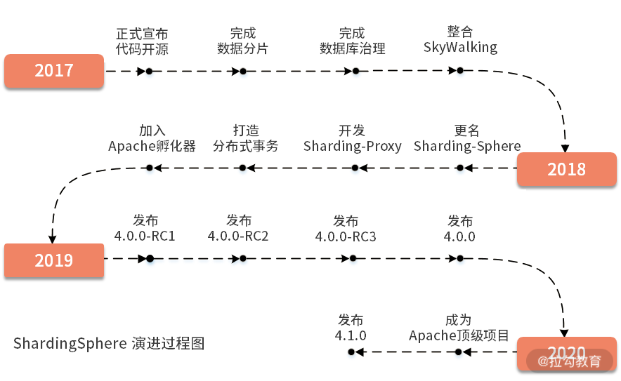
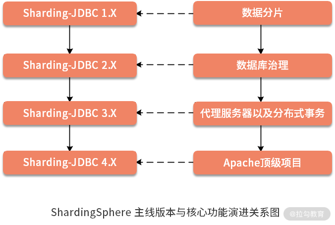
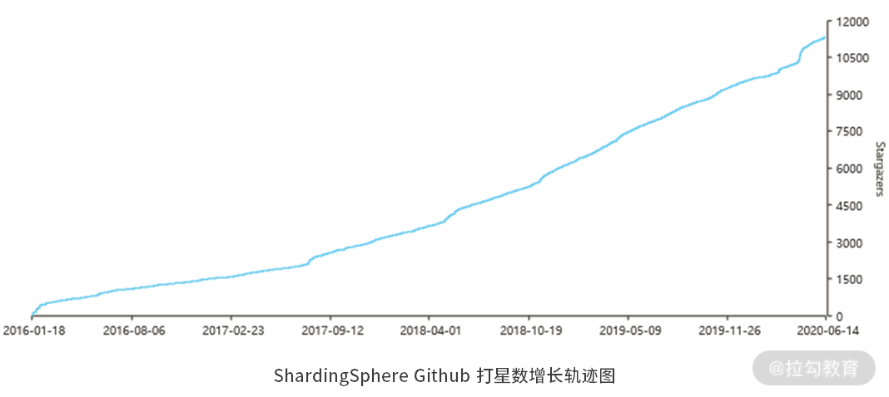
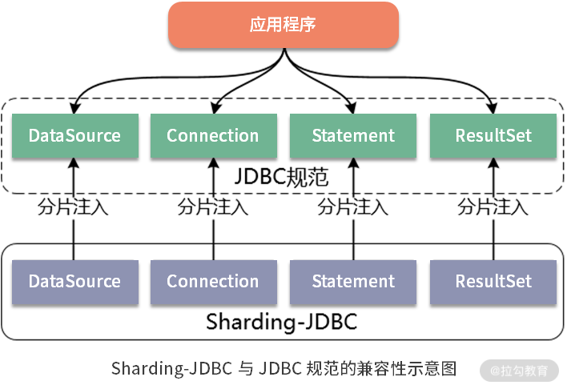
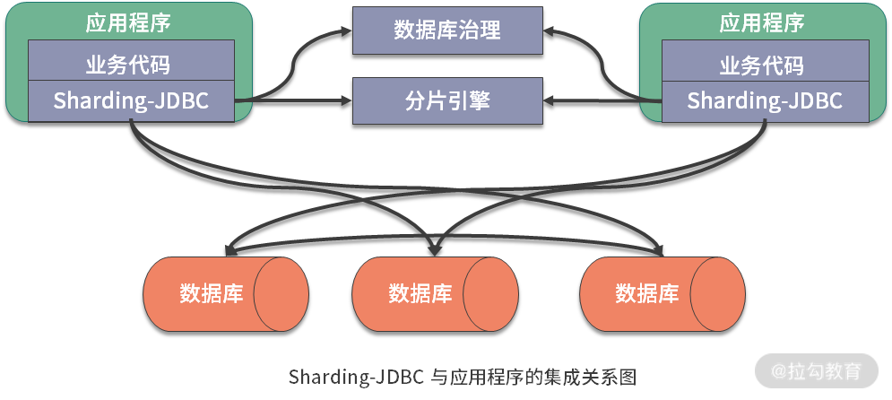
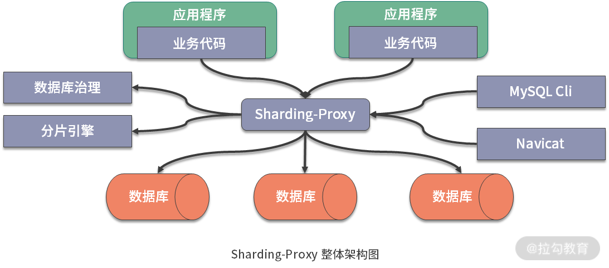
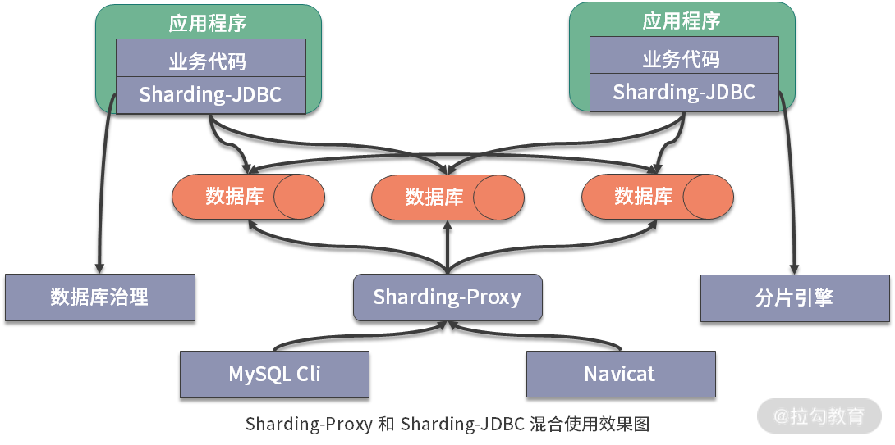
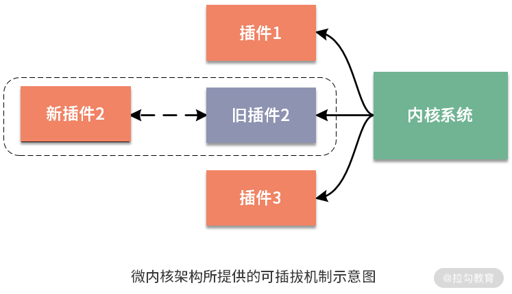

# 02 顶级项目：ShardingSphere 是一款什么样的 Apache 开源软件？

本课时将为你讲解 ShardingSphere 是一款什么样的 Apache 开源软件。

在上一课时中，我详细分析了分库分表的表现形式以及分片架构的解决方案和代表性框架。可以看到，ShardingSphere 同时实现了客户端分片和代理服务器组件，并提供了分布式数据库的相关功能特性。作为一款优秀的开源软件，ShardingSphere 能够取得目前的成就也不是一蹴而就，下面我们先来回顾一下 ShardingSphere 的发展历程。

### ShardingSphere 的发展历程：从 Sharding-JDBC 到 Apache 顶级项目

说到 ShardingSphere 的起源，我们不得不提 Sharding-JDBC 框架，该框架是一款起源于当当网内部的应用框架，并于 2017 年初正式开源。从 Sharding-JDBC 到 Apache 顶级项目，ShardingSphere 的发展经历了不同的演进阶段。纵观整个 ShardingSphere 的发展历史，我们可以得到时间线与阶段性里程碑的演进过程图：

从版本发布角度，我们也可以进一步梳理 ShardingSphere 发展历程中主线版本与核心功能之间的演进关系图：

基于 GitHub 上星数的增长轨迹，也可以从另一个维度很好地反映出 ShardingSphere 的发展历程：

### ShardingSphere 的设计理念：不是颠覆，而是兼容

对于一款开源中间件来说，要得到长足的发展，一方面依赖于社区的贡献，另外在很大程度上还取决于自身的设计和发展理念。

ShardingSphere 的定位非常明确，就是一种关系型数据库中间件，而并非一个全新的关系型数据库。ShardingSphere 认为，在当下，关系型数据库依然占有巨大市场，但凡涉及数据的持久化，关系型数据库仍然是系统的标准配置，也是各个公司核心业务的基石，在可预见的未来中，这点很难撼动。所以， **ShardingSphere 在当前阶段更加关注在原有基础上进行兼容和扩展，而非颠覆** 。那么 ShardingSphere 是如何做到这一点呢？

ShardingSphere 构建了一个生态圈，这个生态圈由一套开源的分布式数据库中间件解决方案所构成。按照目前的规划，ShardingSphere 由 Sharding-JDBC、Sharding-Proxy 和 Sharding-Sidecar 这三款相互独立的产品组成，其中前两款已经正式发布，而 Sharding-Sidecar 正在规划中。我们可以从这三款产品出发，分析 ShardingSphere 的设计理念。

#### Sharding-JDBC

ShardingSphere 的前身是 Sharding-JDBC，所以这是整个框架中最为成熟的组件。Sharding-JDBC 的定位是一个轻量级 Java 框架，在 JDBC 层提供了扩展性服务。我们知道 JDBC 是一种开发规范，指定了 DataSource、Connection、Statement、PreparedStatement、ResultSet 等一系列接口。而各大数据库供应商通过实现这些接口提供了自身对 JDBC 规范的支持，使得 JDBC 规范成为 Java 领域中被广泛采用的数据库访问标准。

基于这一点，Sharding-JDBC 一开始的设计就完全兼容 JDBC 规范，Sharding-JDBC 对外暴露的一套分片操作接口与 JDBC 规范中所提供的接口完全一致。开发人员只需要了解 JDBC，就可以使用 Sharding-JDBC 来实现分库分表，Sharding-JDBC 内部屏蔽了所有的分片规则和处理逻辑的复杂性。显然， **这种方案天生就是一种具有高度兼容性的方案，能够为开发人员提供最简单、最直接的开发支持** 。关于 Sharding-JDBC 与 JDBC 规范的兼容性话题，我们将会在下一课时中详细讨论。

 Sharding-JDBC 与 JDBC 规范的兼容性示意图

在实际开发过程中，Sharding-JDBC 以 JAR 包的形式提供服务。 **开发人员可以使用这个 JAR 包直连数据库，无需额外的部署和依赖管理** 。在应用 Sharding-JDBC 时，需要注意到 Sharding-JDBC 背后依赖的是一套完整而强大的分片引擎：

由于 Sharding-JDBC 提供了一套与 JDBC 规范完全一致的 API，所以它可以很方便地与遵循 JDBC 规范的各种组件和框架进行无缝集成。例如，用于提供数据库连接的 DBCP、C3P0 等数据库连接池组件，以及用于提供对象-关系映射的 Hibernate、MyBatis 等 ORM 框架。当然，作为一款支持多数据库的开源框架，Sharding-JDBC 支持 MySQL、Oracle、SQLServer 等主流关系型数据库。

#### Sharding-Proxy

ShardingSphere 中的 Sharding-Proxy 组件定位为一个透明化的数据库代理端，所以它是代理服务器分片方案的一种具体实现方式。在代理方案的设计和实现上，Sharding-Proxy 同样充分考虑了兼容性。

Sharding-Proxy 所提供的兼容性首先体现在对异构语言的支持上，为了完成对异构语言的支持，Sharding-Proxy 专门对数据库二进制协议进行了封装，并提供了一个代理服务端组件。其次，从客户端组件上讲，针对目前市面上流行的 Navicat、MySQL Command Client 等客户端工具，Sharding-Proxy 也能够兼容遵循 MySQL 和 PostgreSQL 协议的各类访问客户端。当然，和 Sharding-JDBC 一样，Sharding-Proxy 也支持 MySQL 和 PostgreSQL 等多种数据库。

接下来，我们看一下 Sharding-Proxy 的整体架构。对于应用程序而言，这种代理机制是完全透明的，可以直接把它当作 MySQL 或 PostgreSQL 进行使用：

总结一下，我们可以直接把 Sharding-Proxy 视为一个数据库，用来代理后面分库分表的多个数据库，它屏蔽了后端多个数据库的复杂性。同时，也看到 Sharding-Proxy 的运行同样需要依赖于完成分片操作的分片引擎以及用于管理数据库的治理组件。

虽然 Sharding-JDBC 和 Sharding-Proxy 具有不同的关注点，但事实上，我们完全可以将它们整合在一起进行使用，也就是说这两个组件之间也存在兼容性。

前面已经介绍过，我们使用 Sharding-JDBC 的方式是在应用程序中直接嵌入 JAR 包，这种方式适合于业务开发人员。而 Sharding-Proxy 提供静态入口以及异构语言的支持，适用于需要对分片数据库进行管理的中间件开发和运维人员。基于底层共通的分片引擎，以及数据库治理功能，可以混合使用 Sharding-JDBC 和 Sharding-Proxy，以便应对不同的应用场景和不同的开发人员：

#### Sharding-Sidecar

Sidecar 设计模式受到了越来越多的关注和采用，这个模式的目标是把系统中各种异构的服务组件串联起来，并进行高效的服务治理。ShardingSphere 也基于该模式设计了 Sharding-Sidecar 组件。截止到目前，ShardingSphere 给出了 Sharding-Sidecar 的规划，但还没有提供具体的实现方案，这里不做具体展开。作为 Sidecar 模式的具体实现，我们可以想象 **Sharding-Sidecar**  **的作用就是以 Sidecar 的形式代理所有对数据库的访问** 。这也是一种兼容性的设计思路，通过无中心、零侵入的方案将分布式的数据访问应用与数据库有机串联起来。

### ShardingSphere 的核心功能：从数据分片到编排治理

介绍完 ShardingSphere 的设计理念之后，我们再来关注它的核心功能和实现机制。这里把 ShardingSphere 的整体功能拆分成四大部分，即 **基础设施** 、 **分片引擎** 、 **分布式事务** 和 **治理与集成** ，这四大部分也构成了本课程介绍 ShardingSphere 的整体行文结构，下面我们来分别进行介绍：

#### 基础设施

作为一款开源框架，ShardingSphere 在架构上也提供了很多基础设施类的组件，这些组件更多与它的内部实现机制有关，我们将会在后续的源码解析部分详细展开讲解。但对开发人员而言，可以认为微内核架构和分布式主键是框架提供的基础设施类的核心功能。

- 微内核架构

ShardingSphere 在设计上采用了 **微内核（MicroKernel）架构模式** ，来确保系统具有高度可扩展性。微内核架构包含两部分组件，即内核系统和插件。使用微内核架构对系统进行升级，要做的只是用新插件替换旧插件，而不需要改变整个系统架构：

在 ShardingSphere 中，抽象了一大批插件接口，包含用实现 SQL 解析的 SQLParserEntry、用于实现配置中心的 ConfigCenter、用于数据脱敏的 ShardingEncryptor，以及用于数据库治理的注册中心接口 RegistryCenter 等。开发人员完全可以根据自己的需要，基于这些插件定义来提供定制化实现，并动态加载到 ShardingSphere 运行时环境中。

- 分布式主键

在本地数据库场景下，我们可以使用数据库自带的自增序列来完成主键的生成。但在分片场景下，我们将面对从本地数据库转换到分布式数据库的应用场景，这就需要考虑主键在各个数据库中的全局唯一性。为此，我们需要引入分布式主键机制。ShardingSphere 同样提供了分布式主键的实现机制，默认采用的是 SnowFlake（雪花）算法。

#### 分片引擎

对于分片引擎，ShardingSphere 同时支持数据分片和读写分离机制。

- 数据分片

数据分片是 ShardingSphere 的核心功能，常规的，基于垂直拆分和水平拆分的分库分表操作它都支持。同时，ShardingSphere 也预留了分片扩展点，开发人员也可以基于需要实现分片策略的定制化开发。

- 读写分离

在分库分表的基础上，ShardingSphere 也实现了基于数据库主从架构的读写分离机制。而且，这种读写分离机制可以和数据分片完美地进行整合。

#### 分布式事务

分布式事务是分布式环境下确保数据一致性的基本功能，作为分布式数据库的一种生态圈，ShardingSphere 也提供了对分布式事务的全面支持。

- 标准化事务处理接口

ShardingSphere 支持本地事务、基于 XA 两阶段提交的强一致性事务以及基于 BASE 的柔性最终一致性事务。同时，ShardingSphere 抽象了一组标准化的事务处理接口，并通过分片事务管理器 ShardingTransactionManager 进行统一管理。我们也可以根据需要实现自己的 ShardingTransactionManager 从而对分布式事务进行扩展。

- 强一致性事务与柔性事务

ShardingSphere 内置了一组分布式事务的实现方案，其中强一致性事务内置集成了 Atomikos、Narayana 和 Bitronix 等技术来实现 XA 事务管理器；另一方面，ShardingSphere 内部也整合了 Seata 来提供柔性事务功能。

#### 治理与集成

对于分布式数据库而言，治理的范畴可以很广，ShardingSphere 也提供了注册中心、配置中心等一系列功能来支持数据库治理。另一方面，ShardingSphere 作为一款支持快速开发的开源框架，也完成了与其他主流框架的无缝集成。

- 数据脱敏

数据脱敏是确保数据访问安全的常见需求，通常做法是对原始的 SQL 进行改写，从而实现对原文数据进行加密。当我们想要获取原始数据时，在实现上就需要通过对数据库中所存储的密文数据进行解密才能完成。我们可以根据需要实现一套类似的加解密机制，但 ShardingSphere 的强大之处在于， **它将这套机制内嵌到了 SQL 的执行过程中，业务开发人员不需要关注具体的加解密实现细节，而只要通过简单的配置就能实现数据的自动脱敏。**

- 配置中心

关于配置信息的管理，我们可以基于 YAML 格式或 XML 格式的配置文件完成配置信息的维护，这在 ShardingSphere 中都得到了支持。更进一步，在 ShardingSphere 中，它还提供了配置信息动态化的管理机制，可以支持数据源、表与分片及读写分离策略的动态切换。

- 注册中心

相较配置中心，注册中心在 ShardingSphere 中的应用更为广泛。ShardingSphere 中的注册中心提供了基于 Nacos 和 ZooKeeper 的两种实现方式。而在应用场景上，我们可以基于注册中心完成数据库实例管理、数据库熔断禁用等治理功能。

- 链路跟踪

SQL 解析与 SQL 执行是数据分片的最核心步骤，ShardingSphere 在完成这两个步骤的同时，也会将运行时的数据通过标准协议提交到链路跟踪系统。ShardingSphere 使用 OpenTracing API 发送性能追踪数据。像 SkyWalking、Zipkin 和 Jaeger 等面向 OpenTracing 协议的具体产品都可以和 ShardingSphere 自动完成对接。

- 系统集成

这里所谓的系统集成，指的是 ShardingSphere 和 Spring 系列框架的集成。到目前为止，ShardingSphere 实现了两种系统的集成机制，一种是命名空间机制，即通过扩展 Spring Schema 来实现与 Spring 框架的集成；而另一种则是通过编写自定义的 starter 组件来完成与 Spring Boot 的集成。这样，无论开发人员采用哪一种 Spring 框架，对于使用 ShardingSphere 而言都是零学习成本。

### 小结

从今天开始，我们正式引入了 ShardingSphere。本课时回顾了 ShardingSphere 的发展历程，并结合该框架所提供的三大核心产品 Sharding-JDBC、Sharding-Proxy 及 Sharding-Sidecar 阐述了其在设计上的思想和理念。同时，我们也给出了 ShardingSphere 作为分布式数据库所具有的分片引擎、分布式事务及治理与集成方面的核心功能，这些功能在课程的后续内容都会进行详细展开讲解。

这里给你留一道思考题：ShardingSphere是一款兼容性很强的开源框架，它的兼容性具体体现在哪些方面？

通过前面内容的介绍，我们知道了 ShardingSphere 实现分片引擎的方案是重写 JDBC 规范，从而为应用程序提供与 JDBC 完全兼容的使用方式。下一课时将对 ShardingSphere 与 JDBC 规范之间的这层关系展开讨论。
