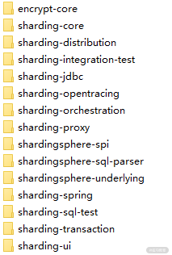
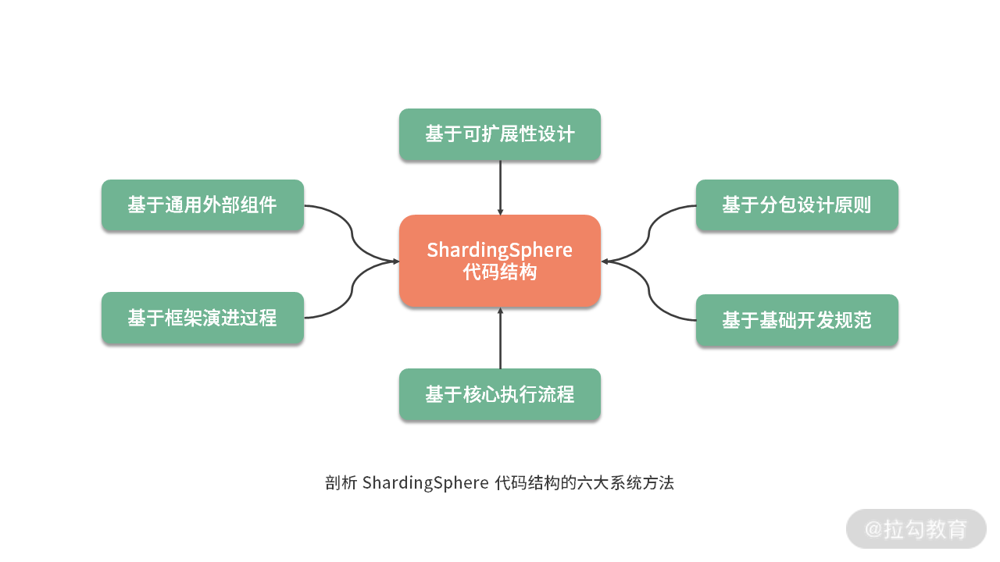
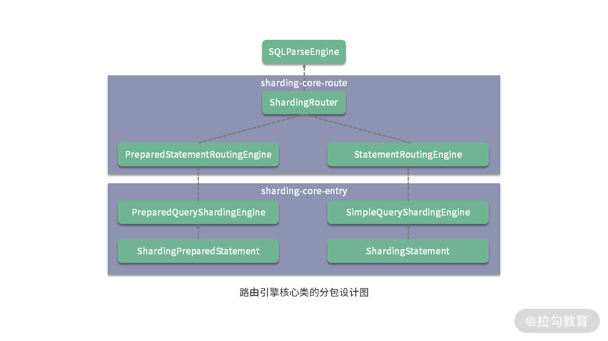
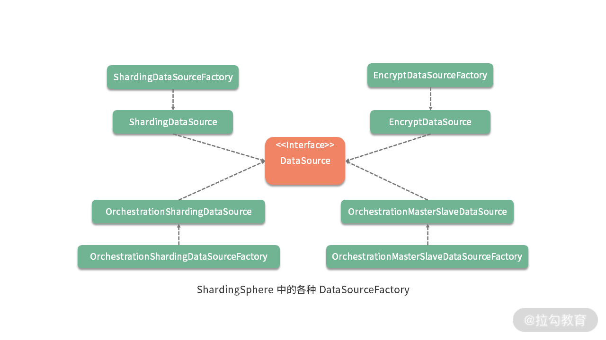
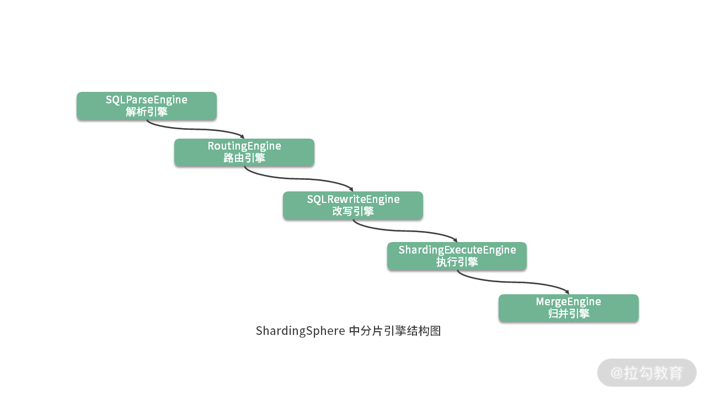
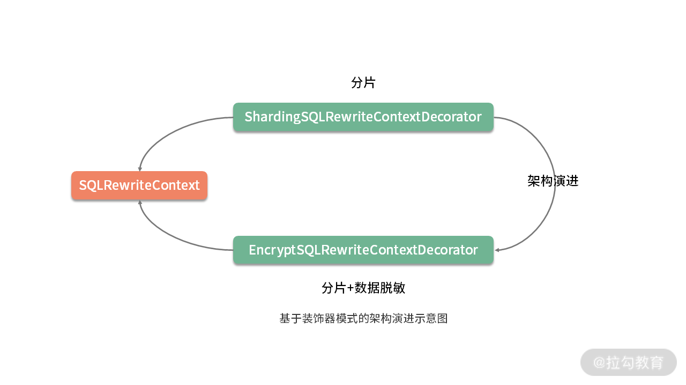
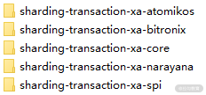

# 12 从应用到原理：如何高效阅读 ShardingSphere 源码？

从本课时开始，专栏将进入：“ShardingSphere 源码解析之基础设施”的模块。在介绍完 ShardingSphere 所具备的分库分表、读写分离、分布式事务、数据脱敏等各项核心功能之后，我将带领你全面剖析这些核心功能背后的实现原理和机制。我们将通过深入解析 ShardingSphere 源码这一途径来实现这一目标。

### 如何系统剖析 ShardingSphere 的代码结构？

在阅读开源框架时，我们碰到的一大问题在于，**常常会不由自主地陷入代码的细节而无法把握框架代码的整体结构** 。市面上主流的、被大家所熟知而广泛应用的代码框架肯定考虑得非常周全，其代码结构不可避免存在一定的复杂性。对 ShardingSphere 而言，情况也是一样，我们发现 ShardingSphere 源码的一级代码结构目录就有 15 个，而这些目录内部包含的具体 Maven 工程则多达 50 余个：

 ShardingSphere 源码一级代码结构目录

**如何快速把握 ShardingSphere 的代码结构呢？这是我们剖析源码时需要回答的第一个问题**，为此我们需要梳理剖析 ShardingSphere 框架代码结构的系统方法。

本课时我们将对如何系统剖析 ShardingSphere 代码结构这一话题进行抽象，梳理出应对这一问题的六大系统方法（如下图）：



接下来，我们将结合 ShardingSphere 框架对这些方法进行展开。

#### 基于可扩展性设计阅读源码

ShardingSphere 在设计上采用了微内核架构模式来确保系统具有高度的可扩展性，并使用了 JDK 提供的 SPI 机制来具体实现微内核架构。在 ShardingSphere 源代码的根目录下，存在一个独立工程 shardingsphere-spi。显然，从命名上看，这个工程中应该包含了 ShardingSphere 实现 SPI 的相关代码。该工程中存在一个 TypeBasedSPI 接口，它的类层结构比较丰富，课程后面将要讲到的很多核心接口都继承了该接口，包括实现配置中心的 ConfigCenter、注册中心的 RegistryCenter 等，如下所示：

 ShardingSphere 中 TypeBasedSPI 接口的类层结构

这些接口的实现都遵循了 JDK 提供的 SPI 机制。在我们阅读 ShardingSphere 的各个代码工程时，**一旦发现在代码工程中的 META-INF/services 目录里创建了一个以服务接口命名的文件，就说明这个代码工程中包含了用于实现扩展性的 SPI 定义** 。

在 ShardingSphere 中，大量使用了微内核架构和 SPI 机制实现系统的扩展性。只要掌握了微内核架构的基本原理以及 SPI 的实现方式就会发现，原来在 ShardingSphere 中，很多代码结构上的组织方式就是为了满足这些扩展性的需求。ShardingSphere 中实现微内核架构的方式就是直接对 JDK 的 ServiceLoader 类进行一层简单的封装，并添加属性设置等自定义的功能，其本身并没有太多复杂的内容。

当然，可扩展性的表现形式不仅仅只有微内核架构一种。在 ShardingSphere 中也大量使用了回调（Callback）机制以及多种支持扩展性的设计模式。掌握这些机制和模式也有助于更好地阅读 ShardingSphere 源码。

#### 基于分包设计原则阅读源码

分包（Package）设计原则可以用来设计和规划开源框架的代码结构。**对于一个包结构而言，最核心的设计要点就是高内聚和低耦合** 。我们刚开始阅读某个框架的源码时，为了避免过多地扎进细节而只关注某一个具体组件，同样可以使用这些原则来管理我们的学习预期。

以 ShardingSphere 为例，我们在分析它的路由引擎时发现了两个代码工程，一个是 sharding-core-route，一个是 sharding-core-entry。从代码结构上讲，尽管这两个代码工程都不是直接面向业务开发人员，但 sharding-core-route 属于路由引擎的底层组件，包含了路由引擎的核心类 ShardingRouter。

而 sharding-core-entry 则位于更高的层次，提供了 PreparedQueryShardingEngine 和 SimpleQueryShardingEngine 类，分包结构如下所示：



图中我们可以看到两个清晰的代码结构层次关系，这是 ShardingSphere 中普遍采用的分包原则中，具有代表性的一种，即根据类的所属层级来组织包结构。

#### 基于基础开发规范阅读源码

对于 ShardingSphere 而言，在梳理它的代码结构时有一个非常好的切入点，那就是基于 JDBC 规范。我们知道 ShardingSphere 在设计上一开始就完全兼容 JDBC 规范，它对外暴露的一套分片操作接口与 JDBC 规范中所提供的接口完全一致。只要掌握了 JDBC 中关于 DataSource、Connection、Statement 等核心接口的使用方式，就可以非常容易地把握 ShardingSphere 中暴露给开发人员的代码入口，进而把握整个框架的代码结构。

我们来看这方面的示例，如果你是刚接触到 ShardingSphere 源码，要想找到 SQL 执行入口是一件有一定难度的事情。在 ShardingSphere 中，存在一个 ShardingDataSourceFactory 工厂类，专门用来创建 ShardingDataSource。而基于《规范兼容：JDBC 规范与 ShardingSphere 是什么关系？》中的讨论，ShardingDataSource 就是一个 JDBC 规范中的 DataSource 实现类：

```java
public final class ShardingDataSourceFactory {
    public static DataSource createDataSource(
            final Map<String, DataSource> dataSourceMap, final ShardingRuleConfiguration shardingRuleConfig, final Properties props) throws SQLException {
        return new ShardingDataSource(dataSourceMap, new ShardingRule(shardingRuleConfig, dataSourceMap.keySet()), props);
    }
}
```

通过这个工厂类，我们很容易就找到了创建支持分片机制的 DataSource 入口，从而引出其背后的 ShardingConnection、ShardingStatement 等类。

事实上，在 ShardingSphere 中存在一批 DataSourceFactory 工厂类以及对应的 DataSource 类：



在阅读 ShardingSphere 源码时，JDBC 规范所提供的核心接口及其实现类，为我们高效梳理代码入口和组织方式提供了一种途径。

#### 基于核心执行流程阅读源码

事实上，还有一个比较容易理解和把握的方法可以帮我们梳理代码结构，这就是代码的执行流程。任何系统行为都可以认为是流程的组合。通过分析，看似复杂的代码结构一般都能梳理出一条贯穿全局的主流程。只要我们抓住这条主流程，就能把握框架的整体代码结构。

那么，对于 ShardingSphere 框架而言，什么才是它的主流程呢？这个问题其实不难回答。事实上，JDBC 规范为我们实现数据存储和访问提供了基本的开发流程。我们可以从 DataSource 入手，逐步引入 Connection、Statement 等对象，并完成 SQL 执行的主流程。这是从框架提供的核心功能角度梳理的一种主流程。

对于框架内部的代码组织结构而言，实际上也存在着核心流程的概念。最典型的就是 ShardingSphere 的分片引擎结构，整个分片引擎执行流程可以非常清晰的分成五个组成部分，**分别是解析引擎、路由引擎、改写引擎、执行引擎和归并引擎** ：



ShardingSphere 对每个引擎都进行了明确地命名，在代码工程的组织结构上也做了对应的约定，例如 sharding-core-route 工程用于实现路由引擎；sharding-core-execute 工程用于实现执行引擎；sharding-core-merge 工程用于实现归并引擎等。这是从框架内部实现机制角度梳理的一种主流程。

在软件建模领域，可以通过一些工具和手段对代码执行流程进行可视化，例如 UML 中的活动图和时序图。在后续的课时中，我们会基于这些工具帮你梳理 ShardingSphere 中很多有待挖掘的代码执行流程。

#### 基于框架演进过程阅读源码

ShardingSphere 经历了从 1.X 到 4.X 版本的发展，功能越来越丰富，目前的代码结构已经比较复杂。但我相信 ShardingSphere 的开发人员也不是一开始就把 ShardingSphere 设计成现在这种代码结构。换个角度，如果我们自己来设计这样一个框架，通常会采用一定的策略，从简单到复杂、从核心功能到辅助机制，逐步实现和完善框架，这也是软件开发的一个基本规律。针对这个角度，当我们想要解读 ShardingSphere 的代码结构而又觉得无从下手时，可以考虑一个核心问题： **如何从易到难对框架进行逐步拆解**？

实际上，在前面几个课时介绍 ShardingSphere 的核心功能时已经回答了这个问题。我们首先介绍的是分库分表功能，然后扩展到读写分离，然后再到数据脱敏。从这些功能的演进我们可以推演其背后的代码结构的演进。这里以数据脱敏功能的实现过程为例来解释这一观点。

在 ShardingSphere 中，数据脱敏功能的实现实际上并不是独立的，而是依赖于 SQL 改写引擎。我们可以快速来到 BaseShardingEngine 类的 rewriteAndConvert 方法中：

```java
    private Collection<RouteUnit> rewriteAndConvert(final String sql, final List<Object> parameters, final SQLRouteResult sqlRouteResult) {
        //构建SQLRewriteContext
     SQLRewriteContext sqlRewriteContext = new SQLRewriteContext(metaData.getRelationMetas(), sqlRouteResult.getSqlStatementContext(), sql, parameters);
     //构建ShardingSQLRewriteContextDecorator对SQLRewriteContext进行装饰
     new ShardingSQLRewriteContextDecorator(shardingRule, sqlRouteResult).decorate(sqlRewriteContext);
     //判断是否根据数据脱敏列进行查询
     boolean isQueryWithCipherColumn = shardingProperties.<Boolean>getValue(ShardingPropertiesConstant.QUERY_WITH_CIPHER_COLUMN);
        //构建EncryptSQLRewriteContextDecorator对SQLRewriteContext进行装饰
     new EncryptSQLRewriteContextDecorator(shardingRule.getEncryptRule(), isQueryWithCipherColumn).decorate(sqlRewriteContext);
     //生成SQLTokens
     sqlRewriteContext.generateSQLTokens();
       …
        return result;
    }
```

注意，这里基于装饰器模式实现了两个 SQLRewriteContextDecorator，一个是 ShardingSQLRewriteContextDecorator，另一个是 EncryptSQLRewriteContextDecorator，而后者是在前者的基础上完成装饰工作。也就是说，我们首先可以单独使用 ShardingSQLRewriteContextDecorator 来完成对 SQL 的改写操作。

随着架构的演进，我们也可以在原有 EncryptSQLRewriteContextDecorator 的基础上添加新的面向数据脱敏的功能，这就体现了一种架构演进的过程。通过阅读这两个装饰器类，以及 SQL 改写上下文对象 SQLRewriteContext，我们就能更好地把握代码的设计思想和实现原理：



关于数据脱敏以及装饰器模式的具体实现细节我们会在《数据脱敏：如何基于改写引擎实现低侵入性数据脱敏方案？》中进行详细展开。

#### 基于通用外部组件阅读源码

在《开篇寄语：如何正确学习一款分库分表开源框架？》中，我们提出了一种观点，即 **技术原理存在相通性** 。这点同样可以帮助我们更好地阅读 ShardingSphere 源码。

在 ShardingSphere 中集成了一批优秀的开源框架，包括用于实现配置中心和注册中心的Zookeeper、Apollo、Nacos，用于实现链路跟踪的 SkyWalking，用于实现分布式事务的 Atomikos 和 Seata 等。

我们先以分布式事务为例，ShardingSphere 提供了一个 sharding-transaction-core 代码工程，用于完成对分布式事务的抽象。然后又针对基于两阶段提交的场景，提供了 sharding-transaction-2pc 代码工程，以及针对柔性事务提供了 sharding-transaction-base 代码工程。而在 sharding-transaction-2pc 代码工程内部，又包含了如下所示的 5 个子代码工程。

 sharding-transaction-2pc 代码工程下的子工程

在翻阅这些代码工程时，会发现每个工程中的类都很少，原因就在于，**这些类都只是完成与第三方框架的集成而已** 。所以，只要我们对这些第三方框架有一定了解，阅读这部分代码就会显得非常简单。

再举一个例子，我们知道 ZooKeeper 可以同时用来实现配置中心和注册中心。作为一款主流的分布式协调框架，基本的工作原理就是采用了它所提供的临时节点以及监听机制。基于 ZooKeeper 的这一原理，我们可以把当前 ShardingSphere 所使用的各个 DataSource 注册到 ZooKeeper 中，并根据 DataSource 的运行时状态来动态对数据库实例进行治理，以及实现访问熔断机制。**事实上，ShardingSphere 能做到这一点，依赖的就是 ZooKeeper 所提供的基础功能** 。只要我们掌握了这些功能，理解这块代码就不会很困难，而 ShardingSphere 本身并没有使用 ZooKeeper 中任何复杂的功能。

### 如何梳理ShardingSphere中的核心技术体系？

ShardingSphere 中包含了很多技术体系，在本课程中，我们将从基础架构、分片引擎、分布式事务以及治理与集成等 4 个方面对这些技术体系进行阐述。

#### 基础架构

这里定义基础架构的标准是，属于基础架构类的技术可以脱离 ShardingSphere 框架本身独立运行。也就是说，这些技术可以单独抽离出来，供其他框架直接使用。我们认为 ShardingSphere 所实现的微内核架构和分布式主键可以归到基础架构。

#### 分片引擎 **分片引擎是 ShardingSphere 最核心的技术体系，包含了解析引擎、路由引擎、改写引擎、执行引擎、归并引擎和读写分离等 6 大主题**，我们对每个主题都会详细展开。分片引擎在整个 ShardingSphere 源码解析内容中占有最大篇幅

对于解析引擎而言，我们重点梳理 SQL 解析流程所包含的各个阶段；对于路由引擎，我们将在介绍路由基本原理的基础上，给出数据访问的分片路由和广播路由，以及如何在路由过程中集成多种分片策略和分片算法的实现过程；改写引擎相对比较简单，我们将围绕如何基于装饰器模式完成 SQL 改写实现机制这一主题展开讨论；而对于执行引擎，首先需要梳理和抽象分片环境下 SQL 执行的整体流程，然后把握 ShardingSphere 中的 Executor 执行模型；在归并引擎中，我们将分析数据归并的类型，并阐述各种归并策略的实现过程；最后，我们将关注普通主从架构和分片主从架构下读写分离的实现机制。

#### 分布式事务

针对分布式事务，我们需要理解 ShardingSphere 中对分布式事务的抽象过程，然后系统分析在 ShardingSphere 中如何基于各种第三方框架集成强一致性事务和柔性事务支持的实现原理。

#### 治理与集成

在治理和集成部分，从源码角度讨论的话题包括数据脱敏、配置中心、注册中心、链路跟踪以及系统集成。

对于数据脱敏，**我们会在改写引擎的基础上给出如何实现低侵入性的数据脱敏方案** ；配置中心用来完成配置信息的动态化管理，而注册中心则实现了数据库访问熔断机制，这两种技术可以采用通用的框架进行实现，只是面向了不同的业务场景，我们会分析通用的实现原理以及面向业务场景的差异性；ShardingSphere 中实现了一系列的 Hook 机制，我们将基于这些 Hook 机制以及 OpenTracing 协议来剖析实现数据访问链路跟踪的工作机制；当然，作为一款主流的开源框架，ShardingSphere 也完成与 Spring 以及 SpringBoot 的无缝集成，对系统集成方式的分析可以更好地帮助我们使用这个框架。

### 从源码解析到日常开发

通过系统讲解框架源码来帮助你深入理解 ShardingSphere 实现原理是本课程的一大目标，但也不是唯一目标。作为扩展，我们希望通过对 ShardingSphere 这款优秀开源框架的学习，掌握系统架构设计和实现过程中的方法和技巧，并指导日常的开发工作。例如，在下一课时介绍微内核架构时，我们还将重点描述基于 JDK 所提供的 SPI 机制来实现系统的扩展性，而这种实现机制完全可以应用到日常开发过程中。

这是一个从源码分析到日常开发的过程，而且是一个不断演进的过程。所谓理论指导实践，我们需要从纷繁复杂的技术知识体系和各种层出不穷的工具框架中抓住其背后的原理，然后做到用自己的语言和方法对这些原理进行阐述，也就是能够构建属于你自己的技术知识体系。

### 总结

本课时是 ShardingSphere 源码解析部分的第一个课时，我们讲解了剖析 ShardingSphere 代码结构的六大系统方法，引导你从可扩展性、分包设计原则、基础开发规范、核心执行流程、框架演进过程、通用外部组件等维度来正确阅读 ShardingSphere 源码。同时，我们针对 ShardingSphere 的基础架构本身以及业务功能来梳理了后续课程将要展开的各项核心技术体系。

这里给你留一道思考题：在剖析 ShardingSphere 的各种方法中，你能针对每个方法列举一两个具体的示例吗？

本课时的内容就到这里，从下一课时开始，我们将进入 ShardingSphere 中基础架构类技术体系的讨论，先要讨论的是微内核架构及其实现原理，记得按时来听课。
