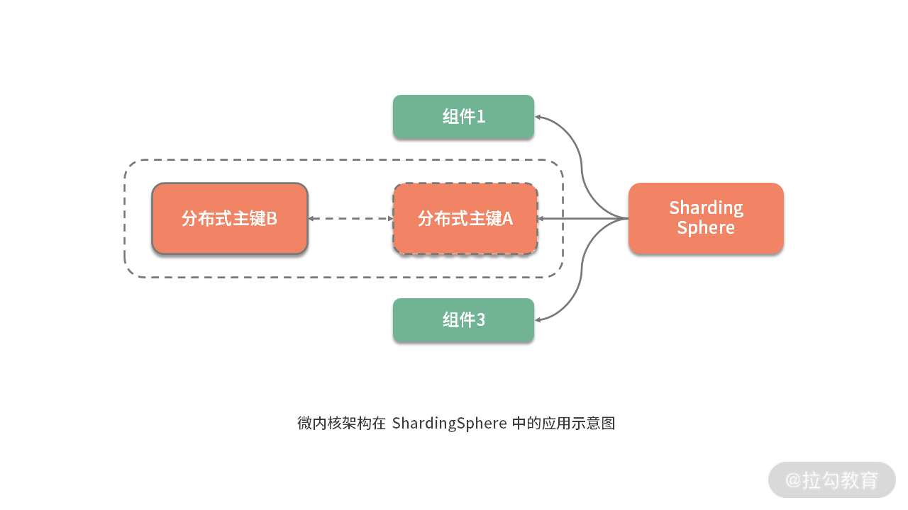
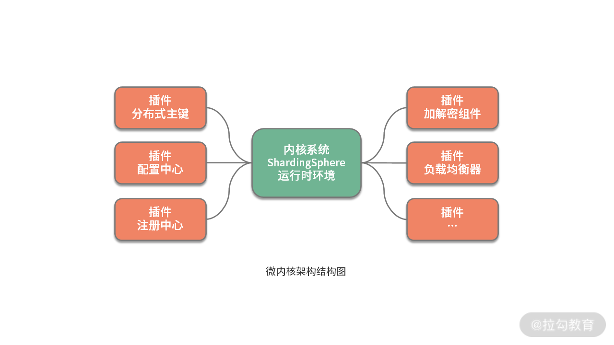
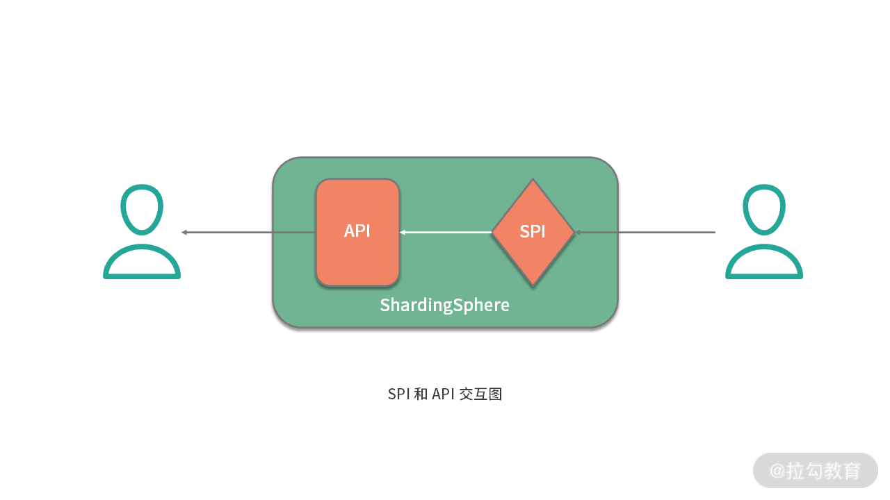
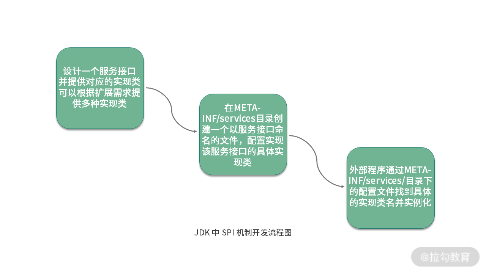

# 13 微内核架构：ShardingSphere 如何实现系统的扩展性？

我们已经在课程中多次提到 ShardingSphere 使用了微内核架构来实现框架的扩展性。随着课程的演进，我们会发现，用于实现配置中心的 ConfigCenter、用于数据脱敏的 ShardingEncryptor 以及用于数据库治理的注册中心接口 RegistryCenter 等大量组件的实现也都使用了微内核架构。那么，究竟什么是微内核架构呢？今天我们就来讨论这个架构模式的基本原理以及在 ShardingSphere 中的应用。

### 什么是微内核架构？

**微内核是一种典型的架构模式** ，区别于普通的设计模式，架构模式是一种高层模式，用于描述系统级的结构组成、相互关系及相关约束。微内核架构在开源框架中的应用也比较广泛，除了 ShardingSphere 之外，在主流的 PRC 框架 Dubbo 中也实现了自己的微内核架构。那么，在介绍什么是微内核架构之前，我们有必要先阐述这些开源框架会使用微内核架构的原因。

#### 为什么要使用微内核架构？ **微内核架构本质上是为了提高系统的扩展性** 。所谓扩展性，是指系统在经历不可避免的变更时所具有的灵活性，以及针对提供这样的灵活性所需要付出的成本间的平衡能力。也就是说，当在往系统中添加新业务时，不需要改变原有的各个组件，只需把新业务封闭在一个新的组件中就能完成整体业务的升级，我们认为这样的系统具有较好的可扩展性

就架构设计而言，扩展性是软件设计的永恒话题。而要实现系统扩展性，一种思路是提供可插拔式的机制来应对所发生的变化。当系统中现有的某个组件不满足要求时，我们可以实现一个新的组件来替换它，而整个过程对于系统的运行而言应该是无感知的，我们也可以根据需要随时完成这种新旧组件的替换。

比如在下个课时中我们将要介绍的 ShardingSphere 中提供的分布式主键功能，分布式主键的实现可能有很多种，而扩展性在这个点上的体现就是， **我们可以使用任意一种新的分布式主键实现来替换原有的实现，而不需要依赖分布式主键的业务代码做任何的改变** 。



微内核架构模式为这种实现扩展性的思路提供了架构设计上的支持，ShardingSphere 基于微内核架构实现了高度的扩展性。在介绍如何实现微内核架构之前，我们先对微内核架构的具体组成结构和基本原理做简要的阐述。

#### 什么是微内核架构？

从组成结构上讲， **微内核架构包含两部分组件：内核系统和插件** 。这里的内核系统通常提供系统运行所需的最小功能集，而插件是独立的组件，包含自定义的各种业务代码，用来向内核系统增强或扩展额外的业务能力。在 ShardingSphere 中，前面提到的分布式主键就是插件，而 ShardingSphere 的运行时环境构成了内核系统。



那么这里的插件具体指的是什么呢？这就需要我们明确两个概念，一个概念就是经常在说的 **API** ，这是系统对外暴露的接口。而另一个概念就是 **SPI** （Service Provider Interface，服务提供接口），这是插件自身所具备的扩展点。就两者的关系而言，API 面向业务开发人员，而 SPI 面向框架开发人员，两者共同构成了 ShardingSphere 本身。



可插拔式的实现机制说起来简单，做起来却不容易，我们需要考虑两方面内容。一方面，我们需要梳理系统的变化并把它们抽象成多个 SPI 扩展点。另一方面， **当我们实现了这些 SPI 扩展点之后，就需要构建一个能够支持这种可插拔机制的具体实现，从而提供一种 SPI 运行时环境** 。

那么，ShardingSphere 是如何实现微内核架构的呢？让我们来一起看一下。

### 如何实现微内核架构？

事实上，JDK 已经为我们提供了一种微内核架构的实现方式，这种实现方式针对如何设计和实现 SPI 提出了一些开发和配置上的规范，ShardingSphere 使用的就是这种规范。首先，我们需要设计一个服务接口，并根据需要提供不同的实现类。接下来，我们将模拟实现分布式主键的应用场景。

基于 SPI 的约定，创建一个单独的工程来存放服务接口，并给出接口定义。请注意 **这个服务接口的完整类路径为 com.tianyilan.KeyGenerator** ，接口中只包含一个获取目标主键的简单示例方法。

```plaintext
package com.tianyilan; 
public interface KeyGenerator{ 
    String getKey(); 
}
```

针对该接口，提供两个简单的实现类，分别是基于 UUID 的 UUIDKeyGenerator 和基于雪花算法的 SnowflakeKeyGenerator。为了让演示过程更简单，这里我们直接返回一个模拟的结果，真实的实现过程我们会在下一课时中详细介绍。

```java
public class UUIDKeyGenerator implements KeyGenerator { 
    @Override 
    public String getKey() { 
       return "UUIDKey"; 
    } 
} 
public class SnowflakeKeyGenerator implements KeyGenerator { 
    @Override 
    public String getKey() { 
       return "SnowflakeKey"; 
    } 
}
```

接下来的这个步骤很关键， **在这个代码工程的 META-INF/services/ 目录下，需要创建一个以服务接口完整类路径 com.tianyilan.KeyGenerator 命名的文件** ，文件的内容是指向该接口所对应的两个实现类的完整类路径 com.tianyilan.UUIDKeyGenerator 和 com.tianyilan. SnowflakeKeyGenerator。

我们把这个代码工程打成一个 jar 包，然后新建另一个代码工程，该代码工程需要这个 jar 包，并完成如下所示的 Main 函数。

```java
import java.util.ServiceLoader; 
import com.tianyilan. KeyGenerator; 
public class Main { 
    public static void main(String[] args) { 
       ServiceLoader<KeyGenerator> generators = ServiceLoader.load(KeyGenerator.class); 
       for (KeyGenerator generator : generators) { 
           System.out.println(generator.getClass()); 
           String key = generator.getKey(); 
           System.out.println(key); 
       } 
    } 
}
```

现在，该工程的角色是 SPI 服务的使用者，这里使用了 JDK 提供的 ServiceLoader 工具类来获取所有 KeyGenerator 的实现类。现在在 jar 包的 META-INF/services/com.tianyilan.KeyGenerator 文件中有两个 KeyGenerator 实现类的定义。执行这段 Main 函数，我们将得到的输出结果如下：

```plaintext
 class com.tianyilan.UUIDKeyGenerator 
 UUIDKey 
 class com.tianyilan.SnowflakeKeyGenerator 
 SnowflakeKey
```

如果我们调整 META-INF/services/com.tianyilan.KeyGenerator 文件中的内容，去掉 com.tianyilan.UUIDKeyGenerator 的定义，并重新打成 jar 包供 SPI 服务的使用者进行引用。再次执行 Main 函数，则只会得到基于 SnowflakeKeyGenerator 的输出结果。

至此， 完整 的 SPI 提供者和使用者的实现过程演示完毕。我们通过一张图，总结基于 JDK 的 SPI 机制实现微内核架构的开发流程：



这个示例非常简单，但却是 ShardingSphere 中实现微内核架构的基础。接下来，就让我们把话题转到 ShardingSphere，看看 ShardingSphere 中应用 SPI 机制的具体方法。

### ShardingSphere 如何基于微内核架构实现扩展性？

ShardingSphere 中微内核架构的实现过程并不复杂，基本就是对 JDK 中 SPI 机制的封装。让我们一起来看一下。

#### ShardingSphere 中的微内核架构基础实现机制

我们发现，在 ShardingSphere 源码的根目录下，存在一个独立的工程 shardingsphere-spi。显然，从命名上看，这个工程中应该包含了 ShardingSphere 实现 SPI 的相关代码。我们快速浏览该工程，发现里面只有一个接口定义和两个工具类。我们先来看这个接口定义 TypeBasedSPI：

```plaintext
public interface TypeBasedSPI { 
    //获取SPI对应的类型 
    String getType(); 
    //获取属性 
    Properties getProperties(); 
    //设置属性 
    void setProperties(Properties properties); 
}
```

从定位上看，这个接口在 ShardingSphere 中应该是一个顶层接口，我们已经在上一课时给出了这一接口的实现类类层结构。接下来再看一下 NewInstanceServiceLoader 类，从命名上看，不难想象该类的作用类似于一种 ServiceLoader，用于加载新的目标对象实例：

```java
public final class NewInstanceServiceLoader { 
    private static final Map<Class, Collection<Class<?>>> SERVICE_MAP = new HashMap<>(); 
    //通过ServiceLoader获取新的SPI服务实例并注册到SERVICE_MAP中
    public static <T> void register(final Class<T> service) { 
        for (T each : ServiceLoader.load(service)) { 
            registerServiceClass(service, each); 
        } 
    } 
    @SuppressWarnings("unchecked") 
    private static <T> void registerServiceClass(final Class<T> service, final T instance) { 
        Collection<Class<?>> serviceClasses = SERVICE_MAP.get(service); 
        if (null == serviceClasses) { 
            serviceClasses = new LinkedHashSet<>(); 
        } 
        serviceClasses.add(instance.getClass()); 
        SERVICE_MAP.put(service, serviceClasses); 
    } 
    @SneakyThrows 
    @SuppressWarnings("unchecked") 
    public static <T> Collection<T> newServiceInstances(final Class<T> service) { 
        Collection<T> result = new LinkedList<>(); 
        if (null == SERVICE_MAP.get(service)) { 
            return result; 
        } 
        for (Class<?> each : SERVICE_MAP.get(service)) { 
            result.add((T) each.newInstance()); 
        } 
        return result; 
    } 
}
```

在上面这段代码中， 首先看到了熟悉的 ServiceLoader.load(service) 方法，这是 JDK 中 ServiceLoader 工具类的具体应用。同时，注意到 ShardingSphere 使用了一个 HashMap 来保存类的定义以及类的实例之 间 的一对多关系，可以认为，这是一种用于提高访问效率的缓存机制。

最后，我们来看一下 TypeBasedSPIServiceLoader 的实现，该类依赖于前面介绍的 NewInstanceServiceLoader 类。 下面这段代码演示了 基于 NewInstanceServiceLoader 获取实例类列表，并根据所传入的类型做过滤：

```java
    //使用NewInstanceServiceLoader获取实例类列表，并根据类型做过滤 
    private Collection<T> loadTypeBasedServices(final String type) { 
        return Collections2.filter(NewInstanceServiceLoader.newServiceInstances(classType), new Predicate<T>() { 
            @Override 
            public boolean apply(final T input) { 
                return type.equalsIgnoreCase(input.getType()); 
            } 
        }); 
    }
```

TypeBasedSPIServiceLoader 对外暴露了服务的接口，对通过 loadTypeBasedServices 方法获取的服务实例设置对应的属性然后返回：

```java
 //基于类型通过SPI创建实例 
    public final T newService(final String type, final Properties props) { 
        Collection<T> typeBasedServices = loadTypeBasedServices(type); 
        if (typeBasedServices.isEmpty()) { 
            throw new RuntimeException(String.format("Invalid `%s` SPI type `%s`.", classType.getName(), type)); 
        } 
        T result = typeBasedServices.iterator().next(); 
        result.setProperties(props); 
        return result; 
 }
```

同时，TypeBasedSPIServiceLoader 也对外暴露了不需要传入类型的 newService 方法，该方法使用了 loadFirstTypeBasedService 工具方法来获取第一个服务实例：

```java
 //基于默认类型通过SPI创建实例 
    public final T newService() { 
        T result = loadFirstTypeBasedService(); 
        result.setProperties(new Properties()); 
        return result; 
 } 
    private T loadFirstTypeBasedService() { 
        Collection<T> instances = NewInstanceServiceLoader.newServiceInstances(classType); 
        if (instances.isEmpty()) { 
            throw new RuntimeException(String.format("Invalid `%s` SPI, no implementation class load from SPI.", classType.getName())); 
        } 
        return instances.iterator().next(); 
 }
```

这样，shardingsphere-spi 代码工程中的内容就介绍完毕。 **这部分内容相当于是 ShardingSphere 中所提供的插件运行时环境** 。下面我们基于 ShardingSphere 中提供的几个典型应用场景来讨论这个运行时环境的具体使用方法。

#### 微内核架构在 ShardingSphere 中的应用

- SQL 解析器 SQLParser

我们将在 15 课时中介绍 SQLParser 类，该类负责将具体某一条 SQL 解析成一个抽象语法树的整个过程。而这个 SQLParser 的生成由 SQLParserFactory 负责：

```java
 public final class SQLParserFactory { 
     public static SQLParser newInstance(final String databaseTypeName, final String sql) { 
      //通过SPI机制加载所有扩展 
      for (SQLParserEntry each : NewInstanceServiceLoader.newServiceInstances(SQLParserEntry.class)) { 
         … 
     } 
 }
```

可以看到，这里并没有使用前面介绍的 TypeBasedSPIServiceLoader 来加载实例，而是直接使用更为底层的 NewInstanceServiceLoader。

这里引入的 SQLParserEntry 接口就位于 shardingsphere-sql-parser-spi 工程的 org.apache.shardingsphere.sql.parser.spi 包中。显然，从包的命名上看，该接口是一个 SPI 接口。在 SQLParserEntry 类层结构接口中包含一批实现类，分别对应各个具体的数据库：


SQLParserEntry 实现类图

我们先来看针对 MySQL 的代码工程 shardingsphere-sql-parser-mysql，在 META-INF/services 目录下，我们找到了一个 org.apache.shardingsphere.sql.parser.spi.SQLParserEntry 文件:


MySQL 代码工程中的 SPI 配置

可以看到这里指向了 org.apache.shardingsphere.sql.parser.MySQLParserEntry 类。再来到 Oracle 的代码工程 shardingsphere-sql-parser-oracle，在 META-INF/services 目录下，同样找到了一个 org.apache.shardingsphere.sql.parser.spi.SQLParserEntry 文件：


Oracle 代码工程中的 SPI 配置

显然，这里应该指向 org.apache.shardingsphere.sql.parser.OracleParserEntry 类，通过这种方式，系统在运行时就会根据类路径动态加载 SPI。

可以注意到，在 SQLParserEntry 接口的类层结构中，实际并没有使用到 TypeBasedSPI 接口 ，而是完全采用了 JDK 原生的 SPI 机制。

- 配置中心 ConfigCenter

接下来，我们来找一个使用 TypeBasedSPI 的示例，比如代表配置中心的 ConfigCenter：

```java
public interface ConfigCenter extends TypeBasedSPI
```

显然，ConfigCenter 接口继承了 TypeBasedSPI 接口，而在 ShardingSphere 中也存在两个 ConfigCenter 接口的实现类，一个是 ApolloConfigCenter，一个是 CuratorZookeeperConfigCenter。

在 sharding-orchestration-core 工程的 org.apache.shardingsphere.orchestration.internal.configcenter 中，我们找到了 ConfigCenterServiceLoader 类，该类扩展了前面提到的 TypeBasedSPIServiceLoader 类：

```java
public final class ConfigCenterServiceLoader extends TypeBasedSPIServiceLoader<ConfigCenter> { 
    static { 
        NewInstanceServiceLoader.register(ConfigCenter.class); 
    } 
    public ConfigCenterServiceLoader() { 
        super(ConfigCenter.class); 
    } 
    //基于SPI加载ConfigCenter 
    public ConfigCenter load(final ConfigCenterConfiguration configCenterConfig) { 
        Preconditions.checkNotNull(configCenterConfig, "Config center configuration cannot be null."); 
        ConfigCenter result = newService(configCenterConfig.getType(), configCenterConfig.getProperties()); 
        result.init(configCenterConfig); 
        return result; 
    } 
}
```

那么它是如何实现的呢？ 首先，ConfigCenterServiceLoader 类通过 NewInstanceServiceLoader.register(ConfigCenter.class) 语句将所有 ConfigCenter 注册到系统中，这一步会通过 JDK 的 ServiceLoader 工具类加载类路径中的所有 ConfigCenter 实例。

我们可以看到在上面的 load 方法中，通过父类 TypeBasedSPIServiceLoader 的 newService 方法，基于类型创建了 SPI 实例。

以 ApolloConfigCenter 为例，我们来看它的使用方法。在 sharding-orchestration-config-apollo 工程的 META-INF/services 目录下，应该存在一个名为 org.apache.shardingsphere.orchestration.config.api.ConfigCenter 的配置文件，指向 ApolloConfigCenter 类：


Apollo 代码工程中的 SPI 配置

其他的 ConfigCenter 实现也是一样，你可以自行查阅 sharding-orchestration-config-zookeeper-curator 等工程中的 SPI 配置文件。

至此，我们全面了解了 ShardingSphere 中的微内核架构，也就可以基于 ShardingSphere 所提供的各种 SPI 扩展点提供满足自身需求的具体实现。

### 从源码解析到日常开发

在日常开发过程中，我们一般可以直接使用 JDK 的 ServiceLoader 类来实现 SPI 机制。当然，我们也可以采用像 ShardingSphere 的方式对 ServiceLoader 类进行一层简单的封装，并添加属性设置等自定义功能。

同时，我们也应该注意到，ServiceLoader 这种实现方案也有一定缺点：

- 一方面，META/services 这个配置文件的加载地址是写死在代码中，缺乏灵活性。
- 另一方面，ServiceLoader 内部采用了基于迭代器的加载方法，会把配置文件中的所有 SPI 实现类都加载到内存中，效率不高。

所以如果需要提供更高的灵活性和性能，我们也可以基于 ServiceLoader 的实现方法自己开发适合自身需求的 SPI 加载 机制。

### 总结

微内核架构是 ShardingSphere 中最核心的基础架构，为这个框架提供了高度的灵活度，以及可插拔的扩展性。微内核架构也是一种同样的架构模式，本课时我们对这个架构模式的特点和组成结构做了介绍，并基于 JDK 中提供的 SPI 机制给出了实现这一架构模式的具体方案。

ShardingSphere 中大量使用了微内核架构来解耦系统内核和各个组件之间的关联关系，我们基于解析引擎和配置中心给出了具体的实现案例。在学习这些案例时 **，重点在于掌握 ShardingSphere 中对 JDK 中 SPI的封装机制。**

这里给你留一道思考题：ShardingSphere 中使用微内核架构时对 JDK 中的 SPI 机制做了哪些封装？

本课时的内容就到这里，下一课时，我们将继续探索 ShardingSphere 中的基础设施，并给出分布式主键的设计原理和多种实现方案，记得按时来听课。
