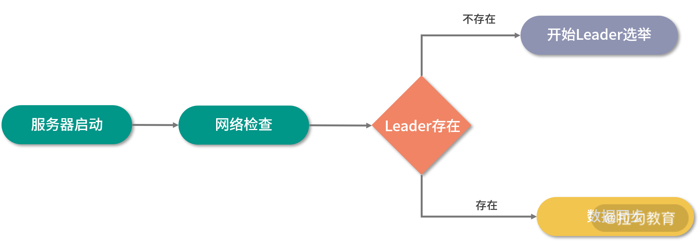
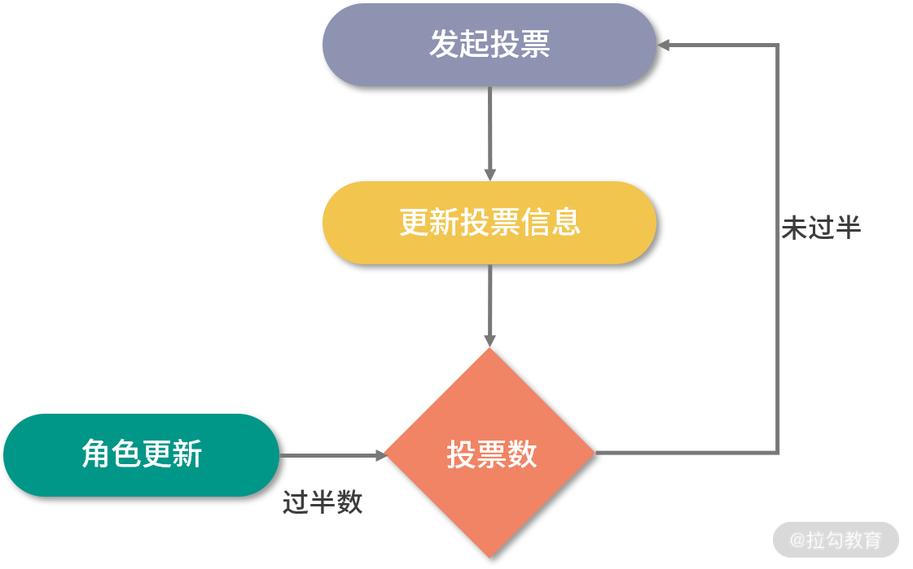

# 15 ZooKeeper 究竟是怎么选中 Leader 的？

在整个高级篇中，我们主要介绍了 ZooKeeper 服务器以及集群的工作原理等相关知识。本课时我们仍然继续上节课的内容，把 Leader 服务器的另一个关键技术点：“Leader 服务器是如何产生的”进行详细讲解。

下面我们就深入到 ZooKeeper 的底层，来学习一下 Leader 服务器选举的实现方法。

### Leader 服务器的选举原理

Leader 服务器的作用是管理 ZooKeeper 集群中的其他服务器。因此，如果是单独一台服务器，不构成集群规模。在 ZooKeeper 服务的运行中不会选举 Leader 服务器，也不会作为 Leader 服务器运行。在前面的课程中我们介绍过，一个 ZooKeeper 服务要想满足集群方式运行，至少需要三台服务器。本课时我们就以三台服务器组成的 ZooKeeper 集群为例，介绍一下 Leader 服务器选举的内部过程和底层实现。

#### 服务启动时的 Leader 选举

Leader 服务器的选举操作主要发生在两种情况下。第一种就是 ZooKeeper 集群服务启动的时候，第二种就是在 ZooKeeper 集群中旧的 Leader 服务器失效时，这时 ZooKeeper 集群需要选举出新的 Leader 服务器。

我们先来介绍在 ZooKeeper 集群服务最初启动的时候，Leader 服务器是如何选举的。在 ZooKeeper 集群启动时，需要在集群中的服务器之间确定一台 Leader 服务器。当 ZooKeeper 集群中的三台服务器启动之后，首先会进行通信检查，如果集群中的服务器之间能够进行通信。集群中的三台机器开始尝试寻找集群中的 Leader 服务器并进行数据同步等操作。如何这时没有搜索到 Leader 服务器，说明集群中不存在 Leader 服务器。这时 ZooKeeper 集群开始发起 Leader 服务器选举。在整个 ZooKeeper 集群中 Leader 选举主要可以分为三大步骤分别是：发起投票、接收投票、统计投票。



#### 发起投票

我们先来看一下发起投票的流程，在 ZooKeeper 服务器集群初始化启动的时候，集群中的每一台服务器都会将自己作为 Leader 服务器进行投票。**也就是每次投票时，发送的服务器的 myid（服务器标识符）和 ZXID (集群投票信息标识符)等选票信息字段都指向本机服务器。** 而一个投票信息就是通过这两个字段组成的。以集群中三个服务器 Serverhost1、Serverhost2、Serverhost3 为例，三个服务器的投票内容分别是：Severhost1 的投票是（1，0）、Serverhost2 服务器的投票是（2，0）、Serverhost3 服务器的投票是（3，0）。

#### 接收投票

集群中各个服务器在发起投票的同时，也通过网络接收来自集群中其他服务器的投票信息。

在接收到网络中的投票信息后，服务器内部首先会判断该条投票信息的有效性。检查该条投票信息的时效性，是否是本轮最新的投票，并检查该条投票信息是否是处于 LOOKING 状态的服务器发出的。

#### 统计投票

在接收到投票后，ZooKeeper 集群就该处理和统计投票结果了。对于每条接收到的投票信息，集群中的每一台服务器都会将自己的投票信息与其接收到的 ZooKeeper 集群中的其他投票信息进行对比。主要进行对比的内容是 ZXID，ZXID 数值比较大的投票信息优先作为 Leader 服务器。如果每个投票信息中的 ZXID 相同，就会接着比对投票信息中的 myid 信息字段，选举出 myid 较大的服务器作为 Leader 服务器。

拿上面列举的三个服务器组成的集群例子来说，对于 Serverhost1，服务器的投票信息是（1，0），该服务器接收到的 Serverhost2 服务器的投票信息是（2，0）。在 ZooKeeper 集群服务运行的过程中，首先会对比 ZXID，发现结果相同之后，对比 myid，发现 Serverhost2 服务器的 myid 比较大，于是更新自己的投票信息为（2，0），并重新向 ZooKeeper 集群中的服务器发送新的投票信息。而 Serverhost2 服务器则保留自身的投票信息，并重新向 ZooKeeper 集群服务器中发送投票信息。

而当每轮投票过后，ZooKeeper 服务都会统计集群中服务器的投票结果，判断是否有过半数的机器投出一样的信息。如果存在过半数投票信息指向的服务器，那么该台服务器就被选举为 Leader 服务器。比如上面我们举的例子中，ZooKeeper 集群会选举 Severhost2 服务器作为 Leader 服务器。



当 ZooKeeper 集群选举出 Leader 服务器后，ZooKeeper 集群中的服务器就开始更新自己的角色信息，**除被选举成 Leader 的服务器之外，其他集群中的服务器角色变更为 Following。**

#### 服务运行时的 Leader 选举

上面我们介绍了 ZooKeeper 集群启动时 Leader 服务器的选举方法。接下来我们再看一下在 ZooKeeper 集群服务的运行过程中，Leader 服务器是如果进行选举的。

在 ZooKeeper 集群服务的运行过程中，Leader 服务器作为处理事物性请求以及管理其他角色服务器，在 ZooKeeper 集群中起到关键的作用。在前面的课程中我们提到过，当 ZooKeeper 集群中的 Leader 服务器发生崩溃时，集群会暂停处理事务性的会话请求，直到 ZooKeeper 集群中选举出新的 Leader 服务器。而整个 ZooKeeper 集群在重新选举 Leader 时也经过了四个过程，分别是变更服务器状态、发起投票、接收投票、统计投票。其中，与初始化启动时 Leader 服务器的选举过程相比，变更状态和发起投票这两个阶段的实现是不同的。下面我们来分别看看这两个阶段。

#### 变更状态

与上面介绍的 ZooKeeper 集群服务器初始化阶段不同。在 ZooKeeper 集群服务运行的过程中，集群中每台服务器的角色已经确定了，当 Leader 服务器崩溃后 ，ZooKeeper 集群中的其他服务器会首先将自身的状态信息变为 LOOKING 状态，该状态表示服务器已经做好选举新 Leader 服务器的准备了，这之后整个 ZooKeeper 集群开始进入选举新的 Leader 服务器过程。

#### 发起投票

ZooKeeper 集群重新选举 Leader 服务器的过程中发起投票的过程与初始化启动时发起投票的过程基本相同。首先每个集群中的服务器都会投票给自己，将投票信息中的 Zxid 和 myid 分别指向本机服务器。

### 底层实现

到目前为止，我们已经对 ZooKeeper 集群中 Leader 服务器的选举过程做了详细的介绍。接下来我们再深入 ZooKeeper 底层，来看一下底层实现的关键步骤。

之前我们介绍过，ZooKeeper 中实现的选举算法有三种，而在目前的 ZooKeeper 3.6 版本后，只支持 “快速选举” 这一种算法。而在代码层面的实现中，QuorumCnxManager 作为核心的实现类，用来管理 Leader 服务器与 Follow 服务器的 TCP 通信，以及消息的接收与发送等功能。在 QuorumCnxManager 中，主要定义了 ConcurrentHashMap\<Long, SendWorker> 类型的 senderWorkerMap 数据字段，用来管理每一个通信的服务器。

```java
public class QuorumCnxManager {
  final ConcurrentHashMap<Long, SendWorker> senderWorkerMap;
final ConcurrentHashMap<Long, ArrayBlockingQueue<ByteBuffer>> queueSendMap;
final ConcurrentHashMap<Long, ByteBuffer> lastMessageSent;
}
```

而在 QuorumCnxManager 类的内部，定义了 RecvWorker 内部类。该类继承了一个 ZooKeeperThread 类的多线程类。主要负责消息接收。在 ZooKeeper 的实现中，为每一个集群中的通信服务器都分配一个 RecvWorker，负责接收来自其他服务器发送的信息。在 RecvWorker 的 run 函数中，不断通过 queueSendMap 队列读取信息。

```java
class SendWorker extends ZooKeeperThread {
  Long sid;
  Socket sock;
  volatile boolean running = true;
  DataInputStream din;
  final SendWorker sw;
  public void run() {
  threadCnt.incrementAndGet();
  while (running && !shutdown && sock != null) {
    int length = din.readInt();
    if (length <= 0 || length > PACKETMAXSIZE) {
        throw new IOException(
                "Received packet with invalid packet: "
                        + length);
    }
    byte[] msgArray = new byte[length];
    din.readFully(msgArray, 0, length);
    ByteBuffer message = ByteBuffer.wrap(msgArray);
    addToRecvQueue(new Message(message.duplicate(), sid));
  }
  }
}
```

除了接收信息的功能外，QuorumCnxManager 内还定义了一个 SendWorker 内部类用来向集群中的其他服务器发送投票信息。如下面的代码所示。在 SendWorker 类中，不会立刻将投票信息发送到 ZooKeeper 集群中，而是将投票信息首先插入到 pollSendQueue 队列，之后通过 send 函数进行发送。

```java
class SendWorker extends ZooKeeperThread {
  Long sid;
  Socket sock;
  RecvWorker recvWorker;
  volatile boolean running = true;
  DataOutputStream dout;
  public void run() {
    while (running && !shutdown && sock != null) {
    ByteBuffer b = null;
    try {
        ArrayBlockingQueue<ByteBuffer> bq = queueSendMap
                .get(sid);
        if (bq != null) {
            b = pollSendQueue(bq, 1000, TimeUnit.MILLISECONDS);
        } else {
            LOG.error("No queue of incoming messages for " +
                      "server " + sid);
            break;
        }
        if(b != null){
            lastMessageSent.put(sid, b);
            send(b);
        }
    } catch (InterruptedException e) {
        LOG.warn("Interrupted while waiting for message on queue",
                e);
    }
}
  }
}
```

实现了投票信息的发送与接收后，接下来我们就来看看如何处理投票结果。在 ZooKeeper 的底层，是通过 FastLeaderElection 类实现的。如下面的代码所示，在 FastLeaderElection 的内部，定义了最大通信间隔 maxNotificationInterval、服务器等待时间 finalizeWait 等属性配置。

```java
public class FastLeaderElection implements Election {
  final static int maxNotificationInterval = 60000;
  final static int IGNOREVALUE = -1
  QuorumCnxManager manager;
}
```

在 ZooKeeper 底层通过 getVote 函数来设置本机的投票内容，如下图面的代码所示，在 getVote 中通过 proposedLeader 服务器信息、proposedZxid 服务器 ZXID、proposedEpoch 投票轮次等信息封装投票信息。

```java
synchronized public Vote getVote(){
    return new Vote(proposedLeader, proposedZxid, proposedEpoch);
 }
```

在完成投票信息的封装以及投票信息的接收和发送后。一个 ZooKeeper 集群中，Leader 服务器选举底层实现的关键步骤就已经介绍完了。 Leader 节点的底层实现过程的逻辑相对来说比较简单，基本分为封装投票信息、发送投票、接收投票等。

### 结束

通过本课时的学习，我们就 ZooKeeper 服务端在集群环境下，如何选举出 Leader 服务器做了一个比较详细的介绍。我们知道 Leader 选举一般发生在 ZooKeeper 集群服务初始化和集群中旧的 Leader 服务器崩溃时。Leader 选举保证了 ZooKeeper 集群运行的可靠性。当旧的 Leader 服务器发生崩溃时，需要重新选举出新的 Leader 服务器以保证集群服务的稳定性。

在这个过程中我们思考一个问题，那就是之前崩溃的 Leader 服务器是否会参与本次投票，以及是否能被重新选举为 Leader 服务器。这主要取决于在选举过程中旧的 Leader 服务器的运行状态。如果该服务器可以正常运行且可以和集群中其他服务器通信，那么该服务器也会参与新的 Leader 服务器的选举，在满足条件的情况下该台服务器也会再次被选举为新的 Leader 服务器。
