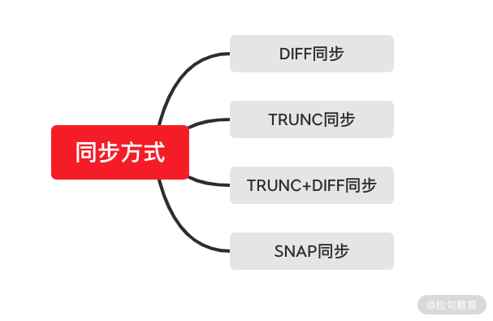

# 16 ZooKeeper 集群中 Leader 与 Follower 的数据同步策略

在前面的课时中，我们已经对 ZooKeeper 集群中 Leader 服务器的选举等相关操作进行了详细介绍。本课时我们继续将焦点集中在 ZooKeeper 集群中的相关操作。在 Leader 节点选举后，还需要把 Leader 服务器和 Follow 服务器进行数据同步。在保证整个 ZooKeeper 集群中服务器数据一致的前提下，ZooKeeper 集群才能对外提供服务。

### 为什么要进行同步

接着上面介绍的内容，在我们介绍 ZooKeeper 集群数据同步之前，先要清楚为什么要进行数据同步。在 ZooKeeper 集群服务运行过程中，主要负责处理发送到 ZooKeeper 集群服务端的客户端会话请求。这些客户端的会话请求基本可以分为事务性的会话请求和非事务性的会话请求，而这两种会话的本质区别在于，执行会话请求后，ZooKeeper 集群服务器状态是否发生改变。

事物性会话请求最常用的操作类型有节点的创建、删除、更新等操作。而查询数据节点等会话请求操作就是非事务性的，因为查询不会造成 ZooKeeper 集群中服务器上数据状态的变更 。

我们之前介绍过，分布式环境下经常会出现 CAP 定义中的一致性问题。比如当一个 ZooKeeper 集群服务器中，Leader 节点处理了一个节点的创建会话操作后，该 Leader 服务器上就新增了一个数据节点。而如果不在 ZooKeeper 集群中进行数据同步，那么其他服务器上的数据则保持旧有的状态，新增加的节点在服务器上不存在。当 ZooKeeper 集群收到来自客户端的查询请求时，会出现该数据节点查询不到的情况，**这就是典型的集群中服务器数据不一致的情况** 。为了避免这种情况的发生，在进行事务性请求的操作后，ZooKeeper 集群中的服务器要进行数据同步，而主要的数据同步是从 Learnning 服务器同步 Leader 服务器上的数据。

### 同步方法

在介绍了 ZooKeeper 集群服务器的同步作用后，接下来我们再学习一下 ZooKeeper 集群中数据同步的方法。**我们主要通过三个方面来讲解 ZooKeeper 集群中的同步方法，分别是同步条件、同步过程、同步后的处理。** #### 同步条件

同步条件是指在 ZooKeeper 集群中何时触发数据同步的机制。与上一课时中 Leader 选举首先要判断集群中 Leader 服务器是否存在不同，**要想进行集群中的数据同步，首先需要 ZooKeeper 集群中存在用来进行数据同步的 Learning 服务器。** 也就是说，当 ZooKeeper 集群中选举出 Leader 节点后，除了被选举为 Leader 的服务器，其他服务器都作为 Learnning 服务器，并向 Leader 服务器注册。之后系统就进入到数据同步的过程中。

#### 同步过程

在数据同步的过程中，ZooKeeper 集群的主要工作就是将那些没有在 Learnning 服务器上执行过的事务性请求同步到 Learning 服务器上。**这里请你注意，事务性的会话请求会被同步，而像数据节点的查询等非事务性请求则不在数据同步的操作范围内。** 而在具体实现数据同步的时候，ZooKeeper 集群又提供四种同步方式，如下图所示：



#### DIFF 同步

DIFF 同步即差异化同步的方式，在 ZooKeeper 集群中，Leader 服务器探测到 Learnning 服务器的存在后，首先会向该 Learnning 服务器发送一个 DIFF 不同指令。在收到该条指令后，Learnning 服务器会进行差异化方式的数据同步操作。在这个过程中，Leader 服务器会将一些 Proposal 发送给 Learnning 服务器。之后 Learnning 服务器在接收到来自 Leader 服务器的 commit 命令后执行数据持久化的操作。

#### TRUNC+DIFF 同步

TRUNC+DIFF 同步代表先回滚再执行差异化的同步，这种方式一般发生在 Learnning 服务器上存在一条事务性的操作日志，但在集群中的 Leader 服务器上并不存在的情况 。发生这种情况的原因可能是 Leader 服务器已经将事务记录到本地事务日志中，但没有成功发起 Proposal 流程。当这种问题产生的时候，ZooKeeper 集群会首先进行回滚操作，在 Learning 服务器上的数据回滚到与 Leader 服务器上的数据一致的状态后，再进行 DIFF 方式的数据同步操作。

#### TRUNC 同步

TRUNC 同步是指仅回滚操作，就是将 Learnning 服务器上的操作日志数据回滚到与 Leader 服务器上的操作日志数据一致的状态下。之后并不进行 DIFF 方式的数据同步操作。

#### SNAP 同步

SNAP 同步的意思是全量同步，是将 Leader 服务器内存中的数据全部同步给 Learnning 服务器。在进行全量同步的过程中，Leader 服务器首先会向 ZooKeeper 集群中的 Learning 服务器发送一个 SNAP 命令，在接收到 SNAP 命令后， ZooKeeper 集群中的 Learning 服务器开始进行全量同步的操作。随后，Leader 服务器会从内存数据库中获取到全量数据节点和会话超时时间记录器，将他们序列化后传输给 Learnning 服务器。Learnning 服务器接收到该全量数据后，会对其反序列化后载入到内存数据库中。

#### 同步后的处理

数据同步的本质就是比对 Leader 服务器与 Learning 服务器，将 Leader 服务器上的数据增加到 Learnning 服务器，再将 Learnning 服务器上多余的事物日志回滚。前面的介绍已经完成了数据的对比与传递操作，接下来就在 Learning 服务器上执行接收到的事物日志，进行本地化的操作。

### 底层实现

到现在为止，我们已经学习了 ZooKeeper 集群中数据同步的方法，下面我们深入到代码层面来看一下 ZooKeeper 的底层是如何实现的。首先我们来看看 Learnning 服务器是如何接收和判断同步方式的。如下面的代码所示，ZooKeeper 底层实现了一个 Learner 类，该类可以看作是集群中 Learnning 服务器的实例对象，与集群中的 Learning 服务器是一一对应的。

```java
public class Learner {}
```

而在 Learner 类的内部，主要通过 syncWithLeader 函数来处理来自 Leader 服务器的命令。在接收到来自 Leader 服务器的命令后，通过 qp.getType() 方法判断数据同步的方式。

```plaintext
protected void syncWithLeader(long newLeaderZxid) throws Exception{
 if (qp.getType() == Leader.DIFF) {
    snapshotNeeded = false;
  }else if (qp.getType() == Leader.TRUNC) {
  }
}
```

在确定了数据同步的方式后，再调用 packetsCommitted.add(qp.getZxid()) 方法将事物操作同步到处理队列中，之后调用事物操作线程进行处理。

```java
if (pif.hdr.getZxid() == qp.getZxid() && qp.getType() == Leader.COMMITANDACTIVATE) {
    QuorumVerifier qv = self.configFromString(new String(((SetDataTxn) pif.rec).getData()));
    boolean majorChange = self.processReconfig(qv, ByteBuffer.wrap(qp.getData()).getLong(),
            qp.getZxid(), true);
    if (majorChange) {
        throw new Exception("changes proposed in reconfig");
    }
}
if (!writeToTxnLog) {
    if (pif.hdr.getZxid() != qp.getZxid()) {
        LOG.warn("Committing " + qp.getZxid() + ", but next proposal is " + pif.hdr.getZxid());
    } else {
        zk.processTxn(pif.hdr, pif.rec);
        packetsNotCommitted.remove();
    }
} else {
    packetsCommitted.add(qp.getZxid());
```

### 结束

本课时我们学习了 ZooKeeper 集群中数据同步的相关知识。知道了 ZooKeeper 集群之所以进行数据同步，是为了避免在处理事务性会话请求时，服务器上的数据状态发生变化，最终导致在 ZooKeeper 集群中出现数据不一致的情况。因此，在处理新增数据节点等会话请求的时候，需要在 ZooKeeper 集群中进行数据同步。

而在 ZooKeeper 集群数据同步的过程中，一般采用四种同步方式，这里我们要注意的是 TRUNC+DIFF 这种同步方式，我们上面讲到过，这种同步方式是先回滚数据再同步数据。而回滚到的状态可以看作是删除在 Leader 服务器上不存在的事务性操作记录。
