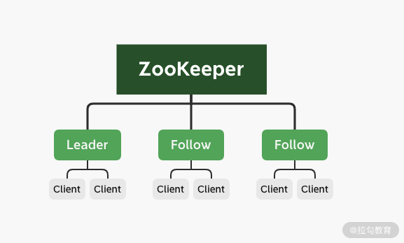
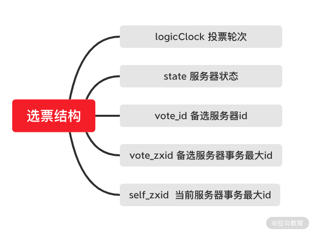
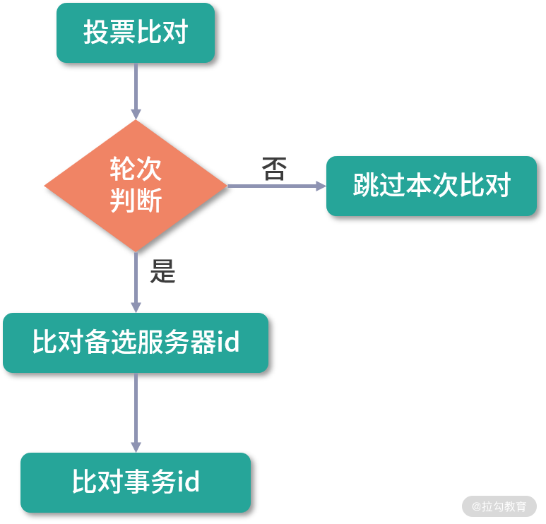
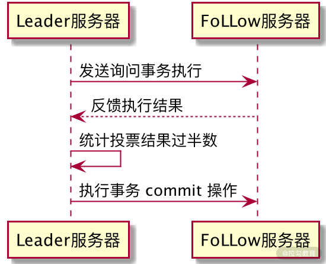

# 29 ZAB 协议算法：崩溃恢复和消息广播

在之前的课程中我们曾谈到当 Leader 节点发生崩溃的时候，在 ZooKeeper 集群中会重新选举出新的 Leader 节点服务器，以保证 ZooKeeper 集群的可用性。那么从 Leader 节点发生崩溃到重新恢复中间经历了哪些过程，又是采用什么算法恢复集群服务的？带着这些问题我们来学习本节课的内容。

### ZAB 协议算法

ZooKeeper 最核心的作用就是保证分布式系统的数据一致性，而无论是处理来自客户端的会话请求时，还是集群 Leader 节点发生重新选举时，都会产生数据不一致的情况。为了解决这个问题，ZooKeeper 采用了 ZAB 协议算法。

**ZAB 协议算法** （Zookeeper Atomic Broadcast ，Zookeeper 原子广播协议）是 ZooKeeper 专门设计用来解决集群最终一致性问题的算法，它的两个核心功能点是 **崩溃恢复** 和 **原子广播协议** 。

在整个 ZAB 协议的底层实现中，ZooKeeper 集群主要采用 **主从模式** 的系统架构方式来保证 ZooKeeper 集群系统的一致性。整个实现过程如下图所示，当接收到来自客户端的事务性会话请求后，系统集群采用主服务器来处理该条会话请求，经过主服务器处理的结果会通过网络发送给集群中其他从节点服务器进行数据同步操作。

以 ZooKeeper 集群为例，这个操作过程可以概括为：当 ZooKeeper 集群接收到来自客户端的事务性的会话请求后，集群中的其他 Follow 角色服务器会将该请求转发给 Leader 角色服务器进行处理。当 Leader 节点服务器在处理完该条会话请求后，会将结果通过操作日志的方式同步给集群中的 Follow 角色服务器。然后 Follow 角色服务器根据接收到的操作日志，在本地执行相关的数据处理操作，最终完成整个 ZooKeeper 集群对客户端会话的处理工作。

#### 崩溃恢复

在介绍完 ZAB 协议在架构层面的实现逻辑后，我们不难看出整个 ZooKeeper 集群处理客户端会话的核心点 **在一台 Leader 服务器上** 。所有的业务处理和数据同步操作都要靠 Leader 服务器完成。结合我们在“ 28 | 彻底掌握二阶段提交/三阶段提交算法原理” 中学习到的二阶段提交知识，会发现就目前介绍的 ZooKeeper 架构方式而言， **极易产生单点问题** ，即当集群中的 Leader 发生故障的时候，整个集群就会因为缺少 Leader 服务器而无法处理来自客户端的事务性的会话请求。因此，为了解决这个问题。在 ZAB 协议中也设置了处理该问题的崩溃恢复机制。

崩溃恢复机制是保证 ZooKeeper 集群服务高可用的关键。触发 ZooKeeper 集群执行崩溃恢复的事件是集群中的 Leader 节点服务器发生了异常而无法工作，于是 Follow 服务器会通过投票来决定是否选出新的 Leader 节点服务器。 **投票过程如下** ：当崩溃恢复机制开始的时候，整个 ZooKeeper 集群的每台 Follow 服务器会发起投票，并同步给集群中的其他 Follow 服务器。在接收到来自集群中的其他 Follow 服务器的投票信息后，集群中的每个 Follow 服务器都会与自身的投票信息进行对比，如果判断新的投票信息更合适，则采用新的投票信息作为自己的投票信息。在集群中的投票信息还没有达到超过半数原则的情况下，再进行新一轮的投票，最终当整个 ZooKeeper 集群中的 Follow 服务器超过半数投出的结果相同的时候，就会产生新的 Leader 服务器。

#### 选票结构

介绍完整个选举 Leader 节点的过程后，我们来看一下整个投票阶段中的投票信息具有怎样的结构。以 Fast Leader Election 选举的实现方式来讲，如下图所示，一个选票的整体结果可以分为一下六个部分：

- **logicClock** ：用来记录服务器的投票轮次。logicClock 会从 1 开始计数，每当该台服务经过一轮投票后，logicClock 的数值就会加 1 。
- **state** ：用来标记当前服务器的状态。在 ZooKeeper 集群中一台服务器具有 LOOKING、FOLLOWING、LEADERING、OBSERVING 这四种状态。
- **self_id** ：用来表示当前服务器的 ID 信息，该字段在 ZooKeeper 集群中主要用来作为服务器的身份标识符。
- **self_zxid** ： 当前服务器上所保存的数据的最大事务 ID ，从 0 开始计数。
- **vote_id** ：投票要被推举的服务器的唯一 ID 。
- **vote_zxid** ：被推举的服务器上所保存的数据的最大事务 ID ，从 0 开始计数。

当 ZooKeeper 集群需要重新选举出新的 Leader 服务器的时候，就会根据上面介绍的投票信息内容进行对比，以找出最适合的服务器。

#### 选票筛选

接下来我们再来看一下，当一台 Follow 服务器接收到网络中的其他 Follow 服务器的投票信息后，是如何进行对比来更新自己的投票信息的。Follow 服务器进行选票对比的过程，如下图所示。

首先，会对比 logicClock 服务器的投票轮次，当 logicClock 相同时，表明两张选票处于相同的投票阶段，并进入下一阶段，否则跳过。接下来再对比 vote_zxid 被选举的服务器 ID 信息，若接收到的外部投票信息中的 vote_zxid 字段较大，则将自己的票中的 vote_zxid 与 vote_myid 更新为收到的票中的 vote_zxid 与 vote_myid ，并广播出去。要是对比的结果相同，则继续对比 vote_myid 被选举服务器上所保存的最大事务 ID ，若外部投票的 vote_myid 比较大，则将自己的票中的 vote_myid 更新为收到的票中的 vote_myid 。 经过这些对比和替换后，最终该台 Follow 服务器会产生新的投票信息，并在下一轮的投票中发送到 ZooKeeper 集群中。

#### 消息广播

在 Leader 节点服务器处理请求后，需要通知集群中的其他角色服务器进行数据同步。ZooKeeper 集群采用消息广播的方式发送通知。

ZooKeeper 集群使用原子广播协议进行消息发送，该协议的底层实现过程与我们在“ 28 | 彻底掌握二阶段提交/三阶段提交算法原理” 的二阶段提交过程非常相似，如下图所示。

当要在集群中的其他角色服务器进行数据同步的时候，Leader 服务器将该操作过程封装成一个 Proposal 提交事务，并将其发送给集群中其他需要进行数据同步的服务器。当这些服务器接收到 Leader 服务器的数据同步事务后，会将该条事务能否在本地正常执行的结果反馈给 Leader 服务器，Leader 服务器在接收到其他 Follow 服务器的反馈信息后进行统计，判断是否在集群中执行本次事务操作。

这里请大家注意 ，与我们“ 28 | 彻底掌握二阶段提交/三阶段提交算法原理” 中提到的二阶段提交过程不同（即需要集群中所有服务器都反馈可以执行事务操作后，主服务器再次发送 commit 提交请求执行数据变更） ，ZAB 协议算法省去了中断的逻辑，当 ZooKeeper 集群中有超过一般的 Follow 服务器能够正常执行事务操作后，整个 ZooKeeper 集群就可以提交 Proposal 事务了。

### 总结

本节课我们主要介绍了 ZooKeeper 中的 ZAB 协议算法。 ZAB 协议算法能够保证 ZooKeeper 集群服务在处理事务性请求后的数据一致性 ，当集群中的 Leader 服务器发生崩溃的时候，ZAB 协议算法可以在 ZooKeeper 集群中重新选举 Leader 并进行数据的同步恢复。其中值得注意的是消息广播的底层实现过程虽然与二阶段提交非常相似，但是与二阶段提交相比，并没有事务丢弃的过程。在 ZooKeeper 集群的消息广播中，只要满足整个集群中超过半数的 Follow 服务器可以执行本次事务操作，Leader 就可以向集群中发送提交事务操作，最终完成数据的变更。
