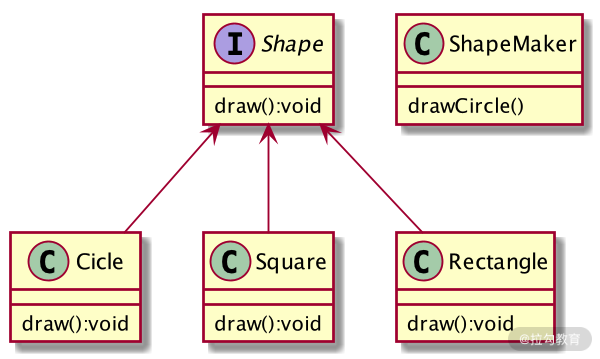
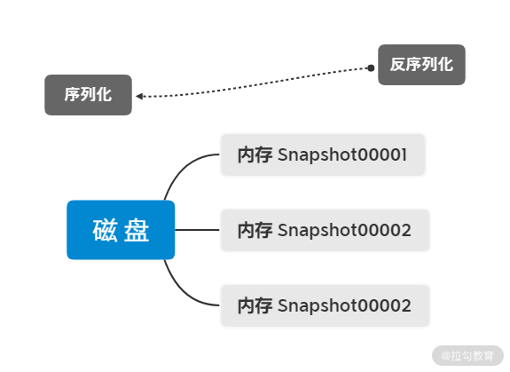

# 32 ZooKeeper 数据存储底层实现解析

在之前的“27 课| crontab 与 PurgeTxnLog：线上系统日志清理的最佳时间和方式”中，我们介绍了线上日志的清理方式，并讲解了 ZooKeeper 服务在运行的过程中产生的数据日志等文件。本节课我们将继续学习 ZooKeeper 文件存储和管理的相关知识，深入分析 ZooKeeper 文件系统的布局方式和不同文件的内部结构格式。

### 文件系统布局

无论是 ZooKeeper 服务在运行时候产生的数据日志，还是在集群中进行数据同步的时候所用到的数据快照，都可以被看作一种文件系统。而文件系统的两个功能就是对文件的存储和对不同文件格式的解析。ZooKeeper 中的数据存储，可以分为两种类型：数据日志文件和快照文件，接下来我们就分别介绍这两种文件的结构信息和底层实现。

### 数据日志

在 ZooKeeper 服务运行的过程中，数据日志是用来记录 ZooKeeper 服务运行状态的数据文件。通过这个文件我们不但能统计 ZooKeeper 服务的运行情况，更可以在 ZooKeeper 服务发生异常的情况下，根据日志文件记录的内容来进行分析，定位问题产生的原因并找到解决异常错误的方法。

如何找到日志文件呢？在 ZooKeeper 的 zoo.cfg 配置文件中的 dataLogDir 属性字段，所指定的文件地址就是当前 ZooKeeper 服务的日志文件的存储地址。

在了解了 ZooKeeper 服务在运行的过程中所产生的日志文件的存放位置，以及日志文件的格式结构后，接下来我们就深入到 ZooKeeper 服务的底层，来看一下它是如何实现日志的搜集以及存储的。

#### 搜集日志

我们先来看一下 ，ZooKeeper 是如何搜集程序的运行信息的。在统计操作情况的日志信息中，ZooKeeper 通过第三方开源日志服务框架 SLF4J 来实现的。

SLF4J 是一个 **采用门面设计模式（Facade）** 的日志框架。如下图所示，门面模式也叫作外观模式，采用这种设计模式的主要作用是，对外隐藏系统内部的复杂性，并向外部调用的客户端或程序提供统一的接口。门面模式通常以接口的方式实现，可以被程序中的方法引用。

在下图中，我们用门面模式创建了一个绘制几何图形的小功能。首先，定义了一个 Shape 接口类，并分别创建了三个类 Circle、Square、Rectangle ，以继承 Shape 接口。其次，我们再来创建一个画笔类 ShapeMaker ，在该类中我定义了 shape 形状字段以及绘画函数 drawCircle等。



之后，当我们在本地项目中需要调用实现的会话功能时，直接调用 ShapeMaker 类，并传入我们要绘制的图形信息，就可以实现图形的绘制功能了。它使用起来非常简单，不必关心其底层是如何实现绘制操作的，只要将我们需要绘制的图形信息传入到接口函数中即可。

而在 ZooKeeper 中使用 SLF4J 日志框架也同样简单，如下面的代码所示，首先在类中通过工厂函数创建日志工具类 LOG，然后在需要搜集的操作流程处引入日志搜集函数 LOG.info 即可。

```java
protected static final Logger LOG = LoggerFactory.getLogger(Learner.class);
LOG.info("Revalidating client: 0x" + Long.toHexString(clientId));
LOG.warn("Couldn't find the leader with id = "
        + current.getId());
```

#### 存储日志

接下来我们看一下搜集完的日志是什么样子的。在开头我们已经说过，系统日志的存放位置，在 zoo.cfg 文件中。假设我们的日志路径为dataDir=/var/lib/zookeeper，打开系统命令行，进入到该文件夹，就会看到如下图所示的样子，所有系统日志文件都放在了该文件夹下。


### 快照文件

除了上面介绍的记录系统操作日志的文件外，ZooKeeper 中另一种十分重要的文件数据是快照日志文件。快照日志文件主要用来存储 ZooKeeper 服务中的事务性操作日志，并通过数据快照文件实现集群之间服务器的数据同步功能。

#### 快照创建

接下来我们来介绍，在 ZooKeeper 的底层实现中，一个快照文件是如何创建的。

如下面的代码所示，在 ZooKeeper 的源码中定义了一个 SnapShot 接口类，在该接口中描述了 ZooKeeper 服务的相关属性和方法。其中 serialize 函数是用来将内存中的快照文件转存到本地磁盘中时的序列化操作。而 deserialize 的作用正好与其相反，是把快照文件从本地磁盘中加载到内存中时的反序列化操作。无论是序列化还是反序列化，整个快照所操作的数据对象是 ZooKeeper 数据模型，也就是由 Znode 组成的结构树。

```plaintext
public interface SnapShot {
  long deserialize(DataTree dt, Map<Long, Integer> sessions) 
    throws IOException;
    void serialize(DataTree dt, Map<Long, Integer> sessions,
               File name, boolean fsync)
    throws IOException;
    File findMostRecentSnapshot() throws IOException;
    void close() throws IOException;
}
```

#### 快照存储

创建完 ZooKeeper 服务的数据快照文件后，接下来就要对数据文件进行持久化的存储操作了。其实在整个 ZooKeeper 中，随着服务的不同阶段变化，数据快照存放文件的位置也随之变化。存储位置的变化，主要是内存和本地磁盘之间的转变。当 ZooKeeper 集群处理来自客户端的事务性的会话请求的时候，会首先在服务器内存中针对本次会话生成数据快照。当整个集群可以执行该条事务会话请求后，提交该请求操作，就会将数据快照持久化到本地磁盘中，如下图所示。



存储到本地磁盘中的数据快照文件，是经过 ZooKeeper 序列化后的二进制格式文件，通常我们无法直接查看，但如果想要查看，也可以通过 ZooKeeper 自带的 SnapshotFormatter 类来实现。如下图所示，在 SnapshotFormatter 类的内部用来查看快照文件的几种函数分别是： printDetails 函数，用来打印日志中的数据节点和 Session 会话信息；printZnodeDetails 函数，用来查看日志文件中节点的详细信息，包括节点 id 编码、state 状态信息、version 节点版本信息等。

```java
public class SnapshotFormatter {
  private void printDetails(DataTree dataTree, Map<Long, Integer> sessions) 
  private void printZnodeDetails(DataTree dataTree) 
  private void printZnode(DataTree dataTree, String name)
  private void printSessionDetails(DataTree dataTree, Map<Long, Integer> sessions) 
  private void printStat(StatPersisted stat)
  private void printHex(String prefix, long value) 
}
```

虽然 ZooKeeper 提供了 SnapshotFormatter 类，但其实现的查询功能比较单一，我们可以通过本节课的学习，按照自己的业务需求，编写自己的快照文件查看器。

到目前位置，我们对 ZooKeeper 服务相关的数据文件都做了讲解。无论是数据日志文件，还是数据快照文件，最终都会存储在本地磁盘中。而从文件的生成方式来看，两种日志文件的不同是：数据日志文件实施性更高，相对的产生的日志文件也不断变化，只要 ZooKeeper 服务一直运行，就会产生新的操作日志数据；而数据快照并非实时产生，它是当集群中数据发生变化后，先在内存中生成数据快照文件，经过序列化后再存储到本地磁盘中。

### 总结

本节课我们讲解了在 ZooKeeper 服务运行过程中所产生的两种主要数据文件：数据日志文件和数据快照文件的结构信息和底层实现，以便加强你对它们的理解。而数据日志文件如何监控并解决异常情况，数据快照文件如何实现数据同步等内容，我们在之前的课程中已经提到，希望你回顾之前的内容，并结合本节课的内容，对 ZooKeeper 的文件系统有更深的理解。
