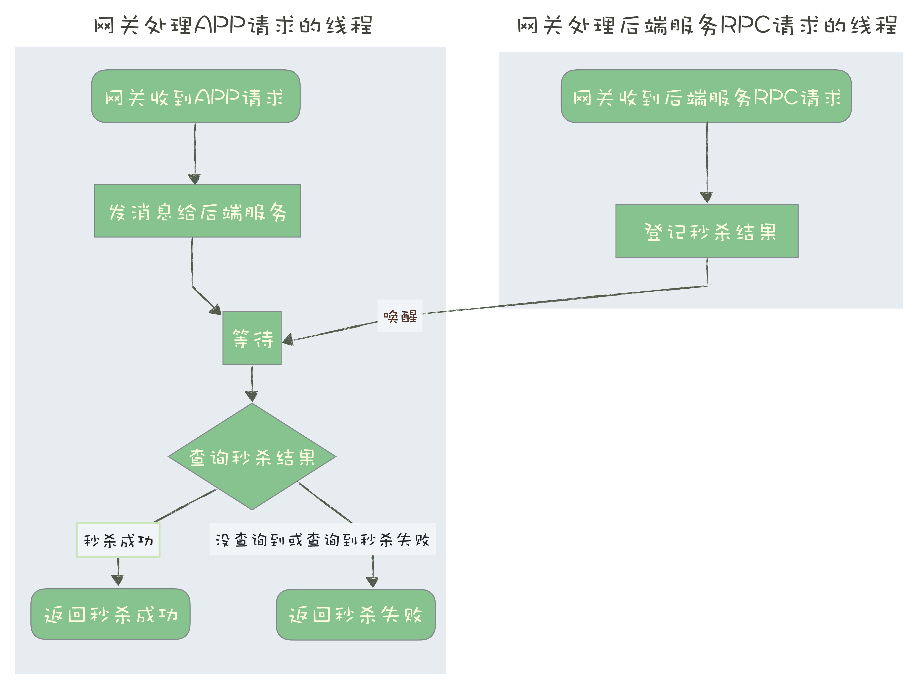
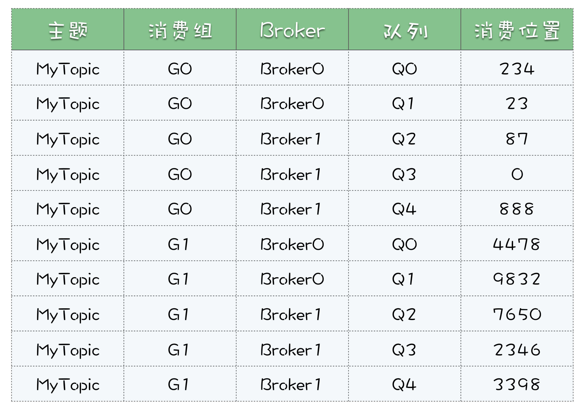

# 08 答疑解惑（一） 网关如何接收服务端的秒杀结果？

你好，我是李玥。

我们的“消息队列高手课”专栏自从上线到现在，同学们的学习热情和参与度都非常高。每一节课都有很多同学留言评论，这些留言里有总结知识分享收获的，有提出精彩问题的，还有给自己加油打气立 Flag 的，竟然还有说老师长得像黄渤的。我又仔细去看了一下配图，还是真挺像的。下次老师和极客时间的设计师小姐姐说一样，让她们照着吴彦祖来 P 图。

同学们每一条的留言我都认真看过，大部分留言我都给出了回复。在基础篇的最后一节课，我来统一解答一下大家都比较关注的一些问题。

## 1. 网关如何接收服务端的秒杀结果？

在《\[01 | 为什么需要消息队列？\]》这节课里面，我们举了一个秒杀的例子，这个例子是用来说明消息队列是如何来实现异步处理的。课后很多同学留言提问，网关在发送消息之后，是如何来接收后端服务的秒杀结果，又如何来给 APP 返回响应的呢？

在解答这个问题之前，我需要先说一下，实际生产环境中的秒杀系统，远比我们举的这个例子复杂得多，实现方案也是多种多样的，不是说一定要按照我们这个例子的方式来实现。

在这个例子中，网关接收后端服务秒杀结果，实现的方式也不只一种，这里我给大家提供一个比较简单的方案。

比如说，用 Java 语言来举例子：

```java
public class RequestHandler {
  // ID 生成器
  @Inject
  private IdGenerator idGenerator;
  // 消息队列生产者
  @Inject
  private Producer producer;
  // 保存秒杀结果的 Map
  @Inject
  private Map<Long, Result> results;
  // 保存 mutex 的 Map
  private Map<Long, Object> mutexes = new ConcurrentHashMap<>();
  // 这个网关实例的 ID
  @Inject
  private long myId;
  @Inject
  private long timeout;
  // 在这里处理 APP 的秒杀请求
  public Response onRequest(Request request) {
    // 获取一个进程内唯一的 UUID 作为请求 id
    Long uuid = idGenerator.next();
    try {
      Message msg = composeMsg(request, uuid, myId);
      // 生成一个 mutex，用于等待和通知
      Object mutex = new Object();
      mutexes.put(uuid, mutex)
      // 发消息
      producer.send(msg);
      // 等待后端处理
      synchronized(mutex) {
        mutex.wait(timeout);
      }
      // 查询秒杀结果
      Result result = results.remove(uuid);
      // 检查秒杀结果并返回响应
      if(null != result && result.success()){
        return Response.success();
      }
    } catch (Throwable ignored) {}
    finally {
      mutexes.remove(uuid);
    }
    // 返回秒杀失败
    return Response.fail();
  }
  // 在这里处理后端服务返回的秒杀结果
  public void onResult(Result result) {
    Object mutex = mutexes.get(result.uuid());
    if(null != mutex) { // 如果查询不到，说明已经超时了，丢弃 result 即可。
      // 登记秒杀结果
      results.put(result.uuid(), result);
      // 唤醒处理 APP 请求的线程
      synchronized(mutex) {
        mutex.notify();
      }
    }
  }
}
```

在这个方案中，网关在收到 APP 的秒杀请求后，直接给消息队列发消息。至于消息的内容，并不一定是 APP 请求的 Request，只要包含足够的字段就行了，比如用户 ID、设备 ID、请求时间等等。另外，还需要包含这个请求的 ID 和网关的 ID，这些后面我们会用到。

如果发送消息失败，可以直接给 APP 返回秒杀失败结果，成功发送消息之后，线程就阻塞等待秒杀结果。这里面不可能无限等待下去，需要设定一个等待的超时时间。

等待结束之后，去存放秒杀结果的 Map 中查询是否有返回的秒杀结果，如果有就构建 Response，给 APP 返回秒杀结果，如果没有，按秒杀失败处理。

这是处理 APP 请求的线程，接下来我们来看一下，网关如何来接收从后端秒杀服务返回的秒杀结果。

我们可以选择用 RPC 的方式来返回秒杀结果，这里网关节点是 RPC 服务端，后端服务为客户端。之前网关发出去的消息中包含了网关的 ID，后端服务可以通过这个网关 ID 来找到对应的网关实例，秒杀结果中需要包含请求 ID，这个请求 ID 也是从消息中获取的。

网关收到后端服务的秒杀结果之后，用请求 ID 为 Key，把这个结果保存到秒杀结果的 Map 中，然后通知对应的处理 APP 请求的线程，结束等待。我刚刚说过，处理 APP 请求的线程，在结束等待之后，会去秒杀的结果 Map 中查询这个结果，然后再给 APP 返回响应。

我把这个处理过程的流程图放在这里，便于你理解：

 这个解决方案还不是一个性能最优的方案，处理 APP 请求的线程需要同步等待秒杀结果。后面课程中我们会专门来讲，如何使用异步方式来提升程序的性能。

## 2. 详解 RocketMQ 和 Kafka 的消息模型

我在看《[03 | 消息模型：主题和队列有什么区别？](http://time.geekbang.org/column/article/110459)》这节课的留言时发现，不少同学对 RocketMQ 和 kafka 的消息模型理解的还不是很透彻，这两个消息队列产品的消息模型是一样的，我在这里，再把这个模型相关的概念，通过一个例子详细地说一说。

假设有一个主题 MyTopic，我们为主题创建 5 个队列，分布到 2 个 Broker 中。


先说消息生产这一端，假设我们有 3 个生产者实例：Produer0，Produer1 和 Producer2。

这 3 个生产者是如何对应到 2 个 Broker 的，又是如何对应到 5 个队列的呢？这个很简单， **不用对应，随便发** 。每个生产者可以在 5 个队列中轮询发送，也可以随机选一个队列发送，或者只往某个队列发送，这些都可以。比如 Producer0 要发 5 条消息，可以都发到队列 Q0 里面，也可以 5 个队列每个队列发一条。

然后说消费端，很多同学没有搞清楚消费组、消费者和队列这几个概念的对应关系。

每个消费组就是一份订阅，它要消费主题 MyTopic 下，所有队列的全部消息。注意，队列里的消息并不是消费掉就没有了，这里的“消费”，只是去队列里面读了消息，并没有删除，消费完这条消息还是在队列里面。

多个消费组在消费同一个主题时，消费组之间是互不影响的。比如我们有 2 个消费组：G0 和 G1。G0 消费了哪些消息，G1 是不知道的，也不用知道。G0 消费过的消息，G1 还可以消费。即使 G0 积压了很多消息，对 G1 来说也没有任何影响。

然后我们再说消费组的内部，一个消费组中可以包含多个消费者的实例。比如说消费组 G1，包含了 2 个消费者 C0 和 C1，那这 2 个消费者又是怎么和主题 MyTopic 的 5 个队列对应的呢？

由于消费确认机制的限制，这里面有一个原则是，在同一个消费组里面，每个队列只能被一个消费者实例占用。至于如何分配，这里面有很多策略，我就不展开说了。总之保证每个队列分配一个消费者就行了。比如，我们可以让消费者 C0 消费 Q0，Q1 和 Q2，C1 消费 Q3 和 Q4，如果 C0 宕机了，会触发重新分配，这时候 C1 同时消费全部 5 个队列。

再强调一下，队列占用只是针对消费组内部来说的，对于其他的消费组来说是没有影响的。比如队列 Q2 被消费组 G1 的消费者 C1 占用了，对于消费组 G2 来说，是完全没有影响的，G2 也可以分配它的消费者来占用和消费队列 Q2。

最后说一下消费位置，每个消费组内部维护自己的一组消费位置，每个队列对应一个消费位置。消费位置在服务端保存，并且， **消费位置和消费者是没有关系的** 。每个消费位置一般就是一个整数，记录这个消费组中，这个队列消费到哪个位置了，这个位置之前的消息都成功消费了，之后的消息都没有消费或者正在消费。

我把咱们这个例子的消费位置整理成下面的表格，便于你理解。



你可以看到，这个表格中并没有消费者这一列，也就是说消费者和消费位置是没有关系的。

## 3. 如何实现单个队列的并行消费？

下面说一下《[03 | 消息模型：主题和队列有什么区别？](http://time.geekbang.org/column/article/110459)》这节课的思考题：如果不要求严格顺序，如何实现单个队列的并行消费？关于这个问题，有很多的实现方式，在 JMQ（京东自研的消息队列产品）中，它实现的思路是这样的。

比如说，队列中当前有 10 条消息，对应的编号是 0-9，当前的消费位置是 5。同时来了三个消费者来拉消息，把编号为 5、6、7 的消息分别给三个消费者，每人一条。过了一段时间，三个消费成功的响应都回来了，这时候就可以把消费位置更新为 8 了，这样就实现并行消费。

这是理想的情况。还有可能编号为 6、7 的消息响应回来了，编号 5 的消息响应一直回不来，怎么办？这个位置 5 就是一个消息空洞。为了避免位置 5 把这个队列卡住，可以先把消费位置 5 这条消息，复制到一个特殊重试队列中，然后依然把消费位置更新为 8，继续消费。再有消费者来拉消息的时候，优先把重试队列中的那条消息给消费者就可以了。

这是并行消费的一种实现方式。需要注意的是，并行消费开销还是很大的，不应该作为一个常规的，提升消费并发的手段，如果消费慢需要增加消费者的并发数，还是需要扩容队列数。

## 4. 如何保证消息的严格顺序？

很多同学在留言中问，怎么来保证消息的严格顺序？我们多次提到过，主题层面是无法保证严格顺序的，只有在队列上才能保证消息的严格顺序。

如果说，你的业务必须要求全局严格顺序，就只能把消息队列数配置成 1，生产者和消费者也只能是一个实例，这样才能保证全局严格顺序。

大部分情况下，我们并不需要全局严格顺序，只要保证局部有序就可以满足要求了。比如，在传递账户流水记录的时候，只要保证每个账户的流水有序就可以了，不同账户之间的流水记录是不需要保证顺序的。

如果需要保证局部严格顺序，可以这样来实现。在发送端，我们使用账户 ID 作为 Key，采用一致性哈希算法计算出队列编号，指定队列来发送消息。一致性哈希算法可以保证，相同 Key 的消息总是发送到同一个队列上，这样可以保证相同 Key 的消息是严格有序的。如果不考虑队列扩容，也可以用队列数量取模的简单方法来计算队列编号。
