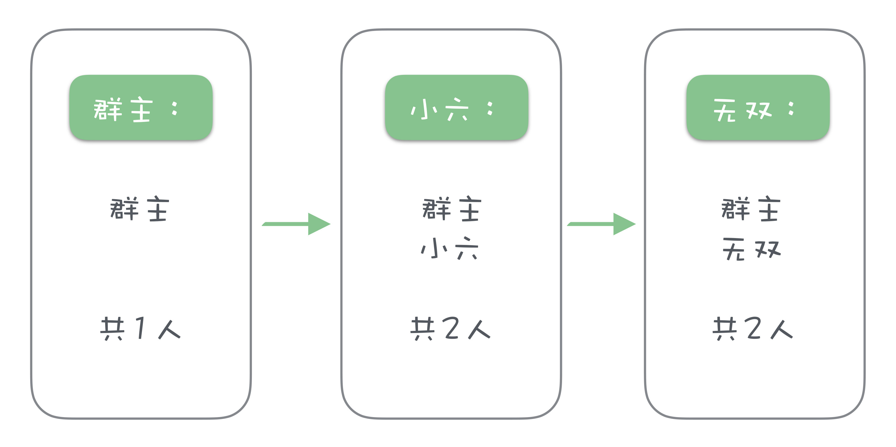

# 17 如何正确使用锁保护共享数据，协调异步线程？

你好，我是李玥。

在前几天的加餐文章中我讲到，JMQ 为了提升整个流程的处理性能，使用了一个“近乎无锁”的设计，这里面其实隐含着两个信息点。第一个是，在消息队列中，“锁”是一个必须要使用的技术。第二个是，使用锁其实会降低系统的性能。

那么，如何正确使用锁，又需要注意哪些事项呢？今天我们就来聊一聊这个问题。

我们知道，使用异步和并发的设计可以大幅提升程序的性能，但我们为此付出的代价是，程序比原来更加复杂了，多线程在并行执行的时候，带来了很多不确定性。特别是对于一些需要多个线程并发读写的共享数据，如果处理不好，很可能会产出不可预期的结果，这肯定不是我们想要的。

我给你举个例子来说明一下，大家应该都参与过微信群投票吧？比如，群主说：“今晚儿咱们聚餐，能来的都回消息报一下名，顺便统计一下人数。都按我这个格式来报名。”然后，群主发了一条消息：“群主，1 人”。

这时候小六和无双都要报名，过一会儿，他俩几乎同时各发了一条消息，“小六，2 人”“无双，2 人”，每个人发的消息都只统计了群主和他们自己，一共 2 人，而这时候，其实已经有 3 个人报名了，并且，在最后发消息的无双的名单中，小六的报名被覆盖了。



这就是一个非常典型的由于并发读写导致的数据错误。使用锁可以非常有效地解决这个问题。锁的原理是这样的： **任何时间都只能有一个线程持有锁，只有持有锁的线程才能访问被锁保护的资源。**

在上面微信群报名的例子中，如果说我们的微信群中有一把锁，想要报名的人必须先拿到锁，然后才能更新报名名单。这样，就避免了多个人同时更新消息，报名名单也就不会出错了。

## 避免滥用锁

那是不是遇到这种情况都要用锁解决呢？我分享一下我个人使用锁的第一条原则： **如果能不用锁，就不用锁；如果你不确定是不是应该用锁，那也不要用锁。** 为什么这么说呢？因为，虽然说使用锁可以保护共享资源，但是代价还是不小的。

第一，加锁和解锁过程都是需要 CPU 时间的，这是一个性能的损失。另外，使用锁就有可能导致线程等待锁，等待锁过程中线程是阻塞的状态，过多的锁等待会显著降低程序的性能。

第二，如果对锁使用不当，很容易造成死锁，导致整个程序“卡死”，这是非常严重的问题。本来多线程的程序就非常难于调试，如果再加上锁，出现并发问题或者死锁问题，你的程序将更加难调试。

所以，你在使用锁以前，一定要非常清楚明确地知道，这个问题必须要用一把锁来解决。切忌看到一个共享数据，也搞不清它在并发环境中会不会出现争用问题，就“为了保险，给它加个锁吧。” **千万不能有这种不负责任的想法，否则你将会付出惨痛的代价！** 我曾经遇到过的严重线上事故，其中有几次就是由于不当地使用锁导致的。

## **只有在并发环境中，共享资源不支持并发访问，或者说并发访问共享资源会导致系统错误的情况下，才需要使用锁。** 锁的用法

锁的用法一般是这样的：

1. 在访问共享资源之前，先获取锁。
1. 如果获取锁成功，就可以访问共享资源了。
1. 最后，需要释放锁，以便其他线程继续访问共享资源。

在 Java 语言中，使用锁的例子：

```java
private Lock lock = new ReentrantLock();
public void visitShareResWithLock() {
  lock.lock();
  try {
    // 在这里安全的访问共享资源
  } finally {
    lock.unlock();
  }
}
```

也可以使用 synchronized 关键字，它的效果和锁是一样的：

```java
private Object lock = new Object();
public void visitShareResWithLock() {
  synchronized (lock) {
    // 在这里安全的访问共享资源
  }
}
```

使用锁的时候，你需要注意几个问题：

第一个，也是最重要的问题就是， **使用完锁，一定要释放它** 。比较容易出现状况的地方是，很多语言都有异常机制，当抛出异常的时候，不再执行后面的代码。如果在访问共享资源时抛出异常，那后面释放锁的代码就不会被执行，这样，锁就一直无法释放，形成死锁。所以，你要考虑到代码可能走到的所有正常和异常的分支，确保所有情况下，锁都能被释放。

有些语言提供了 try-with 的机制，不需要显式地获取和释放锁，可以简化编程，有效避免这种问题，推荐你使用。

比如在 Python 中：

```python
lock = threading.RLock()
def visitShareResWithLock():
  with lock:
    # 注意缩进
    # 在这里安全的访问共享资源
  # 锁会在 with 代码段执行完成后自动释放
```

接下来我们说一下，使用锁的时候，遇到的最常见的问题：死锁。

## 如何避免死锁？

死锁是指，由于某种原因，锁一直没有释放，后续需要获取锁的线程都将处于等待锁的状态，这样程序就卡死了。

导致死锁的原因并不多，第一种原因就是我在刚刚讲的，获取了锁之后没有释放，有经验的程序员很少会犯这种错误，即使出现这种错误，也很容易通过查看代码找到 Bug。

还有一种是锁的重入问题，我们来看下面这段代码：

```java
public void visitShareResWithLock() {
  lock.lock(); // 获取锁
  try {
    lock.lock(); // 再次获取锁，会导致死锁吗？
  } finally {
    lock.unlock();
  }
```

在这段代码中，当前的线程获取到了锁 lock，然后在持有这把锁的情况下，再次去尝试获取这把锁，这样会导致死锁吗？

答案是，不一定。 **会不会死锁取决于，你获取的这把锁它是不是可重入锁。** 如果是可重入锁，那就没有问题，否则就会死锁。

大部分编程语言都提供了可重入锁，如果没有特别的要求，你要尽量使用可重入锁。有的同学可能会问，“既然已经获取到锁了，我干嘛还要再次获取同一把锁呢？”

其实，如果你的程序足够复杂，调用栈很深，很多情况下，当你需要获取一把锁的时候，你是不太好判断在 n 层调用之外的某个地方，是不是已经获取过这把锁了，这个时候，获取可重入锁就有意义了。

最后一种死锁的情况是最复杂的，也是最难解决的。如果你的程序中存在多把锁，就有可能出现这些锁互相锁住的情况。我们一起来看下面这段 Python 代码：

```python
import threading
def func1(lockA, lockB):
  while True:
    print("Thread1: Try to accquire lockA...")
    with lockA:
      print("Thread1: lockA accquired. Try to accquire lockB...")
      with lockB:
        print("Thread1: Both lockA and LockB accrquired.")
def func2(lockA, lockB):
  while True:
    print("Thread2: Try to accquire lockB...")
    with lockB:
      print("Thread2: lockB accquired. Try to accquire lockA...")
      with lockA:
        print("Thread2: Both lockA and LockB accrquired.")
if __name__ == '__main__':
  lockA = threading.RLock();
  lockB = threading.RLock()
  t1 = threading.Thread(target=func1, args=(lockA, lockB,))
  t2 = threading.Thread(target=func2, args=(lockA, lockB,))
  t1.start()
  t2.start()
```

这个代码模拟了一个最简单最典型的死锁情况。在这个程序里面，我们有两把锁：lockA 和 lockB，然后我们定义了两个线程，这两个线程反复地去获取这两把锁，然后释放。我们执行以下这段代码，看看会出现什么情况：

```plaintext
$ python3 DeadLock.py
Thread1: Try to accquire lockA...
Thread1: lockA accquired. Try to accquire lockB...
Thread1: Both lockA and LockB accrquired.
Thread1: Try to accquire lockA...
... ...
Thread1: Try to accquire lockA...
Thread2: Try to accquire lockB...
Thread1: lockA accquired. Try to accquire lockB...
Thread2: lockB accquired. Try to accquire lockA...
```

可以看到，程序执行一会儿就卡住了，发生了死锁。那死锁的原因是什么呢？请注意看代码，这两个线程，他们获取锁的顺序是不一样的。第一个线程，先获取 lockA，再获取 lockB，而第二个线程正好相反，先获取 lockB，再获取 lockA。

然后，你再看一下死锁前的最后两行日志，线程 1 持有了 lockA，现在尝试获取 lockB，而线程 2 持有了 lockB，尝试获取 lockA。你可以想一下这个场景，两个线程，各持有一把锁，都等着对方手里的另外一把锁，这样就僵持住了。

这是最简单的两把锁两个线程死锁的情况，我们还可以分析清楚，你想想如果你的程序中有十几把锁，几十处加锁解锁，几百的线程，如果出现死锁你还能分析清楚是什么情况吗？

关于避免死锁，我在这里给你几点建议。

1. 再次强调一下，避免滥用锁，程序里用的锁少，写出死锁 Bug 的几率自然就低。
1. 对于同一把锁，加锁和解锁必须要放在同一个方法中，这样一次加锁对应一次解锁，代码清晰简单，便于分析问题。
1. 尽量避免在持有一把锁的情况下，去获取另外一把锁，就是要尽量避免同时持有多把锁。
1. 如果需要持有多把锁，一定要注意加解锁的顺序，解锁的顺序要和加锁顺序相反。比如，获取三把锁的顺序是 A、B、C，释放锁的顺序必须是 C、B、A。
1. 给你程序中所有的锁排一个顺序，在所有需要加锁的地方，按照同样的顺序加解锁。比如我刚刚举的那个例子，如果两个线程都按照先获取 lockA 再获取 lockB 的顺序加锁，就不会产生死锁。

最后，你需要知道，即使你完全遵从我这些建议，我也无法完全保证你写出的程序就没有死锁，只能说，会降低一些犯错误的概率。

## 使用读写锁要兼顾性能和安全性

对于共享数据来说，如果说某个方法在访问它的时候，只是去读取，并不更新数据，那是不是就不需要加锁呢？还是需要的，因为如果一个线程读数据的同时，另外一个线程同时在更新数据，那么你读到的数据有可能是更新到一半的数据，这肯定是不符合预期的。所以，无论是只读访问，还是读写访问，都是需要加锁的。

如果给数据简单地加一把锁，虽然解决了安全性的问题，但是牺牲了性能，因为，那无论读还是写，都无法并发了，跟单线程的程序性能是一样。

实际上，如果没有线程在更新数据，那即使多个线程都在并发读，也是没有问题的。我在上节课跟你讲过，大部分情况下，数据的读写比是不均衡的，读要远远多于写，所以，我们希望的是：

- 读访问可以并发执行。
- 写的同时不能并发读，也不能并发写。

这样就兼顾了性能和安全性。读写锁就是为这一需求设计的。我们来看一下 Java 中提供的读写锁：

```java
ReadWriteLock rwlock = new ReentrantReadWriteLock();
public void read() {
  rwlock.readLock().lock();
  try {
    // 在这儿读取共享数据
  } finally {
    rwlock.readLock().unlock();
  }
}
public void write() {
  rwlock.writeLock().lock();
  try {
    // 在这儿更新共享数据
  } finally {
    rwlock.writeLock().unlock();
  }
}
```

在这段代码中，需要读数据的时候，我们获取读锁，获取到的读锁不是一个互斥锁，也就是说 read() 方法是可以多个线程并行执行的，这样使得读数据的性能依然很好。写数据的时候，我们获取写锁，当一个线程持有写锁的时候，其他线程既无法获取读锁，也不能获取写锁，达到保护共享数据的目的。

这样，使用读写锁就兼顾了性能和安全。

## 小结

锁可以保护共享资源，避免并发更新造成的数据错误。只有持有锁的线程才能访问被保护资源。线程在访问资源之前必须获取锁，访问完成后一定要记得释放锁。

一定不要滥用锁，否则容易导致死锁。死锁的原因，主要由于多个线程中多把锁相互争用导致的。一般来说，如果程序中使用的锁比较多，很难分析死锁的原因，所以需要尽量少的使用锁，并且保持程序的结构尽量简单、清晰。

最后，我们介绍了读写锁，在某些场景下，使用读写锁可以兼顾性能和安全性，是非常好的选择。
