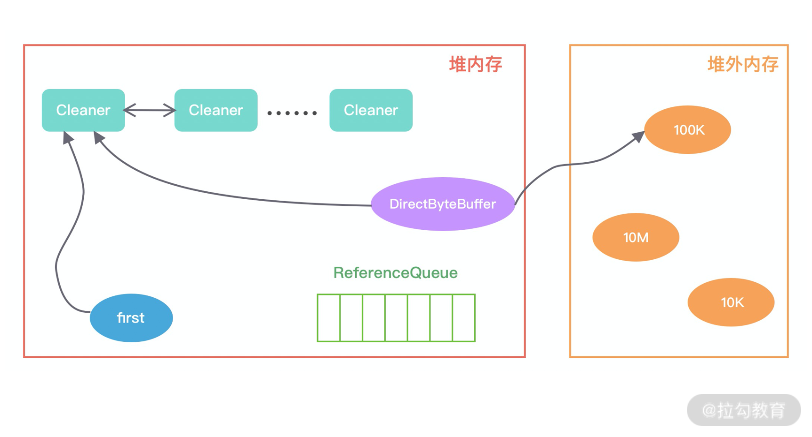

# 10 双刃剑：合理管理 Netty 堆外内存

本节课我们将进入 Netty 内存管理的课程学习，在此之前，我们需要了解 Java 堆外内存的基本知识，因为当你在使用 Netty 时，需要时刻与堆外内存打交道。我们经常看到各类堆外内存泄漏的排查案例，堆外内存使用不当会使得应用出错、崩溃的概率变大，所以在使用堆外内存时一定要慎重，本节课我将带你一起认识堆外内存，并探讨如何更好地使用它。

## 为什么需要堆外内存

在 Java 中对象都是在堆内分配的，通常我们说的 **JVM 内存** 也就指的 **堆内内存**，**堆内内存** 完全被 **JVM 虚拟机** 所管理， JVM 有自己的垃圾回收算法，对于使用者来说不必关心对象的内存如何回收。**堆外内存** 与堆内内存相对应，对于整个机器内存而言，除 **堆内内存以外部分即为堆外内存**，如下图所示。堆外内存不受 JVM 虚拟机管理，直接由操作系统管理。

{style="max-width:600px;width:100%"}

堆外内存和堆内内存各有利弊，这里我针对其中重要的几点进行说明。

1. 堆内内存由 JVM GC 自动回收内存，降低了 Java 用户的使用心智，但是 GC 是需要时间开销成本的，堆外内存由于不受 JVM 管理，所以在一定程度上可以降低 GC 对应用运行时带来的影响。
2. 堆外内存需要手动释放，这一点跟 C/C++ 很像，稍有不慎就会造成应用程序内存泄漏，当出现内存泄漏问题时排查起来会相对困难。
3. 当进行网络 I/O 操作、文件读写时，堆内内存都需要转换为堆外内存，然后再与底层设备进行交互，这一点在介绍 writeAndFlush 的工作原理中也有提到，所以直接使用堆外内存可以减少一次内存拷贝。
4. 堆外内存可以实现进程之间、 JVM 多实例之间的数据共享。

由此可以看出，如果你想实现高效的 I/O 操作、缓存常用的对象、降低 JVM GC 压力，堆外内存是一个非常不错的选择。

## 堆外内存的分配

Java 中堆外内存的分配方式有两种： **ByteBuffer#allocateDirect** 和 **Unsafe#allocateMemory** 。

首先我们介绍下 Java NIO 包中的 ByteBuffer 类的分配方式，使用方式如下：

```java
// 分配 10M 堆外内存
ByteBuffer buffer = ByteBuffer.allocateDirect(10 * 1024 * 1024); 
```

跟进 ByteBuffer.allocateDirect 源码，发现其中直接调用的 DirectByteBuffer 构造函数：

```java
DirectByteBuffer(int cap) {
    super(-1, 0, cap, cap);
    boolean pa = VM.isDirectMemoryPageAligned();
    int ps = Bits.pageSize();
    long size = Math.max(1L, (long)cap + (pa ? ps : 0));
    Bits.reserveMemory(size, cap);
    long base = 0;
    try {
        base = unsafe.allocateMemory(size);
    } catch (OutOfMemoryError x) {
        Bits.unreserveMemory(size, cap);
        throw x;
    }
    unsafe.setMemory(base, size, (byte) 0);
    if (pa && (base % ps != 0)) {
        address = base + ps - (base & (ps - 1));
    } else {
        address = base;
    }
    cleaner = Cleaner.create(this, new Deallocator(base, size, cap));
    att = null;
}
```

如下图所示，描述了 DirectByteBuffer 的内存引用情况，方便你更好地理解上述源码的初始化过程。在堆内存放的 DirectByteBuffer 对象并不大，仅仅包含堆外内存的地址、大小等属性，同时还会创建对应的 Cleaner 对象，通过 ByteBuffer 分配的堆外内存不需要手动回收，它可以被 JVM 自动回收。当堆内的 DirectByteBuffer 对象被 GC 回收时， Cleaner 就会用于回收对应的堆外内存。


从 DirectByteBuffer 的构造函数中可以看出，真正分配堆外内存的逻辑还是通过 unsafe.allocateMemory(size)，接下来我们一起认识下 Unsafe 这个神秘的工具类。

Unsafe 是一个非常不安全的类，它用于执行内存访问、分配、修改等 **敏感操作**，可以越过 JVM 限制的枷锁。 Unsafe 最初并不是为开发者设计的，使用它时虽然可以获取对底层资源的控制权，但也失去了安全性的保证，所以使用 Unsafe 一定要慎重。 Netty 中依赖了 Unsafe 工具类，是因为 Netty 需要与底层 Socket 进行交互， Unsafe 在提升 Netty 的性能方面起到了一定的帮助。

在 Java 中是不能直接使用 Unsafe 的，但是我们可以通过反射获取 Unsafe 实例，使用方式如下所示。

```java
private static Unsafe unsafe = null;
static {
    try {
        Field getUnsafe = Unsafe.class.getDeclaredField("theUnsafe");
        getUnsafe.setAccessible(true);
        unsafe = (Unsafe) getUnsafe.get(null);
    } catch (NoSuchFieldException | IllegalAccessException e) {
        e.printStackTrace();
    }
}
```

获得 Unsafe 实例后，我们可以通过 allocateMemory 方法分配堆外内存， allocateMemory 方法返回的是内存地址，使用方法如下所示：

```java
// 分配 10M 堆外内存
long address = unsafe.allocateMemory(10 * 1024 * 1024);
```

与 DirectByteBuffer 不同的是， Unsafe#allocateMemory 所分配的内存必须自己手动释放，否则会造成内存泄漏，这也是 Unsafe 不安全的体现。 Unsafe 同样提供了内存释放的操作：

```java
unsafe.freeMemory(address);
```

到目前为止，我们了解了堆外内存分配的两种方式，对于 Java 开发者而言，常用的是 ByteBuffer.allocateDirect 分配方式，我们平时常说的堆外内存泄漏都与该分配方式有关，接下来我们一起看看使用 ByteBuffer 分配的堆外内存如何被 JVM 回收，这对我们排查堆外内存泄漏问题有较大的帮助。

## 堆外内存的回收

我们试想这么一种场景，因为 DirectByteBuffer 对象有可能长时间存在于堆内内存，所以它很可能晋升到 JVM 的老年代，所以这时候 DirectByteBuffer 对象的回收需要依赖 Old GC 或者 Full GC 才能触发清理。如果长时间没有 Old GC 或者 Full GC 执行，那么堆外内存即使不再使用，也会一直在占用内存不释放，很容易将机器的物理内存耗尽，这是相当危险的。

那么在使用 DirectByteBuffer 时我们如何避免物理内存被耗尽呢？因为 JVM 并不知道堆外内存是不是已经不足了，所以我们最好通过 JVM 参数 -XX:MaxDirectMemorySize 指定堆外内存的上限大小，当堆外内存的大小超过该阈值时，就会触发一次 Full GC 进行清理回收，如果在 Full GC 之后还是无法满足堆外内存的分配，那么程序将会抛出 OOM 异常。

此外在 ByteBuffer.allocateDirect 分配的过程中，如果没有足够的空间分配堆外内存，在 Bits.reserveMemory 方法中也会主动调用 System.gc() 强制执行 Full GC，但是在生产环境一般都是设置了 -XX:+DisableExplicitGC， System.gc() 是不起作用的，所以依赖 System.gc() 并不是一个好办法。

通过前面堆外内存分配方式的介绍，我们知道 DirectByteBuffer 在初始化时会创建一个 Cleaner 对象，它会负责堆外内存的回收工作，那么 Cleaner 是如何与 GC 关联起来的呢？

Java 对象有四种引用方式：强引用 StrongReference、软引用 SoftReference、弱引用 WeakReference 和虚引用 PhantomReference。其中 PhantomReference 是最不常用的一种引用方式， Cleaner 就属于 PhantomReference 的子类，如以下源码所示， PhantomReference 不能被单独使用，需要与引用队列 ReferenceQueue 联合使用。

```java
public class Cleaner extends java.lang.ref.PhantomReference<java.lang.Object> {
    private static final java.lang.ref.ReferenceQueue<java.lang.Object> dummyQueue;
    private static sun.misc.Cleaner first;
    private sun.misc.Cleaner next;
    private sun.misc.Cleaner prev;
    private final java.lang.Runnable thunk;
    public void clean() {}
}
```

首先我们看下，当初始化堆外内存时，内存中的对象引用情况如下图所示， first 是 Cleaner 类中的静态变量， Cleaner 对象在初始化时会加入 Cleaner 链表中。 DirectByteBuffer 对象包含堆外内存的地址、大小以及 Cleaner 对象的引用， ReferenceQueue 用于保存需要回收的 Cleaner 对象。



当发生 GC 时， DirectByteBuffer 对象被回收，内存中的对象引用情况发生了如下变化：


此时 Cleaner 对象不再有任何引用关系，在下一次 GC 时，该 Cleaner 对象将被添加到 ReferenceQueue 中，并执行 clean() 方法。 clean() 方法主要做两件事情：

1. 将 Cleaner 对象从 Cleaner 链表中移除；
2. 调用 unsafe.freeMemory 方法清理堆外内存。

至此，堆外内存的回收已经介绍完了，下次再排查内存泄漏问题的时候先回顾下这些最基本的知识，做到心中有数。

## 总结

堆外内存是一把双刃剑，在网络 I/O、文件读写、分布式缓存等领域使用堆外内存都更加简单、高效，此外使用堆外内存不受 JVM 约束，可以避免 JVM GC 的压力，降低对业务应用的影响。当然天下没有免费的午餐，堆外内存也不能滥用，使用堆外内存你就需要关注内存回收问题，虽然 JVM 在一定程度上帮助我们实现了堆外内存的自动回收，但我们仍然需要培养类似 C/C++ 的分配 / 回收的意识，出现内存泄漏问题能够知道如何分析和处理。
