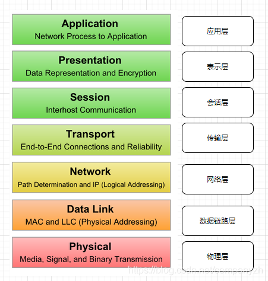
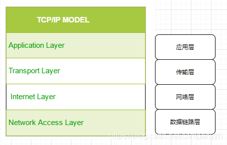

# 01 我应该站在谁的肩膀上 - OSI vs TCPIP模型

相信很多人即使没吃过猪肉也看过猪跑（不知道谁说的老话，我要是猪肉都吃不起，去哪里看猪跑)。Anyway，我相信你即使不知道OSI 模型的详细内容，但你一定听过OSI 7层协议（可能不知道是哪7层）和TCP/IP 4层协议。

你一定会很疑惑，既生瑜何生亮，为什么有了OSI，还需要TCP/IP协议。那我们先来看一下什么是OSI网络模型？什么是TCP/IP模型？以及这两种模型的比较。

## 什么是OSI网络模型？

OSI英文全称叫做(Open System Interconnection Model). 中文全称叫做开放式系统互联模型. 也叫做网络7层模型，从下到上依次为，物理层，数据链路层，网络层，传输层，会话层，表示层，应用层。

## 什么是TCP/IP网络模型？

TCP/IP 模型和OSI相比会简单一点，只有四层，分别为数据链路层，网络层，传输层和应用层。

## 什么是协议？

网络协议是一组确定的规则，这些规则确定如何在同一网络中的不同设备之间传输数据。本质上，它允许连接的设备彼此通信，而不管其内部过程，结构或设计是否有差异。（两个端点都需要了解协议才能进行交流）。

OSI和TCP/IP协议各有各的优点和缺点，我们先来看一下他们的共同点。

### 分层结构

他们都是基于分层的结构。那什么是分层以及分层的好处是什么呢？

- 将任务分为子任务，独立解决每个子任务
- 建立定义明确的界面层，使移植更容易
- 代码重用
- 可扩展性
- 标准化接口

我们来举一个例子来让你可以更好的理解这个模型。你或者你女朋友最喜欢的一句话。“xxx，你的快递到了”。那快递是怎么从义乌到你手上呢？我们就从你看上了某件商品之后开始。

1. 你点击购买
1. 消息发到商家的账户-知道有一个顾客要购买某一件商品
1. 商品被商家放到快递箱子里，箱子上面贴上你的地址
1. 顺丰小哥加上一些信息，扫一下barcode
1. 当地办公室的司机把快递送上飞机然后送到转运站
1. 从转运站再转到下一个离你最近的送货站
1. 最后送到你的手上

你应该可以发现，每一步都是一层，可以详细的分成比如卡车运送层，商品层，地址层等等。希望这个例子可以对你的理解有所帮助。 PS: 你在做系统设计的时候，需要不需要考虑分层，自己仔细想一想好处和坏处。

那我们下面来看一下两种模型的优缺点

### 首先迎面走来的是OSI模型

### OSI 的7层模型

我们上面也说过了从上到下是

- 7-应用层 -> 网络流程应用（表示的是用户界面，例如Telnet，HTTP）
- 6-表示层 -> 数据表示 (数据如何呈现，特殊处理->例如加密，比如ASCII，JPEG）
- 5-会话层 -> 主机间的通信（将不同应用程序的数据分开。建立，管理和终止应用之间的会话）
- 4-传输层 -> 端到端连接（可靠或不可靠的传递，例如TCP，UDP)
- 3-网络层 -> 地址和最佳路径（提供路由器用于路径的逻辑寻址，比如IP）
- 2-数据链路层 -> 媒体访问（将位组合成字节，将字节组合成帧，使用MAC地址访问，错误检测-比如HDLC）
- 1-物理层 -> 二进制传输（在设备之间移动bits。例如V.35）

一般来说把5-7层叫做上层，1-4层叫做下层。

让我再来稍微掰开的讲解一点。

- 应用层 - OSI模型的应用程序层直接与软件应用程序交互以提供所需的通信功能，并且它与最终用户最接近。应用层的功能通常包括验证通信伙伴和资源的可用性以支持任何数据传输。该层还定义了用于最终应用程序的协议，例如域名系统（DNS），文件传输协议（FTP），超文本传输协议（HTTP），Internet消息访问协议（IMAP），邮局协议（POP），简单邮件传输协议（SMTP），简单网络管理协议（SNMP）和Telnet（终端仿真）。你会发现这些都是有页面让你可以来操作的。应用层指的就是最高层。
- 表示层 - 表示层检查数据以确保它与通信资源兼容。它将数据转换为应用程序级别和较低级别接受的形式。第六层还可以处理任何所需的数据格式或代码转换，例如将扩展二进制编码的十进制交换码（EBCDIC）编码的文本文件转换为美国信息交换标准码（ASCII）编码的文本文件。它也可用于数据压缩和加密。例如，视频呼叫将在传输过程中被压缩，以便可以更快地传输，并且数据将在接收方恢复。对于具有较高安全性要求的数据（例如包含你的密码的短信），将在此层进行加密。这一层你可以只是读一下，不需要了解很多。
- 会话层 - 会话层控制计算机之间的对话（连接）。它建立，管理，维护并最终终止本地和远程应用程序之间的连接。第5层软件还处理身份验证和授权功能。它也验证数据是否已交付。会话层通常在使用远程过程调用的应用程序环境中明确实现。同理，这一层你也不需要了解很多。
- 传输层 - 传输层提供通过一个或多个网络将数据序列从源传输到目标主机的功能和手段，同时保持服务质量（QoS）功能并确保数据的完整传递。可以通过纠错和类似的功能来保证数据的完整性。它还可以提供显式的流量控制功能。尽管不严格符合OSI模型，但TCP和用户数据报协议（UDP）是第4层中必不可少的协议。这一层是你必须要深入了解的。后面会有详细的讲解。
- 网络层 - 网络层通过逻辑寻址和交换功能处理数据包路由。网络是可以连接许多节点的介质。每个节点都有一个地址。当一个节点需要将消息传输到其他节点时，它仅能提供消息的内容和目标节点的地址，则网络将找到将消息传递到目标节点的方法，并可能通过其他节点进行路由。如果消息太长，网络可能会在一个节点上将其拆分为多个段，分别发送它们，然后在另一节点上重新组合片段。网络层也是后面的重点。
- 数据链路层 - 数据链路层提供节点到节点的传输，即两个直接连接的节点之间的链接。它以帧的形式处理数据的打包和拆包。它定义了在两个物理连接的设备之间建立和终止连接的协议，例如点对点协议（PPP）。数据链路层通常分为两个子层：媒体访问控制（MAC）层和逻辑链路控制（LLC）层。 MAC层负责控制网络中的设备如何访问媒体以及允许传输数据。 LLC层负责标识和封装网络层协议，并控制错误检查和帧同步。 这一层只需要基本掌握MAC，不需要知道更多。
- 物理层 - 物理层定义了数据连接的物理规格。例如，连接器的插针布局，电缆的工作电压，光纤电缆规格以及无线设备的频率。它负责物理介质中非结构化原始数据的发送和接收。比特率控制在物理层完成。它是底层网络设备的层，从不关心协议或其他更高层的项目。这层你基本不用了解，除非你需要自己制作网线（我可是自己做过哦）。

### 那每一层怎么找到地址呢？

- 物理层 - 不需要地址
- 数据链路层 - 地址必须能够选择网络上的任何主机（MAC）
- 网络层 - 地址必须能够提供信息以启用路由（IP)
- 传输层 - 地址必须标识目标过程（PORT） 这些地址的信息都包含在每一层的头文件里，我们后面会详细讲。

### 优点

1. 它可以帮助你标准化路由器，交换机，主板和其他硬件。就是说不管哪一家生产的硬件都可以互用，比如CISCO。
1. 降低复杂性并使接口标准化
1. 促进模块化工程
1. 当技术发生变化时，可以用新协议替换老协议
1. 提供面向连接的服务以及无连接服务的支持
1. 它是计算机网络中的标准模型
1. 支持无连接和面向连接的服务
1. 它提供了适应各种协议的灵活性

### 缺点

1. 协议的适配是一项繁琐的任务
1. 你只能将其用作参考模型
1. 它没有定义任何特定的协议
1. 在OSI网络层模型中，某些服务在许多层中都是重复的，例如传输层和数据链路层
1. 各层不能并行工作，因为每一层都需要等待从上一层获取数据

## 紧跟其后的这个年轻活力的小伙就是TCP/IP 协议

### TCP/IP的4层模型

- 4-应用层 -> 对应于OSI的5-7层
- 3-传输层 -> 这个是和OSI的第四层想同的
- 2-网络层 -> 这个是和OSI的第3网络层对应的
- 1-网络访问层 -> 这个是和OSI的第1-2层所对应的

让我再来把TCP/IP也掰开一点

- 应用层 - TCP / IP模型的应用程序层使应用程序能够访问其他层的服务，并定义了应用程序用来交换数据的协议。最广为人知的应用层协议包括HTTP，FTP，SMTP，Telnet，DNS，SNMP和路由信息协议（RIP）。重中之重
- 传输层 - 传输层负责为应用程序层提供会话和数据通信服务。该层的核心协议是TCP和UDP。 TCP提供一对一，面向连接的可靠通信服务。它负责对发送的数据包进行排序和确认，并恢复传输中丢失的数据包。 UDP提供一对一或一对多的无连接，不可靠的通信服务。当要传输的数据量较小时（例如，该数据可以放入单个数据包中），通常使用UDP。
- 网络层 - 网络层负责主机寻址，打包和路由功能。 网络层的核心协议是IP，地址解析协议（ARP），Internet控制消息协议（ICMP）和Internet组管理协议（IGMP）。 IP是可路由协议，负责IP寻址，路由以及数据包的分段和重组。 ARP负责发现网络访问层地址，例如与给定Internet层访问关联的硬件地址。由于IP数据包传递失败，ICMP负责提供诊断功能并报告错误。 IGMP负责IP多播组的管理。 IP在此层中将标头添加到数据包中，称为IP地址。现在既有IPv4（32位）地址又有IP Ipv6（128位）地址。
- 网络访问层 - 网络访问层（或链路层）负责将TCP / IP数据包放在网络介质上，并从网络介质上接收TCP / IP数据包。 TCP / IP被设计为独立于网络访问方法，帧格式和介质。换句话说，它独立于任何特定的网络技术。这样，TCP / IP可以用于连接不同的网络类型，例如以太网，令牌环，X.25，帧中继和异步传输模式（ATM）。

### 优点

1. 它可以帮助您在不同类型的计算机之间建立连接
1. 它独立于操作系统运行
1. 它支持许多路由协议
1. 它使组织之间的互联互通成为可能
1. TCP/IP模型具有高度可扩展的客户端-服务器体系结构
1. 它可以独立操作
1. 支持多种路由协议

### 缺点

1. TCP/IP是设置和管理起来更加复杂。
1. TCP/IP的浅层/开销高于IPX（Internet分组交换）
1. 传输层模型不能保证包的传递。
1. 在TCP/IP中替换协议并不容易。
1. 服务，接口和协议没有明确的分离

## 总结

以上说了很多东西，是不是感觉很高深，你暂时不需要了解所有，当然也不可能要求你一下就明白所有。其实一句话来说两者的区别，那就是一个是理论的模型，一个是现实被做成了商品。

你需要记住以上的区别吗，我个人认为，大概读一遍就好，不需要背诵。不像上学时一样，让你背诵全文。即使是网络工程师也不会要求。并且我们以后会详细讲解每一层的功能。最后附上一个经典的图片，忘了是从哪里下载的，但是绝不是我自己的原创。如果知道的麻烦告知，我会把credit还给作者，你可以参考以下的这个图片。 好，这一小节就到这里。感谢你的学习。我们一起来开启这段神奇的旅程。

