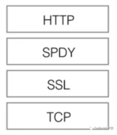

# 18 我都这么成功了，你却说我不行 - HTTP 的特点和缺点

上一小节我们做了这个关于HTTP的介绍。那我们今天来看一下, 到底HTTP有什么缺点, 我们必须要把这个功不可没的元老换掉呢。

### 队头阻塞(Head-of-line blocking)

你想这么一个场景呀。客户发了Data1，回复收到，然后发了Data2, 但是丢了, 客户端这边不会等呀, 继续发Data3，但是server这边收到了Data3，却没有Data2，就苦苦的等呀等。直到收到了Data2，发ack2给客户端, 才会继续。所以在server这边，这个就会增加时间。也就是不能给他的应用层发送任何消息，直到排好序。请求好像瀑布模式，之前的请求会阻拦后面的请求。

HTTP1.1还记得吗，在持久连接的基础上，进一步地支持在持久连接上使用管道化(pipelining)特性。管道化允许客户端在已发送的请求收到服务端的响应之前发送下一个请求，借此来减少等待时间提高吞吐。如果多个请求能在同一个TCP请求发送的话，还能提高网络利用率。但是因为HTTP管道化本身可能会导致队头阻塞的问题，以及一些其他的原因，现代浏览器默认都关闭了管道化。

### 流量控制 Flow control

另一个TCP影响HTTP的问题是Flow control也就是流量控制，用于处理拥塞。如果有两台挨着的电脑连接100m的网，可以开始传送100m来回，没有任何问题。如果这个服务器不能处理100m就要降到50m，但是如果提前知道，这个也没问题，我们可以设置成50m。但是现实世界是，我们没有两个互联的电脑对吧。成千上万的电脑，路由，交换器以及各种机器。每一个机器都有他自己的限制。如果一开始设置一个特别高的速率的话，会造成拥挤, 阻塞网络。如果速率低的话，又会没有效率，TCP处理的方法就是流量控制flow control（就是我们TCP章节讲解的拥塞机制），意思就是可以根据网络的反应来不断的条件传输速率，TCP的实现方法是慢启动, 选一个很小的window size，然后增加。如果开始产生不良反应，降低。这个慢启动会影响所有TCP连接和每一个http请求。所以TCP为了保证可靠并且能够处理拥塞。TCP给HTTP带来了一系列的影响也就是延迟。终于我们的主角HTTP2该出来拯救世界了? 还没有. 主角上场之前, 都会有很多其他的小罗罗对吧。

SPDY就是这样一个产物

### SPYD

2012年Google如一声惊雷一样提出了SPDY的方案，优化了HTTP1.X的请求延迟，解决了HTTP1.X的安全性，具体如下：

1. 降低延迟，针对HTTP高延迟的问题，SPDY优雅的采取了多路复用(multiplexing)。多路复用通过多个请求stream共享一个TCP连接的方式，解决了HOL blocking的问题，降低了延迟同时提高了带宽的利用率。
1. 请求优先级（request prioritization)。多路复用带来一个新的问题是，在连接共享的基础之上有可能会导致关键请求被阻塞。SPDY允许给每个request设置优先级，这样重要的请求就会优先得到响应。比如浏览器加载首页，首页的html内容应该优先展示，之后才是各种静态资源文件，脚本文件等加载，这样可以保证用户能第一时间看到网页内容。
1. Header压缩。前面提到HTTP1.x的header很多时候都是重复多余的。选择合适的压缩算法可以减小包的大小和数量。
1. 基于HTTPS的加密协议传输，大大提高了传输数据的可靠性。
1. 服务端推送(server push)，采用了SPDY的网页，例如我的网页有一个sytle.css的请求，在客户端收到sytle.css数据的同时，服务端会将sytle.js的文件推送给客户端，当客户端再次尝试获取sytle.js时就可以直接从缓存中获取到，不用再发请求了。

SPDY构成图

但是大佬们能让你Google独大吗, 于是基于SPDY发表了升级版也就是我们的HTTP2。 HTTP2.0和SPDY的区别

- HTTP2.0 支持明文HTTP传输，而SPDY强制使用HTTPS
- HTTP2.0 消息头的压缩算法采用HPACK而非SPDY采用的DEFLATE - <http://zh.wikipedia.org/wiki/DEFLATE%E3%80%82>

Http2是一个二进制协议。二进制肯定比这个文本要好传输呀。它呢保持Http1.1里面的所有语义，比如Http1.x里面定义的所有头文件，资源等等。所有的工作都是用来解决Http1的缺点。如果通俗的讲，Http2是关于什么的？, 它是关于performance的。

下面说一个小的知识点呀

你知道SPDY，这个是google自己研发的解决http1.x的效率问题的协议对不对。后来Http2就出来了，Google就放弃使用SPDY了，是一个类似但是不一样的协议呀，现在这个协议已经不用了，Chrome在2016年就已经不用了。http2是15年正式发布的。

从上图，你可以查看浏览器的哪个版本支持HTTP2。你仔细看一下，基本已经都支持了，很多网站也都声称实现了Http2。

### HTTP2

我们来深入看一下Http2。

Http1.1中，使用明文发送请求，拿到回复

HTTP2中可以看出，使用的是二进制，但是内容必须和http1.1包含的内容是一样的，Verb(请求方法,知道有几种吗？9种，分别是GET，HEAD，POST，PUT，DELETE，CONNECT，OPTIONS，TRACE，PATCH)，Resource（资源）以及其他的头文件等等。同样回复中也包含相同的内容，唯一的区别就是从明文变成了二进制。Http2和http1.1是不兼容的。但是我们需要Http2可以在现在的www的架构上运行，我们不可能把几十年创建的架构, 网络全部重建。如果Http2不能在现有的url上工作，那就是一场噩梦呀。所以这就是Http2必须能在http1的基础上工作。

为了在Http2使用明文, 客户端需要发一个升级请求包含在头信息-> h2c。如果服务器支持http2，它会返回101表示换协议。返回信息，升级h2c。如果服务器不支持连接升级，会返回200或者404的状态码。

Frame(桢) 是HTTP2.0 通信的最小单位，每个帧包含帧首部，至少也会标识出当前帧所属的流。

流->已建立的连接上的双向字节流。

• 消息-> 与逻辑消息对应的完整的一系列数据帧。
