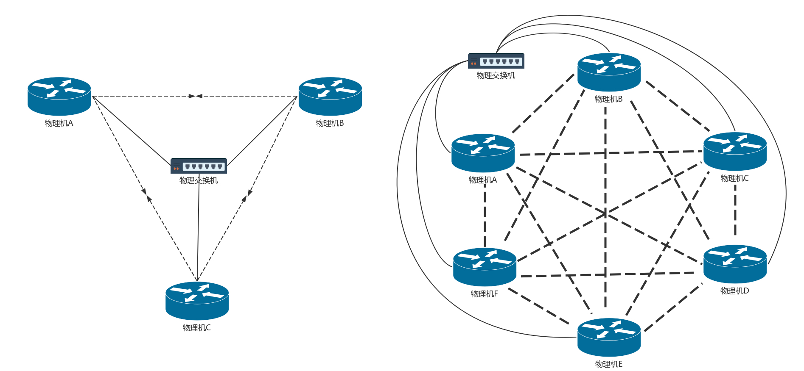

# 31 讲容器网络之Calico：为高效说出善意的谎言

上一节我们讲了Flannel如何解决容器跨主机互通的问题，这个解决方式其实和虚拟机的网络互通模式是差不多的，都是通过隧道。但是Flannel有一个非常好的模式，就是给不同的物理机设置不同网段，这一点和虚拟机的Overlay的模式完全不一样。

在虚拟机的场景下，整个网段在所有的物理机之间都是可以“飘来飘去”的。网段不同，就给了我们做路由策略的可能。

## Calico网络模型的设计思路

我们看图中的两台物理机。它们的物理网卡是同一个二层网络里面的。由于两台物理机的容器网段不同，我们完全可以将两台物理机配置成为路由器，并按照容器的网段配置路由表。


例如，在物理机A中，我们可以这样配置：要想访问网段172.17.9.0/24，下一跳是192.168.100.101，也即到物理机B上去。

这样在容器A中访问容器B，当包到达物理机A的时候，就能够匹配到这条路由规则，并将包发给下一跳的路由器，也即发给物理机B。在物理机B上也有路由规则，要访问172.17.9.0/24，从docker0的网卡进去即可。

当容器B返回结果的时候，在物理机B上，可以做类似的配置：要想访问网段172.17.8.0/24，下一跳是192.168.100.100，也即到物理机A上去。

当包到达物理机B的时候，能够匹配到这条路由规则，将包发给下一跳的路由器，也即发给物理机A。在物理机A上也有路由规则，要访问172.17.8.0/24，从docker0的网卡进去即可。

这就是 **Calico网络的大概思路** ， **即不走Overlay网络，不引入另外的网络性能损耗，而是将转发全部用三层网络的路由转发来实现** ，只不过具体的实现和上面的过程稍有区别。

首先，如果全部走三层的路由规则，没必要每台机器都用一个docker0，从而浪费了一个IP地址，而是可以直接用路由转发到veth pair在物理机这一端的网卡。同样，在容器内，路由规则也可以这样设定：把容器外面的veth pair网卡算作默认网关，下一跳就是外面的物理机。

于是，整个拓扑结构就变成了这个图中的样子。


## Calico网络的转发细节

我们来看其中的一些细节。

容器A1的IP地址为172.17.8.2/32，这里注意，不是/24，而是/32，将容器A1作为一个单点的局域网了。

容器A1里面的默认路由，Calico配置得比较有技巧。

```bash
default via 169.254.1.1 dev eth0 
169.254.1.1 dev eth0 scope link 
```

这个IP地址169.254.1.1是默认的网关，但是整个拓扑图中没有一张网卡是这个地址。那如何到达这个地址呢？

前面我们讲网关的原理的时候说过，当一台机器要访问网关的时候，首先会通过ARP获得网关的MAC地址，然后将目标MAC变为网关的MAC，而网关的IP地址不会在任何网络包头里面出现，也就是说，没有人在乎这个地址具体是什么，只要能找到对应的MAC，响应ARP就可以了。

ARP本地有缓存，通过ip neigh命令可以查看。

```bash
169.254.1.1 dev eth0 lladdr ee:ee:ee:ee:ee:ee STALE
```

这个MAC地址是Calico硬塞进去的，但是没有关系，它能响应ARP，于是发出的包的目标MAC就是这个MAC地址。

在物理机A上查看所有网卡的MAC地址的时候，我们会发现veth1就是这个MAC地址。所以容器A1里发出的网络包，第一跳就是这个veth1这个网卡，也就到达了物理机A这个路由器。

在物理机A上有三条路由规则，分别是去两个本机的容器的路由，以及去172.17.9.0/24，下一跳为物理机B。

```bash
172.17.8.2 dev veth1 scope link 
172.17.8.3 dev veth2 scope link 
172.17.9.0/24 via 192.168.100.101 dev eth0 proto bird onlink
```

同理，物理机B上也有三条路由规则，分别是去两个本机的容器的路由，以及去172.17.8.0/24，下一跳为物理机A。

```bash
172.17.9.2 dev veth1 scope link 
172.17.9.3 dev veth2 scope link 
172.17.8.0/24 via 192.168.100.100 dev eth0 proto bird onlink
```

如果你觉得这些规则过于复杂，我将刚才的拓扑图转换为这个更加容易理解的图。


在这里，物理机化身为路由器，通过路由器上的路由规则，将包转发到目的地。在这个过程中，没有隧道封装解封装，仅仅是单纯的路由转发，性能会好很多。但是，这种模式也有很多问题。

## Calico的架构

### 路由配置组件Felix

如果只有两台机器，每台机器只有两个容器，而且保持不变。我手动配置一下，倒也没啥问题。但是如果容器不断地创建、删除，节点不断地加入、退出，情况就会变得非常复杂。



就像图中，有三台物理机，两两之间都需要配置路由，每台物理机上对外的路由就有两条。如果有六台物理机，则每台物理机上对外的路由就有五条。新加入一个节点，需要通知每一台物理机添加一条路由。

这还是在物理机之间，一台物理机上，每创建一个容器，也需要多配置一条指向这个容器的路由。如此复杂，肯定不能手动配置，需要每台物理机上有一个agent，当创建和删除容器的时候，自动做这件事情。这个agent在Calico中称为Felix。

### 路由广播组件BGP Speaker

当Felix配置了路由之后，接下来的问题就是，如何将路由信息，也即将“如何到达我这个节点，访问我这个节点上的容器”这些信息，广播出去。

能想起来吗？这其实就是路由协议啊！路由协议就是将“我能到哪里，如何能到我”的信息广播给全网传出去，从而客户端可以一跳一跳地访问目标地址的。路由协议有很多种，Calico使用的是BGP协议。

在Calico中，每个Node上运行一个软件BIRD，作为BGP的客户端，或者叫作BGP Speaker，将“如何到达我这个Node，访问我这个Node上的容器”的路由信息广播出去。所有Node上的BGP Speaker 都互相建立连接，就形成了全互连的情况，这样每当路由有所变化的时候，所有节点就都能够收到了。

### 安全策略组件

Calico中还实现了灵活配置网络策略Network Policy，可以灵活配置两个容器通或者不通。这个怎么实现呢？


虚拟机中的安全组，是用iptables实现的。Calico中也是用iptables实现的。这个图里的内容是iptables在内核处理网络包的过程中可以嵌入的处理点。Calico也是在这些点上设置相应的规则。


当网络包进入物理机上的时候，进入PREOUTING规则，这里面有一个规则是cali-fip-dnat，这是实现浮动IP（Floating IP）的场景，主要将外网的IP地址dnat为容器内的IP地址。在虚拟机场景下，路由器的网络namespace里面有一个外网网卡上，也设置过这样一个DNAT规则。

接下来可以根据路由判断，是到本地的，还是要转发出去的。

如果是本地的，走INPUT规则，里面有个规则是cali-wl-to-host，wl的意思是workload，也即容器，也即这是用来判断从容器发到物理机的网络包是否符合规则的。这里面内嵌一个规则cali-from-wl-dispatch，也是匹配从容器来的包。如果有两个容器，则会有两个容器网卡，这里面内嵌有详细的规则“cali-fw-cali网卡1”和“cali-fw-cali网卡2”，fw就是from workload，也就是匹配从容器1来的网络包和从容器2来的网络包。

如果是转发出去的，走FORWARD规则，里面有个规则cali-FORWARD。这里面分两种情况，一种是从容器里面发出来，转发到外面的；另一种是从外面发进来，转发到容器里面的。

第一种情况匹配的规则仍然是cali-from-wl-dispatch，也即from workload。第二种情况匹配的规则是cali-to-wl-dispatch，也即to workload。如果有两个容器，则会有两个容器网卡，在这里面内嵌有详细的规则“cali-tw-cali网卡1”和“cali-tw-cali网卡2”，tw就是to workload，也就是匹配发往容器1的网络包和发送到容器2的网络包。

接下来是匹配OUTPUT规则，里面有cali-OUTPUT。接下来是POSTROUTING规则，里面有一个规则是cali-fip-snat，也即发出去的时候，将容器网络IP转换为浮动IP地址。在虚拟机场景下，路由器的网络namespace里面有一个外网网卡上，也设置过这样一个SNAT规则。

至此为止，Calico的所有组件基本凑齐。来看看我汇总的图。


## 全连接复杂性与规模问题

这里面还存在问题，就是BGP全连接的复杂性问题。

你看刚才的例子里只有六个节点，BGP的互连已经如此复杂，如果节点数据再多，这种全互连的模式肯定不行，到时候都成蜘蛛网了。于是多出了一个组件BGP Route Reflector，它也是用BIRD实现的。有了它，BGP Speaker就不用全互连了，而是都直连它，它负责将全网的路由信息广播出去。

可是问题来了，规模大了，大家都连它，它受得了吗？这个BGP Router Reflector会不会成为瓶颈呢？

所以，肯定不能让一个BGP Router Reflector管理所有的路由分发，而是应该有多个BGP Router Reflector，每个BGP Router Reflector管一部分。

多大算一部分呢？咱们讲述数据中心的时候，说服务器都是放在机架上的，每个机架上最顶端有个TOR交换机。那将机架上的机器连在一起，这样一个机架是不是可以作为一个单元，让一个BGP Router Reflector来管理呢？如果要跨机架，如何进行通信呢？这就需要BGP Router Reflector也直接进行路由交换。它们之间的交换和一个机架之间的交换有什么关系吗？

有没有觉得在这个场景下，一个机架就像一个数据中心，可以把它设置为一个AS，而BGP Router Reflector有点儿像数据中心的边界路由器。在一个AS内部，也即服务器和BGP Router Reflector之间使用的是数据中心内部的路由协议iBGP，BGP Router Reflector之间使用的是数据中心之间的路由协议eBGP。


这个图中，一个机架上有多台机器，每台机器上面启动多个容器，每台机器上都有可以到达这些容器的路由。每台机器上都启动一个BGP Speaker，然后将这些路由规则上报到这个Rack上接入交换机的BGP Route Reflector，将这些路由通过iBGP协议告知到接入交换机的三层路由功能。

在接入交换机之间也建立BGP连接，相互告知路由，因而一个Rack里面的路由可以告知另一个Rack。有多个核心或者汇聚交换机将接入交换机连接起来，如果核心和汇聚起二层互通的作用，则接入和接入之间之间交换路由即可。如果核心和汇聚交换机起三层路由的作用，则路由需要通过核心或者汇聚交换机进行告知。

## 跨网段访问问题

上面的Calico模式还有一个问题，就是跨网段问题，这里的跨网段是指物理机跨网段。

前面我们说的那些逻辑成立的条件，是我们假设物理机可以作为路由器进行使用。例如物理机A要告诉物理机B，你要访问172.17.8.0/24，下一跳是我192.168.100.100；同理，物理机B要告诉物理机A，你要访问172.17.9.0/24，下一跳是我192.168.100.101。

之所以能够这样，是因为物理机A和物理机B是同一个网段的，是连接在同一个交换机上的。那如果物理机A和物理机B不是在同一个网段呢？


例如，物理机A的网段是192.168.100.100/24，物理机B的网段是192.168.200.101/24，这样两台机器就不能通过二层交换机连接起来了，需要在中间放一台路由器，做一次路由转发，才能跨网段访问。

本来物理机A要告诉物理机B，你要访问172.17.8.0/24，下一跳是我192.168.100.100的，但是中间多了一台路由器，下一跳不是我了，而是中间的这台路由器了，这台路由器的再下一跳，才是我。这样之前的逻辑就不成立了。

我们看刚才那张图的下半部分。物理机B上的容器要访问物理机A上的容器，第一跳就是物理机B，IP为192.168.200.101，第二跳是中间的物理路由器右面的网口，IP为192.168.200.1，第三跳才是物理机A，IP为192.168.100.100。

这是咱们通过拓扑图看到的，关键问题是，在系统中物理机A如何告诉物理机B，怎么让它才能到我这里？物理机A根本不可能知道从物理机B出来之后的下一跳是谁，况且现在只是中间隔着一个路由器这种简单的情况，如果隔着多个路由器呢？谁能把这一串的路径告诉物理机B呢？

我们能想到的第一种方式是，让中间所有的路由器都来适配Calico。本来它们互相告知路由，只互相告知物理机的，现在还要告知容器的网段。这在大部分情况下，是不可能的。

第二种方式，还是在物理机A和物理机B之间打一个隧道，这个隧道有两个端点，在端点上进行封装，将容器的IP作为乘客协议放在隧道里面，而物理主机的IP放在外面作为承载协议。这样不管外层的IP通过传统的物理网络，走多少跳到达目标物理机，从隧道两端看起来，物理机A的下一跳就是物理机B，这样前面的逻辑才能成立。

这就是Calico的 **IPIP模式** 。使用了IPIP模式之后，在物理机A上，我们能看到这样的路由表：

```bash
172.17.8.2 dev veth1 scope link 
172.17.8.3 dev veth2 scope link 
172.17.9.0/24 via 192.168.200.101 dev tun0 proto bird onlink
```

这和原来模式的区别在于，下一跳不再是同一个网段的物理机B了，IP为192.168.200.101，并且不是从eth0跳，而是建立一个隧道的端点tun0，从这里才是下一跳。

如果我们在容器A1里面的172.17.8.2，去ping容器B1里面的172.17.9.2，首先会到物理机A。在物理机A上根据上面的规则，会转发给tun0，并在这里对包做封装：

- 内层源IP为172.17.8.2；
- 内层目标IP为172.17.9.2；
- 外层源IP为192.168.100.100；
- 外层目标IP为192.168.200.101。

将这个包从eth0发出去，在物理网络上会使用外层的IP进行路由，最终到达物理机B。在物理机B上，tun0会解封装，将内层的源IP和目标IP拿出来，转发给相应的容器。

## 小结

好了，这一节就到这里，我们来总结一下。

- Calico推荐使用物理机作为路由器的模式，这种模式没有虚拟化开销，性能比较高。
- Calico的主要组件包括路由、iptables的配置组件Felix、路由广播组件BGP Speaker，以及大规模场景下的BGP Route Reflector。
- 为解决跨网段的问题，Calico还有一种IPIP模式，也即通过打隧道的方式，从隧道端点来看，将本来不是邻居的两台机器，变成相邻的机器。

最后，给你留两个思考题：

1. 将Calico部署在公有云上的时候，经常会选择使用IPIP模式，你知道这是为什么吗？
1. 容器是用来部署微服务的，微服务之间的通信，除了网络要互通，还需要高效的传输信息，例如下单的商品、价格、数量、支付的钱等等，这些要通过什么样的协议呢？
