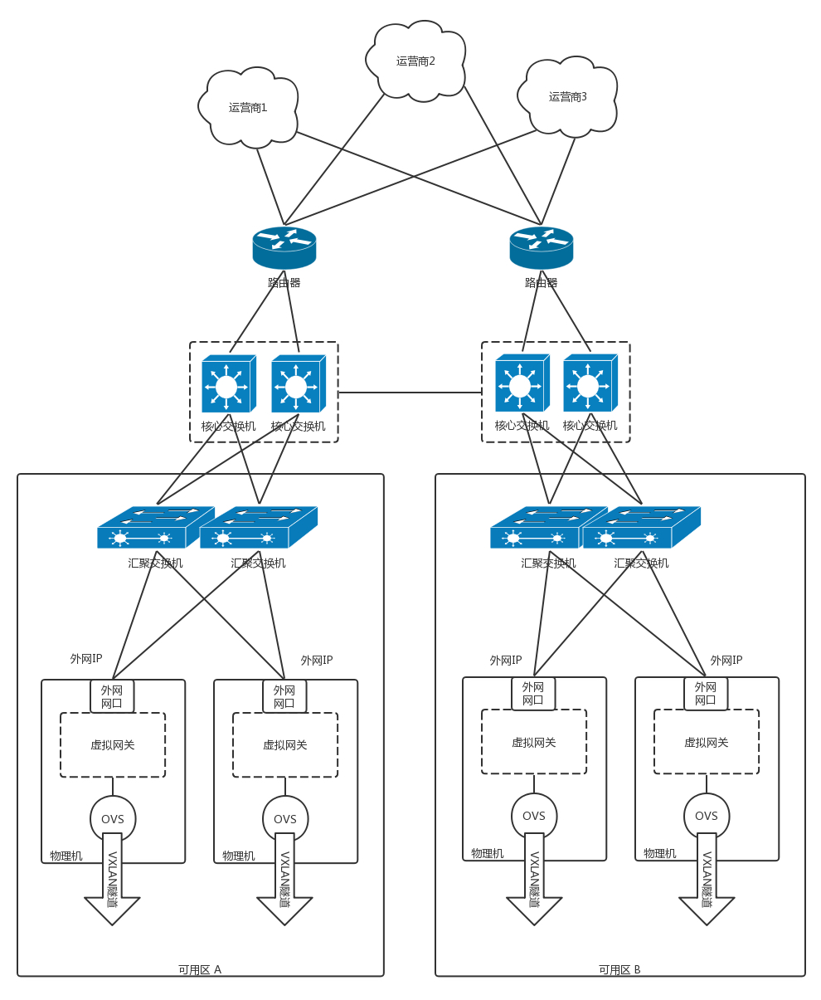

# 37 讲知识串讲：用双十一的故事串起碎片的网络协议（上）

基本的网络知识我们都讲完了，还记得最初举的那个“双十一”下单的例子吗？这一节开始，我们详细地讲解这个过程，用这个过程串起我们讲过的网络协议。

我把这个过程分为十个阶段，从云平台中搭建一个电商开始，到BGP路由广播，再到DNS域名解析，从客户看商品图片，到最终下单的整个过程，每一步我都会详细讲解。这节我们先来看前三个阶段。

## 1.部署一个高可用高并发的电商平台

首先，咱们 **要有个电商平台** 。假设我们已经有了一个特别大的电商平台，这个平台应该部署在哪里呢？假设我们用公有云，一般公有云会有多个位置，比如在华东、华北、华南都有。毕竟咱们的电商是要服务全国的，当然到处都要部署了。我们把主站点放在华东。

为了每个点都能“雨露均沾”，也为了高可用性，往往需要有多个机房，形成多个可用区（Available Zone）。由于咱们的应用是分布在两个可用区的，所以假如任何一个可用区挂了，都不会受影响。

我们来回想\[数据中心\]那一节，每个可用区里有一片一片的机柜，每个机柜上有一排一排的服务器，每个机柜都有一个接入交换机，有一个汇聚交换机将多个机柜连在一起。

这些服务器里面部署的都是计算节点，每台上面都有Open vSwitch创建的虚拟交换机，将来在这台机器上创建的虚拟机，都会连到Open vSwitch上。

接下来，你 **在云计算的界面上创建一个VPC** （Virtual Private Cloud，虚拟私有网络），指定一个IP段，这样以后你部署的所有应用都会在这个虚拟网络里，使用你分配的这个IP段。为了不同的VPC相互隔离，每个VPC都会被分配一个VXLAN的ID。尽管不同用户的虚拟机有可能在同一个物理机上，但是不同的VPC二层压根儿是不通的。

由于有两个可用区，在这个VPC里面，要为每一个可用区分配一个Subnet，也就是在大的网段里分配两个小的网段。当两个可用区里面网段不同的时候，就可以配置路由策略，访问另外一个可用区，走某一条路由了。

接下来，应该 **创建数据库持久化层** 。大部分云平台都会提供PaaS服务，也就是说，不需要你自己搭建数据库，而是采用直接提供数据库的服务，并且单机房的主备切换都是默认做好的，数据库也是部署在虚拟机里面的，只不过从界面上，你看不到数据库所在的虚拟机而已。

云平台会给每个Subnet的数据库实例分配一个域名。创建数据库实例的时候，需要你指定可用区和Subnet，这样创建出来的数据库实例可以通过这个Subnet的私网IP进行访问。

为了分库分表实现高并发的读写，在创建的多个数据库实例之上，会 **创建一个分布式数据库的实例** ，也需要指定可用区和Subnet，还会为分布式数据库分配一个私网IP和域名。

对于数据库这种高可用性比较高的，需要进行跨机房高可用，因而两个可用区都要部署一套，但是只有一个是主，另外一个是备，云平台往往会提供数据库同步工具，将应用写入主的数据同步给备数据库集群。

接下来是 **创建缓存集** 群。云平台也会提供PaaS服务，也需要每个可用区和Subnet创建一套，缓存的数据在内存中，由于读写性能要求高，一般不要求跨可用区读写。

再往上层就是 **部署咱们自己写的程序** 了。基础服务层、组合服务层、Controller层，以及Nginx层、API网关等等，这些都是部署在虚拟机里面的。它们之间通过RPC相互调用，需要到注册中心进行注册。

它们之间的网络通信是虚拟机和虚拟机之间的。如果是同一台物理机，则那台物理机上的OVS就能转发过去；如果是不同的物理机，这台物理机的OVS和另一台物理机的OVS中间有一个VXLAN的隧道，将请求转发过去。

再往外就是 **负载均衡** 了，负载均衡也是云平台提供的PaaS服务，也是属于某个VPC的，部署在虚拟机里面的，但是负载均衡有个外网的IP，这个外网的IP地址就是在网关节点的外网网口上的。在网关节点上，会有NAT规则，将外网IP地址转换为VPC里面的私网IP地址，通过这些私网IP地址访问到虚拟机上的负载均衡节点，然后通过负载均衡节点转发到API网关的节点。

网关节点的外网网口是带公网IP地址的，里面有一个虚拟网关转发模块，还会有一个OVS，将私网IP地址放到VXLAN隧道里面，转发到虚拟机上，从而实现外网和虚拟机网络之间的互通。

不同的可用区之间，通过核心交换机连在一起，核心交换机之外是边界路由器。

在华北、华东、华南同样也部署了一整套，每个地区都创建了VPC，这就需要有一种机制将VPC连接到一起。云平台一般会提供硬件的VPC互连的方式，当然也可以使用软件互连的方式，也就是使用VPN网关，通过IPsec VPN将不同地区的不同VPC通过VPN连接起来。

对于不同地区和不同运营商的用户，我们希望他能够就近访问到网站，而且当一个点出了故障之后，我们希望能够在不同的地区之间切换，这就需要有智能DNS，这个也是云平台提供的。

对于一些静态资源，可以保持在对象存储里面，通过CDN下发到边缘节点，这样客户端就能尽快加载出来。

## 2.大声告诉全世界，可以到我这里买东西

当电商应用搭建完毕之后，接下来需要将如何访问到这个电商网站广播给全网。

刚才那张图画的是一个可用区的情况，对于多个可用区的情况，我们可以隐去计算节点的情况，将外网访问区域放大。

外网IP是放在虚拟网关的外网网口上的，这个IP如何让全世界知道呢？当然是通过BGP路由协议了。

每个可用区都有自己的汇聚交换机，如果机器数目比较多，可以直接用核心交换机，每个Region也有自己的核心交换区域。

在核心交换外面是安全设备，然后就是边界路由器。边界路由器会和多个运营商连接，从而每个运营商都能够访问到这个网站。边界路由器可以通过BGP协议，将自己数据中心里面的外网IP向外广播，也就是告诉全世界，如果要访问这些外网IP，都来我这里。

每个运营商也有很多的路由器、很多的点，于是就可以将如何到达这些IP地址的路由信息，广播到全国乃至全世界。

## 3.打开手机来上网，域名解析得地址

这个时候，不但你的这个网站的IP地址全世界都知道了，你打的广告可能大家也都看到了，于是有客户下载App来买东西了。

客户的手机开机以后，在附近寻找基站eNodeB，发送请求，申请上网。基站将请求发给MME，MME对手机进行认证和鉴权，还会请求HSS看有没有钱，看看是在哪里上网。

当MME通过了手机的认证之后，开始建立隧道，建设的数据通路分两段路，其实是两个隧道。一段是从eNodeB到SGW，第二段是从SGW到PGW，在PGW之外，就是互联网。

PGW会为手机分配一个IP地址，手机上网都是带着这个IP地址的。

当在手机上面打开一个App的时候，首先要做的事情就是解析这个网站的域名。

在手机运营商所在的互联网区域里，有一个本地的DNS，手机会向这个DNS请求解析DNS。当这个DNS本地有缓存，则直接返回；如果没有缓存，本地DNS才需要递归地从根DNS服务器，查到.com的顶级域名服务器，最终查到权威DNS服务器。

如果你使用云平台的时候，配置了智能DNS和全局负载均衡，在权威DNS服务中，一般是通过配置CNAME的方式，我们可以起一个别名，例如 [vip.yourcomany.com](http://vip.yourcomany.com/) ，然后告诉本地DNS服务器，让它请求GSLB解析这个域名，GSLB就可以在解析这个域名的过程中，通过自己的策略实现负载均衡。

GSLB通过查看请求它的本地DNS服务器所在的运营商和地址，就知道用户所在的运营商和地址，然后将距离用户位置比较近的Region里面，三个负载均衡SLB的公网IP地址，返回给本地DNS服务器。本地DNS解析器将结果缓存后，返回给客户端。

对于手机App来说，可以绕过刚才的传统DNS解析机制，直接只要HTTPDNS服务，通过直接调用HTTPDNS服务器，得到这三个SLB的公网IP地址。

看，经过了如此复杂的过程，咱们的万里长征还没迈出第一步，刚刚得到IP地址，包还没发呢？话说手机App拿到了公网IP地址，接下来应该做什么呢？
