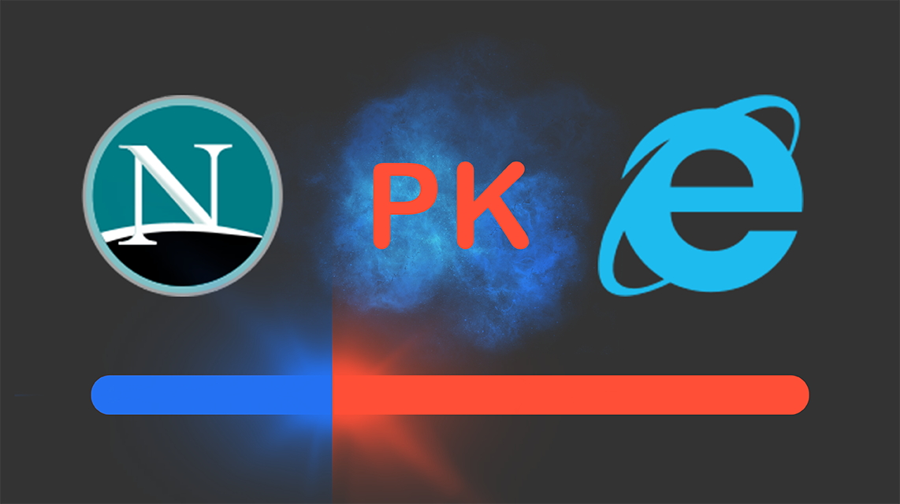
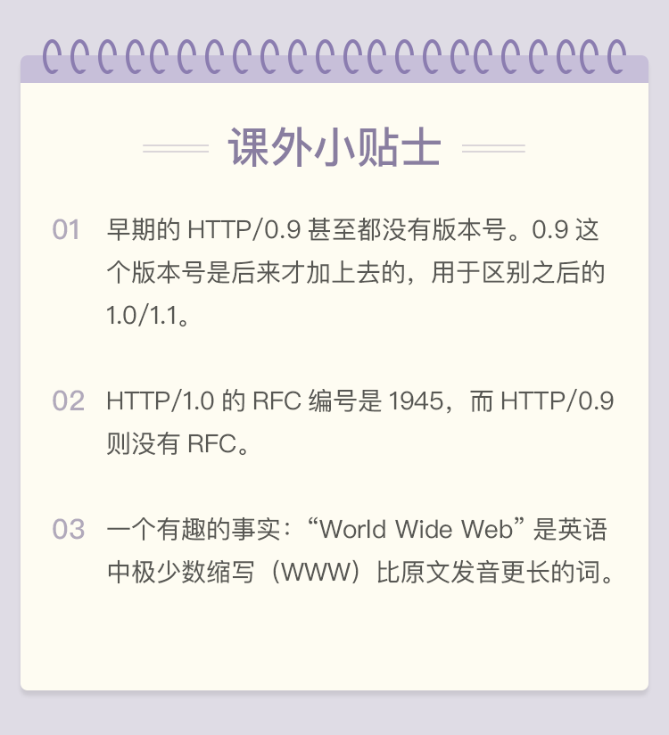

# 01 时势与英雄：HTTP的前世今生

HTTP 协议在我们的生活中随处可见，打开手机或者电脑，只要你上网，不论是用 iPhone、Android、Windows 还是 Mac，不论是用浏览器还是 App，不论是看新闻、短视频还是听音乐、玩游戏，后面总会有 HTTP 在默默为你服务。

据 NetCraft 公司统计，目前全球至少有 16 亿个网站、2 亿多个独立域名，而这个庞大网络世界的底层运转机制就是 HTTP。

那么，在享受如此便捷舒适的网络生活时，你有没有想过，HTTP 协议是怎么来的？它最开始是什么样子的？又是如何一步一步发展到今天，几乎“统治”了整个互联网世界的呢？

常言道：“ **时势造英雄，英雄亦造时势** ”。

今天我就和你来聊一聊 HTTP 的发展历程，看看它的成长轨迹，看看历史上有哪些事件推动了它的前进，它又促进了哪些技术的产生，一起来见证“英雄之旅”。

在这个过程中，你也能够顺便了解一下 HTTP 的“历史局限性”，明白 HTTP 为什么会设计成现在这个样子。

## 史前时期

20 世纪 60 年代，美国国防部高等研究计划署（ARPA）建立了 ARPA 网，它有四个分布在各地的节点，被认为是如今互联网的“始祖”。

然后在 70 年代，基于对 ARPA 网的实践和思考，研究人员发明出了著名的 TCP/IP 协议。由于具有良好的分层结构和稳定的性能，TCP/IP 协议迅速战胜其他竞争对手流行起来，并在 80 年代中期进入了 UNIX 系统内核，促使更多的计算机接入了互联网。

## 创世纪

蒂姆·伯纳斯 - 李

1989 年，任职于欧洲核子研究中心（CERN）的蒂姆·伯纳斯 - 李（Tim Berners-Lee）发表了一篇论文，提出了在互联网上构建超链接文档系统的构想。这篇论文中他确立了三项关键技术。

1. URI：即统一资源标识符，作为互联网上资源的唯一身份；
1. HTML：即超文本标记语言，描述超文本文档；
1. HTTP：即超文本传输协议，用来传输超文本。

这三项技术在如今的我们看来已经是稀松平常，但在当时却是了不得的大发明。基于它们，就可以把超文本系统完美地运行在互联网上，让各地的人们能够自由地共享信息，蒂姆把这个系统称为“万维网”（World Wide Web），也就是我们现在所熟知的 Web。

所以在这一年，我们的英雄“HTTP”诞生了，从此开始了它伟大的征途。

## HTTP/0.9

20 世纪 90 年代初期的互联网世界非常简陋，计算机处理能力低，存储容量小，网速很慢，还是一片“信息荒漠”。网络上绝大多数的资源都是纯文本，很多通信协议也都使用纯文本，所以 HTTP 的设计也不可避免地受到了时代的限制。

这一时期的 HTTP 被定义为 0.9 版，结构比较简单，为了便于服务器和客户端处理，它也采用了纯文本格式。蒂姆·伯纳斯 - 李最初设想的系统里的文档都是只读的，所以只允许用“GET”动作从服务器上获取 HTML 文档，并且在响应请求之后立即关闭连接，功能非常有限。

HTTP/0.9 虽然很简单，但它作为一个“原型”，充分验证了 Web 服务的可行性，而“简单”也正是它的优点，蕴含了进化和扩展的可能性，因为：

“把简单的系统变复杂”，要比“把复杂的系统变简单”容易得多。

## HTTP/1.0

1993 年，NCSA（美国国家超级计算应用中心）开发出了 Mosaic，是第一个可以图文混排的浏览器，随后又在 1995 年开发出了服务器软件 Apache，简化了 HTTP 服务器的搭建工作。

同一时期，计算机多媒体技术也有了新的发展：1992 年发明了 JPEG 图像格式，1995 年发明了 MP3 音乐格式。

这些新软件新技术一经推出立刻就吸引了广大网民的热情，更的多的人开始使用互联网，研究 HTTP 并提出改进意见，甚至实验性地往协议里添加各种特性，从用户需求的角度促进了 HTTP 的发展。

于是在这些已有实践的基础上，经过一系列的草案，HTTP/1.0 版本在 1996 年正式发布。它在多方面增强了 0.9 版，形式上已经和我们现在的 HTTP 差别不大了，例如：

1. 增加了 HEAD、POST 等新方法；
1. 增加了响应状态码，标记可能的错误原因；
1. 引入了协议版本号概念；
1. 引入了 HTTP Header（头部）的概念，让 HTTP 处理请求和响应更加灵活；
1. 传输的数据不再仅限于文本。

但 HTTP/1.0 并不是一个“标准”，只是记录已有实践和模式的一份参考文档，不具有实际的约束力，相当于一个“备忘录”。

所以 HTTP/1.0 的发布对于当时正在蓬勃发展的互联网来说并没有太大的实际意义，各方势力仍然按照自己的意图继续在市场上奋力拼杀。

## HTTP/1.1

1995 年，网景的 Netscape Navigator 和微软的 Internet Explorer 开始了著名的“浏览器大战”，都希望在互联网上占据主导地位。

这场战争的结果你一定早就知道了，最终微软的 IE 取得了决定性的胜利，而网景则“败走麦城”（但后来却凭借 Mozilla Firefox 又扳回一局）。

“浏览器大战”的是非成败我们放在一边暂且不管，不可否认的是，它再一次极大地推动了 Web 的发展，HTTP/1.0 也在这个过程中经受了实践检验。于是在“浏览器大战”结束之后的 1999 年，HTTP/1.1 发布了 RFC 文档，编号为 2616，正式确立了延续十余年的传奇。

从版本号我们就可以看到，HTTP/1.1 是对 HTTP/1.0 的小幅度修正。但一个重要的区别是：它是一个“正式的标准”，而不是一份可有可无的“参考文档”。这意味着今后互联网上所有的浏览器、服务器、网关、代理等等，只要用到 HTTP 协议，就必须严格遵守这个标准，相当于是互联网世界的一个“立法”。

不过，说 HTTP/1.1 是“小幅度修正”也不太确切，它还是有很多实质性进步的。毕竟经过了多年的实战检验，比起 0.9/1.0 少了“学术气”，更加“接地气”，同时表述也更加严谨。HTTP/1.1 主要的变更点有：

1. 增加了 PUT、DELETE 等新的方法；
1. 增加了缓存管理和控制；
1. 明确了连接管理，允许持久连接；
1. 允许响应数据分块（chunked），利于传输大文件；
1. 强制要求 Host 头，让互联网主机托管成为可能。

HTTP/1.1 的推出可谓是“众望所归”，互联网在它的“保驾护航”下迈开了大步，由此走上了“康庄大道”，开启了后续的“Web 1.0”“Web 2.0”时代。现在许多的知名网站都是在这个时间点左右创立的，例如 Google、新浪、搜狐、网易、腾讯等。

不过由于 HTTP/1.1 太过庞大和复杂，所以在 2014 年又做了一次修订，原来的一个大文档被拆分成了六份较小的文档，编号为 7230-7235，优化了一些细节，但此外没有任何实质性的改动。

## HTTP/2

HTTP/1.1 发布之后，整个互联网世界呈现出了爆发式的增长，度过了十多年的“快乐时光”，更涌现出了 Facebook、Twitter、淘宝、京东等互联网新贵。

这期间也出现了一些对 HTTP 不满的意见，主要就是连接慢，无法跟上迅猛发展的互联网，但 HTTP/1.1 标准一直“岿然不动”，无奈之下人们只好发明各式各样的“小花招”来缓解这些问题，比如以前常见的切图、JS 合并等网页优化手段。

终于有一天，搜索巨头 Google 忍不住了，决定“揭竿而起”，就像马云说的“如果银行不改变，我们就改变银行”。那么，它是怎么“造反”的呢？

Google 首先开发了自己的浏览器 Chrome，然后推出了新的 SPDY 协议，并在 Chrome 里应用于自家的服务器，如同十多年前的网景与微软一样，从实际的用户方来“倒逼”HTTP 协议的变革，这也开启了第二次的“浏览器大战”。

历史再次重演，不过这次的胜利者是 Google，Chrome 目前的全球的占有率超过了 60%。“挟用户以号令天下”，Google 借此顺势把 SPDY 推上了标准的宝座，互联网标准化组织以 SPDY 为基础开始制定新版本的 HTTP 协议，最终在 2015 年发布了 HTTP/2，RFC 编号 7540。

HTTP/2 的制定充分考虑了现今互联网的现状：宽带、移动、不安全，在高度兼容 HTTP/1.1 的同时在性能改善方面做了很大努力，主要的特点有：

1. 二进制协议，不再是纯文本；
1. 可发起多个请求，废弃了 1.1 里的管道；
1. 使用专用算法压缩头部，减少数据传输量；
1. 允许服务器主动向客户端推送数据；
1. 增强了安全性，“事实上”要求加密通信。

虽然 HTTP/2 到今天已经四岁，也衍生出了 gRPC 等新协议，但由于 HTTP/1.1 实在是太过经典和强势，目前它的普及率还比较低，大多数网站使用的仍然还是 20 年前的 HTTP/1.1。

## HTTP/3

看到这里，你可能会问了：“HTTP/2 这么好，是不是就已经完美了呢？”

答案是否定的，这一次还是 Google，而且它要“革自己的命”。

在 HTTP/2 还处于草案之时，Google 又发明了一个新的协议，叫做 QUIC，而且还是相同的“套路”，继续在 Chrome 和自家服务器里试验着“玩”，依托它的庞大用户量和数据量，持续地推动 QUIC 协议成为互联网上的“既成事实”。

“功夫不负有心人”，当然也是因为 QUIC 确实自身素质过硬。

在去年，也就是 2018 年，互联网标准化组织 IETF 提议将“HTTP over QUIC”更名为“HTTP/3”并获得批准，HTTP/3 正式进入了标准化制订阶段，也许两三年后就会正式发布，到时候我们很可能会跳过 HTTP/2 直接进入 HTTP/3。

## 小结

今天我和你一起跨越了三十年的历史长河，回顾了 HTTP 协议的整个发展过程，在这里简单小结一下今天的内容：

1. HTTP 协议始于三十年前蒂姆·伯纳斯 - 李的一篇论文；
1. HTTP/0.9 是个简单的文本协议，只能获取文本资源；
1. HTTP/1.0 确立了大部分现在使用的技术，但它不是正式标准；
1. HTTP/1.1 是目前互联网上使用最广泛的协议，功能也非常完善；
1. HTTP/2 基于 Google 的 SPDY 协议，注重性能改善，但还未普及；
1. HTTP/3 基于 Google 的 QUIC 协议，是将来的发展方向。

希望通过今天的介绍，你能够对 HTTP 有一个初步但清晰的印象，知道了“来龙”才能更好地知道“去脉”。

## 课下作业

1. 你认为推动 HTTP 发展的原动力是什么？
1. 你是怎么理解 HTTP（超文本传输协议）的？

欢迎你把自己的答案写在留言区，与我和其他同学一起讨论。暂时回答不出来也不要紧，你可以带着这些问题在后续的课程里寻找答案。

如果你觉得有所收获，欢迎你把文章分享给你的朋友。

