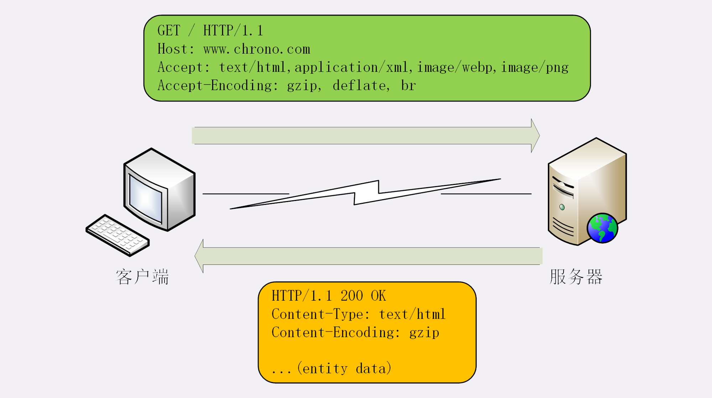
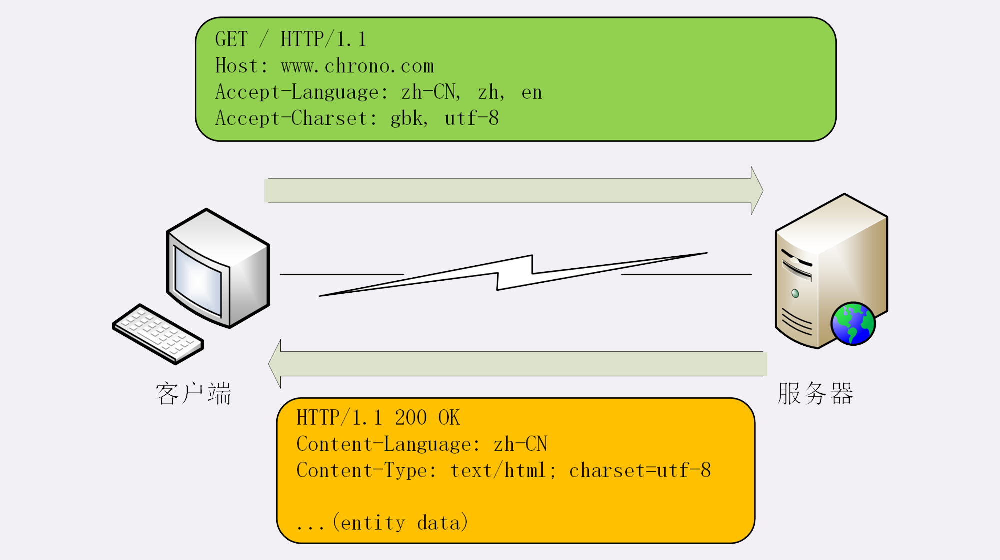
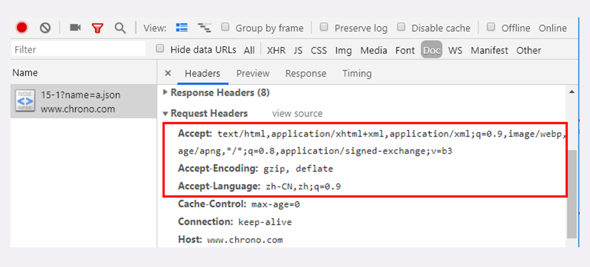
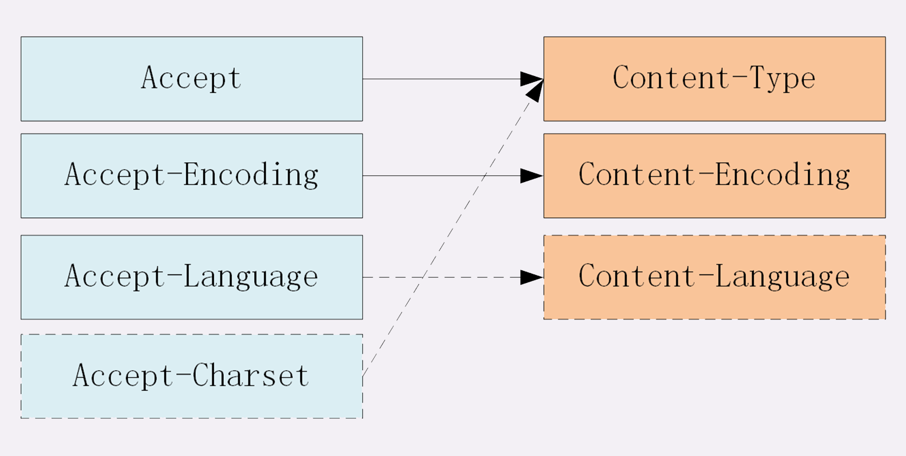

# 15 海纳百川：HTTP的实体数据

你好，我是 Chrono。

今天我要与你分享的话题是“海纳百川：HTTP 的实体数据”。

这一讲是“进阶篇”的第一讲，从今天开始，我会用连续的 8 讲的篇幅来详细解析 HTTP 协议里的各种头字段，包括定义、功能、使用方式、注意事项等等。学完了这些课程，你就可以完全掌握 HTTP 协议。

在前面的“基础篇”里我们了解了 HTTP 报文的结构，知道一个 HTTP 报文是由“header+body”组成的。但那时我们主要研究的是 header，没有涉及到 body。所以，“进阶篇”的第一讲就从 HTTP 的 body 谈起。

## 数据类型与编码

在 TCP/IP 协议栈里，传输数据基本上都是“header+body”的格式。但 TCP、UDP 因为是传输层的协议，它们不会关心 body 数据是什么，只要把数据发送到对方就算是完成了任务。

而 HTTP 协议则不同，它是应用层的协议，数据到达之后工作只能说是完成了一半，还必须要告诉上层应用这是什么数据才行，否则上层应用就会“不知所措”。

你可以设想一下，假如 HTTP 没有告知数据类型的功能，服务器把“一大坨”数据发给了浏览器，浏览器看到的是一个“黑盒子”，这时候该怎么办呢？

当然，它可以“猜”。因为很多数据都是有固定格式的，所以通过检查数据的前几个字节也许就能知道这是个 GIF 图片、或者是个 MP3 音乐文件，但这种方式无疑十分低效，而且有很大几率会检查不出来文件类型。

幸运的是，早在 HTTP 协议诞生之前就已经有了针对这种问题的解决方案，不过它是用在电子邮件系统里的，让电子邮件可以发送 ASCII 码以外的任意数据，方案的名字叫做“ **多用途互联网邮件扩展** ”（Multipurpose Internet Mail Extensions），简称为 MIME。

MIME 是一个很大的标准规范，但 HTTP 只“顺手牵羊”取了其中的一部分，用来标记 body 的数据类型，这就是我们平常总能听到的“ **MIME type** ”。

MIME 把数据分成了八大类，每个大类下再细分出多个子类，形式是“type/subtype”的字符串，巧得很，刚好也符合了 HTTP 明文的特点，所以能够很容易地纳入 HTTP 头字段里。

这里简单列举一下在 HTTP 里经常遇到的几个类别：

1. text：即文本格式的可读数据，我们最熟悉的应该就是 text/html 了，表示超文本文档，此外还有纯文本 text/plain、样式表 text/css 等。
1. image：即图像文件，有 image/gif、image/jpeg、image/png 等。
1. audio/video：音频和视频数据，例如 audio/mpeg、video/mp4 等。
1. application：数据格式不固定，可能是文本也可能是二进制，必须由上层应用程序来解释。常见的有 application/json，application/javascript、application/pdf 等，另外，如果实在是不知道数据是什么类型，像刚才说的“黑盒”，就会是 application/octet-stream，即不透明的二进制数据。

但仅有 MIME type 还不够，因为 HTTP 在传输时为了节约带宽，有时候还会压缩数据，为了不要让浏览器继续“猜”，还需要有一个“Encoding type”，告诉数据是用的什么编码格式，这样对方才能正确解压缩，还原出原始的数据。

比起 MIME type 来说，Encoding type 就少了很多，常用的只有下面三种：

1. gzip：GNU zip 压缩格式，也是互联网上最流行的压缩格式；
1. deflate：zlib（deflate）压缩格式，流行程度仅次于 gzip；
1. br：一种专门为 HTTP 优化的新压缩算法（Brotli）。

## 数据类型使用的头字段

有了 MIME type 和 Encoding type，无论是浏览器还是服务器就都可以轻松识别出 body 的类型，也就能够正确处理数据了。

HTTP 协议为此定义了两个 Accept 请求头字段和两个 Content 实体头字段，用于客户端和服务器进行“ **内容协商** ”。也就是说，客户端用 Accept 头告诉服务器希望接收什么样的数据，而服务器用 Content 头告诉客户端实际发送了什么样的数据。



**Accept** 字段标记的是客户端可理解的 MIME type，可以用“,”做分隔符列出多个类型，让服务器有更多的选择余地，例如下面的这个头：

```plaintext
Accept: text/html,application/xml,image/webp,image/png
```

这就是告诉服务器：“我能够看懂 HTML、XML 的文本，还有 webp 和 png 的图片，请给我这四类格式的数据”。

相应的，服务器会在响应报文里用头字段 **Content-Type** 告诉实体数据的真实类型：

```plaintext
Content-Type: text/html
Content-Type: image/png
```

这样浏览器看到报文里的类型是“text/html”就知道是 HTML 文件，会调用排版引擎渲染出页面，看到“image/png”就知道是一个 PNG 文件，就会在页面上显示出图像。 **Accept-Encoding** 字段标记的是客户端支持的压缩格式，例如上面说的 gzip、deflate 等，同样也可以用“,”列出多个，服务器可以选择其中一种来压缩数据，实际使用的压缩格式放在响应头字段 **Content-Encoding** 里。

```plaintext
Accept-Encoding: gzip, deflate, br
Content-Encoding: gzip
```

不过这两个字段是可以省略的，如果请求报文里没有 Accept-Encoding 字段，就表示客户端不支持压缩数据；如果响应报文里没有 Content-Encoding 字段，就表示响应数据没有被压缩。

## 语言类型与编码

MIME type 和 Encoding type 解决了计算机理解 body 数据的问题，但互联网遍布全球，不同国家不同地区的人使用了很多不同的语言，虽然都是 text/html，但如何让浏览器显示出每个人都可理解可阅读的语言文字呢？

这实际上就是“国际化”的问题。HTTP 采用了与数据类型相似的解决方案，又引入了两个概念：语言类型与字符集。

所谓的“ **语言类型** ”就是人类使用的自然语言，例如英语、汉语、日语等，而这些自然语言可能还有下属的地区性方言，所以在需要明确区分的时候也要使用“type-subtype”的形式，不过这里的格式与数据类型不同， **分隔符不是“/”，而是“-”** 。

举几个例子：en 表示任意的英语，en-US 表示美式英语，en-GB 表示英式英语，而 zh-CN 就表示我们最常使用的汉语。

关于自然语言的计算机处理还有一个更麻烦的东西叫做“字符集”。

在计算机发展的早期，各个国家和地区的人们“各自为政”，发明了许多字符编码方式来处理文字，比如英语世界用的 ASCII、汉语世界用的 GBK、BIG5，日语世界用的 Shift_JIS 等。同样的一段文字，用一种编码显示正常，换另一种编码后可能就会变得一团糟。

所以后来就出现了 Unicode 和 UTF-8，把世界上所有的语言都容纳在一种编码方案里，UTF-8 也成为了互联网上的标准字符集。

## 语言类型使用的头字段

同样的，HTTP 协议也使用 Accept 请求头字段和 Content 实体头字段，用于客户端和服务器就语言与编码进行“ **内容协商** ”。 **Accept-Language** 字段标记了客户端可理解的自然语言，也允许用“,”做分隔符列出多个类型，例如：

```plaintext
Accept-Language: zh-CN, zh, en
```

这个请求头会告诉服务器：“最好给我 zh-CN 的汉语文字，如果没有就用其他的汉语方言，如果还没有就给英文”。

相应的，服务器应该在响应报文里用头字段 **Content-Language** 告诉客户端实体数据使用的实际语言类型：

```plaintext
Content-Language: zh-CN
```

字符集在 HTTP 里使用的请求头字段是 **Accept-Charset** ，但响应头里却没有对应的 Content-Charset，而是在 **Content-Type** 字段的数据类型后面用“charset=xxx”来表示，这点需要特别注意。

例如，浏览器请求 GBK 或 UTF-8 的字符集，然后服务器返回的是 UTF-8 编码，就是下面这样：

```plaintext
Accept-Charset: gbk, utf-8
Content-Type: text/html; charset=utf-8
```

不过现在的浏览器都支持多种字符集，通常不会发送 Accept-Charset，而服务器也不会发送 Content-Language，因为使用的语言完全可以由字符集推断出来，所以在请求头里一般只会有 Accept-Language 字段，响应头里只会有 Content-Type 字段。



## 内容协商的质量值

在 HTTP 协议里用 Accept、Accept-Encoding、Accept-Language 等请求头字段进行内容协商的时候，还可以用一种特殊的“q”参数表示权重来设定优先级，这里的“q”是“quality factor”的意思。

权重的最大值是 1，最小值是 0.01，默认值是 1，如果值是 0 就表示拒绝。具体的形式是在数据类型或语言代码后面加一个“;”，然后是“q=value”。

这里要提醒的是“;”的用法，在大多数编程语言里“;”的断句语气要强于“,”，而在 HTTP 的内容协商里却恰好反了过来，“;”的意义是小于“,”的。

例如下面的 Accept 字段：

```plaintext
Accept: text/html,application/xml;q=0.9,*/*;q=0.8
```

它表示浏览器最希望使用的是 HTML 文件，权重是 1，其次是 XML 文件，权重是 0.9，最后是任意数据类型，权重是 0.8。服务器收到请求头后，就会计算权重，再根据自己的实际情况优先输出 HTML 或者 XML。

## 内容协商的结果

内容协商的过程是不透明的，每个 Web 服务器使用的算法都不一样。但有的时候，服务器会在响应头里多加一个 **Vary** 字段，记录服务器在内容协商时参考的请求头字段，给出一点信息，例如：

```plaintext
Vary: Accept-Encoding,User-Agent,Accept
```

这个 Vary 字段表示服务器依据了 Accept-Encoding、User-Agent 和 Accept 这三个头字段，然后决定了发回的响应报文。

Vary 字段可以认为是响应报文的一个特殊的“版本标记”。每当 Accept 等请求头变化时，Vary 也会随着响应报文一起变化。也就是说，同一个 URI 可能会有多个不同的“版本”，主要用在传输链路中间的代理服务器实现缓存服务，这个之后讲“HTTP 缓存”时还会再提到。

## 动手实验

上面讲完了理论部分，接下来就是实际动手操作了。可以用我们的实验环境，在 www 目录下有一个 mime 目录，里面预先存放了几个文件，可以用 URI“/15-1?name=file”的形式访问，例如：

```plaintext
http://www.chrono.com/15-1?name=a.json
http://www.chrono.com/15-1?name=a.xml
```

在 Chrome 里打开开发者工具，就能够看到 Accept 和 Content 头：



你也可以把任意的文件拷贝到 mime 目录下，比如压缩包、MP3、图片、视频等，再用 Chrome 访问，观察更多的 MIME type。

有了这些经验后，你还可以离开实验环境，直接访问各大门户网站，看看真实网络世界里的 HTTP 报文是什么样子的。

## 小结

今天我们学习了 HTTP 里的数据类型和语言类型，在这里为今天的内容做个小结。



1. 数据类型表示实体数据的内容是什么，使用的是 MIME type，相关的头字段是 Accept 和 Content-Type；
1. 数据编码表示实体数据的压缩方式，相关的头字段是 Accept-Encoding 和 Content-Encoding；
1. 语言类型表示实体数据的自然语言，相关的头字段是 Accept-Language 和 Content-Language；
1. 字符集表示实体数据的编码方式，相关的头字段是 Accept-Charset 和 Content-Type；
1. 客户端需要在请求头里使用 Accept 等头字段与服务器进行“内容协商”，要求服务器返回最合适的数据；
1. Accept 等头字段可以用“,”顺序列出多个可能的选项，还可以用“;q=”参数来精确指定权重。
