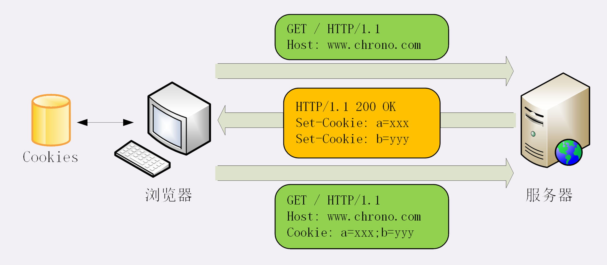
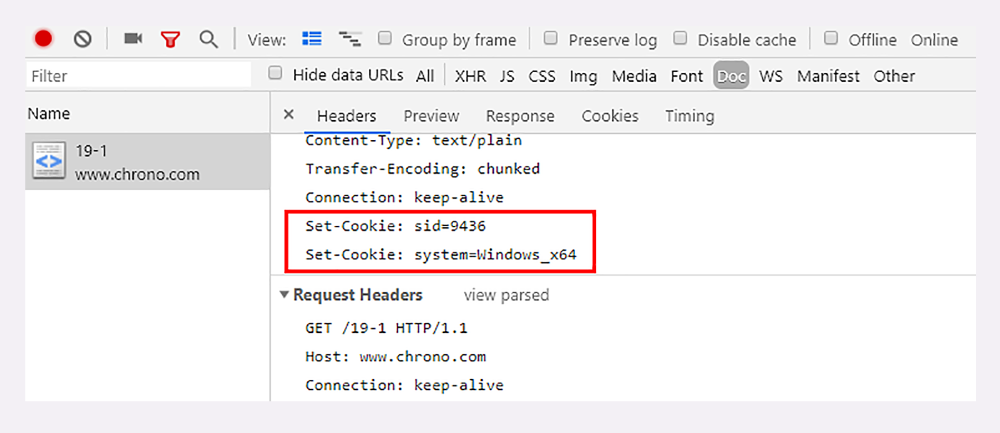
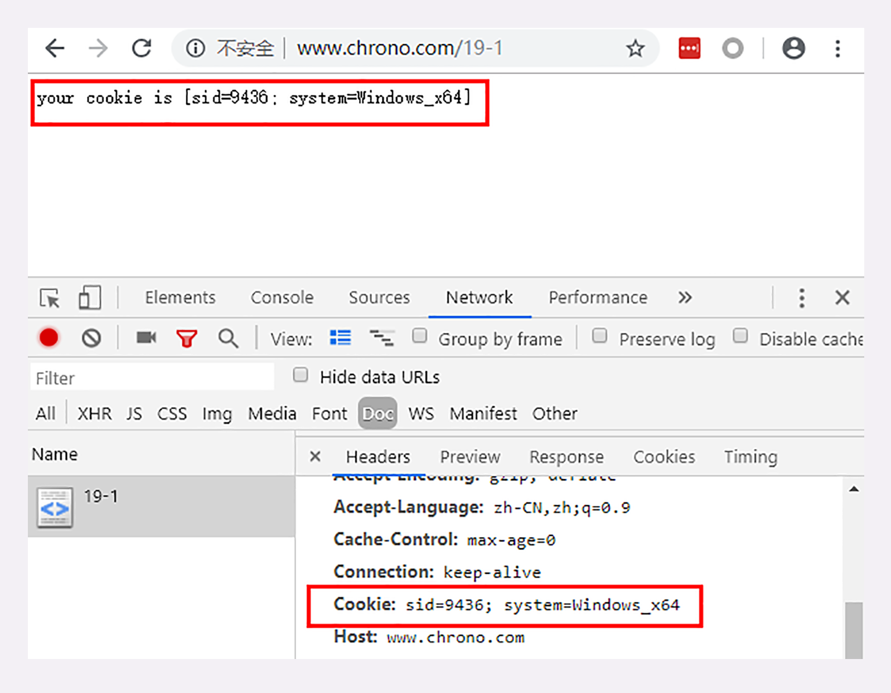
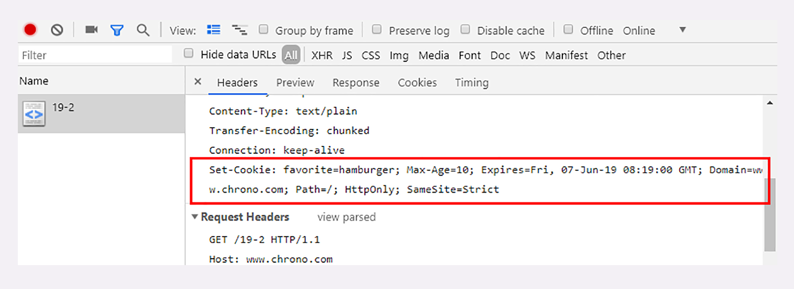
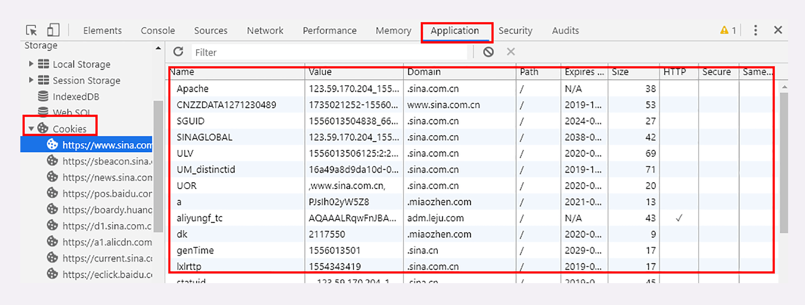
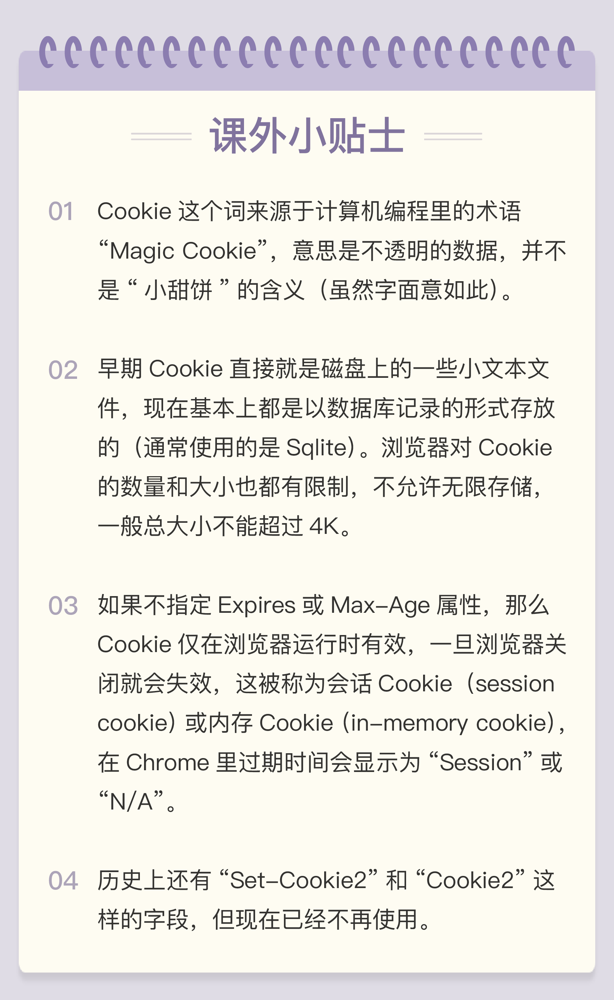

# 19 让我知道你是谁：HTTP的Cookie机制

在之前的第 13、14 讲中，我曾经说过，HTTP 是“无状态”的，这既是优点也是缺点。优点是服务器没有状态差异，可以很容易地组成集群，而缺点就是无法支持需要记录状态的事务操作。

好在 HTTP 协议是可扩展的，后来发明的 Cookie 技术，给 HTTP 增加了“记忆能力”。

## 什么是 Cookie？

不知道你有没有看过克里斯托弗·诺兰导演的一部经典电影《记忆碎片》（Memento），里面的主角患有短期失忆症，记不住最近发生的事情。

比如，电影里有个场景，某人刚跟主角说完话，大闹了一通，过了几分钟再回来，主角却是一脸茫然，完全不记得这个人是谁，刚才又做了什么，只能任人摆布。

这种情况就很像 HTTP 里“无状态”的 Web 服务器，只不过服务器的“失忆症”比他还要严重，连一分钟的记忆也保存不了，请求处理完立刻就忘得一干二净。即使这个请求会让服务器发生 500 的严重错误，下次来也会依旧“热情招待”。

如果 Web 服务器只是用来管理静态文件还好说，对方是谁并不重要，把文件从磁盘读出来发走就可以了。但随着 HTTP 应用领域的不断扩大，对“记忆能力”的需求也越来越强烈。比如网上论坛、电商购物，都需要“看客下菜”，只有记住用户的身份才能执行发帖子、下订单等一系列会话事务。

那该怎么样让原本无“记忆能力”的服务器拥有“记忆能力”呢？

看看电影里的主角是怎么做的吧。他通过纹身、贴纸条、立拍得等手段，在外界留下了各种记录，一旦失忆，只要看到这些提示信息，就能够在头脑中快速重建起之前的记忆，从而把因失忆而耽误的事情继续做下去。

HTTP 的 Cookie 机制也是一样的道理，既然服务器记不住，那就在外部想办法记住。相当于是服务器给每个客户端都贴上一张小纸条，上面写了一些只有服务器才能理解的数据，需要的时候客户端把这些信息发给服务器，服务器看到 Cookie，就能够认出对方是谁了。

## Cookie 的工作过程

那么，Cookie 这张小纸条是怎么传递的呢？

这要用到两个字段：响应头字段 **Set-Cookie** 和请求头字段 **Cookie** 。

当用户通过浏览器第一次访问服务器的时候，服务器肯定是不知道他的身份的。所以，就要创建一个独特的身份标识数据，格式是“ **key=value** ”，然后放进 Set-Cookie 字段里，随着响应报文一同发给浏览器。

浏览器收到响应报文，看到里面有 Set-Cookie，知道这是服务器给的身份标识，于是就保存起来，下次再请求的时候就自动把这个值放进 Cookie 字段里发给服务器。

因为第二次请求里面有了 Cookie 字段，服务器就知道这个用户不是新人，之前来过，就可以拿出 Cookie 里的值，识别出用户的身份，然后提供个性化的服务。

不过因为服务器的“记忆能力”实在是太差，一张小纸条经常不够用。所以，服务器有时会在响应头里添加多个 Set-Cookie，存储多个“key=value”。但浏览器这边发送时不需要用多个 Cookie 字段，只要在一行里用“;”隔开就行。

我画了一张图来描述这个过程，你看过就能理解了。

从这张图中我们也能够看到，Cookie 是由浏览器负责存储的，而不是操作系统。所以，它是“浏览器绑定”的，只能在本浏览器内生效。

如果你换个浏览器或者换台电脑，新的浏览器里没有服务器对应的 Cookie，就好像是脱掉了贴着纸条的衣服，“健忘”的服务器也就认不出来了，只能再走一遍 Set-Cookie 流程。

在实验环境里，你可以用 Chrome 访问 URI“/19-1”，实地看一下 Cookie 工作过程。

首次访问时服务器会设置两个 Cookie。

然后刷新这个页面，浏览器就会在请求头里自动送出 Cookie，服务器就能认出你了。

如果换成 Firefox 等其他浏览器，因为 Cookie 是存在 Chrome 里的，所以服务器就又“蒙圈”了，不知道你是谁，就会给 Firefox 再贴上小纸条。

## Cookie 的属性

说到这里，你应该知道了，Cookie 就是服务器委托浏览器存储在客户端里的一些数据，而这些数据通常都会记录用户的关键识别信息。所以，就需要在“key=value”外再用一些手段来保护，防止外泄或窃取，这些手段就是 Cookie 的属性。

下面这个截图是实验环境“/19-2”的响应头，我来对着这个实际案例讲一下都有哪些常见的 Cookie 属性。

首先，我们应该 **设置 Cookie 的生存周期** ，也就是它的有效期，让它只能在一段时间内可用，就像是食品的“保鲜期”，一旦超过这个期限浏览器就认为是 Cookie 失效，在存储里删除，也不会发送给服务器。

Cookie 的有效期可以使用 Expires 和 Max-Age 两个属性来设置。

“ **Expires** ”俗称“过期时间”，用的是绝对时间点，可以理解为“截止日期”（deadline）。“ **Max-Age** ”用的是相对时间，单位是秒，浏览器用收到报文的时间点再加上 Max-Age，就可以得到失效的绝对时间。

Expires 和 Max-Age 可以同时出现，两者的失效时间可以一致，也可以不一致，但浏览器会优先采用 Max-Age 计算失效期。

比如在这个例子里，Expires 标记的过期时间是“GMT 2019 年 6 月 7 号 8 点 19 分”，而 Max-Age 则只有 10 秒，如果现在是 6 月 6 号零点，那么 Cookie 的实际有效期就是“6 月 6 号零点过 10 秒”。

其次，我们需要 **设置 Cookie 的作用域** ，让浏览器仅发送给特定的服务器和 URI，避免被其他网站盗用。

作用域的设置比较简单，“ **Domain** ”和“ **Path** ”指定了 Cookie 所属的域名和路径，浏览器在发送 Cookie 前会从 URI 中提取出 host 和 path 部分，对比 Cookie 的属性。如果不满足条件，就不会在请求头里发送 Cookie。

使用这两个属性可以为不同的域名和路径分别设置各自的 Cookie，比如“/19-1”用一个 Cookie，“/19-2”再用另外一个 Cookie，两者互不干扰。不过现实中为了省事，通常 Path 就用一个“/”或者直接省略，表示域名下的任意路径都允许使用 Cookie，让服务器自己去挑。

最后要考虑的就是 **Cookie 的安全性** 了，尽量不要让服务器以外的人看到。

写过前端的同学一定知道，在 JS 脚本里可以用 document.cookie 来读写 Cookie 数据，这就带来了安全隐患，有可能会导致“跨站脚本”（XSS）攻击窃取数据。

属性“ **HttpOnly** ”会告诉浏览器，此 Cookie 只能通过浏览器 HTTP 协议传输，禁止其他方式访问，浏览器的 JS 引擎就会禁用 document.cookie 等一切相关的 API，脚本攻击也就无从谈起了。

另一个属性“ **SameSite** ”可以防范“跨站请求伪造”（XSRF）攻击，设置成“SameSite=Strict”可以严格限定 Cookie 不能随着跳转链接跨站发送，而“SameSite=Lax”则略宽松一点，允许 GET/HEAD 等安全方法，但禁止 POST 跨站发送。

还有一个属性叫“ **Secure** ”，表示这个 Cookie 仅能用 HTTPS 协议加密传输，明文的 HTTP 协议会禁止发送。但 Cookie 本身不是加密的，浏览器里还是以明文的形式存在。

Chrome 开发者工具是查看 Cookie 的有力工具，在“Network-Cookies”里可以看到单个页面 Cookie 的各种属性，另一个“Application”面板里则能够方便地看到全站的所有 Cookie。

## Cookie 的应用

现在回到我们最开始的话题，有了 Cookie，服务器就有了“记忆能力”，能够保存“状态”，那么应该如何使用 Cookie 呢？

Cookie 最基本的一个用途就是 **身份识别** ，保存用户的登录信息，实现会话事务。

比如，你用账号和密码登录某电商，登录成功后网站服务器就会发给浏览器一个 Cookie，内容大概是“name=yourid”，这样就成功地把身份标签贴在了你身上。

之后你在网站里随便访问哪件商品的页面，浏览器都会自动把身份 Cookie 发给服务器，所以服务器总会知道你的身份，一方面免去了重复登录的麻烦，另一方面也能够自动记录你的浏览记录和购物下单（在后台数据库或者也用 Cookie），实现了“状态保持”。

Cookie 的另一个常见用途是 **广告跟踪** 。

你上网的时候肯定看过很多的广告图片，这些图片背后都是广告商网站（例如 Google），它会“偷偷地”给你贴上 Cookie 小纸条，这样你上其他的网站，别的广告就能用 Cookie 读出你的身份，然后做行为分析，再推给你广告。

这种 Cookie 不是由访问的主站存储的，所以又叫“第三方 Cookie”（third-party cookie）。如果广告商势力很大，广告到处都是，那么就比较“恐怖”了，无论你走到哪里它都会通过 Cookie 认出你来，实现广告“精准打击”。

为了防止滥用 Cookie 搜集用户隐私，互联网组织相继提出了 DNT（Do Not Track）和 P3P（Platform for Privacy Preferences Project），但实际作用不大。

## 小结

今天我们学习了 HTTP 里的 Cookie 知识。虽然现在已经出现了多种 Local Web Storage 技术，能够比 Cookie 存储更多的数据，但 Cookie 仍然是最通用、兼容性最强的客户端数据存储手段。

简单小结一下今天的内容：

1. Cookie 是服务器委托浏览器存储的一些数据，让服务器有了“记忆能力”；
1. 响应报文使用 Set-Cookie 字段发送“key=value”形式的 Cookie 值；
1. 请求报文里用 Cookie 字段发送多个 Cookie 值；
1. 为了保护 Cookie，还要给它设置有效期、作用域等属性，常用的有 Max-Age、Expires、Domain、HttpOnly 等；
1. Cookie 最基本的用途是身份识别，实现有状态的会话事务。

还要提醒你一点，因为 Cookie 并不属于 HTTP 标准（RFC6265，而不是 RFC2616/7230），所以语法上与其他字段不太一致，使用的分隔符是“;”，与 Accept 等字段的“,”不同，小心不要弄错了。

## 课下作业

1. 如果 Cookie 的 Max-Age 属性设置为 0，会有什么效果呢？
1. Cookie 的好处已经很清楚了，你觉得它有什么缺点呢？

欢迎你把自己的学习体会写在留言区，与我和其他同学一起讨论。如果你觉得有所收获，也欢迎把文章分享给你的朋友。

