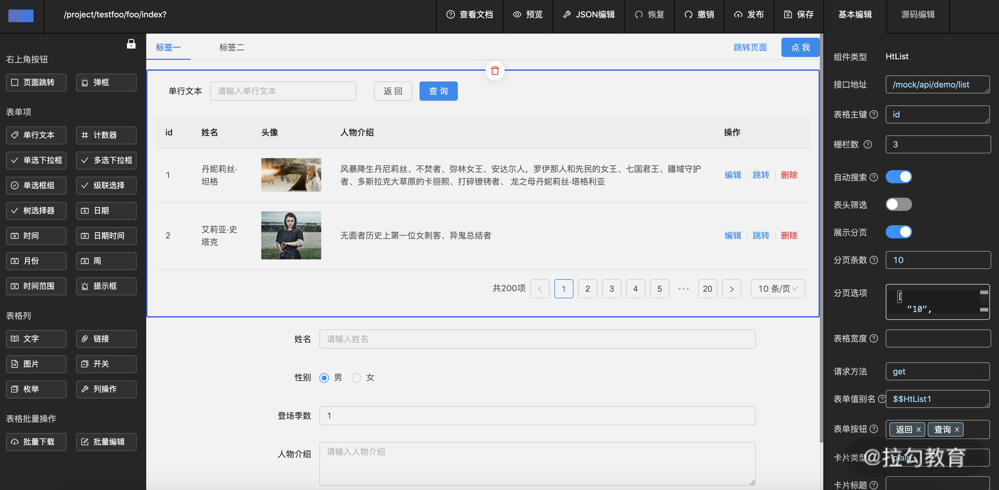

# 07 低代码工具：如何用更少的代码实现更灵活的需求

在进入到这一课的内容之前先让我们来回顾下，通过脚手架工具生成初始化代码，以及通过 Snippet 工具生成代码片段的方式。两种方案的相同在于，通过简单的输入和选择就能获得预设后的项目代码。这种转化方式对于效率的提升效果是清晰可见的。于是有人就想到，能不能更进一步，将我们日常开发的手写代码过程，都转变为通过使用工具来快速生成呢？于是就有了开发效率篇的最后两节内容：低代码开发和无代码开发。这节课我们先来谈低代码开发。

### 什么是低代码开发

**低代码开发** （Low-Code Development， **LCD** ），是一种[很早被提出（2011）](https://en.wikipedia.org/wiki/Low-code_development_platform)的开发模式，开发者 **主要通过图形化用户界面和配置** 来创建应用软件，而不是像传统模式那样 **主要依靠手写代码** 。对应的，提供给开发者的这类低代码开发功能实现的软件，称为 **低代码开发平台** （Low-Code Development Platform， **LCDP** ）。低代码开发模式的开发者，通常不需要具备非常专业的编码技能，或者不需要某一专门领域的编码技能，而是可以通过平台的功能和约束来实现专业代码的产出。

从定义中我们可以看到，低代码开发的工作方式主要依赖操作图形化的用户界面，包括拖拽控件，以及修改其中可被编辑区域的配置。这种可视化的开发方式，可以追溯到更早的 Dreamwaver 时期。而随着前端项目的日趋复杂，这种方式已不再适应现代项目的需求，于是渐渐被更专业的工程化的开发模式所取代。

但是，快速生成项目代码的诉求从未消失。人们也慢慢找到了实现这个目的的两种路径：

- 一种是在高度定制化的场景中，基于经验总结，找到那些相对固定的产品形态，例如公司介绍、产品列表、活动页面等，开放少量的编辑入口，让非专业开发者也能使用。下一课介绍的 **无代码开发** ，主要就是面向这样的场景需求。
- 另一类则相反，顺着早期可视化开发的思路，尝试以组件化和数据绑定为基础，通过抽象语法或 IDE 来实现自由度更高、交互复杂度上限更高的页面搭建流程。这种项目开发方式通常需要一定的开发经验与编码能力，只是和普通编码开发方式相比，更多通过操作可视化工具的方式来达到整体效率的提升，因此被称为 **低代码开发。** 在实际场景中，尤其是商用的低代码平台产品，往往提供的是上面两种开发方式的结合。

#### 低代码开发的典型应用场景

低代码开发的一类典型应用场景是在 PC 端中后台系统的开发流程中，原因如下：

1. 尽管中后台系统的具体页面布局并不固定，但整体 UI 风格较统一，可以基于统一的 UI 组件库来实现搭建，通过组件拖拽组合即可灵活组织成不同形态功能的页面，因此适用于低代码类型的开发模式。
1. 中后台系统涉及数据的增删改查，需要有一定的编码调试能力，无法直接通过 UI 交互完成，因此不适用无代码开发模式。

以中后台系统的开发为目标，低代码开发的方式还可以 **细分为以下两种** ：基于编写 JSON 的开发方式，和基于可视化操作平台的开发方式，下面我们来依次介绍一下。

### 基于编写 JSON 的低代码开发

当我们去审视一个项目前端部分的最终呈现时，可以发现：

1. 一个项目的前端部分本质上呈现的是通过路由连接的不同页面。而前端开发的目标就是 **最终输出页面的展示与交互功能** 。

1. 如果学过浏览器基本原理，你会知道：每一个页面的内容在浏览器中，最终都归结为 **DOM 语法树（DOM Tree）+ 样式（Style）+ 动态交互逻辑（Dynamic Logic）。** 3.  在组件化开发的今天，一个规范定义的组件包含了特定功能的 DOM 子树和样式风格。因此页面的内容又可以定义为： **组件树（Component Tree）+ 动态交互逻辑（Dynamic Logic）。** 而基于 JSON-Schema 的低代码开发的切入逻辑是：

1. 在特定场景下，例如开发中后台增删改查页面时，大部分前端手动编写的代码是模式化的。

1. 页面组件结构模板和相应数据模型的代码组织，可以替换为 **更高效** 的 JSON 语法树描述。

1. 通过制定用于编写的 **JSON 语法图式（JSON Schema）** ，以及封装能够渲染对应 JSON 语法树的运行时工具集，就可以提升开发效率，降低开发技术要求。

下图中的代码就是组件语法树示例（完整的示例代码参见 [07_low_code](https://github.com/fe-efficiency/lessons_fe_efficiency/tree/master/07_low_code)），我们通过编写一个简单的 JSON 语法树以及对应的编译器，来展示低代码开发的模式。

#### 编写 JSON 开发的高效性

编写 JSON 语法树开发的高效性体现在：

1. 由于只用编写 JSON ，而隐藏了前端开发所需的大量技术细节（构建、框架等），因此降低了对开发人员的编码要求，即使是非专业的开发人员，也可以根据示例和文档完成相应页面的开发。
1. 由于只用编写 JSON ，大量的辅助代码集成在工具内部，整体上减少了需要生成的代码量。
1. 可以对中后台系统所使用的常用业务组件进行抽象，然后以示例页面或示例组件的方式，供用户选择。

#### 编写 JSON 开发的缺点

但另一方面，这种方式也存在着一些不足：

1. **输入效率** ：单从组件结构的描述而言，使用 JSON 描述的代码量要多于同等结构的 JSX 语法（参见示例代码 [07_low_code](https://github.com/fe-efficiency/lessons_fe_efficiency/tree/master/07_low_code)），对于有经验的前端开发者而言，通常无法第一时间感受到效率的提升。
2. **学习记忆成本** ：由于引入了新的 JSON 语法图式，无论对于前端开发者、后端开发者还是非专业的人员来说，上手的学习成本都不可避免。此外，不同组件存在不同属性，要在实际编写过程中灵活运用，对记忆量也是一个考验。而反复查阅文档又会造成效率的下降（对于这个问题，有个优化方案是利用 IDE Snippets 的选项功能生成对应的语法提示）。
3. **复用性和可维护性** ：对于多页面存在可复用业务组件的情况，在 JSON 编写的模式下往往需要手动复制到各页面 JSON 中，牺牲了复用组件的可维护性。此外，对于功能复杂的页面，对应的 JSON 长度也会让维护体验变得不太美好。
4. **问题排查难度增加** ：这个问题涉及面向人群，如果是非专业的人员从事 JSON 的开发过程，当遇到问题时，在如何排查上可能造成阻碍，因此通常需要配备额外的专业人员来提供技术支持。

针对编写 JSON 过程中的输入效率、记忆成本和可维护性等问题，许多低代码工具进一步提供了可视化操作平台的工作方式。下面再让我们来了解下，这种方式是怎么解决上述问题的。

### 基于可视化操作平台的低代码开发

可视化的低代码操作平台把编写 JSON 的过程变成了拖拽组件和调试属性配置，如下图所示，这样的交互方式对用户来说更直观友好，开发效率也会更高。

#### 可视化操作平台的基本使用方式

绝大部分的可视化操作平台都将界面布局分为三个区域：左侧的 **组件选择区** ，中部的 **预览交互区** 以及右侧的 **属性编辑区** 。这三个区域的排布所对应的，也是用户 **生成页面的操作流程** ：

- 首先，在左侧面板中选择组件。
- 然后，拖入中间预览区域，并放置到合适的容器块内。
- 最后，调试右侧面板中新移入的组件属性。
- 调试完成后，进行下一个组件的循环操作直到整个页面搭建完成。

#### 可视化操作平台的生产效率影响因素

通常来说，在组件数量不变的情况下，编写 JSON 的产出效率更大程度上取决于编写页面的开发者的技术熟练度。但在使用可视化操作平台时却并非如此：我们会看到，平台本身的很多方面也会直接影响使用者的产出：

- 首先，平台的 **功能完备性** 直接决定了用户 **产出的上限** ：开发者不可能在平台里使用组件区没有显示的组件，也不可能创建编辑区不存在的属性。这就迫使平台开发者需要尽可能完整地陈列所有类型的组件，以及通过定义组件类型描述，来获取所有可以被编辑的属性和方法。包括用户交互和数据对组件的影响，这些都需要平台以合适的使用方式提供给用户。
- 其次，平台的 **逻辑自洽性** 决定了用户产出的 **质量** ：在代码的组织上，不同组件之间不可以任意组合，错误的组合可能导致显示与功能的异常。如果平台只是简单罗列所有组件，而对其中的规则不加以限制，就可能导致用户在使用过程中出现意料外的产出结果。所以，平台开发者需要有一套完整的组件关联关系表，并反映到交互呈现中。
- 最后，平台提供的 **交互易用性** 决定了用户的产出 **效率** ：尽管大部分低代码平台都提供了相似的区域操作逻辑，但真正影响用户使用效率的往往是很多细节的控制。例如，与单纯依靠光标选取组件相比，在侧边栏提供节点树的方式可以更大程度减少误选；与简单陈列所有组件相比，合适的分类，以及当选择特定组件时筛选出可添加的部分组件，更能减少用户搜索的时间，同时减少可能的出错；一些平台提供了操作栈回放的功能，能减少用户误操作后的修复成本，等等。

### 低代码开发的产品

低代码开发的产品有很多，其中既包括商用的产品，例如 Kony、OutSystems、Mendix、Appian、iVX（国内）等，也包括开源类的产品，例如阿里飞冰、百度 Amis、贝壳河图、Vvvebjs、react-visual-editor 等。这里就不一一介绍了，感兴趣的话，你可以进一步搜索了解。

### 总结

这节课我们介绍了低代码开发的概念和它的基本应用场景，也了解了低代码开发的两种基本开发模式：基于编写 JSON 的方式和基于可视化操作平台的方式。

前者对普通的项目开发流程做了抽象，将编写不同功能模块的代码变为只编写组件语法树描述信息，这种方式在一定程度上降低了使用者的技术要求，提升了开发的效率，但是在一些方面仍然不甚理想。而平台化的开发模式相对而言解决了编写 JSON 模式下的一些问题，但是要搭建一个功能完备、使用逻辑自洽和交互性良好的平台也并非易事。

通过这节课的学习，希望能为你提供一种新的项目技术方案，在合适的应用场景下，可以考虑使用低代码工具来提升开发效率。今天的课后思考题是：这节课里讲到的低代码工具主要面向什么样的用户群体？
