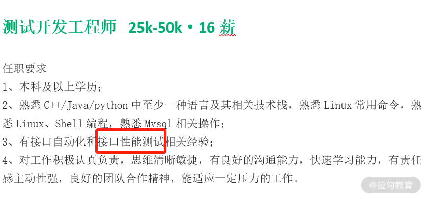

# 00 开篇词 为什么每个测试人都要学好性能测试？

你好，我是周辰晨，欢迎来到《说透性能测试》。

我从事测试工作 8 年，曾就职于京东、平安、易果生鲜等公司，目前在某大型数据科技公司担任测试专家，主导全链路性能测试及测试平台开发相关工作。其间，我通过问题总结出的种种单点经验逐渐转变为自己的方法论，我也渐渐跳出了原来对性能测试的局部认知，开始从全局的视角来看待性能测试。

像京东这样的头部互联网公司，网站承载着数以亿计的客户群，自然对性能有着很高的要求。在京东的工作也让我对性能测试有了更深的理解， **性能测试并不只是要一个结果，更多的是要从部署结构、代码链路、业务上下游等多角度来综合考量** 。

后来，我又经历了从 0 到 1 搭建性能测试体系的全过程，保证了双十一峰值期间 500 万下单量下 App 的正常运转；同时，这套测试体系也能够有效承接每分钟 150 万的访问量。

### 为什么要学性能测试

目前，最成熟的性能测试从业者一般都分布在各大互联网公司，这些公司对性能有着切实的需求，也具备深耕性能测试技术的土壤，所以往往能培养和聚集一批优秀的性能测试从业者。

那是不是说，其他公司就没有性能测试需求了呢？并不是的。

这两年，测试开发这个职位火了起来，许多公司招测试时都是在招测试开发。虽然招聘的不是专职的性能测试人员，但任职要求水涨船高，往往都需要你能够进行非功能测试，如性能测试、自动化测试。

我们来看一则快手的招聘信息，其中就明确要求求职者有性能测试的相关经验。



招聘信息来源拉勾网

我也看到很多测试同学会在简历上写：“熟悉 JMeter 的基本使用和性能测试。”

但当我在面试时问：“性能测试的基本过程是什么？”很多人说“我就是用 JMeter 做了脚本”， **至于“如何监控数据？”“需要监控哪些数据？”这样的问题，回答就更是模糊不清了** 。

下面我列举了几个其他的常见问题，你也可以对照自检：

- **只会使用 JMeter 但执行却不规范** 。在性能测试过程中，工具使用不恰当会影响到性能测试的结果。我见过很多因为工具使用不当导致的客户端瓶颈，让处理能力未达到预期的情况。很多测试没能及时发现是工具的原因，导致自己的专业能力备受质疑。
- **不会制定有效的性能测试目标** 。如果不会制定有效的性能测试目标，那测出来的数据也没有什么参考价值，因为你不知道能不能满足上线需求，也不能准确地评估线上风险，做完了性能测试依然留有一大堆问题。
- **不会定位和分析性能测试结果** 。测试脚本得到的数据并不能直接用来分析系统瓶颈，你只有通过监控去观察系统存在的异常点，然后根据异常点来重点监控相关组件，由表及里、层层深入才能找到根本原因。

事实上，现在 **很多人做性能测试只是在用工具写脚本、跑压测，最后出来一个结果，至于什么是性能测试，性能测试的过程是什么样的，性能测试目的是什么，缺少系统性的认知。** 性能测试真正的价值，并不在于你用工具完成了一份报告，而是通过对过程和结果的分析找到症结，帮助团队有效提升产品性能，比如提升了多少 TPS，降低了多少响应时间，节约了多少硬件成本，等等。

因此，我希望用这门课把性能测试的全过程讲给你听，不只带你玩转工具，学会制定一个有效的性能测试方案，更在把工具做到极致的基础上，和你分享如何监控数据才能迅速定位问题，如何做性能调优，攻克性能测试的重难点。

### 课程设计

性能测试中的很多标准其实都是非常主观的，你在网上看到的很多推导公式、二八原则之类的概念，如果不结合业务实际，盲目地学习，然后把这些作为性能测试的标准打开方式，很可能是有害无益的。

因此，本课程注重实战，我将以真实的互联网使用场景为导向，帮助你建立一个体系化的性能测试认知，分工具使用、场景分析、监控搭建和问题定位分析实践 4 个模块，为你全面展示性能测试的整个过程。 **模块一：性能测试的工具原理与使用** 。JMeter 是目前最流行的性能测试工具之一，它具备较为完善的基础功能，还具备丰富的可拓展性，因此这一模块我将带你玩转 JMeter。

你在这里不仅仅能学到如何使用 JMeter，还能学到 JMeter 的二次开发和调用 JMeter 的 API 完成性能平台开发的基础步骤。二次开发可以让你了解如何通过 JMeter 提供的接口进行拓展，实现自己的定制化需求，而掌握平台化的操作可以极大地提高团队协作效率。 **模块二：性能测试目标与场景分析** 。这个模块可以开启你从使用工具做性能测试到专业化性能测试的进阶之路。

我会聚焦正式开始性能测试之前应当明确的事情：如何制定性能测试指标；参考数据有哪些，怎么获取；常见的性能测试场景有哪些，如何通过这些场景来提高性能测试的覆盖率，等等。这些都是性能测试方案的组成部分，只有制定了正确的性能测试方案才能做出有效的性能测试。通过这一模块的学习，你可以理解性能测试的每一步，而不只是机械地执行上级派给你的任务。 **模块三：分层监控体系建设** 。这一模块的重点是监控和问题定位，包括如何做硬件监控、系统链路监控，如何打造可视化的监控报表。监控是性能测试必要的步骤，是你发现性能问题的“眼睛”。 **模块四：性能分析优化实践** 。我在前面提到，性能测试的标准常常是主观的，过往经验有时候不能照搬。因此，我会从服务端、中间件、数据层三个角度带你了解如何定位和优化问题，希望你看完以后可以结合自身工作场景进行性能调优。

很多公司担心直接在生产环境进行性能测试会影响用户体验、污染线上数据，其实这些都不是问题。我会从线上全链路性能测试的开展、组织和注意事项等多个维度来展开介绍，为你更好地实践提供思路。

### 讲师寄语

测试需要掌握越来越多的技能。对你来说，能多学会一门技能就可以胜任更多的工作，更可以“去同质化”，拥有更强的竞争力。

而且，性能测试作为非功能测试，其实是一个非常有价值、有成就感的工作，当你遇到性能瓶颈时，不是简单地说“去硬件扩容”。如果你的建议不只是简单地增加服务器成本，而是能够通过自己的定位和分析，以及一轮轮的调优和测试提升系统处理能力，一定更能够彰显你的技术视野，体现你工作的价值。

# 课前导读 | 性能测试全流程，你需要注意什么？

作为一个测试从业者，如何在有限的测试时间里保证交付物的质量一直是绕不开的话题，性能测试作为质量保障的一部分，自然也有着重要的地位。这一讲作为本课程的导读，我想带你相对全面地了解一下性能测试的整个过程，以及在这个过程中需要落地的事情。在后面的学习中，我们将一步步展开。

### 历史访问数据

历史访问数据，指的是什么类型的用户通过何种终端访问服务的接口次数。

为什么我要把访问数据记录放在第一个呢？线上作为“案发”的第一现场，保留现场的证据是非常重要的。性能测试说白了是模拟案发现场来寻找破案线索，访问数据记录用户轨迹、作为衡量性能的重要手段，自然是不可或缺的。绝大多数公司都会封装平台来采集历史访问数据，如果要看原始的访问日志，Nginx 日志也是一种方式（如下所示），不过原始的日志都需要加工处理来提取我们需要的信息。

```plaintext
120.204.101.238 - - [29/Nov/2020:14:09:22 +0800] "GET /v1/register HTv1TP/1.1" 200 150 "-
120.204.101.238 - - [29/Nov/2020:14:09:22 +0800] "POST /v1/login HTTP/1.1" 200 36 "-
120.204.101.238 - - [29/Nov/2020:14:09:22 +0800] "GET /hello/map HTTP/1.1" 200 202 
```

可能你能理解为什么要通过终端类型统计服务的接口次数，但却对为什么要统计用户的类型有些困惑？在绝大多数电商场景下，电商用户等级对应不同的权益、优惠券类型和数量，这些业务规则都会影响到性能测试的结果。很多人在做性能测试的时候会忽略这一点 。

### 需求管理

有了参考数据，我们就可以来看需求了，对需求接入和充分的分析能帮助你在测试之前获得更多的信息，也能制定出较为完善的性能测试方案。业务测试和性能测试都是从需求入手的，但业务测试会去了解相关的业务背景和产品方案；对于性能测试而言，则在需求来源、分析方面提出了更多的要求。

#### 需求来源

需求来源其实就是你这次性能测试的目的，调研清楚这个问题能帮助你更有针对性地获取数据，从而制定更为准确的性能目标。例如，我们这次的性能测试是为了应对“黑色星期五”的活动，那么就要考虑有没有以往的性能测试数据沉淀、当前有多少活跃用户数、网站交易数和活跃人数有没有相应的递增比例等和该活动有关的数据。

#### 需求分析

弄清楚了性能测试的目的，我们就要来做需求分析和梳理了。

需求分析是在原始数据中提炼出有效的性能参考数据，通过这些数据构建性能测试的模型，再通过模型形成测试步骤。性能测试模型和性能测试执行步骤也是性能测试方案的核心内容，它决定了你做性能测试是否准确，是否更符合真实场景。

#### 分析方案

在需求分析完成之后，就需要将你分析的内容提交一份性能测试方案了。性能测试方案的目的不仅仅在于让自己知道这次性能测试如何执行，也要让你的项目成员知道这次性能方案，它的执行周期、涉及的成员等，然后再一起评审这次方案中有没有不合理的地方。

### 性能测试环境管理

从目前的趋势来看，线上的全链路性能测试非常热门，但并不意味着就只做线上的性能测试了。关于性能测试环境，一般情况下我们会独立搭建一套，与业务测试环境相隔离，同时也能够在上线之前尽可能暴露一些代码中的问题。 **我曾看到过这样一个观点：线下性能环境与生产环境机器配置相差甚大，我们直接在生产上做性能测试就可以了，没有必要在测试环境中做** 。

这个观点引起了一部分人的赞成，但我认为这个说法不够全面。 **环境的配置高低是决定性能结果的一个影响因素，但不是全部因素** 。能够提前测试、提前暴露 bug，修复 bug 的成本也就越低，所以在线下必须有专门的性能环境，它可以帮助你提前发现内存泄漏、死锁等问题。更何况，这些问题的发现和修复与服务器硬件配置并没有直接联系，如果能够在线下提早用更低的成本解决是一种更优的选择。

如果没有做线下性能测试的情况下直接在生产上测试，对性能中的异常测试、高可用测试可能无法充分执行；同时，修复性能 bug 也需要功能上的回归，这些都增加了过程管理的复杂度。

### 监控管理

监控是发现性能问题的眼睛，没有监控，性能定位分析也就无从谈起了。监控的核心在于全面和深入，因此，我将监控管理分为了客户端数据监控、硬件资源监控、链路监控和业务规则监控，通过这几个层次的监控可以让你最大限度地避免监控死角，也为你调优分析提供充足的依据。

#### 客户端数据监控

性能测试中说的客户端一般是指测试机，测试机输出的数据是观察性能好差的关键指标。我推荐 JMeter+InfluxDB+Grafana 的框架，它具备展现直观、数据实时的特点，可以全面地展示监控的数据。

#### 硬件资源监控

基础硬件资源监控一般包含 CPU、内存、磁盘、网络等，常用的监控方式可以分为命令行监控和可视化监控。

- **命令行监控**

通过命令的监控我们能够以最直接的方式获取服务器的实时状态。以 Linux 服务器举例，top、vmstat、iostat、iftop 等都是性能监控常用的命令。

- **可视化监控** 可视化监控相对于命令行监控提供了更为丰富的图表展示，这样的话看起来更直观易懂，适合监控大屏的展示，能够将监控信息传递给项目组成员，但它需要提取数据之后计算，然后再展示，有一定的延迟，不如命令行监控直接。

Zabbix、Prometheus+Grafana 等都是可视化监控常用的手段，它们可以把数据持久化，能够调取过往时间轴的历史数据，一般在回溯、汇报、复盘时使用比较多。 **不管采用何种方式，在进行硬件监控时，都应该涵盖测试过程中所有的服务器** ，包括压测机、应用服务器、中间件服务器数据库服务器等。

#### 链路监控

链路监控是对代码本身的追踪，代码问题常常是问题产生的根因，所以关于代码的监控不可忽视。目前常用的代码链路追踪工具有 SkyWalking、PinPoint、Arthas，在后续的学习中我会向你介绍其中的一些，帮助你定位代码问题。

#### 业务规则监控

业务逻辑报错和用户息息相关并且用户是可以直接感受到的，比如商品库存不足、用户余额不足，它们会直接影响用户的体验。线上出现问题并不少见，重要的是如何第一时间得知并且解决这些问题。所以当出现问题即时发送报警邮件或者短信也是十分必要的，对于业务的监控同样不能忽视。

### 数据模型建设

为什么有数据模型这样的概念呢？数据模型的意义在于沉淀以往的历史数据，通过不同的维度去发现一些规律，我认为这也是性能测试领域中的一种探索方向。通过数据模型的建设，我们可以尝试在不同纬度建立数据之间的联系，从而发现数据间的规律，对未来的数据进行预测。这些纬度分为时间纬度和机器纬度。

#### 时间纬度

一般的电商每年至少有两次大促，618 和双 11。它们一般会详细记录每年总的成交额、网关访问次数、各个服务访问次数等，通过每年的活动力度、广告投放，以及数据团队来预测下次大促的成交金额和网站访问量等，这些数据也会间接帮助性能测试制定目标。

#### 机器纬度

机器纬度是一个什么概念呢？你可能会认为在线下两台机器测出来接口的处理能力是 100，线上有 10 台等配置的机器，就不用测试了，处理能力直接按照 5 倍去推算。

这其实是默认只要扩充机器系统的处理能力就会倍数增加，事实上是毫无道理的。不过你可以长期记录接口或者服务在性能测试环境的数据和生产环境中，相同场景下的压测数据，再进行长时间地跟踪对比，尝试发现其中是否能够存在一些规律。

### 技术建设

技术建设基于你的技术视野。关于技术的重要性，你可能了解，但理解得不够全面。无论是你写的测试脚本，还是在做的代码调优，其实它们都只是技术的一部分。我认为对于一名优秀的性能测试来说，需要具备以下 3 个方面的能力。

- **熟练掌握一门编程语言** 。测试很难说一定要掌握哪一种语言，但是熟练地使用一门语言可以帮助你迅速上手其他编程语言。
- **能够读懂服务端基本架构** 。如果你不懂服务端的架构，那基本只能根据你的性能测试工具去编写报告，了解不到更深层次内容。
- **能够根据性能测试需求，提出系统改造建议** 。性能测试与业务测试不太一样：业务测试基本是通过构造测试场景去满足业务规则，而性能测试，尤其是线上全链路性能测试，为了避免造成线上数据污染和影响真实用户访问，往往会改造系统去进行流量隔离和清理。

技术有个重要作用： **改善测试效率** 。测试讲究质效合一，质代表质量，效则是效率。

好的测试平台可以管理测试资料，固化测试过程，自动化测试执行，可视化测试结果。它可以增加团队成员之间的协作性，不要重复造轮子，提升团队能效；对于脚本管理和监督，测试结果的回溯也有重要作用。

### 总结

这一讲我带你了解了性能测试全过程中的要点，你可以对性能测试有一个大概的认识。在后面的学习中，我会将上述的知识结合我的经验来讲解。你可以从这一讲中看一下自己还有哪些需要夯实的知识，也可以看看公司的性能测试开展到什么阶段了，看在发展上还有哪些自己力所能及的地方。

对于全过程中需要注意的事情，除了我写的这些，你还有什么要补充的吗？欢迎在评论区留言。

下一讲，我将带你了解 JMeter 的核心概念，它是我们现在最流行的性能测试工具。
