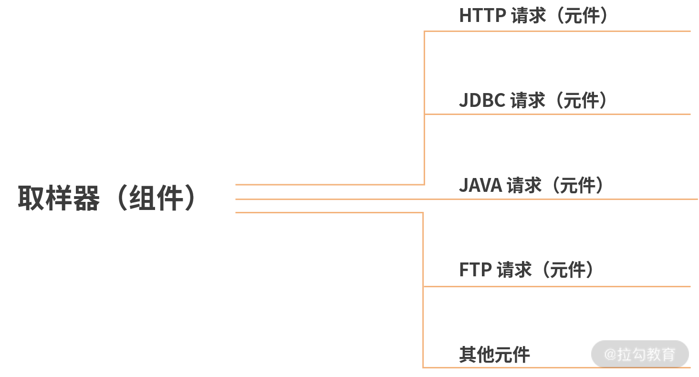
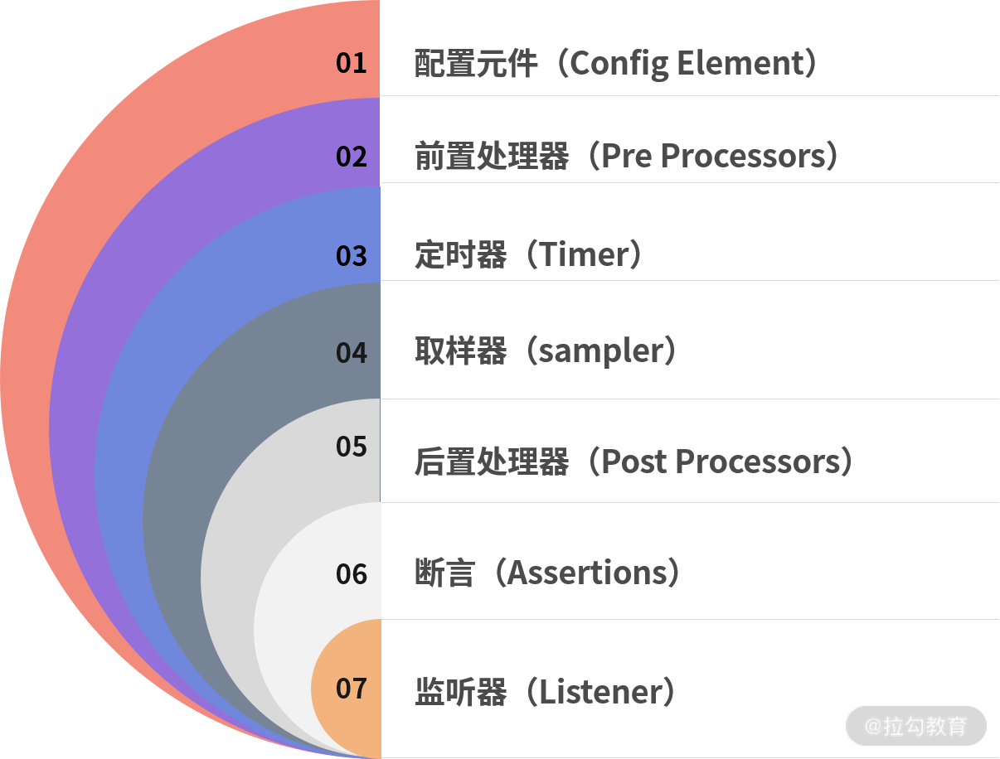
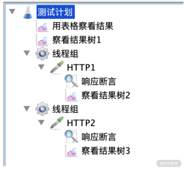
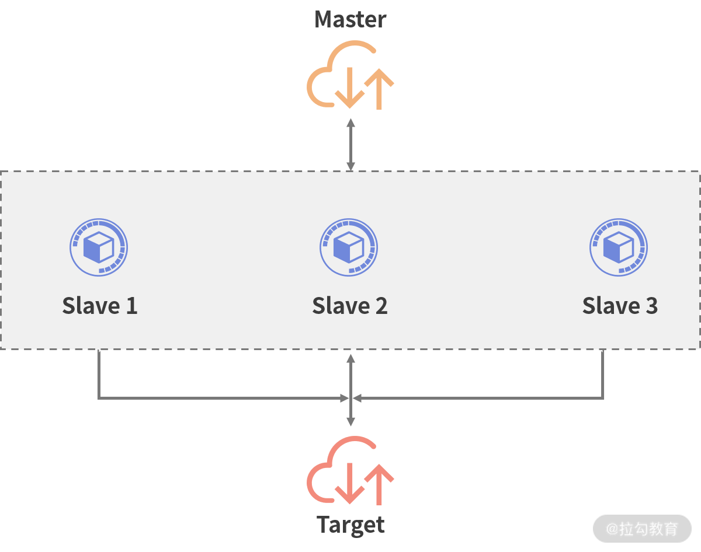

# 01 JMeter 的核心概念

从今天开始，我们将进入模块一的学习，在学习的过程中，希望你能够明白为什么 JMeter 要这么用并掌握 JMeter 的一些进阶用法。这一讲作为我们学习的第一讲，我将带你了解 JMeter 的核心概念，完善你对测试工具的认识。

### 为什么是 JMeter

性能测试有很多工具，JMeter、Loadrunner、Locust、nGrinder 都不乏粉丝。有人认为做性能测试重要的不是工具，是思想。但从学习实践的角度讲，工具在一定程度上决定了工作效率及协作模式。要成为一名测试专家，对工具一定是要精通的。

JMeter 原生的方式只支持单点工作，团队成员并不能很方便地互相检查脚本和查看报告。如果我们想改变这样的协作方式，就要对 JMeter 进行改造。如果不了解工具，改造也就无从谈起。

说了这么多，那我为什么会选择介绍 JMeter 呢？总的来说，它有以下 3 点优势。

- **开源免费、安装简易、多系统兼容** 。相对于 Loadrunner，JMeter 没有版权的困扰，脚本可以在 Windows、Linux、Mac 任意系统间切换，非常简单方便。
- **丰富的基础插件** 。相对于 Locust，JMeter 提供了较多的插件，可以减少重复造轮子的工作。Locust 的基础功能需要写代码实现，更适合定制性较强的测试场景，如游戏类测试，在敏捷化的测试团队中需要考虑到这部分的时间成本问题。
- **良好的拓展性** 。虽然 JMeter 已经有了丰富的基础插件，它本身还是提供了入口进行二次开发，以满足团队定制化的需求。同样，你也可以将 JMeter 平台化，通过平台化的操作来管理 JMeter，增强测试团队的协作性。

我们虽然是从 JMeter 工具开始的，但网上其实已经提供了很多实例来教你 JMeter 的基础使用，所以这一讲的重点是帮你厘清 JMeter 设计上的一些核心理念。我将从 3 个方面来介绍，分别是：线程、循环、Ramp-Up，组件和元件，以及分布式压测。

我们先来看线程、循环、Ramp-Up。

### 线程、循环、Ramp-Up

这是你在 JMeter 的线程组元件中的线程属性，线程组建立是你使用 JMeter 进行性能测试最基础的步骤，压力发起策略几乎都依赖于这个元件。

#### 线程与循环

我们先来看两张图，看看它们之间有什么区别。


图 1：设置图 A


图 2：设置图 B

从两张图的对比中，我们可以看到图 1 和图 2 的区别在于线程数和循环次数，一个是 1 和 10，一个则是 10 和 1。从结果来看，图 1 和图 2 都是发送了 10 个请求，那它们的核心区别是什么呢？ 我们不妨来看两段代码演示。

先来看图 1 的代码演示：

```plaintext
for(int j=0;j<10;j++) {
   System.out.println(Thread.currentThread().getName());//打印线程名字
}
```

这段代码我使用线程循环的方式打印运行线程的名字，运行后的内容如下：

```plaintext
Thread-0
......
Thread-0
Thread-0 //可以看到是基于同一个线程
```

再来看图 2 的代码演示：

```java
for(int i=0;i<10;i++){
    new Thread(new Runnable() {
        public void run() {
            System.out.println(Thread.currentThread().getName());
        }
    }).start();
} //示意代码
```

这段代码我是使用多线程的方式打印正在运行的线程，运行后效果如下：

```plaintext
Thread-0
......
Thread-8
Thread-9 //不同的线程
```

以上代码内容主要是打印线程的名字。不难看出，循环的方式是基于同一个线程反复进行 10 次操作，而多线程则启动了 10 个不一样的线程，虽然都是向服务器发送了 10 次请求，但这两种方式完成的时间和对系统的压力也完全不一样。

打个比方，我们需要掰 100 斤玉米，一组是 10 个人一起掰，一组只有 1 个人掰，每个人的速度如果是一致的，不用想就知道哪个组更快。这样的场景经常发生在使用 JMeter 利用接口造数据时，同样是造 1 万条数据，如果你觉得速度很慢，那你就可以考虑一下多线程了。但掰玉米用 10 个人的成本当然要比用 1 个人来得多，我们的压力场景也是这样的。通常压力场景都是多线程的，线程的多少也直接决定了对被测系统压力的大小。

#### Ramp-Up

Ramp-Up 其实是一个可选项，如果没有特殊要求，保持默认配置脚本即可。如果填 1，代表在 1 秒内所有设置线程数全部启动。不过这个是理论上的，实际启动时间也依赖于硬件的接受程度。如果硬件跟不上，启动时间自然也会增加。

在有的性能测试场景中，如果你不想在性能测试一开始让服务器的压力过大，希望按照一定的速度增加线程到既定数值，你就可以使用这个选项。比如我想用 10 个线程进行测试，启动速度是每秒 2 个线程，就可以在这里填 5，如下所示：


图 3：设置图 C

我们来通过运行展示一下。


图 4：生成线程数

我使用了监听器中的用表格查看结果插件。通过这组数据可以看到，每秒产生了 2 个新的线程，合计在 5 秒内完成。

### 组件和元件

了解了线程、循环和 Ramp-Up，接着来聊聊组件和元件。

#### 组件和元件的关系

要解释组件首先就要说元件。我们看图 4 中的 HTTP 请求，其实这就是一个实际的元件。同样作为元件的还可以是 JDBC 请求、Java 请求等，这一类元件我们统一称为取样器，也就是组件。我用一个示意图来表示组件和元件的关系：



图 5：组件和元件关系图

如图所示，HTTP 请求、JDBC 请求等元件都从属于取样器。

#### 组件的作用

JMeter 有多种组件，我们重点看下这七类： 配置元件、取样器、定时器、前置处理器、后置处理器、断言、监听器。我们来看下它们各自的作用。

- **配置元件** ：用于初始化变量，以便采样器使用。类似于框架的配置文件，参数化需要的配置都在配置元件中。
- **取样器** ：承担 JMeter 发送请求的核心功能，支持多种请求类型，如 HTTP、FTP、JDBC 等，也可以使用 Java 类型的请求进行自定义编写。
- **定时器** ：一般用来指定请求发送的延时策略。在没有定时器的情况下，JMeter 发送请求是不会暂停的。
- **前置处理器** ：在进行取样器请求之前执行一些操作，比如生成入参数据。
- **后置处理器** ：在取样器请求完成后执行一些操作，通常用于处理响应数据，从中提取需要的值。
- **断言** ：主要用于判断取样器请求或对应的响应是否返回了期望的结果。
- **监听器** ：监听器可以在 JMeter 执行测试的过程中搜集相关的数据，然后将这些数据在 JMeter 界面上以树、图、报告等形式呈现出来。不过图形化的呈现非常消耗客户端性能，在正式性能测试中并不推荐使用。

#### 组件的顺序

了解正确的组件执行顺序可以帮助你明白在什么情况下应该添加什么组件，而不会添加错误的组件造成不必要的麻烦。我将它们做了一个排序，如下图所示：



图 6：组件顺序

搞懂了组件顺序，你在测试前准备脚本生成参数化数据时，就可以在前置处理器中寻找相关元件；在要提取接口返回的数据，就可以在后置处理器中寻找相关插件，而不是在其他地方寻找数据，浪费时间。

我经常看到有的测试人员在需要在后置处理器中使用 BeanShell PostProcesor 的时候，错误地用了前置处理器中的 Beanshell PreProcessor，导致系统报错，无法实现预期的功能，甚至是测试无法进行下去。

#### 元件作用域

以上说的都是组件相关的东西，这里就来看看元件作用域。我们先来看一张图：



图 7：结果树 1、2、3

在图中可以看到，我在不同位置放了 3 个一样的元件“查看结果树”（为了方便区分，我分别标记了 1、2、3）。运行后发现，查看结果树 1（图 8）里面显示了 HTTP1 和 HTTP2，而插件结果树 2 里只有 HTTP1，查看结果树 3 里面只有 HTTP2。


图 8：查看结果树 1 的显示图

这是为什么呢？这就要说到元件作用域了。

通过截图可以发现 JMeter 元件除了从上到下的顺序外，有还具备一定的层次结构，比如图 5 中的响应断言和查看结果树，它相对于取样器存在父子组件的关系，说白了就是 HTTP 元件对取样器有效的区域，比如查看结果树 2 是 HTTP1 请求的子节点，那它就只对 HTTP1 生效；如果父节点是测试计划，那就会对测试计划下的 HTTP1 和 HTTP2 都生效。

### 分布式压测

压测就是 JMeter 通过产生大量线程对服务器进行访问产生负载，监听服务器返回结果并进行校验。在大部分情况下，用单台 JMeter 进行性能测试或者自动化测试是可行的，但在多线程运行过程中可能存在性能瓶颈，很多人在排查定位问题时经常会漏掉这一点。

从我的工作经验出发，单机的 JMeter 最好将线程数控制在 1000 以内；如果超过了 1000 线程，则建议使用 JMeter 分布式压测，这在一定程度上可以解决 JMeter 客户端自身形成的瓶颈问题。

在分布式 JMeter 架构下，JMeter 使用的是 Master 和 Slave。

#### Master

Master 负责远程控制 Slave（负载机）。分布式通常有多个 JMeter 节点，其中一个节点承担 Master 的作用。Master 通过发送信号控制节点机的启动和停止，并进行收集节点机的数据等操作。

#### Slave

Slave 一般也叫负载机，主要是发起线程来访问 target 服务器。一般在 Slave 节点机上先启动代理 jar 包，控制机远程连接，负载机运行脚本后对 Master 回传数据。流程示意图如下：



图 9：Slave 流程示意图

JMeter 的 Master 和 Slave 配置也比较简单。将 JMeter 的 bin 目录下的 jmeter.properties 文件配置：IP 和 Port 是 Slave 机的 IP 以及默认的 1099 端口。如下所示：

```plaintext
remote_hosts=ip:1099,ip:1099
```

Slave 启动 jar 包之后，默认会启动 1099 端口。Master 配置完成启动后便可以建立和 Slave 连接，从而进行控制和收集等操作。

一般来说，JMeter 分布式压测都是作为 **缓减** 客户端瓶颈的重要方式。这里我要强调“ **缓减** ”，因为在性能测试领域中不存在一种技术手段能够保证永远没有问题。随着公司的体量发展，对性能的要求也是水涨船高。JMeter 自带的分布式压测作为一种缓解客户端性能问题的方式，并不是万能法则。

### 总结

本讲我主要讲解了 JMeter 的核心设计理念，希望能够让你能对 JMeter 的核心概念有一定的理解。JMeter 作为目前最流行的性能测试工具，它本身提供的插件可以满足绝大多测试场景的使用，并且它也提供了二次开发的接口和 API，使用起来非常灵活。同时它分布式的使用方式也能够让你在较大程度上缓减客户端瓶颈。
