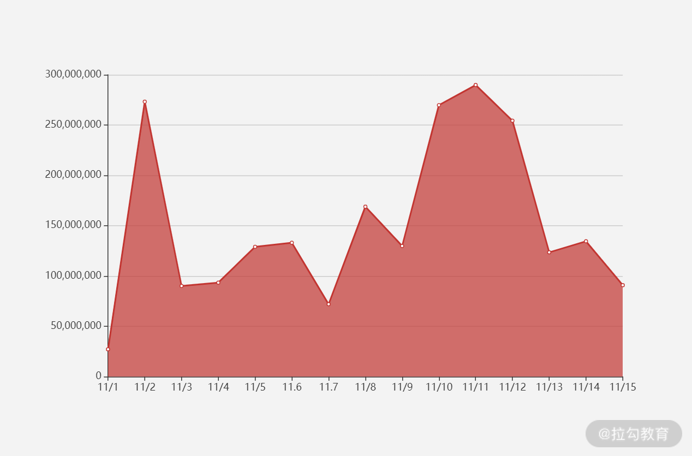
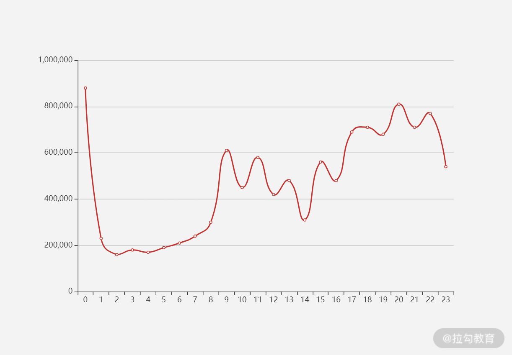
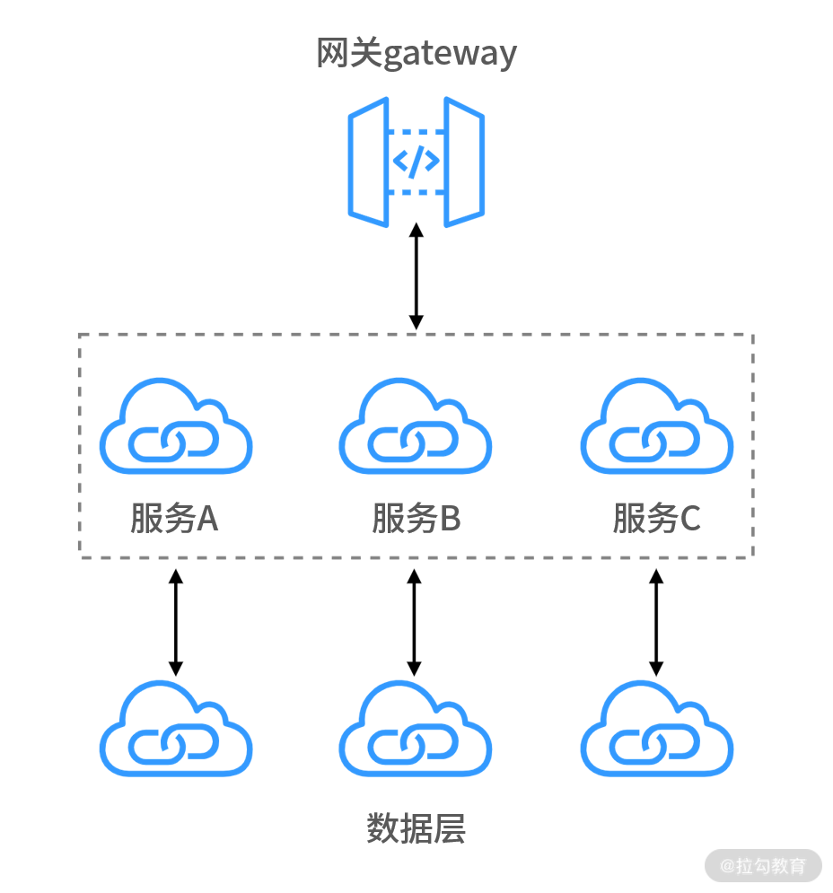
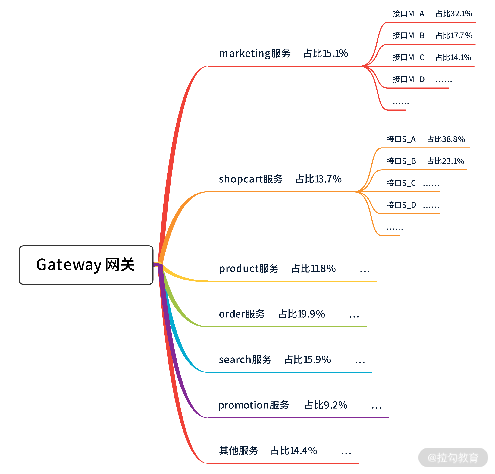

# 07 你真的知道如何制定性能测试的目标吗？

在上一讲中，我介绍了高性能中间件 Nginx，相信你已经有了一定层次的了解，这一讲我将带你学习如何制定性能测试的目标。

之前有同学咨询过我，在测试执行过程中他并不清楚测试得到的结果到底能不能满足这次活动的需求。经过我的追问，发现他连本次活动规则涉及的模块和接口都不是十分清楚，像这样的测试就是没有做性能测试目标的分析。虽然说做了性能测试，但几乎可以说是无效测试，因为 **没有做目标分析的性能测试会与真实的活动场景相差甚远** 。

举一个我遇到的典型案例，一次大促前，在性能测试过程中测出来的数据指标都还不错，然而大促时并没有达到测出来的指标，服务就宕机了。在分析原因后，我们发现有一个接口平时访问量很低，所以并没有纳入性能测试的范围。但这个接口存在大 Key，在大促中达到中间件流量阈值，导致了网站的不可用。

所以说， **测试目标极其重要，是性能测试执行的先决条件** 。

制定目标可以确定既定的测试范围内需要达到的 **性能预期结果** 。制定目标后，你才会对本次性能测试的核心目标有清晰的认知，并指导你进行后续的测试活动，包括测试所需要的资源以及测试的停止条件等。

在回答如何制定性能测试指标之前，要搞清楚我们衡量性能测试的指标都有什么？通过本讲的学习，你将会对性能测试指标如 TPS、响应时间、报错率有更深入的了解，不仅仅知道它们各自代表的含义，还会知道它们是如何制定出来的。

### 衡量指标 1：TPS

衡量性能测试的指标，很多人会说是 **并发** 。并发指同一时间节点发生的事情，但这个同一时间并不是一个标准的度量，也不是我们性能测试直接测量出来的指标。在性能测试中往往是通过在工具中增加虚拟用户数得到的接口每秒的调用量去衡量。

在实际生产中，无论是网关还是服务通常都是记录一定时间内的访问请求次数，所以在业内，性能测试往往以 **TPS** （Transactions Per Second）作为最重要的度量指标，因为它具备 **可度量** 和 **通用性** 的特质。

- 可度量指 TPS 是真实客观且明确的衡量指标；
- 通用性指无论在运维角度还是测试角度，TPS 都可以达成一致的定义。

### 衡量指标 2：响应时间

除了 TPS，第二个比较重要的衡量指标是 **响应时间** 。响应时间和用户体验密切相关，我们往往把一次请求从客户端发出到返回客户端的时间作为响应时间。在实际工作中，我们会以 TPS 的量级来限制响应时间必须在多久之内。以下图 1 为例，从最左侧的客户端到最右侧的数据持久化再返回到客户端，这样一个来回的过程就是一次完整的请求响应时间。

图 1：请求响应的过程图

上图描述的是在正常情况下的响应流程，但当你有了一定的性能测试实践之后，你会发现这样的过程并不是绝对的。比如有的业务第一次在数据库请求到数据后，应用层本地缓存会将数据存储在应用服务器上，也就是接下来在缓存有效时间内不会再去数据库取数据，而是在应用层得到数据后就会直接返回，所以响应时间会比第一次低不少，这也是随着性能测试的进行响应时间变低的原因之一。

### 衡量指标 3：报错率

这个指标也是比较重要的，报错率的计算方式是在统计时间范围内 **不符合返回期望的请求数除以总共的请求数** 。在测试中，这一指标不符合期望的话一般体现在 **对结果的校验上** ，我一般会分为三个层面进行校验：

- **状态码的校验** ，这在性能工具中不需要特别设置，如 4XX、5XX 这样的状态码会直接报错；
- **业务层面的校验** ，为了保证业务的基本准确性，会通过返回的数据包进行校验；
- **数据库校验，** 相对于业务测试，性能测试的每一次请求不会都做数据库校验，这样会影响性能测试结果，我一般会在一轮性能测试之后去统计落库数据的数量和状态是否正常。

以测试登录为例：

- 如果用户名和密码不匹配会返回一段错误报文，不需要走正确流程中的校验逻辑；
- 如果用户名和密码匹配，一般会有多层校验。

这二者存在较大的差别，在实际压测过程中也存在业务没有校验，但已经发生错误的情况，这是不能及时发现的。

### 如何制定性能测试的指标

综上所述，我认为衡量性能最重要的三个指标是 **TPS** 、 **响应时间** 、 **报错率** 。那如何制定性能测试的指标呢？你的依据是什么呢？我列举几个面试者的常见回答：

- 我是根据二八原则，老板说我们百万日活，80% 的用户在 20% 的时间段里访问，响应时间是根据业内的 2-5-8 来制定；
- 我是根据竞品数据分析，他们产品的 PV 应该是百万级，所以我们的产品也是这么制定的；
- 这个指标是业务定的，他们和开发讨论过，应该没什么问题。

以上回答不仅从道理上讲有些牵强，而且也没有任何制定性能测试可以参考的有效信息。性能测试是一项非常严谨的工作，通过间接或者普适规则不可能满足具体特定的分析，所以对这个问题的理解基本可以判断一位同学是否真正做过性能测试。

那有人会问：“你是如何做性能测试目标分析的呢？”

对我来说，性能测试的目标可以分为 4 种。

第一种是 **以衡量系统的处理能力为核心目标** 。这一般是性能测试的主要目标，用来评估当前系统的处理能力和容量方面的规划。我认为评估这个目标最重要的是对数据的客观分析，那我们需要什么样的数据呢？

对于每一个接口都会有 **访问计数** ，这是目前业内比较常见的，也是衡量接口访问能力最准确的指标之一。一般大公司会自己开发相应的监控工具，发展中的公司也会使用一些开源或者商业工具进行监控。有了工具之后我们应该从哪些维度去统计这些数据呢？

通常我们会通过 **时间维度** 和 **服务维度** 来统计。

- **时间维度** 根据经验，我们一般会考虑以大促当天的访问量来测试，但从分析的角度，一般前后半个月的时间都应该考虑在测试范围内。

首先我们需要确定大促前后哪些天数的访问量是比较高的，这里我会先以天作为维度，如图 2。可能你比较疑惑，为什么其他节点也比较高呢？

图 2：大促前后访问量

想想一些电商大促的具体活动场景就不会感到奇怪了。现在很多电商，如京东的“双十一”活动可能从 11 月 1 日就开始了，其中穿插了一些品类活动和推送，所以有流量冲高的情况也是比较正常的。因此，我一般会对 **最高峰** 和 **次高峰** 都进行分析。

当我们选取了天数之后，再以小时为维度，确定哪些时间节点的访问量是比较高的。图 3 中，我选取了其中一天，按照小时分布再统计。这样一来，我们就得到了时间维度上需要的数据。

图 3：各小时访问量

- **服务维度** 那什么是服务维度呢？以目前比较流行的电商微服务架构为例，我一般会做服务级别的拆分。先画一个示意图，方便你对微服务有个简单了解。

图 4：微服务架构图

网关一般是请求进入应用层的第一个入口，也是统计网站入口访问量的方式之一。当我们的请求通过网关之后会下发到各个业务应用服务，如图 4 中所示的服务 A、B、C，我会按照确定的时间节点去统计各个服务的访问量数据。完成服务级的访问数据统计之后，我会继续按照时间维度统计服务下的接口访问数据。你可以看到，每个服务和每个接口的调用比例都不一样，如图 5 所示。

图 5：各个服务的调用比例

我曾看到有的同学使用 JMeter 写性能测试脚本时，用接口串联的方式编写，比如登录 → 浏览商品 → 添加购物车，这样一个流程的方式。这也就默认登录的用户浏览了商品后都会添加购物车，这是一种典型的自动化测试的思维，在性能中不会存在这样的同等分布。

一般来说，在同一个时间点都会有不同的比例，比如早晨 8 点，有 1.2w 次登录请求、4w 次浏览商品的请求，而下午这个数据就会产生变化。所以我会按照服务入口将 **接口调用** 也统计出来，结合时间维度和服务维度做出性能测试的常见模型。

说到这里你可能会有两个问题。 **问题一** ： **选取了这么多时间节点** ， **应该会产生多个比例模型吧** ？ **我们需要对每一个比例模型都进行测试吗** ？

确实会产生多个比例模型，而且每个都需要测试，因为线上存在这样的访问趋势，我们应当都要覆盖。 **问题二** ： **你上面说的步骤好多** ， **感觉需要很多时间** ， **听说流量复制能一键解决** ？

流量复制是不能解决指标制定的问题的，并且在落地过程中还会花费大量的时间和人力成本，所以关于目标的制定和分析我们需要一步一步进行，花费一定的时间是难以避免的，并且线上未来的访问趋势只能尽可能覆盖，无法完全预测到。这一讲不对这部分内容展开描述，如果有兴趣可以了解下 goreplay、jvmsandbox 等技术。

上面是我描述指标分析的第一种类型也是最常见的类型：从 **处理能力的角度** 去说如何制定性能测试的目标。那是否还有其他类型的性能测试目标呢？

我们来看第二种性能测试目标。一个项目刚刚上线，用户访问量还不是很高，这时我们会更关注 **系统的健壮性** ，如内存泄漏、并发死锁、超卖问题，这些也需要在性能测试方向上进行。

值得一提的是，完成这部分性能测试并不需要在生产上进行，在线下性能测试环境也可以模拟，甚至能够更早更快地发现问题。我们都明白在测试领域，提早发现问题修复成本是最低的。如果你在上线后才发现这些问题，然后再去修复，修复完还要经过多轮的业务测试，这样一来，不管是时间成本还是人力成本都会大幅度增加。

第三种目标是 **系统的稳定性。** 关于如何维护系统稳定性一直是一个比较大的话题。性能测试也是保障稳定的一部分，我认为，性能测试场景中的稳定性测试包含 2 个方面。 **一个是正确率** ，这不一定要在高并发下完成，但我们要保证业务长时间运行的正确率能够达到 99.9999% 以上； **另一个是处理能力** ，可以选取性能测试场景中的混合场景来执行（这部分会在第 08 讲中详解），这里我们需要观察两点：

- **整体处理能力** 是否稳定，会不会存在处理能力的下滑；
- **接口之间的比例** 是否稳定，随着时间的进行接口之间的访问比例会不会偏离。

第四种性能测试目标是 **专项能力是否达标。** 刚刚列举的几乎都是以业务接口为测试目标，其实在实际的压测活动中，也存在中间件甚至硬件的性能测试，比如 Nginx、Kafka、防火墙等。这些往往不会作为最终的性能测试目标，但会在全链路排障和专项测试中有所涉及。这部分的性能测试基本上是用来判断当前的环境配置的节点数，以及配置所能达到的最大处理能力，为全链路性能测试提供数据支撑。

### 总结

在性能测试领域最直接的衡量指标是 TPS、响应时间和报错率，三者相互依赖，不能孤立地只分析某一项指标。

性能测试是一项严谨的工作，我们要熟悉制定的方法，一切以 **数据作为基础** ，拒绝在实践中凭感觉拍板的现象。基础数据建设也是性能工作的一部分，当我们拿到数据之后需要根据上文描述的时间维度和服务维度去分析，原则上分析的颗粒度越细越好。
