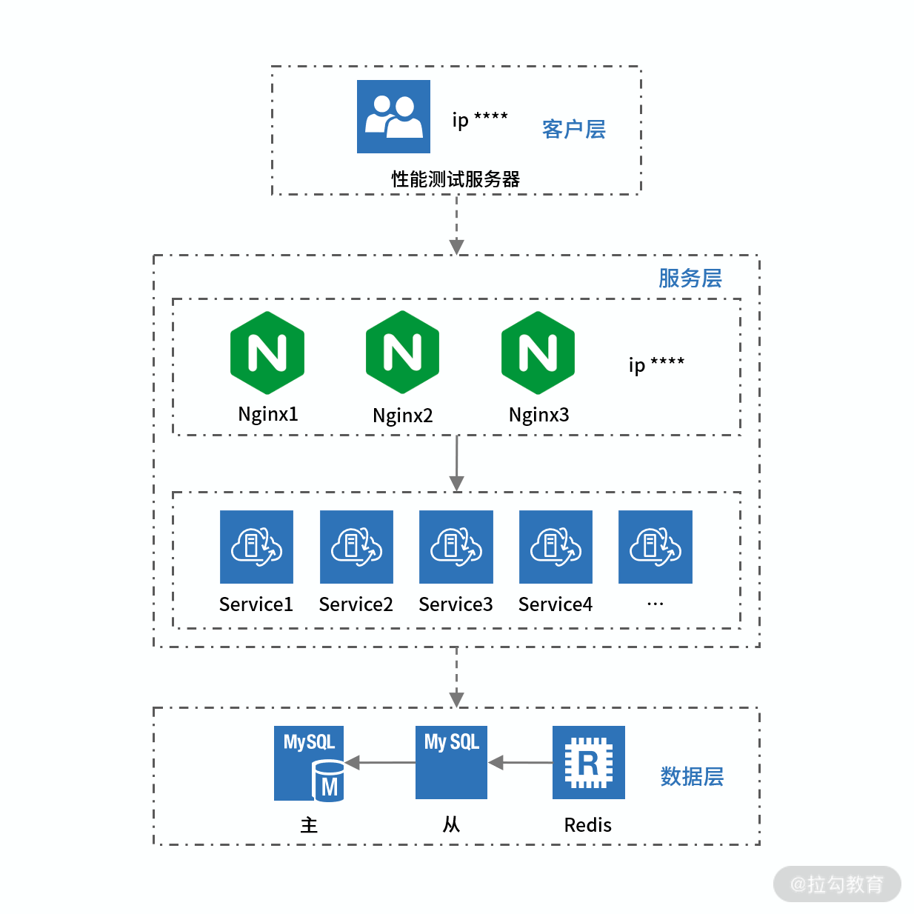
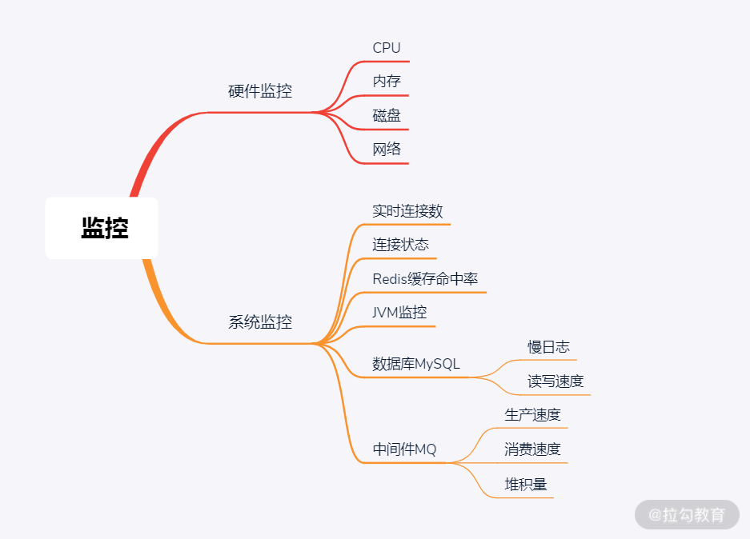
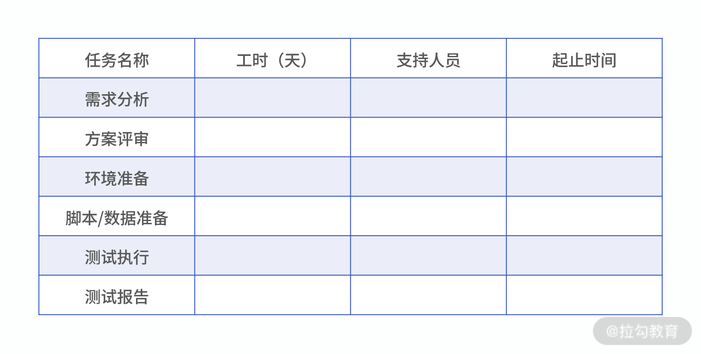

# 09 如何制定一份有效的性能测试方案？

上一讲我们学习了性能测试的场景，并且明确了每个场景的核心意义，这一讲我将带你学习如何做好一份性能测试方案，相信你对测试方案这个概念并不陌生，那如何做好一份性能测试方案呢？这个方案能解决什么问题呢？这一讲我们来一起探索。

### 什么是性能测试方案？

性能测试方案，通俗一点说就是 **指导你进行性能测试的文档** ，包含测试目的、测试方法、测试场景、环境配置、测试排期、测试资源、风险分析等内容。一份详细的性能测试方案可以帮助项目成员明确测试计划和手段，更好地控制测试流程。

#### 性能测试方案的要点以及解决的问题

- 为测试活动做计划，每项测试活动的对象、范围、方法、进度和预期结果会更透明化。
- 制定出有效的性能测试模型，能够排查出性能问题，从而更符合真实场景。
- 确定测试所需要的人力、时间和资源，以保证其可获得性、有效性。
- 预估和消除性能测试活动存在的风险，降低由不可能消除的风险所带来的损失。

### 测试方案需要包含哪些内容？

性能测试方案是在你正式进行性能测试之前的工作，通过前几讲的学习你已经知道了性能方案中的必备内容。

#### 1.制定性能测试目的

性能测试目的是你做一次测试首先要考虑的内容。是要完成既定的指标，还是验证超卖问题，抑或是验证并发下的稳定性问题。如果是验证指标，你的指标如何制定，拿到业务访问数据如何转化成为性能测试模型，在\[《07 | 你真的知道如何制定性能测试的目标吗？》\]中已经说得比较详细了。

#### 2.性能测试场景梳理

对于性能测试有哪些场景，每种场景的目的是什么，\[《08 | 性能测试场景的分类和意义》\]已经给了你答案，你需要根据性能测试的目的进行场景的设计。

那除了这些，性能测试方案还需要包含哪些内容呢？

#### 3.确定被测业务的部署架构

被测的业务部署架构是什么意思呢，简单来说就是被测服务涉及哪些 **组件** ，每个组件部署在哪些服务器上，服务器的配置是怎样的。你需要画一个部署架构示意图，有了这张图，才能知道如何做到全貌监控，以及遇到问题从哪些服务入手。

我用一个自己画的架构示意图来说明这个问题，如下图所示，这是一个经典的链路：从客户端发起到服务端，服务端从代理层到应用层，最后到数据层。需要注意的是，你需要明确被测的环境里的各个服务有多少节点，比如客户层的压测机节点有几台，分别在哪个网段。同理我们可以去调研服务层和数据层的节点。

#### 4.对测试数据进行调研

关于测试数据调研，包含了非常多的内容，对于业务测试来说 **数据调研** 就是获取必要的参数来满足既定的场景可以跑通。那对于性能测试来说，需要做哪些方面的数据调研呢，我带你一一解读。

**（1）数据库基础数据量分析** 数据库的基础数据量就是 **目前线上数据库实际的数据量** ，为什么要统计基础数据量呢？很多公司往往有独立的性能测试环境，但是数据库的数据量与线上相比差距较大，可能出现一条 SQL 在性能测试环境执行很快，但上了生产却会很慢的问题。这就导致测试觉得该测的都测了，但上了生产还是会有问题出现。

这种问题可能会因为 **索引缺失** 以及性能环境数据量较少而不能将问题暴露出来，所以在性能测试环境下的数据量一定要和生产上一致。为了达到这个目的，有的公司可以将生产数据脱敏后备份，有的则需要你自己写脚本来根据业务规则批量造数据。 **（2）压测增量数据分析** 除了数据库的基础数据量，我们也需要考虑一轮性能测试下来会 **增加多少数据量** 。往往增加的数据量最终落到数据库，可能会经过各种中间件如 Redis、Mq 等，所以涉及的链路可能存在数据量的激增，所以这方面需要根据增加情况制定相应的 **兜底方案** 。 **（3）参数化的数据分析** 关于参数化，我相信你已经通过\[《02 | JMeter 参数化策略》\]有了深入的了解。在这里，我还想抛出一道思考题，如何参数化订单号，你可以分别从读写接口两个层面写出你的思考或者实践。 **（4）冷热数据的分析** 以我的从业经历来讲，能够在方案阶段考虑到 **冷热数据分布** 的公司并不多，往往都是从性能测试结果的一些异常点或者实际产线出现的问题去追溯。接下来我就带你了解下什么是冷热数据，以及如果不对其进行分析可能会带来什么影响。

- **冷数据** 是指没有经常被访问的数据，通常情况下将其存放到数据库中，读写效率相对较低。
- **热数据** 是经常被用户访问的数据，一般会放在缓存中。

在性能测试的过程中，被频繁访问的冷数据会转变为热数据。如果参数化数据量比较少，持续压测会让 TPS 越来越高。而在实际大促情况下，往往有千万级的用户直接访问，但大多都是冷数据，会存在处理能力还没达到压测结果的指标，系统就出现问题的情况。所以在需求调研时，你也需要考虑数据会不会被缓存，缓存时间多久的问题。

#### 5.业务规则的调研

对于性能测试而言，业务规则的了解也是不可或缺的。一些公司的性能测试组在进行压测时，业务线的测试也需要协助支持压测的进行，由此可以体现业务的重要性。

对业务的充分了解不仅可以帮助你提高写脚本的效率，也可以帮助你构造更为真实的性能测试场景。举个简单的例子，你模拟下单的时候是否考虑商品属性，比如是单一商品还是套餐商品，下单的时候购物车里有几件商品，这些都会影响性能测试的结果。

#### 6.测试监控的内容确认

监控是你做性能测试的重点内容之一，一旦出现问题，第一反应就是 **查监控** ，关于监控管理建设我在\[《01 | JMeter 的核心概念》\]中也有所陈述。对于性能测试方案，不仅需要罗列清楚你所需要的监控工具和访问方式，同时也需要层次分明地传递你监控的内容。对我来说做监控最基本的一个关键词： **全** 。

怎么去理解“全”呢？先举一个典型的例子，有时候做一个新的项目，询问支持的同学有没有部署监控，他们说已经部署了，但等你真正使用的时候发现只监控了一台应用服务器的 CPU。这个例子我相信大多数人都似曾相识，所以我说的全，至少包含两个方面：

- 涉及所有服务器；
- 涉及服务器基础监控，包括 CPU、磁盘、内存、网络等。

硬件资源的监控只能算一个层面。那完成一次性能测试都需要监控什么呢，我用一个导图给你做一个概览。

监控还有个很重要的点是 **设置阈值来报警** ，无论是线上和线下的性能测试，报警功能都是必需的。因为通过人工的观察，往往不能以最快的速度发现问题。一旦能够及时报警，涉及的人员就可以快速响应，尽可能降低风险。

#### 7.性能测试排期涉及的人员

一般来说测试是上线前的最后一道关卡，也是发现问题的重要角色，所以项目上的风险会在测试阶段集中爆发。性能测试作为测试中的一部分，也会面临类似问题，这也考验你的项目管理能力。而且性能测试需要 **大量的数据和专门的环境** ，这部分的工作内容和资源需要更多支持，所以在你的性能测试方案中，首先要标明开展的阶段和日期，还要明确主负责人和协调人员。在此基础上还需要面对面 check 和落实。

你可以参考如下的表格，具体的内容需要根据公司的情况来确定。这些任务并不是从上到下依次执行，可能存在并行的情况，比如某一些公司环境是由运维人员统一部署，这部分内容就可以和性能测试需求分析一起进行。

### 总结

关于如何打造性能测试方案就讲到这里了，通过本讲的学习，你已经了解了做一份性能测试方案的基本要素和关键点。性能测试方案对于一些公司来说可能只是一份流程化的文档，但对于测试个人来说，这部分内容可以体现出你的思考和计划。尤其对于性能测试新手来说，一定要充分思考每项的意义，这样你才能快速提升。
