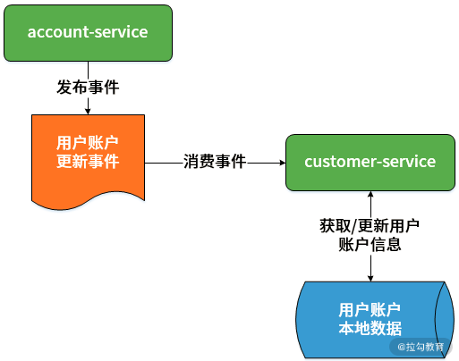
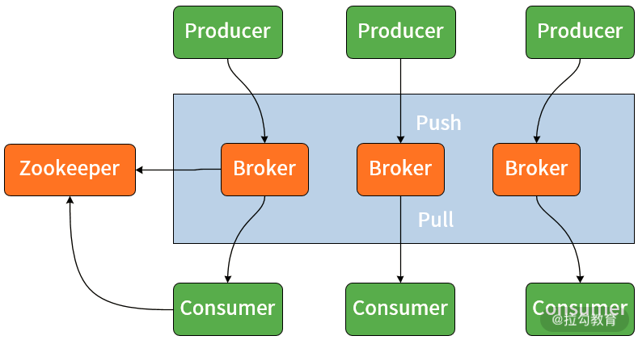
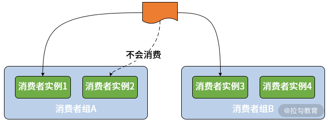

# 14 消息驱动：如何使用 KafkaTemplate 集成 Kafka？

从今天开始，我们将进入 Spring Boot 中另一个重要话题的讨论，即消息通信。

消息通信是 Web 应用程序中间层组件中的代表性技术体系，主要用于构建复杂而又灵活的业务流程。在互联网应用中，消息通信被认为是实现系统解耦和高并发的关键技术体系。本节课我们将在 SpringCSS 案例中引入消息通信机制来实现多个服务之间的异步交互。

## 消息通信机制与 SpringCSS 案例

在引入消息通信机制及消息中间件之前，我们先来梳理下 SpringCSS 中的应用场景。

### SpringCSS 案例中的消息通信场景

在 SpringCSS 案例中，一个用户的账户信息变动并不会太频繁。因为 account-service 和 customer-service 分别位于两个服务中，为了降低远程交互的成本，很多时候我们会想到先在 customer-service 本地存放一份用户账户的拷贝信息，并在客户工单生成过程时直接从本地数据库中获取用户账户。

在这样的设计和实现方式下，如果某个用户的账户信息发生变化，我们应该如何正确且高效地应对呢？

**此时消息驱动机制从系统扩展性角度为我们提供了一种很好的实现方案。**

在用户账户信息变更时，account-service 首先会发送一个消息告知某个用户账户信息已经发生变化，然后通知所有对该消息感兴趣的服务。而在 SpringCSS 案例中，这个服务就是 customer-service，相当于是这个消息的订阅者和消费者。

通过这种方式，customer-service 就可以快速获取用户账户变更消息，从而正确且高效地处理本地的用户账户数据。

整个场景的示意图见下图：



用户账户更新场景中的消息通信机制

上图中我们发现，消息通信机制使得我们不必花费太大代价即可实现整个交互过程，简单而方便。

### 消息通信机制简介

消息通信机制的整体工作流程如下图所示：


消息通信机制示意图

上图中位于流程中间的就是各种消息中间件，**消息中间件** 一般提供了消息的发送客户端和接收客户端组件，这些客户端组件会嵌入业务服务中。**消息的生产者** 负责产生消息，在实际业务中一般由业务系统充当生产者；而 **消息的消费者** 负责消费消息，在实际业务中一般是后台系统负责异步消费。**消息通信有两种基本模型**，即发布-订阅（Pub-Sub）模型和点对点（Point to Point）模型，发布-订阅支持生产者消费者之间的一对多关系，而点对点模型中有且仅有一个消费者。

上述概念构成了消息通信系统最基本的模型，围绕这个模型，业界已经有了一些实现规范和工具，代表性的规范有 JMS 、AMQP ，以及它们的实现框架 ActiveMQ 和 RabbitMQ 等，而 Kafka 等工具并不遵循特定的规范，但也提供了消息通信的设计和实现方案。**本节课我们重点关注 Kafka，后续的两个课时中我们再分别介绍 ActiveMQ 和 RabbitMQ。** 与前面介绍的 JdbcTemplate 和 RestTemplate 类似，Spring Boot 作为一款支持快速开发的集成性框架，同样提供了一批以 -Template 命名的模板工具类用于实现消息通信。对于 Kafka 而言，这个工具类就是 KafkaTemplate。

## 使用 KafkaTemplate 集成 Kafka

在讨论如何使用 KafkaTemplate 实现与 Kafka 之间的集成方法之前，我们先来简单了解 Kafka 的基本架构，再引出 Kafka 中的几个核心概念。

### Kafka 基本架构

Kafka 基本架构参考下图，从中我们可以看到 Broker、Producer、Consumer、Push、Pull 等消息通信系统常见概念在 Kafka 中都有所体现，生产者使用 Push 模式将消息发布到 Broker，而消费者使用 Pull 模式从 Broker 订阅消息。



Kafka 基本架构图 **在上图中我们注意到，Kafka 架构图中还使用了 Zookeeper。** Zookeeper 中存储了 Kafka 的元数据及消费者消费偏移量（Offset），其作用在于实现 Broker 和消费者之间的负载均衡。因此，如果我们想要运行 Kafka，首先需要启动 Zookeeper，再启动 Kafka 服务器。

在 Kafka 中还存在 Topic 这么一个核心概念，它是 Kafka 数据写入操作的基本单元，每一个 Topic 可以存在多个副本（Replication）以确保其可用性。每条消息属于且仅属于一个 Topic，因此开发人员通过 Kafka 发送消息时，必须指定将该消息发布到哪个 Topic。同样，消费者订阅消息时，也必须指定订阅来自哪个 Topic 的信息。**另一方面，从组成结构上讲，一个 Topic 中又可以包含一个或多个分区（Partition），因此在创建 Topic 时我们可以指定 Partition 个数。** KafkaTemplate 是 Spring 中提供的基于 Kafka 完成消息通信的模板工具类，而要想使用这个模板工具类，我们必须在消息的发送者和消费者应用程序中都添加如下 Maven 依赖：

```xml
<dependency>
    <groupId>org.springframework.kafka</groupId>
    <artifactId>spring-kafka</artifactId>
</dependency>
```

### 使用 KafkaTemplate 发送消息

KafkaTemplate 提供了一系列 send 方法用来发送消息，典型的 send 方法定义如下代码所示：

```java
@Override
public ListenableFuture<SendResult<K, V>> send(String topic, @Nullable V data) {
}
```

在上述方法实际传入了两个参数，一个是消息对应的 Topic，另一个是消息体的内容。通过该方法，我们就能完成最基本的消息发送过程。**请注意，在使用 Kafka 时，我们推荐事先创建好 Topic 供消息生产者和消费者使用，** 通过命令行创建 Topic 的方法如下代码所示：

```xml
bin/kafka-topics.sh --create --zookeeper localhost:2181 --replication-factor 3 --partitions 3 --topic springcss.account.topic
```

这里创建了一个名为“springcss.account.topic”的 Topic，并指定它的副本数量和分区数量都是 3。

事实上，我们在调用 KafkaTemplate 的 send 方法时，如果 Kafka 中不存在该方法中指定的 Topic，它就会自动创建一个新的 Topic。

另一方面，KafkaTemplate 也提供了一组 sendDefault 方法，它通过使用默认的 Topic 来发送消息，如下代码所示:

```java
@Override
public ListenableFuture<SendResult<K, V>> sendDefault(V data) {
    return send(this.defaultTopic, data);
}
```

从代码中我们可以看到，在上述 sendDefault 方法内部中也是使用了 send 方法完成消息的发送过程。

那么，如何指定这里的 defaultTopic 呢？在 Spring Boot 中，我们可以使用如下配置项完成这个工作。

```properties
spring:
  kafka:
    bootstrap-servers:
    - localhost:9092
    template:
      default-topic: demo.topic
```

现在，我们已经了解了通过 KafkaTemplate 发送消息的实现方式，KafkaTemplate 高度抽象了消息的发送过程，整个过程非常简单。

接下来我们切换下视角，看看如何消费所发送的消息。

### 使用 @KafkaListener 注解消费消息

首先需要强调一点，通过翻阅 KafkaTemplate 提供的类定义，我们并未找到有关接收消息的任何方法，这实际上与 Kafka 的设计思想有很大关系。

这点也与本课程后续要介绍的 JmsTemplate 和 RabbitTemplate 存在很大区别，因为它们都提供了明确的 receive 方法来接收消息。

从前面提供的 Kafka 架构图中我们可以看出，**在 Kafka 中消息通过服务器推送给各个消费者，而 Kafka 的消费者在消费消息时，需要提供一个监听器（Listener）对某个 Topic 实现监听，从而获取消息，这也是 Kafka 消费消息的唯一方式。** 在 Spring 中提供了一个 @KafkaListener 注解实现监听器，该注解定义如下代码所示：

```java
@Target({ ElementType.TYPE, ElementType.METHOD, ElementType.ANNOTATION_TYPE })
@Retention(RetentionPolicy.RUNTIME)
@MessageMapping
@Documented
@Repeatable(KafkaListeners.class)
public @interface KafkaListener {
    String id() default "";
    String containerFactory() default "";
    //消息 Topic
    String[] topics() default {};
    //Topic 的模式匹配表达式
    String topicPattern() default "";
    //Topic 分区
    TopicPartition[] topicPartitions() default {};
    String containerGroup() default "";
    String errorHandler() default "";
    //消息分组 Id
    String groupId() default "";
    boolean idIsGroup() default true;
    String clientIdPrefix() default "";
    String beanRef() default "__listener";
}
```

上述代码中我们可以看到 @KafkaListener 的定义比较复杂，我把日常开发中常见的几个配置项做了注释。

在使用 @KafkaListener 时，最核心的操作是设置 Topic，而 Kafka 还提供了一个模式匹配表达式可以对目标 Topic 实现灵活设置。**在这里，我们有必要强调下 groupId 这个属性，这就涉及 Kafka 中另一个核心概念：消费者分组（Consumer Group）。**

设计消费者组的目的是应对集群环境下的多服务实例问题。显然，如果采用发布-订阅模式会导致一个服务的不同实例可能会消费到同一条消息。

为了解决这个问题，Kafka 中提供了消费者组的概念。一旦我们使用了消费组，一条消息只能被同一个组中的某一个服务实例所消费。

消费者组的基本结构如下图所示：



Kafka 消费者组示意图

使用 @KafkaListener 注解时，我们把它直接添加在处理消息的方法上即可，如下代码所示：

```java
@KafkaListener(topics = "demo.topic")
public void handlerEvent(DemoEvent event) {
    //TODO：添加消息处理逻辑
}
```

当然，我们还需要在消费者的配置文件中指定用于消息消费的配置项，如下代码所示：

```properties
spring:      
  kafka:
    bootstrap-servers:
    - localhost:9092
    template:
      default-topic: demo.topic
    consumer:
      group-id: demo.group
```

可以看到，这里除了指定 template.default-topic 配置项之外，还指定了 consumer. group-id 配置项来指定消费者分组信息。

## 在 SpringCSS 案例中集成 Kafka

介绍完 KakfaTemplate 的基本原理后，我们将在 SpringCSS 案例中引入 Kafka 实现 account-service 与 customer-service 之间的消息通信。

### 实现 account-service 消息生产者

首先，我们新建一个 Spring Boot 工程，用来保存用于多个服务之间交互的消息对象，以供各个服务使用。

我们将这个代码工程简单命名为 message，并添加一个代表消息主体的事件 AccountChangedEvent，如下代码所示：

```java
package com.springcss.message;
public class AccountChangedEvent implements Serializable {
    //事件类型
    private String type;
    //事件所对应的操作（新增、更新和删除）
    private String operation;
    //事件对应的领域模型
    private AccountMessage accountMessage;
    //省略 getter/setter
}
```

上述 AccountChangedEvent 类包含了 AccountMessage 对象本身以及它的操作类型，而 AccountMessage 与 Account 对象的定义完全一致，只不过 AccountMessage 额外实现了用于序列化的 Serializable 接口而已，如下代码所示：

```java
public class AccountMessage implements Serializable {
    private Long id;
    private String accountCode;    
    private String accountName;
}
```

定义完消息实体之后，我们在 account-service 中引用了一个 message 工程，并添加了一个 KafkaAccountChangedPublisher 类用来实现消息的发布，如下代码所示：

```java
@Component("kafkaAccountChangedPublisher")
public class KafkaAccountChangedPublisher {
    @Autowired
    private KafkaTemplate<String, AccountChangedEvent> kafkaTemplate;
    @Override
    protected void publishEvent(AccountChangedEvent event) {
        kafkaTemplate.send(AccountChannels.SPRINGCSS_ACCOUNT_TOPIC, event);
    }
}
```

在这里可以看到，我们注入了一个 KafkaTemplate 对象，然后通过它的 send 方法向目标 Topic 发送了消息。

这里的 AccountChannels.SPRINGCSS_ACCOUNT_TOPIC 就是 "springcss.account.topic"，我们需要在 account-service 中的配置文件中指定同一个 Topic，如下代码所示：

```properties
spring:
  kafka:
    bootstrap-servers:
    - localhost:9092
    template:
      default-topic: springcss.account.topic
    producer:
      keySerializer: org.springframework.kafka.support.serializer.JsonSerializer
      valueSerializer: org.springframework.kafka.support.serializer.JsonSerializer
```

注意到这里，我们使用了 JsonSerializer 对发送的消息进行序列化。

### 实现 customer-service 消息消费者

针对服务消费者 customer-service，我们先来看它的配置信息，如下代码所示：

```properties
spring:      
  kafka:
    bootstrap-servers:
    - localhost:9092
    template:
      default-topic: springcss.account.topic
    consumer:
      value-deserializer: org.springframework.kafka.support.serializer.JsonDeserializer
      group-id: springcss_customer
      properties:
        spring.json.trusted.packages: com.springcss.message
```

相较消息生产者中的配置信息，消息消费者的配置信息多了两个配置项，其中一个是 group-id，通过前面内容的介绍，我们已经知道这是 Kafka 消费者特有的一个配置项，用于指定消费者组。

而另一个配置项是 spring.json.trusted.packages，用于设置 JSON 序列化的可行包名称，这个名称需要与 AccountChangedEvent 类所在的包结构一致，即这里指定的 com.springcss.message。

## 小结与预告

消息通信机制是应用程序开发过程中常用的一种技术体系。在今天的课程中，我们首先基于 SpringCSS 案例梳理了消息通信机制的应用场景，并给出了这一机制的一些基本概念。然后，基于 Kafka 这款主流的详细中间件，我们使用 Spring Boot 提供的 KafkaTemplate 完成了消息的发送和消费，并将其集成到 SpringCSS 案例中。
