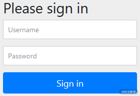
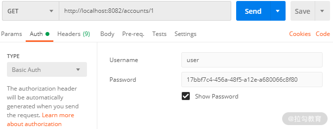
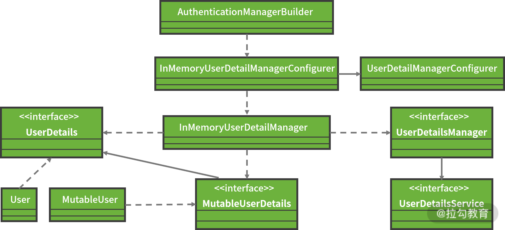

# 18 用户认证：如何基于 Spring Security 构建用户认证体系？

在 17 讲中，我们梳理了 Web 应用程序的安全性需求，并引出了 Spring Security 这款 Spring 家族中专门用于处理安全性需求的开发框架，同时也明确了认证和授权是安全性框架的核心功能。

这一讲我们将先讨论与认证相关的话题，并给出 Spring Security 认证机制及其使用方法。因为 Spring Security 是日常开发过程中的基础组件，所以我们也会对如何实现数据加解密的过程做一些展开。

在 Spring Boot 中整合 Spring Security 框架的方式非常简单，我们只需要在 pom 文件中引入 spring-boot-starter-security 依赖即可，这与以往需要提供很多配置才能与 Spring Security 完成集成的开发过程不同，如下代码所示：

```xml
<dependency>
    <groupId>org.springframework.boot</groupId>
    <artifactId>spring-boot-starter-security</artifactId>
</dependency>
```

______________________________________________________________________

**请注意，只要我们在代码工程中添加了上述依赖，包含在该工程中的所有 HTTP 端点都将被保护起来。** 例如，在 SpringCSS 案例的 account-service 中，我们知道存在一个 AccountController ，且它暴露了一个“accounts/ /{accountId}”端点。现在，我们启动 account-service 服务并访问上述端点，弹出了如下图所示的界面内容：



添加 Spring Security 之后自动出现的登录界面

同时，在系统的启动控制台日志中，我们发现了如下所示的新的日志信息。

```shell
Using generated security password: 17bbf7c4-456a-48f5-a12e-a680066c8f80
```

在这里可以看到，Spring Security 为我们自动生成了一个密码，我们可以基于“user”这个账号及上述密码登录这个界面，抽空你也可以尝试下。

如果我们使用了 Postman 可视化 HTTP 请求工具，可以设置授权类型为“Basic Auth”并输入对应的用户名和密码完成对 HTTP 端点的访问，设置界面如下图所示：



使用 Postman 来完成认证信息的设置

事实上，在引入 spring-boot-starter-security 依赖之后，Spring Security 会默认创建一个用户名为“user”的账号。很显然，每次启动应用时，通过 Spring Security 自动生成的密码都会有所变化，因此它不适合作为一种正式的应用方法。

如果我们想设置登录账号和密码，最简单的方式是通过配置文件。例如，我们可以在 account-service 的 application.yml 文件中添加如下代码所示的配置项：

```properties
spring:
  security:
    user:
      name: springcss
      password: springcss_password
```

重启 account-service 服务后，我们就可以使用上述用户名和密码完成登录。

虽然基于配置文件的用户信息存储方案简单且直接，但是显然缺乏灵活性，因此 Spring Security 为我们提供了多种存储和管理用户认证信息的方案，我们一起来看一下。

## 配置 Spring Security

在 SpringSecurity 中，初始化用户信息所依赖的配置类是 WebSecurityConfigurer 接口，该接口实际上是一个空接口，继承了更为基础的 SecurityConfigurer 接口。

在日常开发中，我们往往不需要自己实现这个接口，而是使用 WebSecurityConfigurerAdapter 类简化该配置类的使用方式。比如我们可以通过继承 WebSecurityConfigurerAdapter 类并且覆写其中的 configure(AuthenticationManagerBuilder auth) 的方法完成配置工作。

关于 WebSecurityConfigurer 配置类，首先我们需要明确配置的内容。实际上，初始化所使用的用户信息非常简单，只需要指定用户名（Username）、密码（Password）和角色（Role）这三项数据即可。

在 WebSecurityConfigurer 类中，使用 AuthenticationManagerBuilder 类创建一个 AuthenticationManager 就能够轻松实现基于内存、LADP 和 JDBC 的验证。

接下来，我们就围绕 AuthenticationManagerBuilder 提供的功能实现多种用户信息存储方案。

### 使用基于内存的用户信息存储方案

我们先来看看如何使用 AuthenticationManagerBuilder 完成基于内存的用户信息存储方案。

实现方法是调用 AuthenticationManagerBuilder 的 inMemoryAuthentication 方法，示例代码如下所示：

```java
@Override
protected void configure(AuthenticationManagerBuilder builder) throws Exception {
    builder.inMemoryAuthentication()
        .withUser("springcss_user").password("password1")
        .roles("USER")
        .and()
        .withUser("springcss_admin").password("password2")
        .roles("USER", "ADMIN");
}
```

从上面的代码中，我们看到系统中存在"springcss \_user"和"springcss \_admin"这两个用户，其密码分别是"password1"和"password2"，分别代表着普通用户 USER 及管理员 ADMIN 这两个角色。

在 AuthenticationManagerBuilder 中，上述 inMemoryAuthentication 的方法的实现过程如下代码所示：

```java
public InMemoryUserDetailsManagerConfigurer<AuthenticationManagerBuilder> inMemoryAuthentication() throws Exception {
    return apply(new InMemoryUserDetailsManagerConfigurer<>());
}
```

这里的 InMemoryUserDetailsManagerConfigurer 内部又使用到了 InMemoryUserDetailsManager 对象，而通过深入该类，我们可以获取 Spring Security 中与用户认证相关的一大批核心对象，它们之间的关系如下图所示：



Spring Security 中用户认证相关类结构图

首先，我们来看上图中代表用户详细信息的 UserDetails 接口，如下代码所示：

```java
public interface UserDetails extends Serializable {
    //获取该用户的权限信息
    Collection<? extends GrantedAuthority> getAuthorities();
    //获取密码
    String getPassword();
    //获取用户名
    String getUsername();
    //判断该账户是否已失效
    boolean isAccountNonExpired();
    //判断该账户是否已被锁定
    boolean isAccountNonLocked();
    //判断该账户的凭证信息是否已失效
    boolean isCredentialsNonExpired();
    //判断该用户是否可用
    boolean isEnabled();
}
```

在上述代码中，我们发现 UserDetails 存在一个子接口 MutableUserDetails，从命名上不难看出，后者是一个可变的 UserDetails，而可变的内容就是密码。

关于 MutableUserDetails 接口的定义如下代码所示：

```java
interface MutableUserDetails extends UserDetails {
    //设置密码
    void setPassword(String password);
}
```

在 Spring Security 中，针对 UserDetails 还存在一个专门的 UserDetailsService，该接口专门用来管理 UserDetails，它的定义如下代码所示：

```java
public interface UserDetailsService {
    //根据用户名获取用户信息
    UserDetails loadUserByUsername(String username) throws UsernameNotFoundException;
}
```

而 UserDetailsManager 继承了 UserDetailsService，并提供了一批针对 UserDetails 的操作接口，如下代码所示：

```java
public interface UserDetailsManager extends UserDetailsService {
    //创建用户
    void createUser(UserDetails user);
    //更新用户
    void updateUser(UserDetails user);
    //删除用户
    void deleteUser(String username);
    //修改密码
    void changePassword(String oldPassword, String newPassword);
    //判断指定用户名的用户是否存在
    boolean userExists(String username);
}
```

介绍完 UserDetailsManager 后，我们再回到 InMemoryUserDetailsManager 类，它实现了 UserDetailsManager 接口中的所有方法，这些方法主要用来对用户信息进行维护，从而形成一条代码支线。

为了完成用户信息的配置，还存在另外一条代码支线，即 UserDetailsManagerConfigurer。该类维护了一个 UserDetails 列表，并提供了一组 withUser 方法完成用户信息的初始化，如下代码所示：

```java
private final List<UserDetails> users = new ArrayList<>();
public final C withUser(UserDetails userDetails) {
    this.users.add(userDetails);
    return (C) this;
}
```

从上述代码中，我们看到 withUser 方法返回的是一个 UserDetailsBuilder 对象，通过该对象可以实现类似 .withUser("springcss_user").password("password1").roles("USER") 这样的链式语法，从而完成用户信息的设置。**请注意，这里的 .roles() 方法实际上是 .authorities() 方法的一种简写，因为 Spring Security 会在每个角色名称前自动添加“ROLE_”前缀**，我们可以通过如下所示的代码实现同样的功能：

```java
@Override
protected void configure(AuthenticationManagerBuilder builder) throws Exception {
    builder.inMemoryAuthentication()
        .withUser("springcss_user").password("password1")
        .authorities("ROLE_USER")
        .and()
        .withUser("springcss_admin").password("password2")
        .authorities("ROLE_USER", "ROLE_ADMIN");
}
```

我们可以看到，基于内存的用户信息存储方案也比较简单，但是由于用户信息写死在代码中，因此同样缺乏灵活性。

接下来我们将引出另一种更为常见的用户信息存储方案——数据库存储。

### 使用基于数据库的用户信息存储方案

既然是将用户信息存储在数据库中，我们势必需要创建表结构。因此，在 Spring Security 的源文件中，我们可以找到对应的 SQL 语句，如下代码所示：

```sql
create table users(username varchar_ignorecase(50) not null primary key,password varchar_ignorecase(500) not null,enabled boolean not null);
create table authorities (username varchar_ignorecase(50) not null,authority varchar_ignorecase(50) not null,constraint fk_authorities_users foreign key(username) references users(username));
create unique index ix_auth_username on authorities (username,authority);
```

一旦在自己的数据库中创建了这两张表，且添加了相应数据，我们就可以直接注入一个 DataSource 对象查询用户数据，如下代码所示：

```java
@Autowired
DataSource dataSource;
@Override
protected void configure(AuthenticationManagerBuilder auth) throws Exception {
    auth.jdbcAuthentication().dataSource(dataSource)
        .usersByUsernameQuery("select username, password, enabled from Users " + "where username=?")
        .authoritiesByUsernameQuery("select username, authority from UserAuthorities " + "where username=?")
        .passwordEncoder(new BCryptPasswordEncoder());
}
```

这里使用了 AuthenticationManagerBuilder 的 jdbcAuthentication 方法配置数据库认证方式，而内部则使用了 JdbcUserDetailsManager 工具类。

围绕 JdbcUserDetailsManager 整条代码链路的类层结构与 InMemoryUserDetailsManager 非常一致，在该类中定义了各种用户数据库查询的 SQL 语句，以及使用 JdbcTemplate 完成数据库访问的具体实现方法。这里我们不再具体展开，你可以对照前面给出的 InMemoryUserDetailsManager 类层结构图进行分析。

______________________________________________________________________

**注意，在上述方法中，通过 jdbcAuthentication() 方法验证用户信息时，我们必须集成加密机制，即使用 passwordEncoder() 方法嵌入一个 PasswordEncoder 接口的实现类。**

在 Spring Security 中，PasswordEncoder 接口代表一种密码编码器，定义如下代码所示：

```java
public interface PasswordEncoder {
    //对原始密码进行编码
    String encode(CharSequence rawPassword);
    //对提交的原始密码与库中存储的加密密码进行比对
    boolean matches(CharSequence rawPassword, String encodedPassword);
    //判断加密密码是否需要再次进行加密，默认返回false
    default boolean upgradeEncoding(String encodedPassword) {
        return false;
    }
}
```

Spring Security 中内置了一大批 PasswordEncoder 接口的实现类，如下图所示：


Spring Security 中的 PasswordEncoder 实现类

上图中，比较常用的算法如 SHA-256 算法的 StandardPasswordEncoder、bcrypt 强哈希算法的 BCryptPasswordEncoder 等。而在实际案例中，我们使用的是 BCryptPasswordEncoder，它的 encode 方法如下代码所示：

```java
public String encode(CharSequence rawPassword) {
    String salt;
    if (random != null) {
        salt = BCrypt.gensalt(version.getVersion(), strength, random);
    } else {
        salt = BCrypt.gensalt(version.getVersion(), strength);
    }
    return BCrypt.hashpw(rawPassword.toString(), salt);
}
```

可以看到，上述 encode 方法执行了两个步骤，第一步是生成盐，第二步是根据盐和明文密码生成最终的密文密码。

## 实现定制化用户认证方案

通过前面内容的分析，我们明确了用户信息存储的实现过程实际上是完全可定制化，而 Spring Security 所做的工作只是把常见、符合一般业务场景的实现方式嵌入框架中。如果存在特殊的场景，开发人员完全可以通过自定义用户信息存储方案进行实现。

在前面的内容中，我们介绍了 UserDetails 接口代表用户详细信息，而 UserDetailsService 接口负责对 UserDetails 进行各种操作 。因此，实现定制化用户认证方案的关键是实现 UserDetails 和 UserDetailsService 这两个接口。

### 扩展 UserDetails

扩展 UserDetails 的方法的实质是直接实现该接口，例如我们可以构建如下所示的 SpringCssUser 类：

```java
public class SpringCssUser implements UserDetails {
    private static final long serialVersionUID = 1L;
    private Long id;
    private final String username;
    private final String password;
    private final String phoneNumber;
    //省略getter/setter
    @Override
    public String getUsername() {
        return username;
    }
    @Override
    public String getPassword() {
        return password;
    }
    @Override
    public Collection<? extends GrantedAuthority> getAuthorities() {
    return Arrays.asList(new SimpleGrantedAuthority("ROLE_USER"));
    }
    @Override
    public boolean isAccountNonExpired() {
    return true;
    }
    @Override
    public boolean isAccountNonLocked() {
    return true;
    }
    @Override
    public boolean isCredentialsNonExpired() {
    return true;
    }
    @Override
    public boolean isEnabled() {
    return true;
    }
}
```

显然，这里我们使用了一种更简单的方法满足 UserDetails 中各个接口的实现需求。一旦我们构建了一个 SpringCssUser 类，就可以创建对应的表结构存储类中所定义的字段。同时，我们也可以基于 Spring Data JPA 创建一个自定义的 Repository，如下代码所示：

```java
public interface SpringCssUserRepository extends CrudRepository<SpringCssUser, Long> {
    SpringCssUser findByUsername(String username);
}
```

SpringCssUserRepository 扩展了 CrudRepository 接口，并提供了一个方法名衍生查询 findByUsername。

关于 Spring Data JPA 的使用方法，你还可以回顾《ORM 集成：如何使用 Spring Data JPA 访问关系型数据库？》。

### 扩展 UserDetailsService

接着，我们来实现 UserDetailsService 接口，如下代码所示：

```java
@Service
public class SpringCssUserDetailsService implements UserDetailsService {
    @Autowired
    private SpringCssUserRepository repository;
    @Override
    public UserDetails loadUserByUsername(String username) throws UsernameNotFoundException {
        SpringCssUser user = repository.findByUsername(username);
        if (user != null) {
          return user;
        } 
        throw new UsernameNotFoundException("SpringCSS User '" + username + "' not found");
    }
}
```

在 UserDetailsService 接口中，我们只需要实现 loadUserByUsername 方法就行。因此，我们可以基于 SpringCssUserRepository 的 findByUsername 方法，再根据用户名从数据库中查询数据。

### 整合定制化配置

最后，我们再次回到 SpringCssSecurityConfig 类。

这次我们将使用自定义的 SpringCssUserDetailsService 完成用户信息的存储和查询，此时我们只需要对配置策略做一些调整，调整后的完整 SpringCssSecurityConfig 类如下代码所示：

```java
@Configuration
public class SpringCssSecurityConfig extends WebSecurityConfigurerAdapter {
    @Autowired
    SpringCssUserDetailsService springCssUserDetailsService;
    @Override
    protected void configure(AuthenticationManagerBuilder auth) throws Exception {
        auth.userDetailsService(springCssUserDetailsService);
    }
}
```

这里我们注入了 SpringCssUserDetailsService，并将其添加到 AuthenticationManagerBuilder 中，这样 AuthenticationManagerBuilder 将基于自定义的 SpringCssUserDetailsService 完成 UserDetails 的创建和管理。

## 小结与预告

这一讲我们详细介绍了如何使用 Spring Security 构建用户认证体系的系统方法。

一方面，我们可以分别基于内存和数据库方案存储用户信息，这两种方案都是 Spring Security 内置的。另一方面，我们可以通过扩展 UserDetails 接口的方式实现定制化用户的认证方案。同时，为了方便你理解和掌握这部分内容，我们还梳理了与用户认证相关的核心类。

介绍完用户认证信息后，19 讲我们将介绍如何基于 Spring Security 确保 Web 请求的安全访问。
