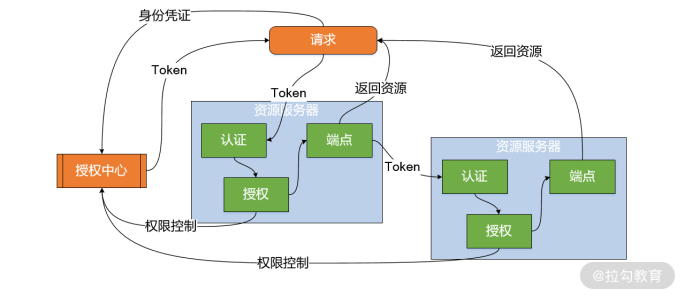

# 01 顶级框架：Spring Security 是一款什么样的安全性框架？

在开篇词中，我们描述了 Web 应用程序的安全性需求，并引出了专门用来满足这些需求的 Spring Security 框架。Spring Security 是 Spring 家族中历史比较悠久的框架，具备完整而强大的功能体系。从今天开始，我们将正式学习 Spring Security，并围绕它的功能体系展开讨论。

## 初识 Spring Security

其实在 Spring Boot 出现之前，Spring Security 就已经诞生多年了。但 Spring Security 的发展一直都不是很顺利，主要问题在于应用程序中集成和配置 Spring Security 框架的过程比较复杂。但是随着 Spring Boot 的兴起，基于 Spring Boot 所提供的针对 Spring Security 的自动配置方案，开发人员可以零配置使用 Spring Security。如果想要在 Spring Boot 应用程序中使用 Spring Security，只需要在 Maven 工程的 pom 文件中添加如下依赖：

```xml
<dependency>
     <groupId>org.springframework.boot</groupId>
     <artifactId>spring-boot-starter-security</artifactId>
</dependency>
```

接下来，让我们构建一个简单的 HTTP 端点，如下所示：

```java
@RestController
public class DemoController {
    @GetMapping("/hello")
    public String hello() {
        return "Hello World!";
    }
}
```

现在，启动这个 Spring Boot 应用程序，然后通过浏览器访问"/hello"端点。你可能希望得到的是"Hello World!"这个输出结果，但事实上，浏览器会跳转到一个如下所示的登录界面：


Spring Security 内置的登录界面

那么，为什么会弹出这个登录界面呢？原因就在于我们添加了 spring-boot-starter-security 依赖之后，Spring Security 为应用程序 **自动嵌入了用户认证机制** 。

接下来，我们围绕这个登录场景，分析如何获取登录所需的用户名和密码。我们注意到在 Spring Boot 的控制台启动日志中，出现了如下所示的一行日志：

```shell
Using generated security password: 707d7469-631f-4d92-ab71-3809620fe0dc
```

这行日志就是 Spring Security 生成的一个密码，而用户名则是系统默认的“user”。通过输入正确的用户名和密码，浏览器就会输出"Hello World!"这个响应结果。你可以做一些尝试。

上述过程演示的就是 Spring Security 提供的认证功能，也是 Spring Security 众多功能中的一项基础功能。接下来，就让我们一同挖掘 Spring Security 中的完整功能体系。

## Spring Security 功能体系

Spring Security 提供的是一整套完整的安全性解决方案。面向不同的业务需求和应用场景，Spring Security 分别提供了对应的安全性功能，在接下来的内容中，我们将从 **单体应用、微服务架构以及响应式系统** 这三个维度对这些功能展开讨论。

### Spring Security 与单体应用

在软件系统中，我们可以把需要访问的内容定义为是一种资源（Resource），而安全性设计的核心目标就是对这些资源进行保护，确保对它们的访问是安全可控的。例如，在一个 Web 应用程序中，对外暴露的 HTTP 端点就可以被理解为是资源。对于资源的安全性访问，业界也存在一些常见的技术体系。在讲解这些技术体系之前，我们先来理解在安全领域中非常常见但又容易混淆的两个概念，即认证（Authentication）和授权（Authorization）。

首先我们需要明确，所谓认证，解决的是“你是谁”这一个问题，也就是说对于每一次访问请求，系统都能判断出访问者是否具有合法的身份标识。

一旦明确 “ **你是谁** ”，下一步就可以判断“ **你能做什么** ”，这个步骤就是授权。通用的授权模型大多基于权限管理体系，即对资源、权限、角色和用户的一种组合处理。

如果我们将认证和授权结合起来，就构成了对系统中的资源进行安全性管理的最常见解决方案，即先判断资源访问者的有效身份，再来确定其是否有对这个资源进行访问的合法权限，如下图所示：


基于认证和授权机制的资源访问安全性示意图

上图代表的是一种通用方案，而不同的应用场景和技术体系下可以衍生出很多具体的实现策略。Web 应用系统中的认证和授权模型与上图类似，但在具体设计和实现过程中也有其特殊性。

针对认证，这部分的需求相对比较明确。显然我们需要构建 **一套完整的存储体系** 来保存和维护用户信息，并且确保这些用户信息在处理请求的过程中能够得到合理的利用。

而针对授权，情况可能会比较复杂。对于某一个特定的 Web 应用程序而言，我们面临的第一个问题是如何判断一个 HTTP 请求是否具备访问自己的权限。更进一步，就算这个请求具备访问该应用程序的权限，但并不意味着该请求能够访问应用程序所有的 HTTP 端点。某些核心功能需要具备较高的权限才能访问，而有些则不需要。这就是我们需要解决的第二个问题，如何 **对访问的权限进行精细化管理**？如下图所示：


Web 应用程序访问授权效果示意图

在上图中，我们假设该请求具备对应用程序中端点 2、3、4 的访问权限，但不具备访问端点 1 的权限。想要达到这种效果，一般的做法是 **引入角色体系** 。我们对不同的用户设置不同等级的角色，角色等级不同对应的访问权限也不同。而每一个请求都可以绑定到某一个角色，也就具备了访问权限。

接下来，我们把认证和授权结合起来，梳理出 Web 应用程序访问场景下的安全性实现方案，如下图所示：


单体服务下的认证和授权整合示意图

结合示意图我们可以看到，通过请求传递用户凭证完成用户认证，然后根据该用户信息中具备的角色信息获取访问权限，并最终完成对 HTTP 端点的访问授权。

围绕认证和授权，我们还需要一系列的额外功能确保整个流程得以实现。这些功能包括用于密码保护的加解密机制、用于实现方法级的安全访问，以及支持跨域等，这些功能在我们专栏的后续内容中都会一一展开讨论。

### Spring Security 与微服务架构

微服务架构的情况要比单体应用复杂很多，因为涉及了服务与服务之间的 **调用关系** 。我们继续沿用“资源”这个概念，对应到微服务系统中，服务提供者充当的角色就是资源的服务器，而服务消费者就是客户端。所以各个服务本身既可以是客户端，也可以作为资源服务器，或者两者兼之。

接下来，我们把认证和授权结合起来，梳理出微服务访问场景下的安全性实现方案，如下图所示：



微服务架构下的认证和授权整合示意图

可以看到，与单体应用相比，在微服务架构中需要把认证和授权的过程进行集中化管理，所以在上图中出现了一个 **授权中心。** 授权中心会获取客户端请求中所带有的身份凭证信息，然后基于凭证信息生成一个 Token，这个 Token 中就包含了 **权限范围和有效期** 。

客户端获取 Token 之后就可以基于这个 Token 发起对微服务的访问。这个时候，服务的提供者需要对这个 Token 进行认证，并根据 Token 的权限范围和有效期从授权中心获取该请求能够访问的特定资源。在微服务系统中，对外的资源表现形式同样可以理解为一个个 HTTP 端点。

上图中关键点就在于构建用于生成和验证 Token 的授权中心，为此我们需要引入 **OAuth2 协议** 。OAuth2 协议为我们在客户端程序和资源服务器之间设置了一个 **授权层**，并确保 Token 能够在各个微服务中进行有效传递，如下图所示：


OAuth2 协议在服务访问场景中的应用

OAuth2 是一个相对复杂的协议，综合应用摘要认证、签名认证、HTTPS 等安全性手段，需要提供 Token 生成和校验以及公私钥管理等功能，同时需要开发者入驻并进行权限粒度控制。一般我们应该避免自行实现这类复杂的协议，倾向于借助于特定工具以免重复造轮子。而 Spring Security 为我们提供了实现这一协议的完整解决方案，我们可以使用该框架完成适用于微服务系统中的认证授权机制。

### Spring Security 与响应式系统

随着 Spring 5 的发布，我们迎来了响应式编程（Reactive Programming）的全新发展时期。响应式编程是 Spring 5 最核心的新功能，也是 Spring 家族目前重点推广的技术体系。Spring 5 的响应式编程模型以 Project Reactor 库为基础，后者则实现了响应式流规范。

事实上，Spring Boot 从 2.x 版本开始也全面依赖 Spring 5。同样，在 Spring Security 中，用户账户体系的建立、用户认证和授权、方法级别的安全访问、OAuth2 协议等传统开发模式下具备的安全性功能都具备对应的响应式版本。

## 小结与预告

本讲是整个专栏内容的第一讲，我们通过一个简单的示例引入了 Spring Security 框架，并基于日常开发的安全需求，全面剖析了 Spring Security 框架具备的功能体系。不同的功能对应不同的应用场景，在普通的单体应用、微服务架构、响应式系统中都可以使用 Spring Security 框架提供的各种功能确保系统的安全性。

本讲内容总结如下：


这里给你留一道思考题：针对单体应用和微服务架构，你能分别描述它们所需要的认证和授权机制吗？

接下来我们将正式进入到 Spring Security 框架各项功能的学习过程中，首先介绍的就是用户认证功能。下一讲，我们将讨论如何基于 Spring Security 对用户进行有效的认证。
