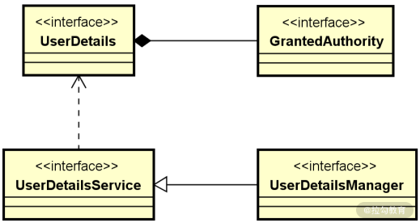
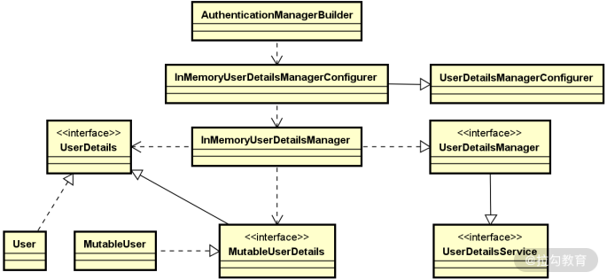
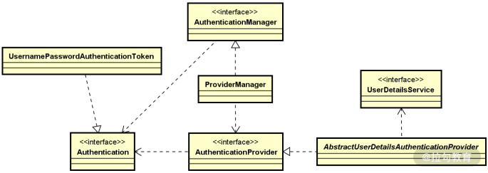
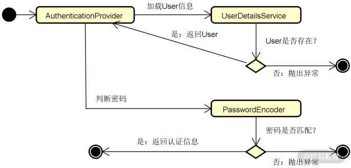
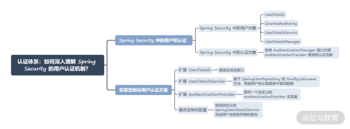

# 03 认证体系：如何深入理解 Spring Security 用户认证机制？

上一讲，我们给出了 Spring Security 中实现用户认证的系统方法，可以发现整个实现过程还是比较简单的，开发人员只需要通过一些配置方法就能完成复杂的处理逻辑。这种简单性得益于 Spring Security 对用户认证过程的提炼和抽象。今天我们就围绕这个话题展开讨论，继续探究 Spring Security 中的用户和认证对象，以及如何基于这些对象完成定制化的用户认证方案。

### Spring Security 中的用户和认证

Spring Security 中的认证过程由一组核心对象组成，大致可以分成两大类，一类是 **用户对象**，一类是 **认证对象**，下面我们来具体了解一下。

#### Spring Security 中的用户对象

Spring Security 中的用户对象用来描述用户并完成对用户信息的管理，涉及 **UserDetails、GrantedAuthority、UserDetailsService 和 UserDetailsManager** 这四个核心对象。

- UserDetails：描述 Spring Security 中的用户。
- GrantedAuthority：定义用户的操作权限。
- UserDetailsService：定义了对 UserDetails 的查询操作。
- UserDetailsManager：扩展 UserDetailsService，添加了创建用户、修改用户密码等功能。

这四个对象之间的关联关系如下图所示，显然，对于由 UserDetails 对象所描述的一个用户而言，它应该具有 1 个或多个能够执行的 GrantedAuthority：



Spring Security 中的四大核心用户对象

结合上图，我们先来看承载用户详细信息的 UserDetails 接口，如下所示：

```java
public interface UserDetails extends Serializable {
    //获取该用户的权限信息
    Collection<? extends GrantedAuthority> getAuthorities();
    //获取密码
    String getPassword();
    //获取用户名
    String getUsername();
    //判断该账户是否已失效
    boolean isAccountNonExpired();
    //判断该账户是否已被锁定
    boolean isAccountNonLocked();
    //判断该账户的凭证信息是否已失效
    boolean isCredentialsNonExpired();
    //判断该用户是否可用
    boolean isEnabled();
}
```

通过 UserDetails，我们可以获取用户相关的基础信息，并判断其当前状态。同时，我们也可以看到 UserDetails 中保存着一组 GrantedAuthority 对象。而 GrantedAuthority 指定了一个方法用来获取权限信息，如下所示：

```java
public interface GrantedAuthority extends Serializable {
    //获取权限信息
    String getAuthority();
}
```

UserDetails 存在一个子接口 MutableUserDetails，从命名上不难看出后者是一个可变的 UserDetails，而 **可变的内容就是密码** 。MutableUserDetails 接口的定义如下所示：

```java
interface MutableUserDetails extends UserDetails {
    //设置密码
    void setPassword(String password);
}
```

如果我们想要在应用程序中创建一个 UserDetails 对象，可以使用如下所示的链式语法：

```java
UserDetails user = User.withUsername("jianxiang") 
  .password("123456") 
  .authorities("read", "write") 
  .accountExpired(false) 
  .disabled(true) 
  .build();
```

Spring Security 还专门提供了一个 UserBuilder 对象来辅助构建 UserDetails，使用方式也类似：

```java
User.UserBuilder builder = User.withUsername("jianxiang");
UserDetails user = builder
  .password("12345") 
  .authorities("read", "write")
  .accountExpired(false) 
  .disabled(true) 
  .build();
```

在 Spring Security 中，针对 UserDetails 专门提供了一个 UserDetailsService，该接口用来管理 UserDetails，定义如下：

```java
public interface UserDetailsService {
    //根据用户名获取用户信息
    UserDetails loadUserByUsername(String username) throws UsernameNotFoundException;
}
```

而 UserDetailsManager 继承了 UserDetailsService，并提供了一批针对 UserDetails 的操作接口，如下所示：

```java
public interface UserDetailsManager extends UserDetailsService {
    //创建用户
    void createUser(UserDetails user);
    //更新用户
    void updateUser(UserDetails user);
    //删除用户
    void deleteUser(String username);
    //修改密码
    void changePassword(String oldPassword, String newPassword);
    //判断指定用户名的用户是否存在
    boolean userExists(String username);
}
```

这样，几个核心用户对象之间的关联关系就很清楚了，接下来我们需要进一步明确具体的实现过程。

我们来看 UserDetailsManager 的两个实现类，一个是 **基于内存存储** 的 InMemoryUserDetailsManager，一个是 **基于关系型数据库存储** 的 JdbcUserDetailsManager。

这里，我们以 JdbcMemoryUserDetailsManager 为例展开分析，它的 createUser 方法如下所示：

```java
public void createUser(final UserDetails user) {
    validateUserDetails(user);
    getJdbcTemplate().update(createUserSql, ps -> {
            ps.setString(1, user.getUsername());
            ps.setString(2, user.getPassword());
            ps.setBoolean(3, user.isEnabled());
            int paramCount = ps.getParameterMetaData().getParameterCount();
            if (paramCount > 3) {
                ps.setBoolean(4, !user.isAccountNonLocked());
                ps.setBoolean(5, !user.isAccountNonExpired());
                ps.setBoolean(6, !user.isCredentialsNonExpired());
            }
    });
    if (getEnableAuthorities()) {
            insertUserAuthorities(user);
    }
}
```

可以看到，这里直接使用了 Spring 框架中的 JdbcTemplate 模板工具类实现了数据的插入，同时完成了 GrantedAuthority 的存储。

UserDetailsManager 是一条相对独立的代码线，为了完成用户信息的配置，还存在另一条代码支线，即 UserDetailsManagerConfigurer。该类维护了一个 UserDetails 列表，并提供了一组 withUser 方法完成用户信息的初始化，如下所示：

```java
private final List<UserDetails> users = new ArrayList<>();
public final C withUser(UserDetails userDetails) {
    this.users.add(userDetails);
    return (C) this;
}
```

而 withUser 方法返回的是一个 UserDetailsBuilder 对象，该对象内部使用了前面介绍的 UserBuilder 对象，因此可以实现类似 .withUser("spring_user").password("password1").roles("USER") 这样的链式语法，完成用户信息的设置。这也是上一讲中，我们在介绍基于内存的用户信息存储方案时使用的方法。

作为总结，我们也梳理了 Spring Security 中与用户对象相关的一大批实现类，它们之间的关系如下图所示：



Spring Security 中用户对象相关类结构图

#### Spring Security 中的认证对象

有了用户对象，我们就可以讨论具体的认证过程了，首先来看认证对象 Authentication，如下所示：

```java
public interface Authentication extends Principal, Serializable {
    //安全主体具有的权限
    Collection<? extends GrantedAuthority> getAuthorities();
    //证明主体有效性的凭证
    Object getCredentials();
    //认证请求的明细信息
    Object getDetails();
    //主体的标识信息
    Object getPrincipal();
    //认证是否通过
    boolean isAuthenticated();
    //设置认证结果
    void setAuthenticated(boolean isAuthenticated) throws IllegalArgumentException;
}
```

认证对象代表认证请求本身，并保存该请求访问应用程序过程中涉及的各个实体的详细信息。在安全领域，请求访问该应用程序的用户通常被称为 **主体** （Principal），在 JDK 中存在一个同名的接口，而 Authentication 扩展了这个接口。

显然，Authentication 只代表了认证请求本身，而具体执行认证的过程和逻辑需要由专门的组件来负责，这个组件就是 AuthenticationProvider，定义如下：

```java
public interface AuthenticationProvider {
    //执行认证，返回认证结果
    Authentication authenticate(Authentication authentication) throws AuthenticationException;
    //判断是否支持当前的认证对象
    boolean supports(Class<?> authentication);
}
```

讲到这里，你可能会认为 Spring Security 是直接使用 AuthenticationProvider 接口完成用户认证的，其实不然。如果你翻阅 Spring Security 的源码，会发现它 **使用了 AuthenticationManager 接口来代理 AuthenticationProvider 提供的认证功能** 。这里，我们以 InMemoryUserDetailsManager 中的 changePassword 为例，分析用户认证的执行过程（为了展示简洁，部分代码做了裁剪）：

```java
public void changePassword(String oldPassword, String newPassword) {
    Authentication currentUser = SecurityContextHolder.getContext().getAuthentication();
    if (currentUser == null) {
        throw new AccessDeniedException(
                "Can't change password as no Authentication object found in context "
                        + "for current user.");
    }
    String username = currentUser.getName();
    if (authenticationManager != null) {
        authenticationManager.authenticate(new UsernamePasswordAuthenticationToken(
                username, oldPassword));
    }
    else {
        …
    }
    MutableUserDetails user = users.get(username);
    if (user == null) {
        throw new IllegalStateException("Current user doesn't exist in database.");
    }
    user.setPassword(newPassword);
}
```

可以看到，这里使用了 AuthenticationManager 而不是 AuthenticationProvider 中的 authenticate() 方法来执行认证。同时，我们也注意到这里出现了 UsernamePasswordAuthenticationToken 类，这就是 Authentication 接口的一个具体实现类，用来 **存储用户认证所需的用户名和密码信息** 。

同样作为总结，我们也梳理了 Spring Security 中与认证对象相关的一大批核心类，它们之间的关系如下所示：



Spring Security 中认证的对象相关类结构图

### 实现定制化用户认证方案

通过前面的分析，我们明确了用户信息存储的实现过程实际上是可以定制化的。Spring Security 所做的工作只是把常见的、符合一般业务场景的实现方式嵌入到了框架中。如果有特殊的场景，开发人员完全可以实现自定义的用户信息存储方案。

现在，我们已经知道 UserDetails 接口代表着用户详细信息，而负责对 UserDetails 进行各种操作的则是 UserDetailsService 接口。因此，

**实现定制化用户认证方案主要就是实现 UserDetails 和 UserDetailsService 这两个接口** 。

#### 扩展 UserDetails

扩展 UserDetails 的方法就是直接实现该接口，例如我们可以构建如下所示的 SpringUser 类：

```java
public class SpringUser implements UserDetails {
    private static final long serialVersionUID = 1L;
    private Long id;  
    private final String username;
    private final String password;
    private final String phoneNumber;
    //省略 getter/setter
    @Override
    public String getUsername() {
        return username;
    }
    @Override
    public String getPassword() {
        return password;
    }
    @Override
    public Collection<? extends GrantedAuthority> getAuthorities() {
         return Arrays.asList(new SimpleGrantedAuthority("ROLE_USER"));
    }
  @Override
  public boolean isAccountNonExpired() {
      return true;
  }
  @Override
  public boolean isAccountNonLocked() {
      return true;
  }
  @Override
  public boolean isCredentialsNonExpired() {
      return true;
  }
  @Override
  public boolean isEnabled() {
      return true;
  }
}
```

显然，这里使用了一种最简单的方法来满足 UserDetails 中各个接口的实现需求。一旦我们构建了这样一个 SpringUser 类，就可以创建对应的表结构存储类中定义的字段。同时，我们也可以基于 Spring Data JPA 来创建一个自定义的 Repository，如下所示：

```java
public interface SpringUserRepository extends CrudRepository<SpringUser, Long> {
    SpringUser findByUsername(String username);  
}
```

SpringUserRepository 扩展了 Spring Data 中的 CrudRepository 接口，并提供了一个方法名衍生查询 findByUsername。

#### 扩展 UserDetailsService

接着，我们来实现 UserDetailsService 接口，如下所示：

```java
@Service
public class SpringUserDetailsService implements UserDetailsService {
  @Autowired
  private SpringUserRepository repository;
  @Override
  public UserDetails loadUserByUsername(String username) throws UsernameNotFoundException {
    SpringUser user = repository.findByUsername(username);
    if (user != null) {
      return user;
    }
    throw new UsernameNotFoundException("SpringUser '" + username + "' not found");
  }
}
```

我们知道 UserDetailsService 接口只有一个 loadUserByUsername 方法需要实现。因此，我们基于 SpringUserRepository 的 findByUsername 方法，根据用户名从数据库中查询数据。

#### 扩展 AuthenticationProvider

扩展 AuthenticationProvider 的过程就是提供一个自定义的 AuthenticationProvider 实现类。这里我们以最常见的用户名密码认证为例，梳理自定义认证过程所需要实现的步骤，如下所示：



自定义 AuthenticationProvider 的实现流程图

上图中的流程并不复杂，首先我们需要通过 UserDetailsService 获取一个 UserDetails 对象，然后根据该对象中的密码与认证请求中的密码进行匹配，如果一致则认证成功，反之抛出一个 BadCredentialsException 异常。示例代码如下所示：

```java
@Component
public class SpringAuthenticationProvider implements AuthenticationProvider {
    @Autowired
    private UserDetailsService userDetailsService;
    @Autowired
    private PasswordEncoder passwordEncoder;
    @Override
    public Authentication authenticate(Authentication authentication) {
        String username = authentication.getName();
        String password = authentication.getCredentials().toString();
        UserDetails user = userDetailsService.loadUserByUsername(username);
        if (passwordEncoder.matches(password, user.getPassword())) {
            return new UsernamePasswordAuthenticationToken(username, password, u.getAuthorities());
        } else {
            throw new BadCredentialsException("The username or password is wrong!");
        }
    }
    @Override
    public boolean supports(Class<?> authenticationType) {
        return authenticationType.equals(UsernamePasswordAuthenticationToken.class);
    }
}
```

这里我们同样使用了 UsernamePasswordAuthenticationToken 来传递用户名和密码，并使用一个 PasswordEncoder 对象校验密码。

#### 整合定制化配置

最后，我们创建一个 SpringSecurityConfig 类，该类继承了 WebSecurityConfigurerAdapter 配置类。这次，我们将使用自定义的 SpringUserDetailsService 来完成用户信息的存储和查询，需要对原有配置策略做一些调整。调整之后的完整 SpringSecurityConfig 类如下所示：

```java
@Configuration
public class SpringSecurityConfig extends WebSecurityConfigurerAdapter {
    @Autowired
    private UserDetailsService springUserDetailsService;
    @Autowired
    private AuthenticationProvider springAuthenticationProvider;
    @Override
    protected void configure(AuthenticationManagerBuilder auth) throws Exception {
     auth.userDetailsService(springUserDetailsService)
        .authenticationProvider(springAuthenticationProvider);
    }
}
```

这里我们注入了 SpringUserDetailsService 和 SpringAuthenticationProvider，并将其添加到 AuthenticationManagerBuilder 中，这样 AuthenticationManagerBuilder 将基于这个自定义的 SpringUserDetailsService 完成 UserDetails 的创建和管理，并基于自定义的 SpringAuthenticationProvider 完成用户认证。

### 小结与预告

这一讲我们基于 Spring Security 提供的用户认证功能分析了其背后的实现过程。我们的切入点在于分析与用户和认证相关的各个核心类，并梳理它们之间的交互过程。另一方面，我们还通过扩展 UserDetailsService 和 AuthenticationProvider 接口的方式来实现定制化的用户认证方案。

本讲内容总结如下：



最后给你留一道思考题：基于 Spring Security，如何根据用户名和密码实现一套定制化的用户认证解决方案？欢迎在留言区和我分享你的想法。
