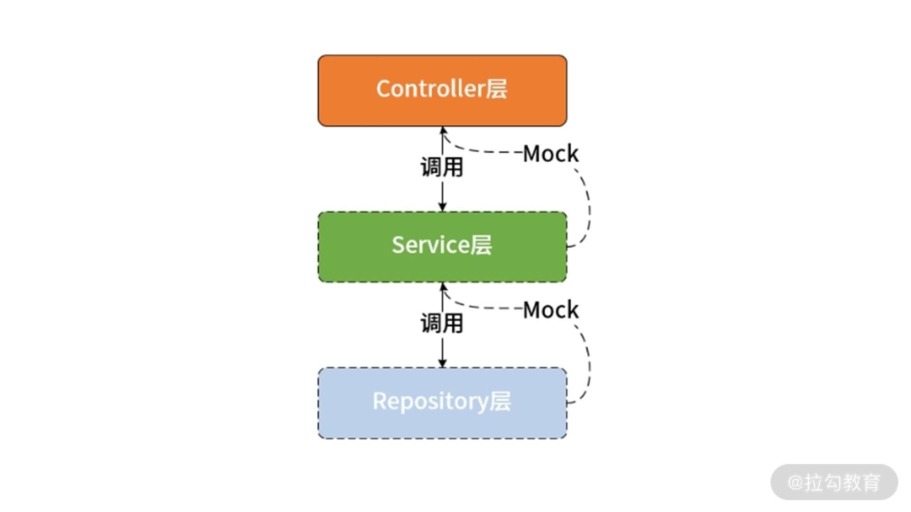

# 19 测试驱动：如何基于 Spring Security 测试系统安全性？

作为整个课程最后一部分内容，我们将讨论基于 Spring Security 的测试解决方案。对于安全性而言，测试是一个难点，也是经常被忽略的一套技术体系。当我们使用 Spring Security 时，如何验证我们所使用的安全性功能是否正确呢？今天的内容将给出详细的答案。

## 如何对系统的安全性进行测试？

Spring Security 是一款安全性开发框架，提供的是内嵌到业务系统中的基础设施类功能。因此，势必会涉及大量组件之间的依赖关系，这是测试安全性功能所面临的最大挑战，需要采用特定的测试方法。因此，在介绍具体的测试用例之前，我们先来梳理一下安全性测试方法，以及 Spring Security 中为我们提供的测试解决方案。

## 安全性测试与 Mock 机制

正如前面提到的，验证安全性功能正确性的难点在于组件与组件之间的依赖关系，为了弄清楚这个关系，这里就需要引出测试领域非常重要的一个概念，即 Mock（模拟）。**针对测试组件涉及的外部依赖，我们的关注点在于这些组件之间的调用关系，以及返回的结果或发生的异常等，而不是组件内部的执行过程** 。因此常见的技巧就是使用 Mock 对象来替代真实的依赖对象，从而模拟真实的调用场景。

我们以一个常见的三层 Web 服务架构为例来进一步解释 Mock 的实施方法。Controller 层会访问 Service 层，而 Service 层又会访问 Repository 层，我们对 Controller 层的端点进行验证时，就需要模拟 Service 层组件的功能。同样，对 Service 层组件进行测试时，也需要假定 Repository 层组件的结果是可以获取的，如下所示：



Web 服务中各层组件与 Mock 对象示意图

对于 Spring Security 而言，上图所展示的原理同样适用，例如我们可以通过模拟用户的方式来测试用户认证和授权功能的正确性。在本讲后面的内容中，我们会给出相关的代码示例。

## Spring Security 中的测试解决方案

要想开展单元测试、集成测试以及基于 Mock 的测试，需要有一套完整的技术体系。和 Spring Boot 1.x 版本一样，Spring Boot 2.x 同样提供了针对测试的 spring-boot-starter-test 组件。在 Spring Boot 中集成该组件的方法就是在 pom 文件中添加如下依赖：

```xml
<dependency>
     <groupId>org.springframework.boot</groupId>
     <artifactId>spring-boot-starter-test</artifactId>
     <scope>test</scope>
</dependency>
```

通过这个依赖，一系列组件被自动引入到了代码工程的构建路径中，包括 JUnit、JSON Path、AssertJ、Mockito、Hamcrest 等，这些测试组件都非常有用。同时，因为 Spring Boot 程序的入口是 Bootstrap 类，因此专门提供了一个 @SpringBootTest 注解来测试你的 Bootstrap 类。所有配置都会通过 Bootstrap 类去加载，而该注解可以引用 Bootstrap 类的配置。

另一方面，Spring Security 也提供了专门用于测试安全性功能的 spring-security-test 组件，如下所示：

```xml
<dependency>
     <groupId>org.springframework.security</groupId>
     <artifactId>spring-security-test</artifactId>
     <scope>test</scope>
</dependency>
```

该组件提供了相关的注解来模拟用户登录信息或者调用用户登录的方法，让我们一起来看一下。

## 测试 Spring Security 功能

### 测试用户

在使用 Spring Security 时，首先需要测试的无疑是合法的用户。假设我们实现了如下所示的一个简单 Controller：

```java
@RestController
public class HelloController {
    @GetMapping("/hello")
    public String hello() {
        return "Hello";
    }
}
```

一旦我们启用 Spring Security 认证功能，那么对上述“/hello”端点就可以执行两种测试，分别面向认证和非认证用户。我们先来看一下针对非认证用户的测试方法：

```java
@SpringBootTest
@AutoConfigureMockMvc
public class HelloControllerTests {
    @Autowired
    private MockMvc mvc;
    @Test
    public void testUnauthenticatedUser() throws Exception {
        mvc.perform(get("/hello"))
                .andExpect(status().isUnauthorized());
 }
}
```

这里引入了一个 @AutoConfigureMockMvc 注解，通过将 @SpringBootTest 注解与 @AutoConfigureMockMvc 注解相结合，@AutoConfigureMockMvc 注解在通过 @SpringBootTest 加载的 Spring 上下文环境中会自动装配 MockMvc 这个测试工具类。

顾名思义，MockMvc 用来对 WebMVC 的执行过程进行模拟。MockMvc 类提供的基础方法如下所示。

- perform：执行一个 RequestBuilder 请求，会自动执行 SpringMVC 流程，并映射到相应的 Controller 进行处理。
- get/post/put/delete：声明发送一个 HTTP 请求的方式，根据 URI 模板和 URI 变量值得到一个 HTTP 请求，支持 GET、POST、PUT、DELETE 等 HTTP 方法。
- param：添加请求参数，发送 JSON 数据时将不能使用这种方式，而应该采用 @ResponseBody 注解。
- andExpect：添加 ResultMatcher 验证规则，通过对返回的数据进行判断来验证 Controller 执行结果是否正确。
- andDo：添加 ResultHandler 结果处理器，比如调试时打印结果到控制台。
- andReturn：最后返回相应的 MvcResult，然后执行自定义验证或做异步处理。

在上述代码示例中，我们通过 perform、accept 和 andExpect 方法最终模拟 HTTP 请求的整个过程并验证请求的返回状态是否为非认证。

接下来我们来模拟认证用户的测试场景，测试用例如下所示：

```java
@Test
@WithMockUser
public void testAuthenticatedUser() throws Exception {
    mvc.perform(get("/hello"))
        .andExpect(content().string("Hello"))
        .andExpect(status().isOk());
}
```

显然，我们在这里看到了一个新的 @WithMockUser 注解，请注意这个注解是 Spring Security 所提供的，专门用来模拟认证用户。现在，既然已经有了认证用户，那么我们就可以验证响应的返回值以及状态，正如上述代码所示。

通过 @WithMockUser 注解，我们还可以指定用户的详细信息，例如如下所示的代码模拟了一个用户名为“admin”、角色为“USER”和“ADMIN”的认证用户：

```java
@WithMockUser(username="admin",roles={"USER","ADMIN"})
```

进一步，我们还可以通过模拟 UserDetailsService 来提供自定义的 UserDetails 用户信息。为此，Spring Security 中专门提供了一个 @WithUserDetails 注解，示例代码如下所示：

```java
@Test
@WithUserDetails("jianxiang")
public void testAuthenticatedUser() throws Exception {
    mvc.perform(get("/hello"))
        .andExpect(content().string("Hello"))
        .andExpect(status().isOk());
}
```

### 测试认证

测试完用户，我们接着来测试针对用户的认证过程。为了对整个认证过程有更多的定制化实现，这里专门提供一个 AuthenticationProvider 接口的实现类 MyAuthenticationProvider，如下所示：

```java
@Component
public class MyAuthenticationProvider implements AuthenticationProvider {
    @Override
    public Authentication authenticate(Authentication authentication) throws AuthenticationException {
        String username = authentication.getName();
        String password = String.valueOf(authentication.getCredentials());
        if ("jianxiang".equals(username) && "123456".equals(password)) {
            return new UsernamePasswordAuthenticationToken(username, password, Arrays.asList());
        } else {
            throw new AuthenticationCredentialsNotFoundException("Error!");
        }
    }
    @Override
    public boolean supports(Class<?> authenticationType) {
        return UsernamePasswordAuthenticationToken.class.isAssignableFrom(authenticationType);
    }
}
```

现在，我们基于 HTTP 基础认证机制来编写测试用例，如下所示：

```java
@SpringBootTest
@AutoConfigureMockMvc
public class AuthenticationTests {
    @Autowired
    private MockMvc mvc;
    @Test
    public void testAuthenticatingWithValidUser() throws Exception {
        mvc.perform(get("/hello")
            .with(httpBasic("jianxiang","123456")))
            .andExpect(status().isOk());
    }
    @Test
    public void testAuthenticatingWithInvalidUser() throws Exception {
        mvc.perform(get("/hello")
            .with(httpBasic("noexiseduser","123456")))
            .andExpect(status().isUnauthorized());
    }
}
```

这里使用了前面介绍的 @AutoConfigureMockMvc 注解和 MockMvc 工具类，然后通过 httpBasic() 方法来实现 HTTP 基础认证。我们分别针对正确和错误的用户名/密码组合来执行 HTTP 请求并根据返回状态对认证结果进行校验。

### 测试方法安全

前面讨论的内容都是面向 Web 应用，也就是说测试的对象都是 HTTP 端点。那么，如何针对方法级别的安全性进行测试呢？

针对全局方法安全机制，前面介绍的 @WithMockUser 注解 @WithUserDetails 注解实际上也都是可以正常使用的。但因为已经脱离了 Web 环境，所以 MockMvc 工具类显然是无效的。这时候，你要做的事情就是在测试用例中直接注入目标方法即可，我们来看一下代码示例，假设一个非 Web 类的应用程序中存在如下一个 Service 类：

```java
@Service
public class HelloService {
    @PreAuthorize("hasAuthority('write')")
    public String hello() {
        return "Hello";
    }
}
```

可以看到这里使用了 @PreAuthorize 注解限制了只有具备“write”权限的用户才能访问这个方法。

现在让我们编写针对方法访问安全的第一个测试用例，如下所示：

```java
@Autowired
private HelloService helloService;
@Test
void testMethodWithNoUser() {
    assertThrows(AuthenticationException.class, () -> helloService.hello());
}
```

当我们在没有认证的情况下访问 helloService 的 hello() 方法，应该抛出一个 AuthenticationException 异常，上述测试用例验证了这一点。而如果我们使用一个具备不同权限的认证用户去访问这个方法时，会发生什么呢？对应测试用例如下所示：

```java
@Test
@WithMockUser(authorities = "read")
void testMethodWithUserButWrongAuthority() {
    assertThrows(AccessDeniedException.class, () -> helloService.hello());
}
```

可能看到这里使用了 @WithMockUser 模拟了一个具有“read”权限的认证用户，但因为 @PreAuthorize 注解中指定只有“write”权限的用户才能访问这个方法，所以会抛出一个 AccessDeniedException。

最后，我们来测试正常流程下的结果，测试用例如下所示：

```java
@Test
@WithMockUser(authorities = "write")
void testMethodWithUserButCorrectAuthority() {
     Stringresult = helloService.hello();
     assertEquals("Hello", result);
}
```

### 测试 CSRF 和 CORS 配置

基于我们在\[《攻击应对：如何实现 CSRF 保护和 CORS？》\]中的讨论，对于 POST、PUT 和 DELETE 等 HTTP 请求，我们需要添加针对 CSRF 的安全保护。为了测试 CSRF 配置的正确性，假设我们存在这样一个 HTTP 端点，请注意它的 HTTP 方法是 POST：

```java
@RestController
public class HelloController {
    @PostMapping("/hello")
    public String postHello() {
        return "Post Hello!";
    }
}
```

现在，我们通过 MockMvc 工具类发起 post 请求，测试用例如下所示：

```java
@Test
public void testHelloUsingPOST() throws Exception {
     mvc.perform(post("/hello"))
        .andExpect(status().isForbidden());
}
```

请注意，这个 post 请求并没有携带 CSRF Token，所以响应的状态应该是 HTTP 403 Forbidden。

现在，让我们重构上述测试用例，如下所示：

```java
@Test
public void testHelloUsingPOSTWithCSRF() throws Exception {
     mvc.perform(post("/hello").with(csrf()))
        .andExpect(status().isOk());
}
```

上述 csrf() 方法的作用就是在请求中添加 CSRF Token，显然，这时候的响应结果应该是正确的。

讨论完 CSRF，我们再来看 CORS。在\[《攻击应对：如何实现 CSRF 保护和 CORS？》\]中，我们已经通过 CorsConfiguration 设置了 HTTP 响应消息头，如下所示：

```java
@Override
protected void configure(HttpSecurity http) throws Exception {
    http.cors(c -> {
        CorsConfigurationSource source = request -> {
            CorsConfiguration config = new CorsConfiguration();
            config.setAllowedOrigins(Arrays.asList("*"));
            config.setAllowedMethods(Arrays.asList("*"));
            return config;
        };
        c.configurationSource(source);
    });
    …
}
```

对上述配置进行测试的方法也很简单，我们通过 MockMvc 发起请求，然后对响应的消息头进行验证即可，测试用例如下所示：

```java
@SpringBootTest
@AutoConfigureMockMvc
public class MainTests {
    @Autowired
    private MockMvc mvc;
    @Test
    public void testCORSForTestEndpoint() throws Exception {
        mvc.perform(options("/hello")
            .header("Access-Control-Request-Method", "POST")
            .header("Origin", "http://www.test.com")
        )
        .andExpect(header().exists("Access-Control-Allow-Origin"))
        .andExpect(header().string("Access-Control-Allow-Origin", "*"))
        .andExpect(header().exists("Access-Control-Allow-Methods"))
        .andExpect(header().string("Access-Control-Allow-Methods", "POST"))
        .andExpect(status().isOk());
    }
}
```

可以看到，针对 CORS 配置，我们分别获取了响应结果的"Access-Control-Allow-Origin"和"Access-Control-Allow-Methods"消息头并进行了验证。

## 小结与预告

对于一个应用程序而言，无论其表现形式是否是一个 Web 服务，我们都需要对其进行安全性测试，为此 Spring Security 也提供了专门的测试解决方案，这其中很大程度上依赖于对 Mock 机制的合理应用。本讲对 Spring Security 所提供的用户、认证、全局方法、CSRF 以及 CORS 设计了测试用例，并给出了对应的示例代码。
