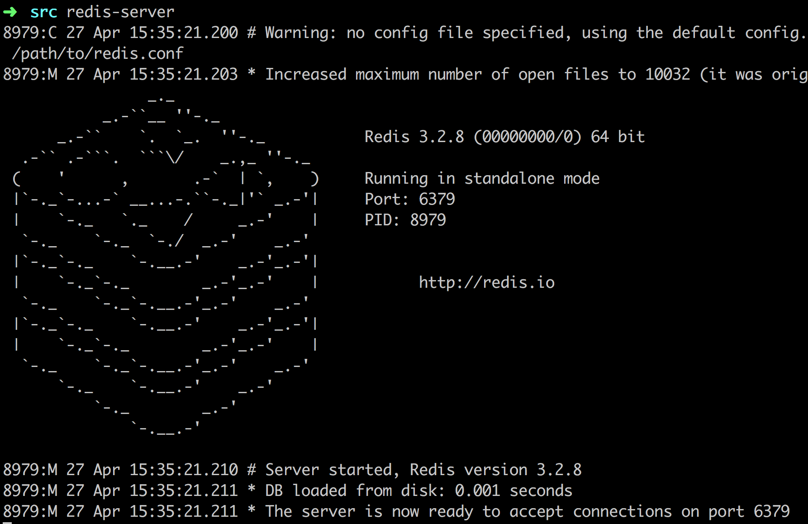
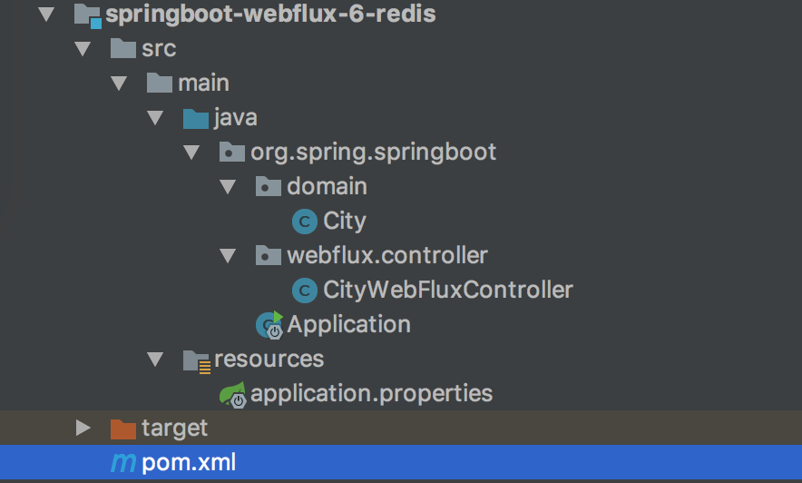

# 07 WebFlux 整合 Redis

### 前言

上一篇内容讲了如何整合 MongoDB，这里继续讲如何操作 Redis 这个数据源，那什么是 Reids？

Redis 是一个高性能的 key-value 数据库，[GitHub 地址详见这里](https://github.com/antirez/redis)。GitHub 是这么描述的：

Redis is an in-memory database that persists on disk. The data model is key-value, but many different kind of values are supported: Strings, Lists, Sets, Sorted Sets, Hashes, HyperLogLogs, Bitmaps.

Redis 是内存式数据库，存储在磁盘，支持的数据类型很多：Strings、Lists、Sets、Sorted Sets、Hashes、HyperLogLogs、Bitmaps 等。

#### 安装简易教程（适用 Mac/Linux）

下载并解压：

```plaintext
下载安装包 redis-x.x.x.tar.gz
## 解压
tar zxvf redis-2.8.17.tar.gz
```

编译安装：

```plaintext
cd redis-x.x.x/
make ## 编译
```

启动 Redis：

```plaintext
cd src/
redis-server
```

如果需要运行在守护进程，设置 daemonize 从 no 修改成 yes，并指定运行：redis-server redis.conf。



### 结构

类似上面讲的工程搭建，新建一个工程编写此案例，工程如图：



目录核心如下：

- pom.xml maven 配置
- application.properties 配置文件
- domain 实体类
- controller 控制层，本文要点

### 新增 POM 依赖与配置

在 pom.xml 配置新的依赖：

```plaintext
    <!-- Spring Boot 响应式 Redis 依赖 -->
    <dependency>
      <groupId>org.springframework.boot</groupId>
      <artifactId>spring-boot-starter-data-redis-reactive</artifactId>
    </dependency>
```

类似 MongoDB 配置，在 application.properties 配置连接 Redis：

```plaintext
## Redis 配置
## Redis服务器地址
spring.redis.host=127.0.0.1
## Redis服务器连接端口
spring.redis.port=6379
## Redis服务器连接密码（默认为空）
spring.redis.password=
# 连接超时时间（毫秒）
spring.redis.timeout=5000
```

默认 密码为空，这里注意的是连接超时时间不能太少或者为 0，不然会引起异常 RedisCommandTimeoutException: Command timed out。

### 对象

修改 org.spring.springboot.domain 包里面的城市实体对象类，城市（City）对象 City，代码如下：

```java
import org.springframework.data.annotation.Id;
import java.io.Serializable;
/**
 * 城市实体类
 *
 */
public class City implements Serializable {
    private static final long serialVersionUID = -2081742442561524068L;
    /**
     * 城市编号
     */
    @Id
    private Long id;
    /**
     * 省份编号
     */
    private Long provinceId;
    /**
     * 城市名称
     */
    private String cityName;
    /**
     * 描述
     */
    private String description;
    public Long getId() {
        return id;
    }
    public void setId(Long id) {
        this.id = id;
    }
    public Long getProvinceId() {
        return provinceId;
    }
    public void setProvinceId(Long provinceId) {
        this.provinceId = provinceId;
    }
    public String getCityName() {
        return cityName;
    }
    public void setCityName(String cityName) {
        this.cityName = cityName;
    }
    public String getDescription() {
        return description;
    }
    public void setDescription(String description) {
        this.description = description;
    }
}
```

值得注意点：

- @Id 注解标记对应库表的主键或者唯一标识符。因为这个是我们的 DO，数据访问对象一一映射到数据存储。
- City 必须实现序列化，因为需要将对象序列化后存储到 Redis。如果没实现 Serializable，会引出异常：java.lang.IllegalArgumentException: DefaultSerializer requires a Serializable payload but received an object of type。
- 如果不是用默认的序列化，需要自定义序列化实现，只要实现 RedisSerializer 接口去实现即可，然后在使用 RedisTemplate.setValueSerializer 方法去设置你实现的序列化实现，支持 JSON、XML 等。

### 控制层 CityWebFluxController

代码如下：

```java
import org.spring.springboot.domain.City;
import org.springframework.beans.factory.annotation.Autowired;
import org.springframework.data.redis.core.RedisTemplate;
import org.springframework.data.redis.core.ValueOperations;
import org.springframework.web.bind.annotation.*;
import reactor.core.publisher.Mono;
import java.util.concurrent.TimeUnit;
@RestController
@RequestMapping(value = "/city")
public class CityWebFluxController {
    @Autowired
    private RedisTemplate redisTemplate;
    @GetMapping(value = "/{id}")
    public Mono<City> findCityById(@PathVariable("id") Long id) {
        String key = "city_" + id;
        ValueOperations<String, City> operations = redisTemplate.opsForValue();
        boolean hasKey = redisTemplate.hasKey(key);
        City city = operations.get(key);
        if (!hasKey) {
            return Mono.create(monoSink -> monoSink.success(null));
        }
        return Mono.create(monoSink -> monoSink.success(city));
    }
    @PostMapping()
    public Mono<City> saveCity(@RequestBody City city) {
        String key = "city_" + city.getId();
        ValueOperations<String, City> operations = redisTemplate.opsForValue();
        operations.set(key, city, 60, TimeUnit.SECONDS);
        return Mono.create(monoSink -> monoSink.success(city));
    }
    @DeleteMapping(value = "/{id}")
    public Mono<Long> deleteCity(@PathVariable("id") Long id) {
        String key = "city_" + id;
        boolean hasKey = redisTemplate.hasKey(key);
        if (hasKey) {
            redisTemplate.delete(key);
        }
        return Mono.create(monoSink -> monoSink.success(id));
    }
}
```

代码详解：

- 使用 @Autowired 注入 RedisTemplate 对象，这个对象和 Spring 的 JdbcTemplate 功能十分相似，RedisTemplate 封装了 RedisConnection，具有连接管理、序列化和各个操作等，还有针对 String 的支持对象 StringRedisTemplate。
- 删除 Redis 某对象，直接通过 key 值调用 delete(key)。
- Redis 操作视图接口类用的是 ValueOperations，对应的是 Redis String/Value 操作，get 是获取数据；set 是插入数据，可以设置失效时间，这里设置的失效时间是 60 s。
- 还有其他的操作视图，ListOperations、SetOperations、ZSetOperations 和 HashOperations。

### 运行工程

一个操作 Redis 工程就开发完毕了，下面运行工程验证一下，使用 IDEA 右侧工具栏，单击 Maven Project Tab，单击使用下 Maven 插件的 install 命令。或者使用命令行的形式，在工程根目录下，执行 Maven 清理和安装工程的指令：

```plaintext
cd springboot-webflux-6-redis
mvn clean install
```

在控制台中看到成功的输出：

```plaintext
... 省略
[INFO] ------------------------------------------------------------------------
[INFO] BUILD SUCCESS
[INFO] ------------------------------------------------------------------------
[INFO] Total time: 01:30 min
[INFO] Finished at: 2018-10-15T10:00:54+08:00
[INFO] Final Memory: 31M/174M
[INFO] ------------------------------------------------------------------------
```

在 IDEA 中执行 Application 类启动，任意正常模式或者 Debug 模式，可以在控制台看到成功运行的输出：

```bash
... 省略
2018-04-10 08:43:39.932  INFO 2052 --- [ctor-http-nio-1] r.ipc.netty.tcp.BlockingNettyContext     : Started HttpServer on /0:0:0:0:0:0:0:0:8080
2018-04-10 08:43:39.935  INFO 2052 --- [           main] o.s.b.web.embedded.netty.NettyWebServer  : Netty started on port(s): 8080
2018-04-10 08:43:39.960  INFO 2052 --- [           main] org.spring.springboot.Application        : Started Application in 6.547 seconds (JVM running for 9.851)
```

打开 POST MAN 工具，开发必备。进行下面操作：

#### 新增城市信息 POST <http://127.0.0.1:8080/city>


#### 获取城市信息 GET <http://127.0.0.1:8080/city/2>


如果等待 60s 以后，再次则会获取为空，因为保存的时候设置了失效时间是 60 s。

### 总结

这里探讨了 Spring WebFlux 的如何整合 Redis，介绍了如何通过 RedisTemplate 去操作 Redis。因为 Redis 在获取资源性能极佳，常用 Redis 作为缓存存储对象，下面我们利用 Reids 实现缓存操作。
