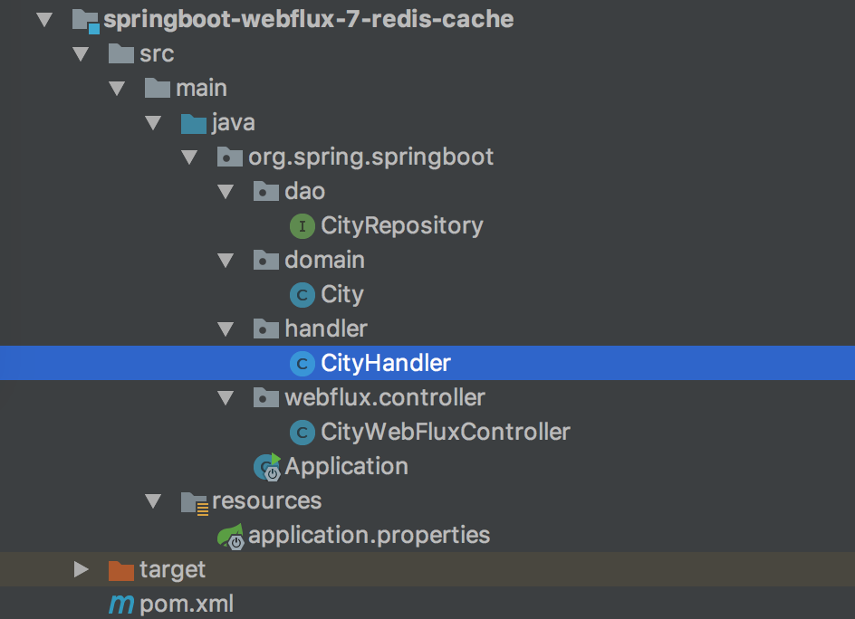
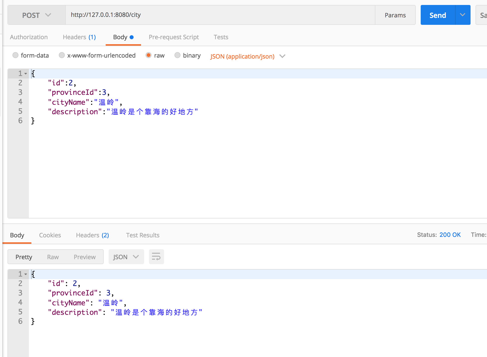
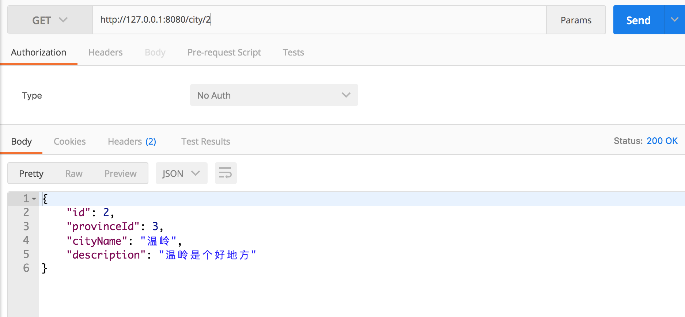

# 08 WebFlux 中 Redis 实现缓存

### 前言

首先，补充下上一篇的内容，RedisTemplate 实现操作 Redis，但操作是同步的，不是 Reactive 的。自然，支持 Reactive 的操作类为 ReactiveRedisTemplate，下面我们写个小案例。

### ReactiveRedisTemplate

在上一篇工程中，新建 CityWebFluxReactiveController 类，路由为 /city2 开头。

```java
@RestController
@RequestMapping(value = "/city2")
public class CityWebFluxReactiveController {
    @Autowired
    private ReactiveRedisTemplate reactiveRedisTemplate;
    @GetMapping(value = "/{id}")
    public Mono<City> findCityById(@PathVariable("id") Long id) {
        String key = "city_" + id;
        ReactiveValueOperations<String, City> operations = reactiveRedisTemplate.opsForValue();
        Mono<City> city = operations.get(key);
        return city;
    }
    @PostMapping
    public Mono<City> saveCity(@RequestBody City city) {
        String key = "city_" + city.getId();
        ReactiveValueOperations<String, City> operations = reactiveRedisTemplate.opsForValue();
        return operations.getAndSet(key, city);
    }
    @DeleteMapping(value = "/{id}")
    public Mono<Long> deleteCity(@PathVariable("id") Long id) {
        String key = "city_" + id;
        return reactiveRedisTemplate.delete(key);
    }
}
```

- 写法和以前保持一致，@Autowired 注入 ReactiveRedisTemplate 对象。
- ReactiveValueOperations 是 String（或 value）的操作视图，操作视图还有 ReactiveHashOperations、ReactiveListOperations、ReactiveSetOperations 和 ReactiveZSetOperations 等。
- 不一样的是，操作视图 set 方法是操作 City 对象，但可以 get 回 Mono 或者 Flux 对象。

### 结构

回到这个工程，新建一个工程编写整合 Redis 实现缓存案例，工程如图：



目录核心如下：

- pom.xml maven 配置
- application.properties 配置文件
- domain 实体类
- dao mongodb数据操作层
- handler 业务层，本文要点
- controller 控制层

[单击这里查看源代码](https://github.com/JeffLi1993/springboot-learning-example)。

### 控制层 CityWebFluxController

代码如下：

```java
@RestController
@RequestMapping(value = "/city")
public class CityWebFluxController {
    @Autowired
    private CityHandler cityHandler;
    @GetMapping(value = "/{id}")
    public Mono<City> findCityById(@PathVariable("id") Long id) {
        return cityHandler.findCityById(id);
    }
    @GetMapping()
    public Flux<City> findAllCity() {
        return cityHandler.findAllCity();
    }
    @PostMapping()
    public Mono<City> saveCity(@RequestBody City city) {
        return cityHandler.save(city);
    }
    @PutMapping()
    public Mono<City> modifyCity(@RequestBody City city) {
        return cityHandler.modifyCity(city);
    }
    @DeleteMapping(value = "/{id}")
    public Mono<Long> deleteCity(@PathVariable("id") Long id) {
        return cityHandler.deleteCity(id);
    }
}
```

### CityHandler 业务层

目前，@Cacheable 等注解形式实现缓存没有很好的集成，二者 Mono / Flux 对象没有实现 Serializable，无法通过默认序列化器，解决方式是需要自定义序列化，这里通过手动方式与 Redis 手动集成，并实现缓存策略。

[参考《缓存更新的套路》](http://coolshell.cn/articles/17416.html)，缓存更新的模式有四种：Cache aside、Read through、Write through、Write behind caching。

这里使用的是 Cache Aside 策略，从三个维度（摘自耗子叔叔博客）：

- 失效：应用程序先从 Cache 取数据，没有得到，则从数据库中取数据，成功后，放到缓存中。
- 命中：应用程序从 Cache 中取数据，取到后返回。
- 更新：先把数据存到数据库中，成功后，再让缓存失效。

代码如下：

```java
@Component
public class CityHandler {
    private static final Logger LOGGER = LoggerFactory.getLogger(CityHandler.class);
    @Autowired
    private RedisTemplate redisTemplate;
    private final CityRepository cityRepository;
    @Autowired
    public CityHandler(CityRepository cityRepository) {
        this.cityRepository = cityRepository;
    }
    public Mono<City> save(City city) {
        return cityRepository.save(city);
    }
    public Mono<City> findCityById(Long id) {
        // 从缓存中获取城市信息
        String key = "city_" + id;
        ValueOperations<String, City> operations = redisTemplate.opsForValue();
        // 缓存存在
        boolean hasKey = redisTemplate.hasKey(key);
        if (hasKey) {
            City city = operations.get(key);
            LOGGER.info("CityHandler.findCityById() : 从缓存中获取了城市 >> " + city.toString());
            return Mono.create(cityMonoSink -> cityMonoSink.success(city));
        }
        // 从 MongoDB 中获取城市信息
        Mono<City> cityMono = cityRepository.findById(id);
        if (cityMono == null)
            return cityMono;
        // 插入缓存
        cityMono.subscribe(cityObj -> {
            operations.set(key, cityObj);
            LOGGER.info("CityHandler.findCityById() : 城市插入缓存 >> " + cityObj.toString());
        });
        return cityMono;
    }
    public Flux<City> findAllCity() {
        return cityRepository.findAll().cache();
    }
    public Mono<City> modifyCity(City city) {
        Mono<City> cityMono = cityRepository.save(city);
        // 缓存存在，删除缓存
        String key = "city_" + city.getId();
        boolean hasKey = redisTemplate.hasKey(key);
        if (hasKey) {
            redisTemplate.delete(key);
            LOGGER.info("CityHandler.modifyCity() : 从缓存中删除城市 ID >> " + city.getId());
        }
        return cityMono;
    }
    public Mono<Long> deleteCity(Long id) {
        cityRepository.deleteById(id);
        // 缓存存在，删除缓存
        String key = "city_" + id;
        boolean hasKey = redisTemplate.hasKey(key);
        if (hasKey) {
            redisTemplate.delete(key);
            LOGGER.info("CityHandler.deleteCity() : 从缓存中删除城市 ID >> " + id);
        }
        return Mono.create(cityMonoSink -> cityMonoSink.success(id));
    }
}
```

首先这里注入了 RedisTemplate 对象，联想到 Spring 的 JdbcTemplate ，RedisTemplate 封装了 RedisConnection，具有连接管理，序列化和 Redis 操作等功能，还有针对 String 的支持对象 StringRedisTemplate。

回到更新缓存的逻辑。

a. findCityById 获取城市逻辑：

- 如果缓存存在，从缓存中获取城市信息；
- 如果缓存不存在，从 DB 中获取城市信息，然后插入缓存。

b. deleteCity 删除 / modifyCity 更新城市逻辑：

- 如果缓存存在，删除；
- 如果缓存不存在，不操作。

### 运行工程

一个操作 Redis 工程就开发完毕了，下面运行工程验证下。使用 IDEA 右侧工具栏，点击 Maven Project Tab，点击使用下 Maven 插件的 install 命令；或者使用命令行的形式，在工程根目录下，执行 Maven 清理和安装工程的指令：

```plaintext
cd springboot-webflux-7-redis-cache
mvn clean install
```

在控制台中看到成功的输出：

```plaintext
... 省略
[INFO] ------------------------------------------------------------------------
[INFO] BUILD SUCCESS
[INFO] ------------------------------------------------------------------------
[INFO] Total time: 01:30 min
[INFO] Finished at: 2018-10-15T10:00:54+08:00
[INFO] Final Memory: 31M/174M
[INFO] ------------------------------------------------------------------------
```

在 IDEA 中执行 Application 类启动，任意正常模式或者 Debug 模式，可以在控制台看到成功运行的输出：

```bash
... 省略
2018-04-10 08:43:39.932  INFO 2052 --- [ctor-http-nio-1] r.ipc.netty.tcp.BlockingNettyContext     : Started HttpServer on /0:0:0:0:0:0:0:0:8080
2018-04-10 08:43:39.935  INFO 2052 --- [           main] o.s.b.web.embedded.netty.NettyWebServer  : Netty started on port(s): 8080
2018-04-10 08:43:39.960  INFO 2052 --- [           main] org.spring.springboot.Application        : Started Application in 6.547 seconds (JVM running for 9.851)
```

打开 POST MAN 工具，开发必备。进行下面操作：

**新增城市信息 POST <http://127.0.0.1:8080/city>** **获取城市信息 GET <http://127.0.0.1:8080/city/2>**



再请求一次，获取城市信息会发现数据获取的耗时快了很多，服务端 Console 输出的日志：

```plaintext
2017-04-13 18:29:00.273  INFO 13038 --- [nio-8080-exec-1] findCityById() : 城市插入缓存 >> City{id=12, provinceId=3, cityName='三亚', description='水好,天蓝'}
2017-04-13 18:29:03.145  INFO 13038 --- [nio-8080-exec-2] findCityById() : 从缓存中获取了城市 >> City{id=12, provinceId=3, cityName='三亚', description='水好,天蓝'}
```

可见，第一次是从数据库 MongoDB 获取数据，并插入缓存，第二次直接从缓存中取。

更新 / 删除城市信息，这两种操作中，如果缓存有对应的数据，则删除缓存。服务端 Console 输出的日志：

```plaintext
2017-04-13 18:29:52.248  INFO 13038 --- [nio-8080-exec-9] deleteCity() : 从缓存中删除城市 ID >> 12
```

### 总结

这一讲，主要补充了 Redis 对响应式的支持操作，以及缓存更新策略及实际应用小例子。
